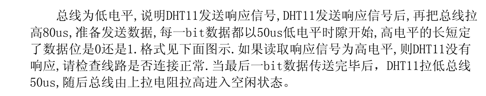
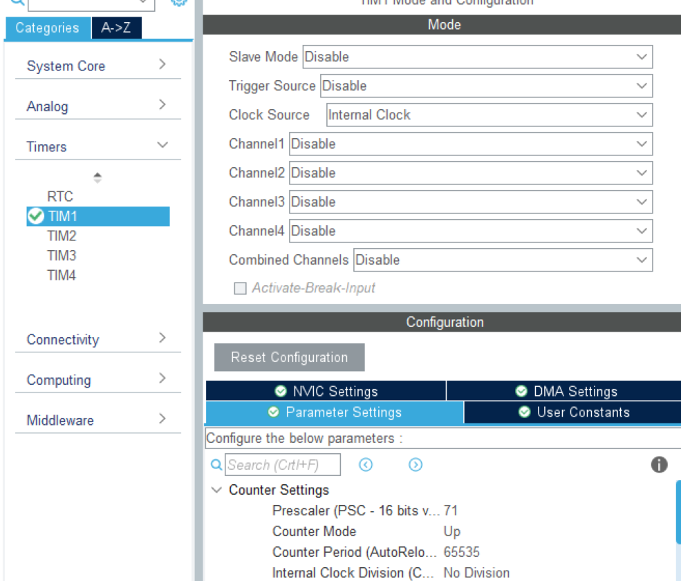
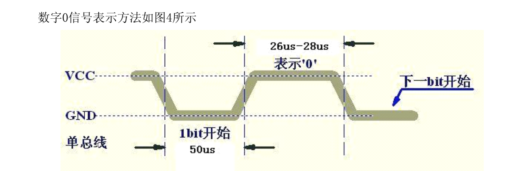
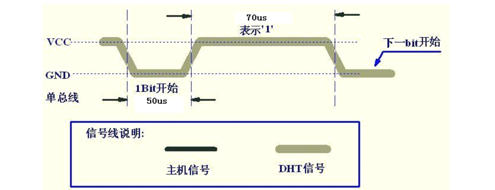
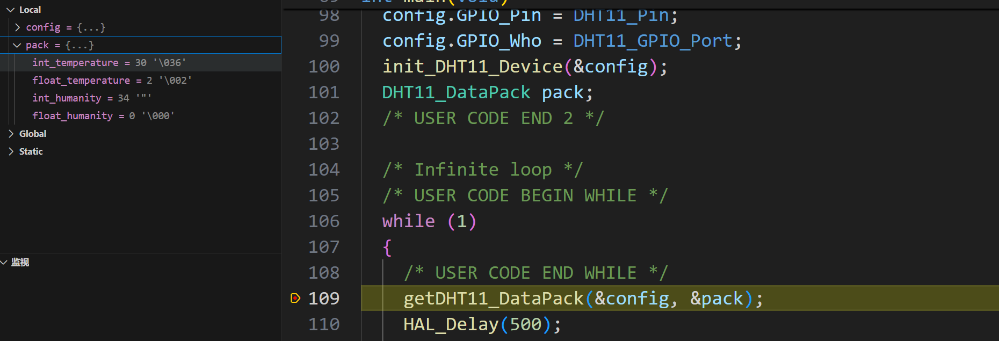

# 构建DHT11驱动

​	我们的第一天，就是构建DHT11驱动，这里，我们使用的是HAL库的接口。

​	如何驱动一个你陌生的传感器呢？别看我，也别在网上死马当活马医！你需要做的，**首先是明确你的传感器的名称，在这里，我们想要使用的是DHT11温湿度传感器**

## 开查手册

​	可以拿到购买DHT11时附送的手册（什么，没有送？仔细看看商家有没有提供链接，没有提供就去要，或者，直接去网上搜索手册），我们打开，重点关注的是：

- 如何启动？（笔者这里被坑了一天，就是因为没有仔细读启动方式导致错误时长的延时）
- 如何读取数据？
- 如何解析得到的数据（数据格式如何）

​	笔者查阅手头的手册，可以摘取到如下的信息：

​	这是手册指出的启动方式（解答问题1）：


​	这是手册给出的DHT11如何传回数据（解答问题2）



​	这是手册给出了数据格式：


​	也就是说，我们需要一个五字节大小的单位数据帧。前四个数据帧装载的是DHT11传感器所传递的实时监测数据，最后一位则是校验和，保证我们接收到的数据是合法的！

​	我们这里是最一般情况的开发，可以不用太关心这个器件的电气特性。但是如果工作状态下有更特殊的情况，请**务必确保工作环境可以使器件正常工作！** 

## 代码设计：自顶向下

​	为什么说自顶向下呢？因为我们思考一个工程的时候，往往首先需要考虑到这个模块它的基本步骤，它要实现什么样的功能。这是跟底层没有什么太大关系的，是底层的一种抽象。所以从架构层次上来讲我们管这个叫自顶向下。 

​	在我们找到了我们所需要的手册信息之后，就是要对之逐个剖析，设计代码框架并且实现它！

​	我们思考我们如何使用一个传感器——那就是它进行可能的初始化，随后在我们需要的时候启动传感器，然后接收传感器得到的数据，最后使用传感器得到的数据。对于用户侧，我们需要暴露的必要函数方法接口正是：

- 初始化DHT11的接口

- 和拿到DHT11接收到的数据的接口

 即可。

​	但是事情并没有结束：我们想要书写的是库驱动，使用到的引脚我们并不知道，期盼的格式用户侧也不知道，其被抽象封装的传感器的状态也需要用户知道。也就是说我们实际上还需要提供这样的一些用户可以设置的参数。这也是我们代码设计需要思考的问题！

- 用户自己指定的DHT11GPIO接口
- 用户用于拿到数据的规格化的数据结构体 

​	结合手册阅读，我们发现这个传感器的精度上有湿度的整数和小数，温度的整数和小数。这也就暗示了我们的设计：

```
typedef struct __DHT11_DataPack{
    uint8_t int_temperature;	// 整数湿度
    uint8_t float_temperature;	// 小数湿度
    uint8_t int_humanity;		// 整数湿度
    uint8_t float_humanity;		// 小数湿度
}DHT11_DataPack;
```

​	我们并不需要暴露校验位，因为校验工作并不是用户来完成，而是由我们库开发者来完成！因此暴露这个接口还不如暴露一个相应的错误码（这个我们在后续提到）

​	与这个传感器通信的连接到的单片机的引脚只需要一个普通的gpio引脚即可。因此我们设计DHT11的用户配置结构体只需要这样简单即可

```
typedef struct __DHT11_Config{
    GPIO_TypeDef* GPIO_Who; 
    GPIO_Pin_Type GPIO_Pin;
}DHT11_Config;
```

​	当然响应的错误码不要忘记

```
// 状态错误码
typedef enum __DHT11_Error{
    DHT11_NO_ERROR,                 // 没错误
    DHT11_NOT_INIT,                 // 没有初始化
    DHT11_ERROR_DEVICE_NOT_FOUND,   // 设备未找到
    DHT11_FAILED_READ_DATA,         // 无法读取数据
    DHT11_FAILED_PASS_CHECK         // 没有通过校验检查
}DHT11_Error;
```

​	现在当我们必要的结构体抽象完成之后，就可以思考函数签名的格式，这样函数签名的格式则规定了用户跟使用我们开发的库之间如何进行架构设计上的通信。

```
// 初始化设备，其行为依据LAZY_INIT确定
uint8_t     init_DHT11_Device(DHT11_Config* config);
// 获取数据包，pack推介是空的！
void        getDHT11_DataPack(DHT11_Config* config, DHT11_DataPack* pack);
// 获取当前状态
DHT11_Error error_GetDHT11_Status();
```

​	截止到目前我们可以思考得到三个这样的函数签名。大概的思考流程就是：

​	用户调用第一个初始化函数后，即可使用第二个函数获取到传感器得到的信息，对于上层想要查看状态只需要调用的三个接口即可。

​	下面，我们就来实现细节。

## 代码实现：自底向上

### 定时模块

​	我们下面就把手册上死的说明活起来，仔细想一想我们首先需要一个实际完成传感器初始化的函数，这个函数非常专一只用来进行初始化相关工作，不做其他事情。

> dht11.c

```
static void __DHT11_Only_Init(DHT11_Config* config)
```

> 为什么是static修饰符呢，因为这个函数将会被限制在文件作用域下方才可用，不会被外界所找到，熟悉C++等面对对象的语言的同志们马上就会发现这不就是private吗，我想这是类似的。
>
> 这样做的好处在于：我们可用提醒自己

​	在架构设计上，这是Interface - Implement关系，用户侧只知道init_DHT11_Device可以完成我们的工作，但是不知道实际上工作是由__DHT11_Only_Init作为核心完成的。

​	阅读手册，我们发现一个恼火的事情，那就是HAL库是默认没有delay_us的，这就令人郁闷了，我们怎么知道用户到底要通过什么样的方式来进行微秒级别的延时呢？是使用系统定时器？是使用STM32内部的某一个TIM定时器？还是直接使用空指令取挂起流水线呢？我们都不知道？

​	对于我们库用户完全不知道的事情，我们选择提供新的接口让用户来完成！同时要保证一定的用户友好度，确保用户在错误的设置该步骤后尽可能仍然维持整个系统的正常工作。

​	所以，我们还需要辛苦的（真的很辛苦！）再添加一个接口，这个接口需要让用户自己设置时钟

```
// 时钟资源
typedef 	TIM_HandleTypeDef DHT11_ClockSource;
// 否则，将会使用系统时钟，导致延时不准确！
void        setDHT11_DelayClockSource(DHT11_ClockSource* source);
```

> 能不能不Typedef呢？
>
> 可以，这个随意，但是为此需要暴露一个头文件。这样来看会增加工程的复杂度，而我们只是使用一个时钟接口而已。在这里讲述一个工程技巧：那就是如果我们只使用到一个结构体的名称，最好的方式是使用它的指针，然后前置声明它。这样可以有效地降低工程的引用复杂度！

​	现在，我们需要从低往上构建代码。我们目前遇到的困难是：没有us级别的delay。

​	关于Delay模块，我们知道，要不使用定时器，要不就是自己手动挂流水线。我们这样想，如果因为一些原因并没有办法启动定时器，我们就采用手动挂流水线的方式进行延迟。反之，如果用户指定的定时器资源，我们则使用用户提供的定时器进行定时，至于定时器如何不是我们关心的事情！这是由用户来操心的！

```
// 使用的时钟
TIM_HandleTypeDef* using_clock = NULL;
// 默认不使用定时器，意味着为NULL
// 使用手动Delay，非常不推介！

static void __DHT11_NO_CLOCK_SET(uint16_t us){
    uint32_t Tdata = us* SystemCoreClock / 8U / 1000000U;
    do{__NOP();}while(Tdata--);
    return ;
}

// 自己搓的HAL_DELAY_US，需要开启一个定时器，定时器资源使用
// setDHT11_DelayClockSource提前设置好
static void __DHT11_MAKE_US_DELAY(uint16_t us){
// 用户没有指定时钟！
    if(!using_clock) return __DHT11_NO_CLOCK_SET(us);
// 用户指定了时钟
    uint16_t differ=0xffff-us-5;

    HAL_TIM_Base_Start(using_clock);
            __HAL_TIM_SetCounter(using_clock,differ);
    while(differ<0xffff-5){
        differ = __HAL_TIM_GetCounter(using_clock);
    }
    HAL_TIM_Base_Stop(using_clock);
}

// 定时器资源设置
void setDHT11_DelayClockSource(DHT11_ClockSource* source)
{
    using_clock = source;
}
```



​	Prescaler设置为72 -1 = 71，关于定时器如何设置请自行查阅！

### 初始化

​	在我们完成了微秒级的延时函数之后我们可以开始进行初始化。

​	在这里贴一下手册


​	这是一个按要求编程的活。

​	我们发现这个gpio它是既要可以输入，又要可以输出的，意味着我们需要动态的进行调整这个gpio接口的属性所以我们可以抽象一个内部函数来完成gpio接口的调整

```
// 设置端口IO模式的_impl函数
static void __DHT11_SetPackInternal(DHT11_Config* config, uint32_t mode)
{
    GPIO_InitTypeDef init;
    init.Mode = mode;
    init.Pin = config->GPIO_Pin;
    
    if(mode == GPIO_MODE_INPUT)
        init.Pull = GPIO_PULLUP; // 输入则上拉
    else
        init.Speed = GPIO_SPEED_FREQ_HIGH; // 输出设置快速输出
    HAL_GPIO_Init(config->GPIO_Who, &init); 
}

// 设置端口IO模式
static void __setDHT11_PinMode(DHT11_Config* config, DHT11_Mode mode)
{
    switch (mode)
    {
    case DHT11_Mode_Read:
        __DHT11_SetPackInternal(config, GPIO_MODE_INPUT);
        break;
    case DHT11_Mode_Write:
        __DHT11_SetPackInternal(config, GPIO_MODE_OUTPUT_PP);
        break;
    default:
        break;
    }
}
```

​	层层的设计上， 而言我们实际上调用的是__DHT11_SetPackInternal函数，然后对之做一点语义封装，这点可做可不做，为了的是保证良好的抽象性。这样，我们一行就可以轻松的设置GPIO的属性了。

​	下面就是初始化接口的完善

```
// 错误设置
static DHT11_Error global_error = DHT11_NOT_INIT;

// ... 

// 只初始化不做检查
static void __DHT11_Only_Init(DHT11_Config* config){
    __setDHT11_PinMode(config, DHT11_Mode_Write); // 写端口
    HAL_GPIO_WritePin(config->GPIO_Who, config->GPIO_Pin, GPIO_PIN_RESET); // 拉低电平
    HAL_Delay(20); // 主机等待至少18ms
    HAL_GPIO_WritePin(config->GPIO_Who, config->GPIO_Pin, GPIO_PIN_SET); //拉高电平
    __DHT11_MAKE_US_DELAY(30); // 主机挂起30us
    __set_global_error(DHT11_NO_ERROR); // 初始化完成，置零错误
}
```

​	初始化完成了，我们下面就可以做检查。我们想要发起一次请求，就必须做一次初始化通知传感器开始进行通信通知结束后我们还需要检查是否真的有响应，只有真的来了响应我们才可以进一步读取传感器。所以我们还需要写一个检查函数如下：


```
 static uint8_t __DHT11_Check_If_DHT11_Work(DHT11_Config* config){
 	// 设置为读取
    _setDHT11_PinMode(config, DHT11_Mode_Read);
    // 这里需要判断读取到的是不是低电平，这是根据手册中：“总线为低电平时说明传感器准备发送响应信号”而写的代码 
    uint8_t status = HAL_GPIO_ReadPin(config->GPIO_Who, config->GPIO_Pin) == GPIO_PIN_RESET;
    if(!status){
        __set_global_error(DHT11_FAILED_READ_DATA);
    }
    return status;
}
```

​	所以，一个具备差错能力的用户接口初始化函数变得简单：

```
uint8_t init_DHT11_Device(DHT11_Config* config)
{
    __DHT11_Only_Init(config);
    return __DHT11_Check_If_DHT11_Work(config); // 返回是否准备传输
}
```

### 数据传输

​	我们继续说说刚刚贴的那张图它同时还说明了数据是如何进行传输的。我想很简单它是根据高电平所维持时间的多久来反映单位时间内传递的比特。所以，我们需要写一个读取比特的内部函数





​	所以从这里来看我们只需要延时大概三十微秒后查看是否是高电平来决定此时传递的比特是不是高电平 

```
// 读取一个比特
static inline uint8_t __DHT11_read_one_bit(DHT11_Config* config)
{
    if(!__dht11_pass_retry(config, GPIO_PIN_RESET)){
        __set_global_error(DHT11_FAILED_READ_DATA);
    }
    // 根据时序图，DHT传回高电平信号维持26us~28us表示0，	维持70us表示1
    __DHT11_MAKE_US_DELAY(30);
    uint8_t res = HAL_GPIO_ReadPin(config->GPIO_Who, config->GPIO_Pin);
    // 还是做检查有没有正常传递结束一个比特的检查
    if(!__dht11_pass_retry(config, GPIO_PIN_SET)){
        __set_global_error(DHT11_FAILED_READ_DATA);
    }

    return res;
}
```

​	所以在这个时候我们只需要把这个事情循环做八次就可以接收到一个字节。

```
// 读取一个字节，是对__DHT11_read_one_bit的循环封装
static uint8_t __DHT11_read_one_byte(DHT11_Config* config)
{
    uint8_t required_ret_byte = 0;
    for(uint8_t i = 0; i < 8; i++){
        required_ret_byte <<= 1;
        required_ret_byte |= __DHT11_read_one_bit(config);
    }
    return required_ret_byte;
}
```

​	只是接收到数据是不够的， 我们还需要做数据的校验机制。

```
// 数据校验
static inline uint8_t __DHT11_Check_Policy(){
    return dataFrame[0]+dataFrame[1]+dataFrame[2]+dataFrame[3]==dataFrame[4];
}
```

> inline: 在比较传统的C里面inline指示编译器内联函数，简单的讲就是直接将函数的汇编代码贴到调用方中从而减少栈开销。但是现在是2024年了，编译器早就智能的做了这个事情，但是并不保证所有的编译器都是如此智能。所以我们选择添加，让它总是内连。关于现在这个关键字做什么感兴趣的同志可以自行查找。（提示：语义变化极大）

​	现在，我们可以继续实现一个完整的请求逻辑了：

```
    __DHT11_Only_Init(config); // 通知DHT11开启一次通信
    if(__DHT11_Check_If_DHT11_Work(config)) // 开启成功，开始通信
    {
        // 接下来，DHT11拉低电平一段时间后拉高电平一段时间
        // 这个失误可以在下几次循环中消除，所以只设错误不反回
        __dht11_pass_retry(config, GPIO_PIN_RESET); // 监视总线，查看有没有按照预期工作
        __dht11_pass_retry(config, GPIO_PIN_SET); // 监视总线，查看有没有按照预期工作
        // 数据帧填写
        for(int i = 0; i < 5;i++)
            dataFrame[i] = __DHT11_read_one_byte(config);

        if(__DHT11_Check_Policy()){ // 校验位
            pack->int_humanity = dataFrame[0];
            pack->float_humanity = dataFrame[1];
            pack->int_temperature = dataFrame[2];
            pack->float_temperature = dataFrame[3];
        }else{
            __set_global_error(DHT11_FAILED_PASS_CHECK);
        }
    }
```

我们把代码整合起来看看：

> dht11.h

```
#include "stm32f1xx_hal.h"

// 最大尝试次数
#define RETRY_MAX_TIME (100)
// 协议数据包长度，DHT11默认为5个byte
#define DHT11_BUFFER_SIZE (5)
// Lazy_Init决定了要不要提前拉起DHT11的工作状态
// 定义为1，直到使用的时候才会初始化，
// init_DHT11_Device不会采取实际行动，函数将会总是成功！
// 反之，使能init_DHT11_Device函数
#define LAZY_INIT 0

// 时钟资源
typedef TIM_HandleTypeDef DHT11_ClockSource;

// 指定的端口
typedef uint16_t GPIO_Pin_Type;
typedef struct __DHT11_Config{
    GPIO_TypeDef* GPIO_Who;
    GPIO_Pin_Type GPIO_Pin;
}DHT11_Config;

// 状态错误码
typedef enum __DHT11_Error{
    DHT11_NO_ERROR,                 // 没错误
    DHT11_NOT_INIT,                 // 没有初始化
    DHT11_ERROR_DEVICE_NOT_FOUND,   // 设备未找到
    DHT11_FAILED_READ_DATA,         // 无法读取数据
    DHT11_FAILED_PASS_CHECK         // 没有通过校验检查
}DHT11_Error;

// DHT11数据结构体
typedef struct __DHT11_DataPack{
    uint8_t int_temperature;
    uint8_t float_temperature;
    uint8_t int_humanity;
    uint8_t float_humanity;
}DHT11_DataPack;

// 接口说明

// 初始化设备，其行为依据LAZY_INIT确定
uint8_t     init_DHT11_Device(DHT11_Config* config);
// 设置DHT11延时函数的时钟资源，该函数务必在使用DHT11之前就有所调用
// 否则，将会使用系统时钟，导致延时不准确！
void        setDHT11_DelayClockSource(DHT11_ClockSource* source);
// 获取数据包，pack推介是空的！
void        getDHT11_DataPack(DHT11_Config* config, DHT11_DataPack* pack);
// 获取当前状态
DHT11_Error error_GetDHT11_Status();
```

> dht11.c

```
#include "dht11.h"
#include "tim.h"

typedef enum __DHT11_Mode{
    DHT11_Mode_Write, 
    DHT11_Mode_Read
}DHT11_Mode;

// 错误设置
static DHT11_Error global_error = DHT11_NOT_INIT;
// buffer
static uint8_t dataFrame[DHT11_BUFFER_SIZE];
// 使用的时钟
TIM_HandleTypeDef* using_clock = NULL;

// 设计方法：将这个C文件自身看作模块，所有
// static 修饰的函数都是 private 私有函数

// 设置全局错误
static inline void __set_global_error(DHT11_Error error){
    global_error = error;
}

// 使用系统时钟，非常不推介！
static void __DHT11_NO_CLOCK_SET(uint16_t us){
    uint32_t Tdata = us* SystemCoreClock / 8U / 1000000U;
    do{__NOP();}while(Tdata--);
    return ;
}

// 自己搓的HAL_DELAY_US，需要开启一个定时器，定时器资源使用
// setDHT11_DelayClockSource提前设置好
static void __DHT11_MAKE_US_DELAY(uint16_t us){
    if(!using_clock) return __DHT11_NO_CLOCK_SET(us);
    
    uint16_t differ=0xffff-us-5;

    HAL_TIM_Base_Start(using_clock);
            __HAL_TIM_SetCounter(using_clock,differ);
    while(differ<0xffff-5){
        differ = __HAL_TIM_GetCounter(using_clock);
    }
    HAL_TIM_Base_Stop(using_clock);
}

// 设置端口IO模式的_impl函数
static void __DHT11_SetPackInternal(DHT11_Config* config, uint32_t mode)
{
    GPIO_InitTypeDef init;
    init.Mode = mode;
    init.Pin = config->GPIO_Pin;
    
    if(mode == GPIO_MODE_INPUT)
        init.Pull = GPIO_PULLUP; // 输入则上拉
    else
        init.Speed = GPIO_SPEED_FREQ_HIGH; // 输出设置快速输出
    HAL_GPIO_Init(config->GPIO_Who, &init); 
}

// 设置端口IO模式
static void __setDHT11_PinMode(DHT11_Config* config, DHT11_Mode mode)
{
    switch (mode)
    {
    case DHT11_Mode_Read:
        __DHT11_SetPackInternal(config, GPIO_MODE_INPUT);
        break;
    case DHT11_Mode_Write:
        __DHT11_SetPackInternal(config, GPIO_MODE_OUTPUT_PP);
        break;
    default:
        break;
    }
}

// 这个是查看retry是否成功的，想要使得库更加的严谨，考虑检查返回值！
static uint8_t __dht11_pass_retry(DHT11_Config* config, uint8_t required_check_bits)
{
    uint8_t retry_times = 0;
    __setDHT11_PinMode(config, DHT11_Mode_Read);
    while(  HAL_GPIO_ReadPin(config->GPIO_Who, config->GPIO_Pin)   
            == required_check_bits && 
            retry_times <= RETRY_MAX_TIME)
    {
        __DHT11_MAKE_US_DELAY(1);
        retry_times++;
    }
    return retry_times < RETRY_MAX_TIME;
}

// 查看工作状态是否正常
static uint8_t __DHT11_Check_If_DHT11_Work(DHT11_Config* config){
    __setDHT11_PinMode(config, DHT11_Mode_Read);
    uint8_t status = HAL_GPIO_ReadPin(config->GPIO_Who, config->GPIO_Pin) == GPIO_PIN_RESET;
    if(!status){
        __set_global_error(DHT11_FAILED_READ_DATA);
    }
    return status;
}

// 读取一个比特
static inline uint8_t __DHT11_read_one_bit(DHT11_Config* config)
{
    if(!__dht11_pass_retry(config, GPIO_PIN_RESET)){
        __set_global_error(DHT11_FAILED_READ_DATA);
    }
    // 根据时序图，DHT传回高电平信号维持26us~28us表示0，	维持70us表示1
    __DHT11_MAKE_US_DELAY(30);
    uint8_t res = HAL_GPIO_ReadPin(config->GPIO_Who, config->GPIO_Pin);
    // 还是做检查有没有正常传递结束一个比特的检查
    if(!__dht11_pass_retry(config, GPIO_PIN_SET)){
        __set_global_error(DHT11_FAILED_READ_DATA);
    }

    return res;
}

// 读取一个字节，是对__DHT11_read_one_bit的循环封装
static uint8_t __DHT11_read_one_byte(DHT11_Config* config)
{
    uint8_t required_ret_byte = 0;
    for(uint8_t i = 0; i < 8; i++){
        required_ret_byte <<= 1;
        required_ret_byte |= __DHT11_read_one_bit(config);
    }
    return required_ret_byte;
}

// 数据校验
static inline uint8_t __DHT11_Check_Policy(){
    return dataFrame[0]+dataFrame[1]+dataFrame[2]+dataFrame[3]==dataFrame[4];
}

// 只初始化不做检查
static void __DHT11_Only_Init(DHT11_Config* config){
    __setDHT11_PinMode(config, DHT11_Mode_Write);
    HAL_GPIO_WritePin(config->GPIO_Who, config->GPIO_Pin, GPIO_PIN_RESET);
    HAL_Delay(20);
    HAL_GPIO_WritePin(config->GPIO_Who, config->GPIO_Pin, GPIO_PIN_SET);
    __DHT11_MAKE_US_DELAY(30);
    __set_global_error(DHT11_NO_ERROR);
}

uint8_t init_DHT11_Device(DHT11_Config* config)
{
#if LAZY_INIT
    return 1;
#else
    __DHT11_Only_Init(config);
    return __DHT11_Check_If_DHT11_Work(config);
#endif
}

void setDHT11_DelayClockSource(DHT11_ClockSource* source)
{
    using_clock = source;
}

DHT11_Error error_GetDHT11_Status()
{
    return global_error;
}

void getDHT11_DataPack(DHT11_Config* config, DHT11_DataPack* pack)
{
    __DHT11_Only_Init(config);
    if(__DHT11_Check_If_DHT11_Work(config))
    {
        // 接下来，DHT11拉低电平一段时间后拉高电平一段时间
        // 这个失误可以在下几次循环中消除，所以只设错误不反回
        __dht11_pass_retry(config, GPIO_PIN_RESET);
        __dht11_pass_retry(config, GPIO_PIN_SET);
        for(int i = 0; i < 5;i++)
            dataFrame[i] = __DHT11_read_one_byte(config);

        if(__DHT11_Check_Policy()){
            pack->int_humanity = dataFrame[0];
            pack->float_humanity = dataFrame[1];
            pack->int_temperature = dataFrame[2];
            pack->float_temperature = dataFrame[3];
        }else{
            __set_global_error(DHT11_FAILED_PASS_CHECK);
        }
    }

}
```

### 测试：

​	我们再CubeMX中配置PA15为目标引脚，TIM1为定时器资源后，书写如下代码

```
/* USER CODE BEGIN Header */
/**
  ******************************************************************************
  * @file           : main.c
  * @brief          : Main program body
  ******************************************************************************
  * @attention
  *
  * <h2><center>&copy; Copyright (c) 2024 STMicroelectronics.
  * All rights reserved.</center></h2>
  *
  * This software component is licensed by ST under BSD 3-Clause license,
  * the "License"; You may not use this file except in compliance with the
  * License. You may obtain a copy of the License at:
  *                        opensource.org/licenses/BSD-3-Clause
  *
  ******************************************************************************
  */
/* USER CODE END Header */
/* Includes ------------------------------------------------------------------*/
#include "main.h"
#include "tim.h"
#include "gpio.h"

/* Private includes ----------------------------------------------------------*/
/* USER CODE BEGIN Includes */
#include "dht11.h"
#include "dht11_try.h"
/* USER CODE END Includes */

/* Private typedef -----------------------------------------------------------*/
/* USER CODE BEGIN PTD */

/* USER CODE END PTD */

/* Private define ------------------------------------------------------------*/
/* USER CODE BEGIN PD */
DHT11_Data_TypeDef DH;
/* USER CODE END PD */

/* Private macro -------------------------------------------------------------*/
/* USER CODE BEGIN PM */

/* USER CODE END PM */

/* Private variables ---------------------------------------------------------*/

/* USER CODE BEGIN PV */

/* USER CODE END PV */

/* Private function prototypes -----------------------------------------------*/
void SystemClock_Config(void);
/* USER CODE BEGIN PFP */

/* USER CODE END PFP */

/* Private user code ---------------------------------------------------------*/
/* USER CODE BEGIN 0 */

/* USER CODE END 0 */

/**
  * @brief  The application entry point.
  * @retval int
  */


int main(void)
{
  /* USER CODE BEGIN 1 */

  /* USER CODE END 1 */

  /* MCU Configuration--------------------------------------------------------*/

  /* Reset of all peripherals, Initializes the Flash interface and the Systick. */
  HAL_Init();

  /* USER CODE BEGIN Init */

  /* USER CODE END Init */

  /* Configure the system clock */
  SystemClock_Config();

  /* USER CODE BEGIN SysInit */

  /* USER CODE END SysInit */

  /* Initialize all configured peripherals */
  MX_GPIO_Init();
  MX_TIM1_Init();
  /* USER CODE BEGIN 2 */
  // 设置定时器资源
  setDHT11_DelayClockSource(&htim1);
  // 配置端口
  DHT11_Config config;
  config.GPIO_Pin = DHT11_Pin;
  config.GPIO_Who = DHT11_GPIO_Port;
  init_DHT11_Device(&config);
  // 数据包指定
  DHT11_DataPack pack;
  /* USER CODE END 2 */

  /* Infinite loop */
  /* USER CODE BEGIN WHILE */
  while (1)
  {
    /* USER CODE END WHILE */
    // 获取数据包
    getDHT11_DataPack(&config, &pack);
    // 这里笔者使用调试查看，你也可以自行的指定串口打印！
    HAL_Delay(500);
    /* USER CODE BEGIN 3 */
  }
  /* USER CODE END 3 */
}
// ... omitted

```

​	在PIO中配置且烧录，设置成调试模式后：



​	可以看到正常工作了，手头的室内温度剂显示当前是31摄氏度，比较准。

## Questions

> 想尝试一下PIO + VSCode开发：
>
> Sir, this way: [STM32开发环境配置记录——关于PlatformIO + VSCode + CubeMX的集成环境配置_platformio stm32-CSDN博客](https://blog.csdn.net/charlie114514191/article/details/140724534)


> 我买的国产芯片，然后烧录的时候提示Error expected 1 of 1 0x1ba01477， 也就是STLink死活烧不进去程序
>
> 恭喜你买到盗版的ST芯片了，[VsCode给STM32F103C8T6芯片下载程序失败_info : auto-selecting first available session tran-CSDN博客](https://blog.csdn.net/qq_40923918/article/details/131698522)是你的解决方案。乖乖改cfg文件吧，记得把旧的备份。

## Sources

​	所有的源代码：

>[MCU_Libs/DHT11 at main · Charliechen114514/MCU_Libs (github.com)](https://github.com/Charliechen114514/MCU_Libs/tree/main/DHT11)