# STM32开发环境配置记录——关于PlatformIO + VSCode + CubeMX的集成环境配置

#### 前言

​	为什么配置这样的一个环境呢？鄙人受够了Keil5那个简陋的工作环境了，实在是用不下去，调试上很容易跟CubeMX的代码产生不协调导致调试——发布代码不一致造成的一系列问题。CubeIDE虽说不错，但是它的代码辅助功能和构建系统实在不敢恭维，经常出现Makefile未同步导致符号定义冲突，亦或者是埋下了潜在的程序bug。

​	也有人尝试使用Keil Assistance + VSCode + Keil分工写代码与烧录，这听起来不错，但是调试并不方便，常常要来回奔波，实在是有些麻烦。这里我们尝试新兴的PlatformIO来辅助我们进行嵌入式的开发。

## 介绍

### PlatformIO

>[Your Gateway to Embedded Software Development Excellence — PlatformIO latest documentation](https://docs.platformio.org/en/latest/)

​	Platform是基于VScode文本编辑器，使用了vscode强大的扩展extension功能，使得开发者可以在vscode中直接调用gcc、jlink、gdb等进行开发、调试。PlatformIO只是一个集成开发环境，其本身几乎不包括任何实质性功能，但是其集成了很多了例如编译器、调试器等，主要包括以下：

- vscode
- gcc编译器，版本：arm-none-eabi-gcc （针对arm内核嵌入式设备的专属c语言编译器）
- arm-none-eabi-gdb调试器
- jlink 驱动
- Scons构建工具、

​	也就是说，PlatformIO就是一个类似于Keil, STMCudeIDE那样的工作环境，它本身不负责进行编译，上传，调试测试等，但是它封装了我们常见的arm-noeabi-系列工具，省去我们学习纷繁复杂的配置语法，统一成PlatformIO的配置语言，这样我们就可以通过写PlatformIO的配置语言来辅助构建我们的嵌入式程序。

### STM32CubeMX

> [STM32CubeMX - STM32Cube initialization code generator - STMicroelectronics](https://www.st.com/en/development-tools/stm32cubemx.html)

​	STM32CubeMX 是用于 32 位 ARM Cortex STM32 微控制器的图形工具。它允许对 STM32 微控制器和微处理器进行非常简单的配置，生成初始化 C 代码，还可以通过一步一步的操作为 Arm Cortex-M 内核或 Arm Cortex-A core 生成部分 Linux 设备树。它是 STMCube 生态系统的一部分，且可以作为独立应用程序或作为 Eclipse 插件集成在开发环境（STM32CubeIDE）中。
​	它能做到的事情很简单了：那就是将我们配置嵌入式设备的流程从代码配置走向GUI配置，点点摁扭，就可以生成一系列初始化的代码辅助我们完成繁琐的初始化任务

### Visual Studio Code

>[Visual Studio Code - Code Editing. Redefined](https://code.visualstudio.com/)

Visual Studio Code 是一个轻量级功能强大的源代码编辑器，支持语法高亮、代码自动补全（又称 IntelliSense）、代码重构、查看定义功能，并且内置了命令行工具和 Git 版本控制系统。适用于 Windows、macOS 和 Linux。它内置了对 JavaScript、TypeScript 和 Node.js 的支持，并为其他语言和运行时（如 C++、C#、Java、Python、PHP、Go、.NET）提供了丰富的扩展生态系统。为了不影响读者的沉浸式阅读学习，如需使用目录请在左侧使用即可。


## 正文

​	我们下面来以STM32F103ZET6为目标单片机，实现一个简单的点灯任务！来看看我们如何进行工程配置。

### 使用STM32CubeMX生成PlatformIO可以支持的Makefile文件

​	我们的初始化代码是由STM32CubeMX生成的，这里我们完成这些配置：

> 关于如何下载安装STM32CubeMX不是本文的重点，请看官另行百度

点击画圈的地方选择目标嵌入式设备

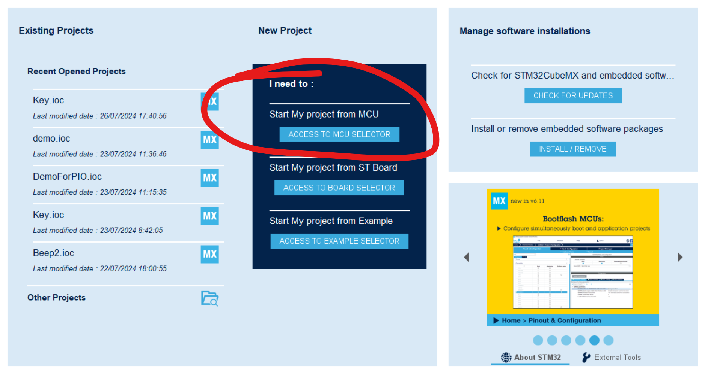

锁定目标板子（↓）

> 这里我收藏了常用的板子，所以可以很快找到，没有的看官搜索板子的型号就好

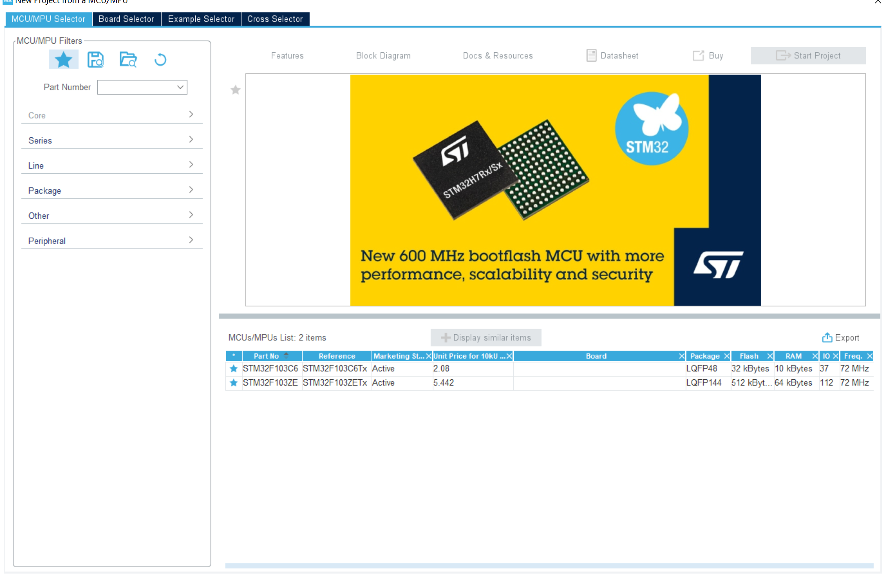

点击目标板子的栏目，就看到我们熟悉的界面了。

#### 1. 选择目标引脚并配置

​	我们需要选择目标引脚然后完成相关的配置，笔者这里选择了我这块开发板上的PE5引脚来驱动连接上的单片机，引脚的配置需要结合硬件电路进行选择


​	在这里，本人设置了：上拉输出，高速模式

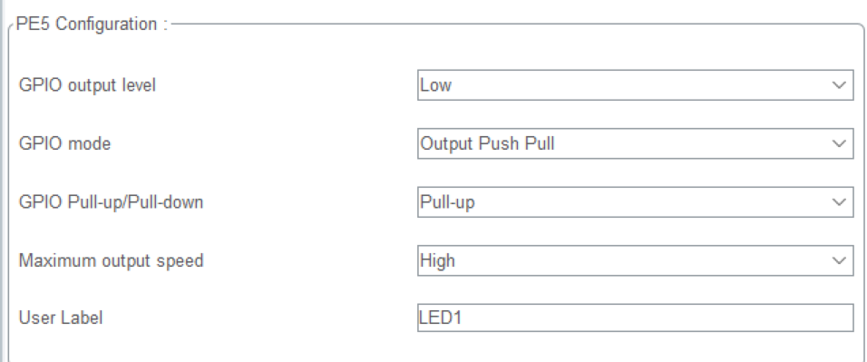

#### 2. 配置时钟树

​	我选择了使用外部晶振时钟，配置为72MHz

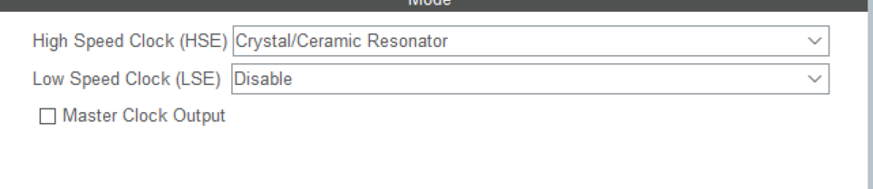

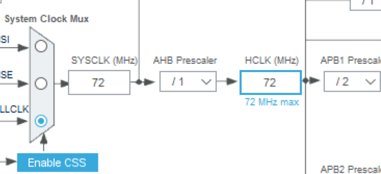

#### 3. **[关键！调试则需要：]**选择调试器类型

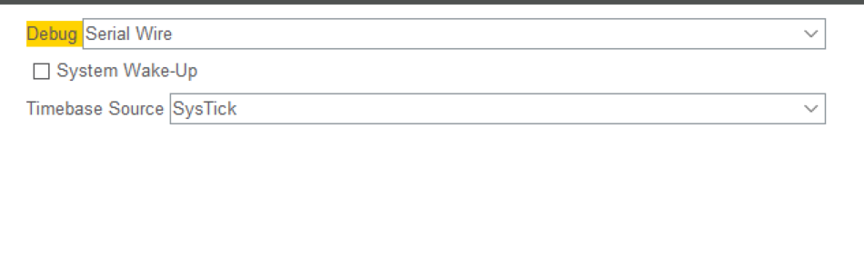

​	Serial Wire是笔者选择的，我的手头只有STLink可以使用，如果看官有的是JLink调试器，请根据

>[STM32-HAL库CubeMX中的SYS配置选项_cubmx不配置sys debug-CSDN博客](https://blog.csdn.net/2304_77832287/article/details/136578853)

​	做出相关的选择！这一步相当关键！

#### 4. 选择对应的目标IDE配置代码与文件

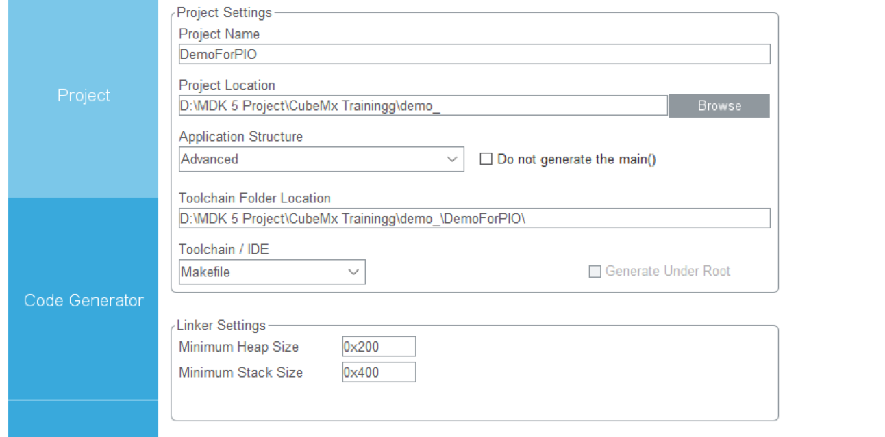

​	看官自行**设置好项目名称**和**项目存储的文件夹**，两者将会在后面的PIO配置中使用到！请高度关注！

> TIPS: 如果看官不想拷贝所有的库文件，可以在Code Generator那一栏中选择相应的配置：
>
> 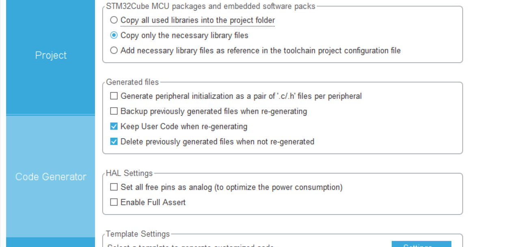

下面我们生成代码

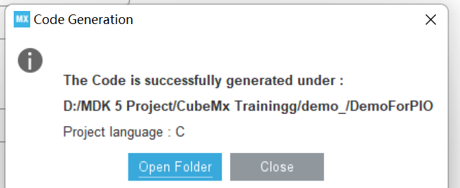

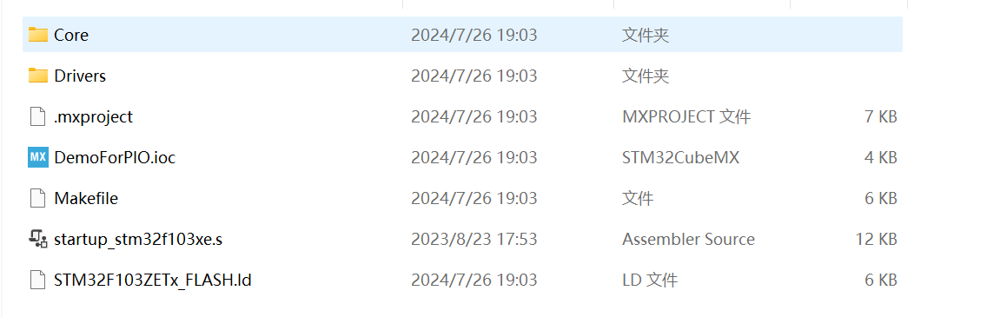

​	可以看到所有的必要底层库文件都得到了拷贝，下面我们转战VSCode + PIO

### 使用PlatformIO搭建我们的STM32开发环境

​	打开VSCode，PlatformIO在Plugin Market里下载。

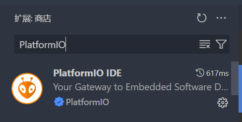

​	看官先点击下载之，泡上一杯咖啡吧，下载很慢的！（笔者这里下载过了）安装结束之后，你的左侧工具栏会出现这个

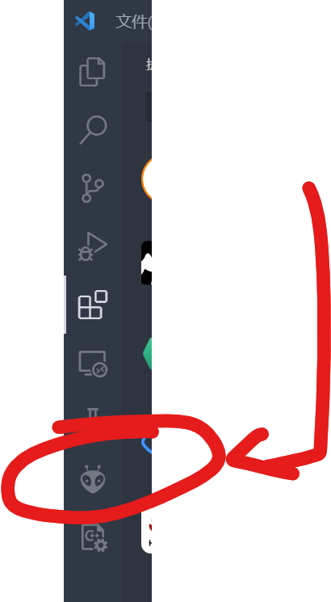

​	点击一下：

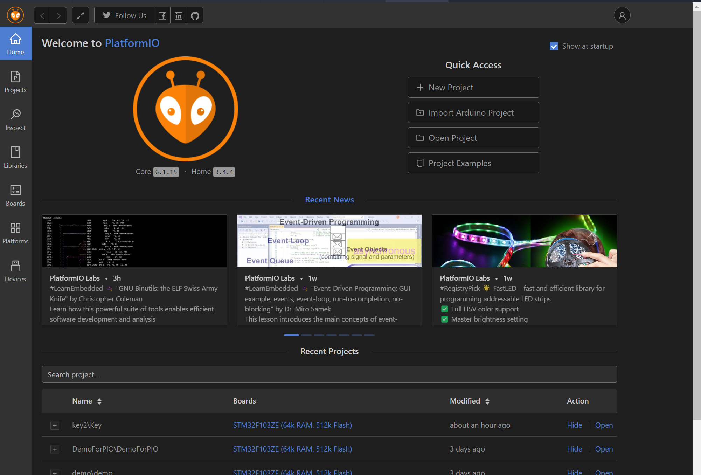

​	这就是PlatformIO!我们下面可以将我们的STM32生成的代码跟PIO对接。点击新建工程：

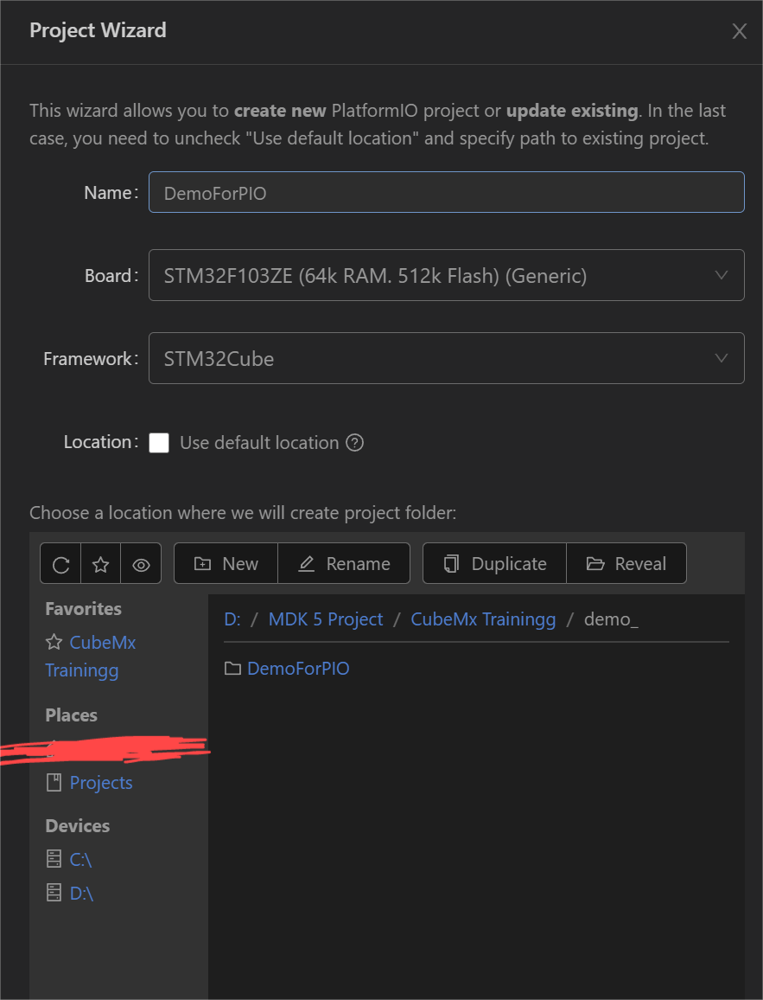

里面需要填写的项目我一个个说：

> 1. 工程名称：跟CubeMx你填写的项目名称要完全一致
> 2. 目标板子：跟CubeMx型号一致
> 3. 框架：这个是说的是如何进行读取行为，我们使用的是CubeMX的生成代码，所以目标框架我们采用的是STM32Cube
> 4. 位置Location:先把Default Location给删掉，我们需要选择在刚刚在CubeMx下选择的文件夹，可以看到我们在刚刚笔者选择在了`D:\MDK5 Project\CubeMx Trainingg\demo_`下，所有的代码都继续生成在了`D:\MDK5 Project\CubeMx Trainingg\demo_\${ProjectName}\`下方，**我们在PIO下的目录就选择到`D:\MDK5 Project\CubeMx Trainingg\demo_`这个位置**，这是因为他也会生成`${ProjectName}\...`文件夹，我们这样做是为了让PIO生成的文件和CubeMx的文件生成在用以项目根目录下，方便我们的书写和文件读取


​	点击Finish到这里之后，第一次下载的朋友将会下载相关的工具链，笔者当时下载了长达小半个小时，请各位看官稍有耐心，可以出去散散步！之后等到工具链配置结束之后，生成工程就是一刹那的事情。

​	现在生成结束了！

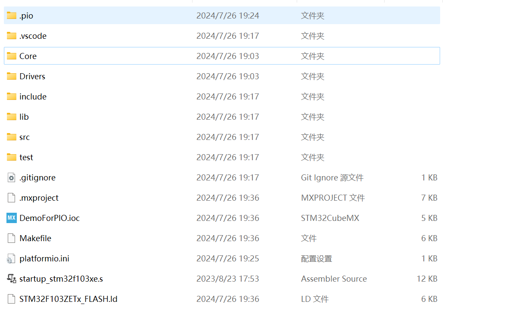

​	我们下面来看看platformio.ini文件。

```
; PlatformIO Project Configuration File
;
;   Build options: build flags, source filter
;   Upload options: custom upload port, speed and extra flags
;   Library options: dependencies, extra library storages
;   Advanced options: extra scripting
;
; Please visit documentation for the other options and examples
; https://docs.platformio.org/page/projectconf.html


[env:genericSTM32F103ZE]
platform = ststm32
board = genericSTM32F103ZE
framework = stm32cube
```

​	这是PlatformIO为我们默认生成好的模板，但是仅靠这个完全没有办法编译我们的项目，我们需要自行修改。

​	经过笔者的简单探索，笔者整合出了如下的配置：

> 使用笔者的配置

```
; PlatformIO Project Configuration File
;
;   Build options: build flags, source filter
;   Upload options: custom upload port, speed and extra flags
;   Library options: dependencies, extra library storages
;   Advanced options: extra scripting
;
; Please visit documentation for the other options and examples
; https://docs.platformio.org/page/projectconf.html


; src_dir就是告知我们的项目的大源文件地址在何处，它隶属于platformio模块的匹配
; https://docs.platformio.org/en/latest/projectconf/sections/platformio/options/directory/src_dir.html
[platformio]
src_dir = ./Core/

;目标板子: STM32F103ZE
[env:genericSTM32F103ZE]
platform = ststm32
board = genericSTM32F103ZE
framework = stm32cube

; -Idir是include文件目录, 这里随了GCC的语法
; build_flag本质上就是给arm-noeabi-gcc加上了编译参数，直接添加的，所以直接随的是GCC的语法
build_flags =     
    -ICore/Inc    

;选择链接文件，我们的STM32上电后要执行一段启动脚本
board_build.ldscript = ./STM32F103ZETx_FLASH.ld

; 下面是上传工具的配置
; PlatformIO默认使用的上传协议就是stlink,默认的调试协议还是stlink, 这是笔者并没有写出的原因
; 如果看官手头有的调试器是JLink的话，则需要显示的指定: [看官自行注释]
; upload_protocol=jlink
; debug_tool=jlink

; 手头只有USB < - > TTL的话, 则是
; upload_protocol=serial

; 值得注意的是: 一些板子是不支持某一些协议的，这跟PlatformIO使用到的开源库有关系，请前往
; https://docs.platformio.org/en/latest/boards/index.html#boards
; 搜索自己使用的板子查看支持的上传，调试协议
```

​	还有另一份是广为传播的一种配置：

```
; PlatformIO Project Configuration File
;
;   Build options: build flags, source filter
;   Upload options: custom upload port, speed and extra flags
;   Library options: dependencies, extra library storages
;   Advanced options: extra scripting
;
; Please visit documentation for the other options and examples
; https://docs.platformio.org/page/projectconf.html

; 在配置文件中分号开头为注释
[platformio]
; 将源代码的编译目录移到项目目录下，否则默认src下
src_dir = ./

[env:genericSTM32F103ZE]
platform = ststm32
board = genericSTM32F103ZE
; framework = stm32cube（不用framework了）
; 编译配置-D是宏定义，-Idir是include文件目录,读者可按自己项目结构更改
; 这里笔者锐评一下: 这种方式就是会十分繁琐！必须依次指定所有的包含目录!
; 在已经存在支持的框架下，请优先使用platformIO已经支持的框架！
build_flags =         
  -D STM32F103xE	; 预定义宏, 看官可以理解为在一切源文件的开头加上了#define STM32F103xE
  -ICore/Inc		; 包含了源文件的路径
  -IDrivers/CMSIS/Include
  -IDrivers/CMSIS/Device/ST/STM32F1xx/Include
  -IDrivers/STM32F1xx_HAL_Driver/Inc
  -IDrivers/STM32F1xx_HAL_Driver/Inc/Legacy

;选择编译文件的所在路径，这里包含了源文件路径，启动文件，驱动库和rtos路径。如果+<*>便是路径下的所以文件，-<.git/>便是忽略.git路径下的文件
build_src_filter = +<Core/Src> +<startup_stm32f103xe.s> +<Drivers/> +<Middlewares/>
;选择链接文件
board_build.ldscript = ./STM32F103ZETx_FLASH.ld
```

​	下面我们直接点灯就好，在Core/Src/main.c下：

```
  // 笔者选择的是上拉模式,亮灯要拉低GPIO电平
  HAL_GPIO_WritePin(LED1_GPIO_Port, LED1_Pin, GPIO_PIN_RESET);
  HAL_GPIO_WritePin(LED0_GPIO_Port, LED0_Pin, GPIO_PIN_RESET);
```

​	我们下面编译运行，**您既可以Ctrl + Shift + P输入PlatformIO:Build**开始构建，也可以的点击VSCode下方工具栏上的：


> 从小房子的图标开始，依次是：
>
> - PlatformIO主页面
> - 构建
> - 上传
> - 清理
> - 测试（单元测试）
> - 串口监视器
> - 终端
> - 项目
> - 上传的端口设置（默认不动就好）

​	余下的是笔者写其他语言的插件，请不予理会。

​	笔者下面演示的是构建工程，点击`√`号

```
Processing genericSTM32F103ZE (platform: ststm32; board: genericSTM32F103ZE; framework: stm32cube)
----------------------------------------------------------------------------------------------------------------------------------------------------------------
Verbose mode can be enabled via `-v, --verbose` option
CONFIGURATION: https://docs.platformio.org/page/boards/ststm32/genericSTM32F103ZE.html
PLATFORM: ST STM32 (17.4.0) > STM32F103ZE (64k RAM. 512k Flash)
HARDWARE: STM32F103ZET6 72MHz, 64KB RAM, 512KB Flash
DEBUG: Current (blackmagic) External (blackmagic, cmsis-dap, jlink, stlink)
PACKAGES:
 - framework-stm32cubef1 @ 1.8.4
 - tool-ldscripts-ststm32 @ 0.2.0
 - toolchain-gccarmnoneeabi @ 1.70201.0 (7.2.1)
LDF: Library Dependency Finder -> https://bit.ly/configure-pio-ldf
LDF Modes: Finder ~ chain, Compatibility ~ soft
Found 29 compatible libraries
Scanning dependencies...
No dependencies
Building in release mode
Compiling .pio\build\genericSTM32F103ZE\FrameworkHALDriver\Src\stm32f1xx_hal.o
... 
Compiling .pio\build\genericSTM32F103ZE\FrameworkCMSISDevice\gcc\startup_stm32f103xe.o
Compiling .pio\build\genericSTM32F103ZE\FrameworkCMSISDevice\system_stm32f1xx.o
Archiving .pio\build\genericSTM32F103ZE\libFrameworkCMSISDevice.a
Indexing .pio\build\genericSTM32F103ZE\libFrameworkCMSISDevice.a
Linking .pio\build\genericSTM32F103ZE\firmware.elf
Checking size .pio\build\genericSTM32F103ZE\firmware.elf
Advanced Memory Usage is available via "PlatformIO Home > Project Inspect"
RAM:   [          ]   0.1% (used 44 bytes from 65536 bytes)
Flash: [          ]   0.5% (used 2724 bytes from 524288 bytes)
Building .pio\build\genericSTM32F103ZE\firmware.bin
================================================================= [SUCCESS] Took 4.93 seconds =================================================================
```

​	出现`[SUCCESS] `字样，说明我们的项目构建顺利，否则，请依次查看自己的项目配置问题。常见的是重定义，请保证自己不要重复包含源文件导致符号重定义！

​	下面我们点击`->`上传项目到板子上！

​	请在上传之前，确保您已经连接好调试器（我的是STLink），同时板子已经上好电了！

```
Processing genericSTM32F103ZE (platform: ststm32; board: genericSTM32F103ZE; framework: stm32cube)
----------------------------------------------------------------------------------------------------------------------------------------------------------------
Verbose mode can be enabled via `-v, --verbose` option
CONFIGURATION: https://docs.platformio.org/page/boards/ststm32/genericSTM32F103ZE.html
PLATFORM: ST STM32 (17.4.0) > STM32F103ZE (64k RAM. 512k Flash)
HARDWARE: STM32F103ZET6 72MHz, 64KB RAM, 512KB Flash
DEBUG: Current (blackmagic) External (blackmagic, cmsis-dap, jlink, stlink)
PACKAGES:
 - framework-stm32cubef1 @ 1.8.4
 - tool-dfuutil @ 1.11.0
 - tool-dfuutil-arduino @ 1.11.0
 - tool-ldscripts-ststm32 @ 0.2.0
 - tool-openocd @ 3.1200.0 (12.0)
 - tool-stm32duino @ 1.0.2
 - toolchain-gccarmnoneeabi @ 1.70201.0 (7.2.1)
LDF: Library Dependency Finder -> https://bit.ly/configure-pio-ldf
LDF Modes: Finder ~ chain, Compatibility ~ soft
Found 29 compatible libraries
Scanning dependencies...
No dependencies
Building in release mode
Checking size .pio\build\genericSTM32F103ZE\firmware.elf
Advanced Memory Usage is available via "PlatformIO Home > Project Inspect"
RAM:   [          ]   0.1% (used 44 bytes from 65536 bytes)
Flash: [          ]   0.5% (used 2724 bytes from 524288 bytes)
Configuring upload protocol...
AVAILABLE: blackmagic, cmsis-dap, dfu, jlink, serial, stlink
CURRENT: upload_protocol = stlink
Uploading .pio\build\genericSTM32F103ZE\firmware.elf
xPack Open On-Chip Debugger 0.12.0-01004-g9ea7f3d64-dirty (2023-01-30-15:04)
Licensed under GNU GPL v2
For bug reports, read
        http://openocd.org/doc/doxygen/bugs.html
debug_level: 1

hla_swd
[stm32f1x.cpu] halted due to debug-request, current mode: Thread 
xPSR: 0x01000000 pc: 0x08000bf8 msp: 0x20010000
** Programming Started **
Warn : Adding extra erase range, 0x08000c90 .. 0x08000fff
** Programming Finished **
** Verify Started **
** Verified OK **
** Resetting Target **
shutdown command invoked
================================================================= [SUCCESS] Took 2.75 seconds =================================================================
```

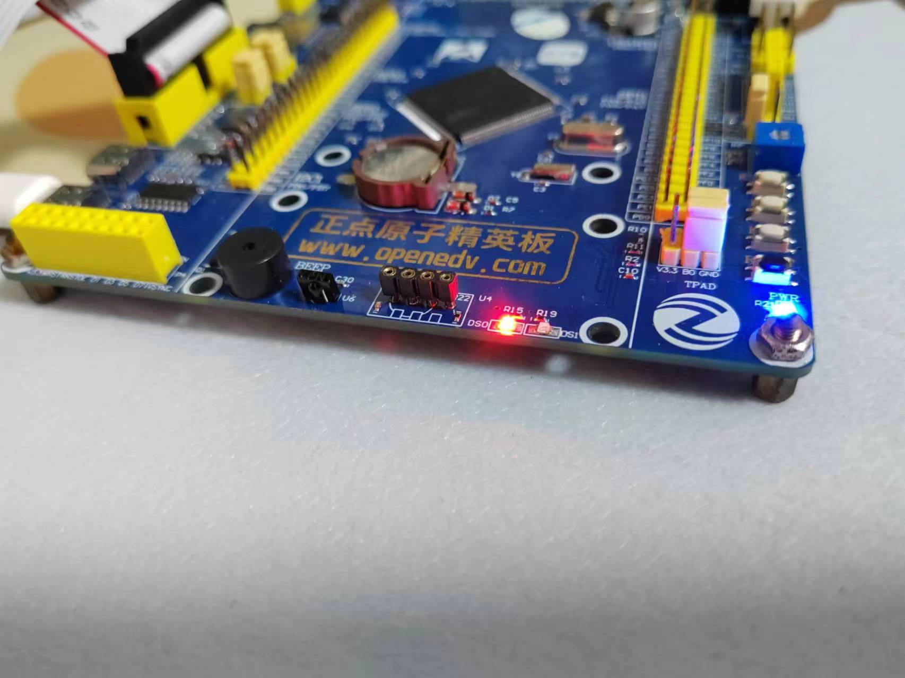

​	如愿，小灯亮起，到这里，我们的教程结束！

## 一些在上传中可能出现的问题

1. 板子没上电↓

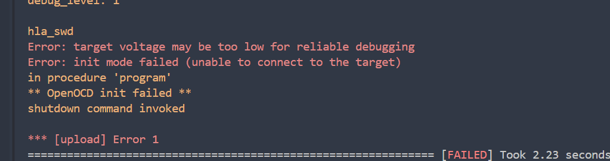

2. STLink没插好！或者STLink异常，导致OpenOCD无法初始化，请检查端口

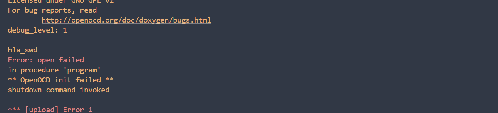

3. 使用USB转TTL接口上传程序出现的问题

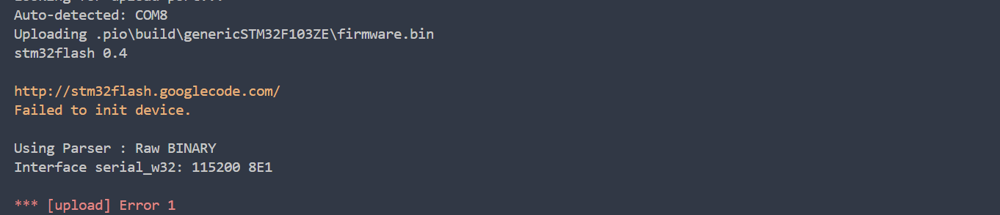

​	感谢SourceForge大佬的解答，我随后马上意识到自己犯了一件很蠢的事情，我忘记改板子为bootloader烧录模式了，导致板子根本不接受usb烧录。

> [stm32flash / Tickets / #134 STM32L462 "Failed to init device" problem (sourceforge.net)](https://sourceforge.net/p/stm32flash/tickets/134/)

​	请各位看官参考自己的手册关于BOOT引脚的配置！

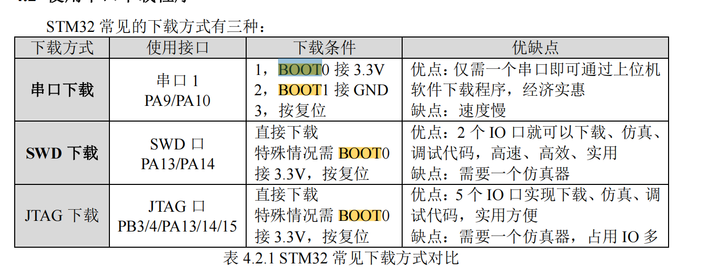

​	所以，我需要改BOOT0引脚接到3.3V上去，上载好程序后，恢复BOOT引脚全部接地运行程序，果然：

```
Processing genericSTM32F103ZE (platform: ststm32; board: genericSTM32F103ZE; framework: stm32cube)
----------------------------------------------------------------------------------------------------------------------------------------------------------------
Verbose mode can be enabled via `-v, --verbose` option
CONFIGURATION: https://docs.platformio.org/page/boards/ststm32/genericSTM32F103ZE.html
PLATFORM: ST STM32 (17.4.0) > STM32F103ZE (64k RAM. 512k Flash)
HARDWARE: STM32F103ZET6 72MHz, 64KB RAM, 512KB Flash
DEBUG: Current (blackmagic) External (blackmagic, cmsis-dap, jlink, stlink)
PACKAGES:
 - framework-stm32cubef1 @ 1.8.4
 - tool-dfuutil @ 1.11.0
 - tool-dfuutil-arduino @ 1.11.0
 - tool-ldscripts-ststm32 @ 0.2.0
 - tool-openocd @ 3.1200.0 (12.0)
 - tool-stm32duino @ 1.0.2
 - toolchain-gccarmnoneeabi @ 1.70201.0 (7.2.1)
LDF: Library Dependency Finder -> https://bit.ly/configure-pio-ldf
LDF Modes: Finder ~ chain, Compatibility ~ soft
Found 29 compatible libraries
Scanning dependencies...
No dependencies
Building in release mode
Checking size .pio\build\genericSTM32F103ZE\firmware.elf
Advanced Memory Usage is available via "PlatformIO Home > Project Inspect"
RAM:   [          ]   0.1% (used 44 bytes from 65536 bytes)
Flash: [          ]   0.5% (used 2716 bytes from 524288 bytes)
Configuring upload protocol...
AVAILABLE: blackmagic, cmsis-dap, dfu, jlink, serial, stlink
CURRENT: upload_protocol = serial
Looking for upload port...
Auto-detected: COM8
Uploading .pio\build\genericSTM32F103ZE\firmware.bin
stm32flash 0.4

http://stm32flash.googlecode.com/

Using Parser : Raw BINARY
Interface serial_w32: 115200 8E1
Version      : 0x22
Option 1     : 0x00
Option 2     : 0x00
Device ID    : 0x0414 (High-density)
- RAM        : 64KiB  (512b reserved by bootloader)
- Flash      : 512KiB (sector size: 2x2048)
- Option RAM : 16b
- System RAM : 2KiB
Write to memory
Erasing memory

Wrote address 0x08000100 (7.98%) 
Wrote address 0x08000200 (15.96%) 
...
Wrote address 0x08000b00 (87.78%) 
Wrote address 0x08000c00 (95.76%) 
Wrote address 0x08000c88 (100.00%) Done.

Starting execution at address 0x08000000... done.
```

## 调试

​	这里请只有串口烧录的朋友止步了。

​	调试极其容易，我们只需要按照经典的点击：

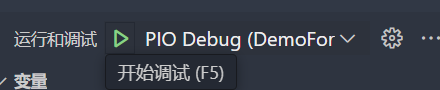

​	确保自己的板子和调试器都上好电之后，就可以愉快调试了！