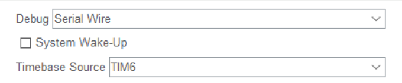
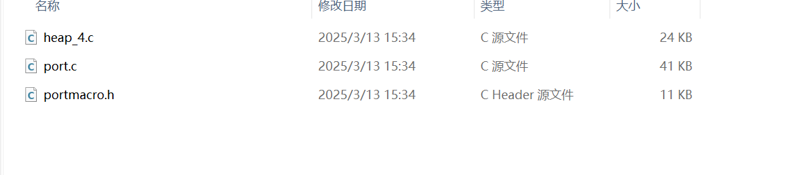

# 基于STM32F407ZGT6的硬件平台，（可选CubeMX） + PlatformIO软件开发的FreeRTOS部署指南

## 前言

​	笔者在结束了自己的Operating System手搓之旅之后，笔者开展的第一个研究。目前笔者发现，中文互联网上对FreeRTOS于PlatformIO的部署资料甚少（好像大家都很喜欢Keil或者是CubeIDE，这也是，没人喜欢更换软件开发成本）。而且，大部分我看到的方案都比较老了。本教程写于2025年的3月13号，基于笔者没有办法保证整个参考办法一直有效，请各位看官酌情参考。

​	笔者关于如何在使用PlatformIO + CubeMX开发STM32F103系列的单片机的博客指南在：[STM32开发环境配置记录——关于PlatformIO + VSCode + CubeMX的集成环境配置_platformio stm32-CSDN博客](https://blog.csdn.net/charlie114514191/article/details/140724534)，如果您优先对PlatformIO/CubeMX代码生成器感兴趣，可以先看看整个博客，注意的是这是F1系列的，但是F4同样可以类比使用！

​	这里，笔者会给出两个方案——存在CubeMX配置工具的方案和非CubeMX的配置方案。请您自行参考。注意的是——FreeRTOS是争取平台无关的。如果您是Keil用户或者是CubeIDE用户，**可以参考笔者的非平台相关标注的部分，其余的部分请不要雷同死板的迁移！**

# 使用CubeMX生成代码的FreeRTOS移植方案

​	大部分人应该最关心这个！

​	CubeMX作为一个代码生成器实在是非常的好用。他自己内部就集成了FreeRTOS的代码迁移，而且存在自己的一套封装（就是CMSIS_OS方案和CMSIS_OS_V2方案，这里笔者不对之做非常具体的介绍，你可以认为是对硬件平台的支持程度，学习的情况下，我建议是CMSIS_V1，因为屁事少，而且需要注意的是——PlatformIO对CubeMX的CMSIS_OS的支持截止到今天也是V1支持，V2要自己改不少东西（笔者没有更改成功），所以我建议是V1）

​	打开CubeMX，针对STM32F407ZGT6单片机生成一个空白的工程。跟着我一起完成一系列的配置

## 时钟选择



​	注意，你的第一步是切换一个时基，不要选择Systicks，因为，我们的HAL库默认给Systicks的更新放到了中断优先级的最下面，这意味着，只要任何发生跟Systicks中断有关的**更高优先级**的事件，**整个FreeRTOS就会卡死，造成RTOS不RT，所以，请你必！须！切换一个基础的定时器（笔者随意选择了一个，各位自己开发的时候按照自己的外设分配情况选择）**

## 在Middlewares中选择FreeRTOS的版本支持


​	在`Middlewares -> FreeRTOS -> Interface`中选择CMSIS_OS的版本，笔者认为，如果你不是存在特殊的需求，请选择V1版本。具体的V1和V2的需求请参考博客：[FreeRTOS:CMSIS_V1与CMSIS_V2区别_freertos v1和v2-CSDN博客](https://blog.csdn.net/liuwuyi1987/article/details/125812216)

## 其他外设的支持

​	这里，就是跟你往常一样了，你用到哪些外设，使能它，然后正常配置。笔者就举一个——配置了PF9和PF10管脚外接的LED小灯吧！


## 封装自己配置的任务

​	现在停下手头的事情，规划一下自己哪一些任务是可以解耦合发配到FreeRTOS中作为一个任务运行的——笔者是——一个任务翻转一个小灯。


​	点击Add添加任务，如果你分析一下，栈，分配策略没有任何特殊的话，选择默认设置，可以帮助自己省事。


## 生成PIO代码

​	下一步就是生成PIO的代码了，这里笔者不再说咋搞了，如果你不知道如何配置，照猫画虎我的博客：[STM32开发环境配置记录——关于PlatformIO + VSCode + CubeMX的集成环境配置_platformio stm32-CSDN博客](https://blog.csdn.net/charlie114514191/article/details/140724534)

## 修改platformio.ini

​	比较麻烦的事情来了，我相信找到这个博客的大伙主要看这个，笔者现给配置，然后看我一一说明：

```
; PlatformIO Project Configuration File
;
;   Build options: build flags, source filter
;   Upload options: custom upload port, speed and extra flags
;   Library options: dependencies, extra library storages
;   Advanced options: extra scripting
;
; Please visit documentation for the other options and examples
; https://docs.platformio.org/page/projectconf.html

; Set the Src dir as current
[platformio]
src_dir = ./


[env:black_f407zg]
platform = ststm32
board = black_f407zg
; 注释掉下面这个话，因为我们需要自己指定编译的办法——有ThirdParty的FreeRTOS在，所以笔者之前博客的办法用不了
; framework = stm32cube
; 设置构建目录
build_flags =   
    -mfloat-abi=hard -mfpu=fpv4-sp-d16    ; 第一步: 指定使用STM32F4的硬件FPU  
    -D STM32F407xx -DARM_MATH_CM4 -DARM_MATH_MATRIX_CHECK -DARM_MATH_ROUNDING ; 第二步，指明单片机和FPU设置
    -ICore/Inc	; 下面是包含我们的STM32的库文件, HAL库源码, FreeRTOS源码的路径
    -IDrivers/CMSIS/Include
    -IDrivers/CMSIS/Device/ST/STM32F4xx/Include
    -IDrivers/STM32F4xx_HAL_Driver/Inc
    -IDrivers/STM32F4xx_HAL_Driver/Inc/Legacy
    -IMiddlewares/Third_Party/FreeRTOS/Source/include
    -IMiddlewares/Third_Party/FreeRTOS/Source/portable/GCC/ARM_CM4F
    -IMiddlewares/Third_Party/FreeRTOS/Source/CMSIS_RTOS

; 下面这一步是设置源码搜索的过滤路径
build_src_filter = +<Core/Src> +<startup_stm32f407xx.s> +<Drivers/> +<Middlewares/>
; 下面这一步是设置我们的链接脚本，非常重要，根据自己生成的链接脚本的文件名称选择！
board_build.ldscript = ./STM32F407ZGTx_FLASH.ld
; 笔者使用的是CMSIS-DAP下载器, STLink选手使用STLink，串口选手选serial
upload_protocol = cmsis-dap
debug_tool = cmsis-dap
; 非常重要，需要我们指定额外的链接脚本，否则就会出现链接错误
extra_scripts = update_link_flags.py
```

​	笔者一一说明：

### 第一步：指定我们的源码文件夹

​	因为CubeMX生成的规范和PlatformIO的不太兼容，需要我们自己指定。修改的地方就有——

- 指定src_dir为当前的目录
- 包含我们的头文件检索路径：
  1. 包含我们的库文件（HAL库封装的基础）
     - -IDrivers/CMSIS/Include
       -IDrivers/CMSIS/Device/ST/STM32F4xx/Include
  2. 包含我们的HAL库的源码
     - -IDrivers/STM32F4xx_HAL_Driver/Inc
     - -IDrivers/STM32F4xx_HAL_Driver/Inc/Legacy
  3. 包含我们的FreeRTOS源码
     - -IMiddlewares/Third_Party/FreeRTOS/Source/portable/GCC/ARM_CM4F
     - -IMiddlewares/Third_Party/FreeRTOS/Source/include

     - -IMiddlewares/Third_Party/FreeRTOS/Source/CMSIS_RTOS
- 指定我们的连接脚本：board_build.ldscript = ./STM32F407ZGTx_FLASH.ld
- 设置源代码搜索路径为：
  - `build_src_filter = +<Core/Src> +<startup_stm32f407xx.s> +<Drivers/> +<Middlewares/>`
  - 依次是——MX生成的Src源代码文件文件夹，启动汇编代码，HAL库和库函数文件夹以及我们的FreeRTOS文件夹，上面中，所有在这些文件夹下包含的C源代码都会被PIO的，Python写的源代码文件检索程序检索提供给GCC编译

### 第二步，解决FPU的选择问题

​	笔者在研究的时候就发现，不指定FPU是软件模拟FPU还是硬件FPU，FreeRTOS的源码就会报错。其错误是

```
D:\Temp\cc4JXOIP.s:330: Error: selected processor does not support `vstmdbeq r0!,{s16-s31}' in Thumb mode
D:\Temp\cc4JXOIP.s:332: Error: instruction not allowed in IT block -- `stmdb r0!,{r4-r11,r14}'
D:\Temp\cc4JXOIP.s:352: Error: selected processor does not support `vldmiaeq r0!,{s16-s31}' in Thumb mode D:\Temp\cc4JXOIP.s:354: Error: instruction not allowed in IT block -- `msr psp,r0'
```

​	等等，这个一眼FPU的指令问题，说明，我们需要指定使用的FPU。

​	这就是笔者查阅资料后得到的结论，背书可以看这位兄弟配置CLion的时候发生的事情：[STM32F4开发板添加FreeRtos后在Clion中编译报错_selected processor does not support `vstmdbeq r0!,-CSDN博客](https://blog.csdn.net/qq_57228077/article/details/130230224)

> 添加指定使用硬件FPU，且使用的是——`fpv4-sp-d16` 表示使用 ARMv4 浮点单元，支持单精度（sp）并且有 16 个寄存器（d16）。

```
-mfloat-abi=hard -mfpu=fpv4-sp-d16     
```

> 添加更加具体的FreeRTOS对FPU的支持

```
-DARM_MATH_CM4 -DARM_MATH_MATRIX_CHECK -DARM_MATH_ROUNDING
```

​	再次编译，错误就改到了，链接失败了：

```
c:/.platformio/packages/toolchain-gccarmnoneeabi@1.70201.0/bin/../lib/gcc/arm-none-eabi/7.2.1/../../../../arm-none-eabi/bin/ld.exe: error: .pio\build\black_f407zg\src\Middlewares\Third_Party\FreeRTOS\Source\tasks.o uses VFP register arguments, .pio\build\black_f407zg\firmware.elf does not
c:/.platformio/packages/toolchain-gccarmnoneeabi@1.70201.0/bin/../lib/gcc/arm-none-eabi/7.2.1/../../../../arm-none-eabi/bin/ld.exe: failed to merge target specific data of file .pio\build\black_f407zg\src\Middlewares\Third_Party\FreeRTOS\Source\tasks.o
c:/.platformio/packages/toolchain-gccarmnoneeabi@1.70201.0/bin/../lib/gcc/arm-none-eabi/7.2.1/../../../../arm-none-eabi/bin/ld.exe: error: .pio\build\black_f407zg\src\Middlewares\Third_Party\FreeRTOS\Source\timers.o uses VFP register arguments, .pio\build\black_f407zg\firmware.elf does not
c:/.platformio/packages/toolchain-gccarmnoneeabi@1.70201.0/bin/../lib/gcc/arm-none-eabi/7.2.1/../../../../arm-none-eabi/bin/ld.exe: failed to merge target specific data of file .pio\build\black_f407zg\src\Middlewares\Third_Party\FreeRTOS\Source\timers.o
```

​	这里说明我们还要针对链接过程告知支持FPU，这里就是笔者的最后一个修改

```
extra_scripts = update_link_flags.py
```

​	对了，不要用extra_script，笔者翻阅PlatformIO的Update Releases说了马上就会移除extra_script选项的支持，别看老博客照抄！

​	其中，update_link_flags.py就是这些内容，看不懂你就复制粘贴

```c
# Custom settings, as referred to as "extra_script" in platformio.ini
#
# See http://docs.platformio.org/en/latest/projectconf.html#extra-script

from SCons.Script import DefaultEnvironment

env = DefaultEnvironment()

env.Append(
    LINKFLAGS=[
        "-mfloat-abi=hard",
        "-mfpu=fpv4-sp-d16"
    ]
)
```

​	现在我们编译

```
Linking .pio\build\black_f407zg\firmware.elf
Checking size .pio\build\black_f407zg\firmware.elf
Advanced Memory Usage is available via "PlatformIO Home > Project Inspect"
RAM:   [=         ]  13.4% (used 17528 bytes from 131072 bytes)
Flash: [          ]   0.9% (used 9588 bytes from 1048576 bytes)
```

​	完美通过。你可以开始你的FreeRTOS的旅程了

# 非CubeMX的FreeRTOS移植

​	可惜笔者真不喜欢CubeMX，背后做了太多的事情，导致我们根本没办法掌控我们的程序，出问题了只能抓瞎！所以笔者针对此，补充了一个类似于正点原子的从头开始移植的教程。

## 源码下载

​	玩最潮的！https://github.com/FreeRTOS/FreeRTOS-LTS/releases/download/202406.01-LTS/FreeRTOSv202406.01-LTS.zip

​	我们下载这个最新的FreeRTOS，笔者目前最关心的是内核部分，其他比如说FreeRTOS对MQTT，TCP/IP等协议支持的部分请参考其他人的博客！

​	我们的平台是PlatformIO，使用的工具链是ARM-GCC，所以，我们实际上做的就是这些事情！

### 根据平台和我们使用的模块，摘除代码

​	我们在下载的LTS中，只留下到FreeRTOS-Kernel和下面的文件，其他的全部删掉


​	进入目录，


​	我们的examples是使用样例，删掉。然后进入portable


​	只留下GCC下的ARM_CM4F文件夹下的内容和MemMang的heap_4.c

> 我们的STM32F407ZGT6使用的是ARM_CM4F，如果你不知道，教你一个办法——使用CubeMX生成一次，看他裁剪的结果就好了，如果你没有CubeMX，那就搜索引擎，查型号

​	其他的全部删掉！笔者最后整理在了一起，方便我们编写platformio.ini文件



​	跟硬件平台相关的部分，就已经配置完了。

## 编写我们的FreeRTOSConfig文件

​	这个就属于FreeRTOS的学习了，笔者先直接扔出来笔者的配置

```c
#ifndef FREERTOS_CONFIG_H
#define FREERTOS_CONFIG_H

/*-----------------------------------------------------------
 * Application specific definitions.
 *
 * These definitions should be adjusted for your particular hardware and
 * application requirements.
 *
 * These parameters and more are described within the 'configuration' section of the
 * FreeRTOS API documentation available on the FreeRTOS.org web site.
 *
 * See http://www.freertos.org/a00110.html
 *----------------------------------------------------------*/

/* Ensure definitions are only used by the compiler, and not by the assembler. */
#if defined(__ICCARM__) || defined(__CC_ARM) || defined(__GNUC__)
  #include <stdint.h>
  extern uint32_t SystemCoreClock;
#endif
#define configENABLE_FPU                         0
#define configENABLE_MPU                         0

#define configUSE_PREEMPTION                     1
#define configSUPPORT_STATIC_ALLOCATION          1
#define configSUPPORT_DYNAMIC_ALLOCATION         1
#define configUSE_IDLE_HOOK                      0
#define configUSE_TICK_HOOK                      0
#define configCPU_CLOCK_HZ                       ( SystemCoreClock )
#define configTICK_RATE_HZ                       ((TickType_t)1000)
#define configMAX_PRIORITIES                     ( 7 )
#define configMINIMAL_STACK_SIZE                 ((uint16_t)128)
#define configTOTAL_HEAP_SIZE                    ((size_t)15360)
#define configMAX_TASK_NAME_LEN                  ( 16 )
#define configUSE_16_BIT_TICKS                   0
#define configUSE_MUTEXES                        1
#define configQUEUE_REGISTRY_SIZE                8
#define configUSE_PORT_OPTIMISED_TASK_SELECTION  1
/* USER CODE BEGIN MESSAGE_BUFFER_LENGTH_TYPE */
/* Defaults to size_t for backward compatibility, but can be changed
   if lengths will always be less than the number of bytes in a size_t. */
#define configMESSAGE_BUFFER_LENGTH_TYPE         size_t
/* USER CODE END MESSAGE_BUFFER_LENGTH_TYPE */

/* Co-routine definitions. */
#define configUSE_CO_ROUTINES                    0
#define configMAX_CO_ROUTINE_PRIORITIES          ( 2 )

/* Set the following definitions to 1 to include the API function, or zero
to exclude the API function. */
#define INCLUDE_vTaskPrioritySet             1
#define INCLUDE_uxTaskPriorityGet            1
#define INCLUDE_vTaskDelete                  1
#define INCLUDE_vTaskCleanUpResources        0
#define INCLUDE_vTaskSuspend                 1
#define INCLUDE_vTaskDelayUntil              0
#define INCLUDE_vTaskDelay                   1
#define INCLUDE_xTaskGetSchedulerState       1

/* Cortex-M specific definitions. */
#ifdef __NVIC_PRIO_BITS
 /* __BVIC_PRIO_BITS will be specified when CMSIS is being used. */
 #define configPRIO_BITS         __NVIC_PRIO_BITS
#else
 #define configPRIO_BITS         4
#endif

/* The lowest interrupt priority that can be used in a call to a "set priority"
function. */
#define configLIBRARY_LOWEST_INTERRUPT_PRIORITY   15

/* The highest interrupt priority that can be used by any interrupt service
routine that makes calls to interrupt safe FreeRTOS API functions.  DO NOT CALL
INTERRUPT SAFE FREERTOS API FUNCTIONS FROM ANY INTERRUPT THAT HAS A HIGHER
PRIORITY THAN THIS! (higher priorities are lower numeric values. */
#define configLIBRARY_MAX_SYSCALL_INTERRUPT_PRIORITY 5

/* Interrupt priorities used by the kernel port layer itself.  These are generic
to all Cortex-M ports, and do not rely on any particular library functions. */
#define configKERNEL_INTERRUPT_PRIORITY 		( configLIBRARY_LOWEST_INTERRUPT_PRIORITY << (8 - configPRIO_BITS) )
/* !!!! configMAX_SYSCALL_INTERRUPT_PRIORITY must not be set to zero !!!!
See http://www.FreeRTOS.org/RTOS-Cortex-M3-M4.html. */
#define configMAX_SYSCALL_INTERRUPT_PRIORITY 	( configLIBRARY_MAX_SYSCALL_INTERRUPT_PRIORITY << (8 - configPRIO_BITS) )

/* Normal assert() semantics without relying on the provision of an assert.h
header file. */
/* USER CODE BEGIN 1 */
#define configASSERT( x ) if ((x) == 0) {taskDISABLE_INTERRUPTS(); for( ;; );}
/* USER CODE END 1 */

/* Definitions that map the FreeRTOS port interrupt handlers to their CMSIS
standard names. */
#define vPortSVCHandler    SVC_Handler
#define xPortPendSVHandler PendSV_Handler

/* IMPORTANT: This define is commented when used with STM32Cube firmware, when the timebase source is SysTick,
              to prevent overwriting SysTick_Handler defined within STM32Cube HAL */

#define xPortSysTickHandler SysTick_Handler

/* USER CODE BEGIN Defines */
/* Section where parameter definitions can be added (for instance, to override default ones in FreeRTOS.h) */
/* USER CODE END Defines */

#endif /* FREERTOS_CONFIG_H */
```

​	这个文件非常长，笔者在附录中有分析这个FreeRTOSConfig文件的含义，请感兴趣的朋友移步到附录。

## 下一步，搭建HAL库到FreeRTOS飞跃的Adapter

​	我们使用FreeRTOS，需要自己完成一部分配置。这里就是我们说的——时基的选择，中断优先级的分类。所以，我们需要动点手脚。

### 第一步，修正中断分组

​	在HAL_Init中，我们要修正一下可能不对的中断优先级分组

```
HAL_NVIC_SetPriorityGrouping(NVIC_PRIORITYGROUP_4);
```

​	这个看自己的情况来。以及，还需要配置一下我们的MspInit函数

```c
void HAL_MspInit(void)
{
  __HAL_RCC_SYSCFG_CLK_ENABLE();
  __HAL_RCC_PWR_CLK_ENABLE();

  /* System interrupt init*/
  /* PendSV_IRQn interrupt configuration */
  HAL_NVIC_SetPriority(PendSV_IRQn, 15, 0);
}
```


### 第二步，设置使用对应的外设时钟

​	熟悉HAL库的朋友都知道，这就是重写HAL_InitTicks函数嘛！笔者放到下面了

```c
#include "stm32f4xx_hal.h"
#include "stm32f4xx_hal_tim.h"

TIM_HandleTypeDef        htim6;
/**
  * @brief  This function configures the TIM6 as a time base source.
  *         The time source is configured  to have 1ms time base with a dedicated
  *         Tick interrupt priority.
  * @note   This function is called  automatically at the beginning of program after
  *         reset by HAL_Init() or at any time when clock is configured, by HAL_RCC_ClockConfig().
  * @param  TickPriority: Tick interrupt priority.
  * @retval HAL status
  */
HAL_StatusTypeDef HAL_InitTick(uint32_t TickPriority)
{
  RCC_ClkInitTypeDef    clkconfig;
  uint32_t              uwTimclock = 0;
  uint32_t              uwPrescalerValue = 0;
  uint32_t              pFLatency;
  /*Configure the TIM6 IRQ priority */
  HAL_NVIC_SetPriority(TIM6_DAC_IRQn, TickPriority ,0);

  /* Enable the TIM6 global Interrupt */
  HAL_NVIC_EnableIRQ(TIM6_DAC_IRQn);

  /* Enable TIM6 clock */
  __HAL_RCC_TIM6_CLK_ENABLE();

  /* Get clock configuration */
  HAL_RCC_GetClockConfig(&clkconfig, &pFLatency);

  /* Compute TIM6 clock */
  uwTimclock = 2*HAL_RCC_GetPCLK1Freq();
  /* Compute the prescaler value to have TIM6 counter clock equal to 1MHz */
  uwPrescalerValue = (uint32_t) ((uwTimclock / 1000000U) - 1U);

  /* Initialize TIM6 */
  htim6.Instance = TIM6;

  /* Initialize TIMx peripheral as follow:
  + Period = [(TIM6CLK/1000) - 1]. to have a (1/1000) s time base.
  + Prescaler = (uwTimclock/1000000 - 1) to have a 1MHz counter clock.
  + ClockDivision = 0
  + Counter direction = Up
  */
  htim6.Init.Period = (1000000U / 1000U) - 1U;
  htim6.Init.Prescaler = uwPrescalerValue;
  htim6.Init.ClockDivision = 0;
  htim6.Init.CounterMode = TIM_COUNTERMODE_UP;

  if(HAL_TIM_Base_Init(&htim6) == HAL_OK)
  {
    /* Start the TIM time Base generation in interrupt mode */
    return HAL_TIM_Base_Start_IT(&htim6);
  }

  /* Return function status */
  return HAL_ERROR;
}

/**
  * @brief  Suspend Tick increment.
  * @note   Disable the tick increment by disabling TIM6 update interrupt.
  * @param  None
  * @retval None
  */
void HAL_SuspendTick(void)
{
  /* Disable TIM6 update Interrupt */
  __HAL_TIM_DISABLE_IT(&htim6, TIM_IT_UPDATE);
}

/**
  * @brief  Resume Tick increment.
  * @note   Enable the tick increment by Enabling TIM6 update interrupt.
  * @param  None
  * @retval None
  */
void HAL_ResumeTick(void)
{
  /* Enable TIM6 Update interrupt */
  __HAL_TIM_ENABLE_IT(&htim6, TIM_IT_UPDATE);
}

void TIM6_DAC_IRQHandler(void)
{
  HAL_TIM_IRQHandler(&htim6);
}

void HAL_TIM_PeriodElapsedCallback(TIM_HandleTypeDef *htim)
{
  if (htim->Instance == TIM6) {
    HAL_IncTick();
  }
}
```

​	笔者是移植了CubeMX生成的代码，放到了一起

### 第三步（看具体情况，可选）——配置静态分配支持

​	看你自己的FreeRTOSConfig.h中对静态分配是否支持，需要的支持的话，你需要自己写分配函数，笔者给一个参考：


```c
/* GetIdleTaskMemory prototype (linked to static allocation support) */
void vApplicationGetIdleTaskMemory(StaticTask_t **ppxIdleTaskTCBBuffer, StackType_t **ppxIdleTaskStackBuffer, uint32_t *pulIdleTaskStackSize);

static StaticTask_t xIdleTaskTCBBuffer;
static StackType_t xIdleStack[configMINIMAL_STACK_SIZE];

void vApplicationGetIdleTaskMemory(StaticTask_t **ppxIdleTaskTCBBuffer, StackType_t **ppxIdleTaskStackBuffer, uint32_t *pulIdleTaskStackSize)
{
  *ppxIdleTaskTCBBuffer = &xIdleTaskTCBBuffer;
  *ppxIdleTaskStackBuffer = &xIdleStack[0];
  *pulIdleTaskStackSize = configMINIMAL_STACK_SIZE;
}
```

​	到这里，我们可以开写了

```
Advanced Memory Usage is available via "PlatformIO Home > Project Inspect"
RAM:   [=         ]  12.6% (used 16532 bytes from 131072 bytes)
Flash: [          ]   1.7% (used 8764 bytes from 524288 bytes)
Building .pio\build\black_f407ze\firmware.bin
```

​	编译通过！笔者这里提供一个笔者自己搭建的工程，但是是PIO的：[BetterATK/STM32F4/freeRTOS/0_RawTemplate at main · Charliechen114514/BetterATK](https://github.com/Charliechen114514/BetterATK/tree/main/STM32F4/freeRTOS/0_RawTemplate)

### 第四步，写Platformio.ini

​	关于这里的说明参见上面MX配置中我对Platformio.ini的说明，这里给出来我的一个配置

```
; PlatformIO Project Configuration File
;
;   Build options: build flags, source filter
;   Upload options: custom upload port, speed and extra flags
;   Library options: dependencies, extra library storages
;   Advanced options: extra scripting
;
; Please visit documentation for the other options and examples
; https://docs.platformio.org/page/projectconf.html

[env:black_f407ze]
platform = ststm32
board = black_f407ze
framework = stm32cube

build_flags = 
    -DARM_MATH_CM4 -DARM_MATH_MATRIX_CHECK -DARM_MATH_ROUNDING
    -mfloat-abi=hard -mfpu=fpv4-sp-d16
    -Ilib/freertos/portable

; tells the protocol
upload_protocol = cmsis-dap        
debug_tool  = cmsis-dap    
extra_scripts = update_link_flags.py
```


## 附录

### FreeRTOSConfig.h文件的宏定义含义

#### 1. `configENABLE_FPU` 和 `configENABLE_MPU`

```
#define configENABLE_FPU                         0
#define configENABLE_MPU                         0
```

- `configENABLE_FPU`：此宏定义控制是否启用浮点单元（FPU）。在这里设置为 `0`，表示禁用 FPU。
- `configENABLE_MPU`：此宏定义控制是否启用内存保护单元（MPU）。设置为 `0`，表示禁用 MPU。

#### 2. 内核相关配置

```
#define configUSE_PREEMPTION                     1
#define configSUPPORT_STATIC_ALLOCATION          1
#define configSUPPORT_DYNAMIC_ALLOCATION         1
#define configUSE_IDLE_HOOK                      0
#define configUSE_TICK_HOOK                      0
#define configCPU_CLOCK_HZ                       ( SystemCoreClock )
#define configTICK_RATE_HZ                       ((TickType_t)1000)
#define configMAX_PRIORITIES                     ( 7 )
#define configMINIMAL_STACK_SIZE                 ((uint16_t)128)
#define configTOTAL_HEAP_SIZE                    ((size_t)15360)
#define configMAX_TASK_NAME_LEN                  ( 16 )
#define configUSE_16_BIT_TICKS                   0
#define configUSE_MUTEXES                        1
#define configQUEUE_REGISTRY_SIZE                8
#define configUSE_PORT_OPTIMISED_TASK_SELECTION  1
```

- `configUSE_PREEMPTION`：启用抢占式调度。如果设置为 `1`，任务会在有更高优先级的任务可运行时被抢占。此处设置为 `1`，表示启用抢占。
- `configSUPPORT_STATIC_ALLOCATION`：支持静态任务分配。设置为 `1`，表示支持静态分配任务内存。
- `configSUPPORT_DYNAMIC_ALLOCATION`：支持动态任务分配。设置为 `1`，表示支持动态分配任务内存。
- `configUSE_IDLE_HOOK` 和 `configUSE_TICK_HOOK`：是否使用空闲钩子函数和时钟滴答钩子函数。均设置为 `0`，表示不使用。
- `configCPU_CLOCK_HZ`：CPU 的时钟频率。它通过 `SystemCoreClock` 获取，这通常由启动代码设置。
- `configTICK_RATE_HZ`：系统时钟节拍频率，即系统时钟每秒发生的次数，设置为 1000 Hz，表示每秒 1000 次时钟滴答。
- `configMAX_PRIORITIES`：系统支持的最大优先级数。设置为 `7`，表示支持 7 个优先级。
- `configMINIMAL_STACK_SIZE`：每个任务的最小栈大小，设置为 128 字节。
- `configTOTAL_HEAP_SIZE`：可用堆内存的总大小，设置为 15360 字节。
- `configMAX_TASK_NAME_LEN`：任务名称的最大长度，设置为 16。
- `configUSE_16_BIT_TICKS`：是否使用 16 位的滴答计时器。设置为 `0`，表示不使用。
- `configUSE_MUTEXES`：是否启用互斥量，设置为 `1`，表示启用。
- `configQUEUE_REGISTRY_SIZE`：队列注册表的大小，表示队列的最大数量，设置为 8。
- `configUSE_PORT_OPTIMISED_TASK_SELECTION`：启用端口优化的任务选择，设置为 `1`，表示启用。

#### 3. 消息缓冲区长度类型

```
#define configMESSAGE_BUFFER_LENGTH_TYPE         size_t
```

这个定义用于消息缓冲区的长度类型，默认使用 `size_t`，它保证与平台兼容。

#### 4. 协程相关配置

```
#define configUSE_CO_ROUTINES                    0
#define configMAX_CO_ROUTINE_PRIORITIES          ( 2 )
```

- `configUSE_CO_ROUTINES`：是否启用协程，设置为 `0`，表示禁用。
- `configMAX_CO_ROUTINE_PRIORITIES`：协程的最大优先级数，设置为 2。

#### 5. FreeRTOS API 函数包含配置

```
#define INCLUDE_vTaskPrioritySet             1
#define INCLUDE_uxTaskPriorityGet            1
#define INCLUDE_vTaskDelete                  1
#define INCLUDE_vTaskCleanUpResources        0
#define INCLUDE_vTaskSuspend                 1
#define INCLUDE_vTaskDelayUntil              0
#define INCLUDE_vTaskDelay                   1
#define INCLUDE_xTaskGetSchedulerState       1
```

这些宏定义控制 FreeRTOS API 函数的包含：

- `INCLUDE_vTaskPrioritySet`：启用设置任务优先级的 API，设置为 `1`，表示启用。
- `INCLUDE_uxTaskPriorityGet`：启用获取任务优先级的 API，设置为 `1`，表示启用。
- `INCLUDE_vTaskDelete`：启用删除任务的 API，设置为 `1`，表示启用。
- `INCLUDE_vTaskCleanUpResources`：启用清理资源的 API，设置为 `0`，表示禁用。
- `INCLUDE_vTaskSuspend`：启用挂起任务的 API，设置为 `1`，表示启用。
- `INCLUDE_vTaskDelayUntil` 和 `INCLUDE_vTaskDelay`：启用延时 API，分别用于延时直到某个时间点和延时指定时间，设置为 `1`，表示启用。
- `INCLUDE_xTaskGetSchedulerState`：启用获取调度器状态的 API，设置为 `1`，表示启用。

#### 6. Cortex-M 特定定义

```
#ifdef __NVIC_PRIO_BITS
 #define configPRIO_BITS         __NVIC_PRIO_BITS
#else
 #define configPRIO_BITS         4
#endif
```

- `configPRIO_BITS`：定义中断优先级的位数。根据具体的 ARM Cortex-M 处理器，该值会有所不同。如果使用 CMSIS，则通过 `__NVIC_PRIO_BITS` 获取；否则，默认设置为 4。

#### 7. 中断优先级设置

```
#define configLIBRARY_LOWEST_INTERRUPT_PRIORITY   15
#define configLIBRARY_MAX_SYSCALL_INTERRUPT_PRIORITY 5
#define configKERNEL_INTERRUPT_PRIORITY          ( configLIBRARY_LOWEST_INTERRUPT_PRIORITY << (8 - configPRIO_BITS) )
#define configMAX_SYSCALL_INTERRUPT_PRIORITY     ( configLIBRARY_MAX_SYSCALL_INTERRUPT_PRIORITY << (8 - configPRIO_BITS) )
```

- `configLIBRARY_LOWEST_INTERRUPT_PRIORITY`：最低中断优先级设置为 15。
- `configLIBRARY_MAX_SYSCALL_INTERRUPT_PRIORITY`：最大系统调用中断优先级为 5。
- `configKERNEL_INTERRUPT_PRIORITY` 和 `configMAX_SYSCALL_INTERRUPT_PRIORITY`：计算内核中断和系统调用中断的优先级，确保系统调用不会被比最大系统调用中断优先级更高的中断打断。

#### 8. 断言配置

```
#define configASSERT( x ) if ((x) == 0) {taskDISABLE_INTERRUPTS(); for( ;; );}
```

- `configASSERT` 宏用于断言，当条件不成立时禁用中断并进入死循环。

#### 9. 定义中断处理程序

```
#define vPortSVCHandler    SVC_Handler
#define xPortPendSVHandler PendSV_Handler
#define xPortSysTickHandler SysTick_Handler
```

- 这些宏定义将 FreeRTOS 的端口层中断处理程序映射到 Cortex-M 系统的标准中断处理程序名称。（所以不要瞎看一些人乱改源码，人家这里有给好好的定义！）

## Reference

> [FreeRTOS的Systick和HAL时基_freertos的tick-CSDN博客](https://blog.csdn.net/qq_43460068/article/details/128634382)
>
> [FreeRTOS:CMSIS_V1与CMSIS_V2区别_freertos v1和v2-CSDN博客](https://blog.csdn.net/liuwuyi1987/article/details/125812216)
>
> [STM32开发环境配置记录——关于PlatformIO + VSCode + CubeMX的集成环境配置_platformio stm32-CSDN博客](https://blog.csdn.net/charlie114514191/article/details/140724534)
>
> [使用PlatformIO IDE使用CMSIS DSP库排坑 - 简书](https://www.jianshu.com/p/d6a0d4836b4d)

