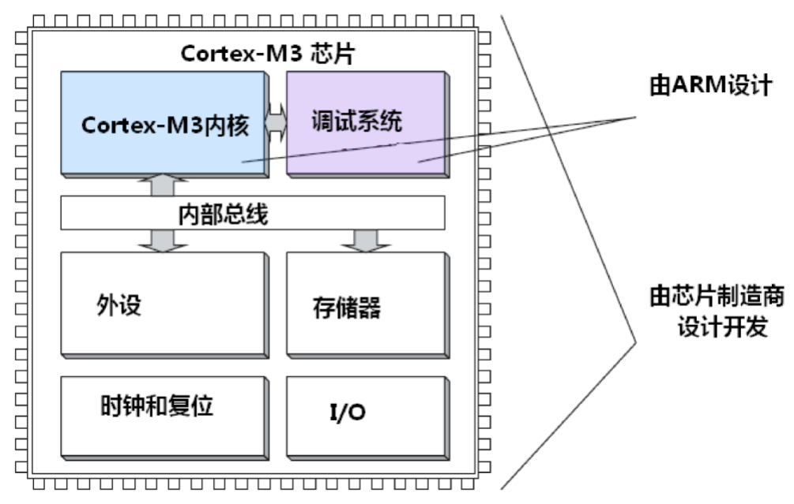
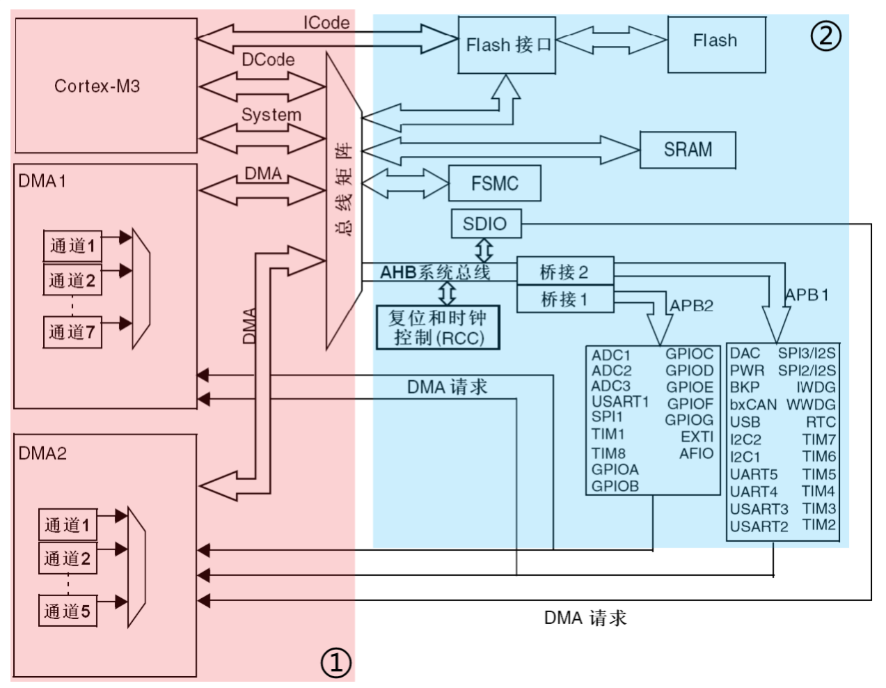
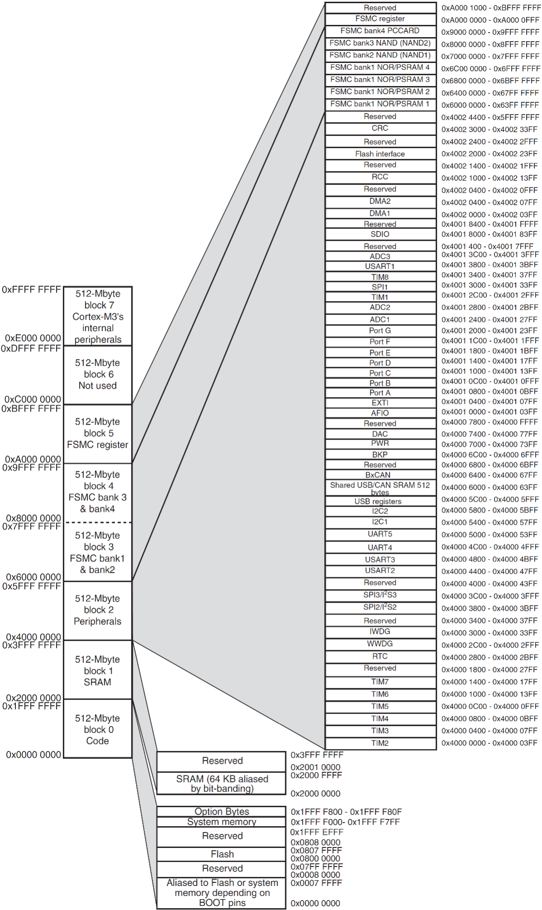
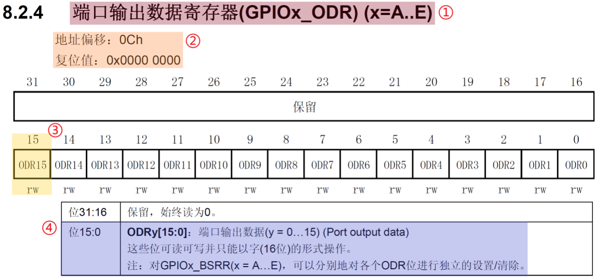

# STM32 从0开始系统学习2

​		下面简单的聊一聊一些需要的前置知识基础。

## C语言基础

### 位操作

​	这个在单片机里算基操。我们回忆一下数电课程里学习过的基本的与或非等。那就不难以理解以下这些基本的符号：

| 运算符 | 含义     |
| ------ | -------- |
| &      | 与       |
| \|     | 或       |
| ^      | 异或     |
| ~      | 按位取反 |
| <<     | 左移     |
| >>     | 右移     |

​	这些运算符被嵌入式软件编程中就会得到自己的含义。比如说：

```
GPIOA->CRL &= 0xFFFFFFBF // 1111111111111111 1111111111011111
```

​	我们知道：任何一个数**与上0都是0，与上1保持原样**，那这个代码很简单了。

​	另一方面就是完全相反的操作：给一个指定的位放上1：

```
GPIOA->CRL |= 0x00000020 // 0000000000000000000000000100000 
```

​	这是给第6位放上1。

​	当然，还有一种常见的是取反：这个是上面的代码有的时候想要有更加清晰的语义的时候使用：

```
GPIOB->CRL ^= 1 << (PIN)
```

​	这个是啥呢，表达的是给GPIOB的PB_Pin上的IO电平反转一次。这个时候如果我们恰当的延时循环这个代码，会发现接在这个上面的LED在闪烁。

### extern 修饰符

​	extern!任何学习过汇编的都知道extern代表的是导出符号的意思。对于包含C的中低级语言，一个常见的表达对外接口的方式就是使用extern修饰的符号

```
# At Definitions
extern wanna_be_seen_value = 10; // 将符号导出到外面
# At reference
extern wanna_be_seen_value
```

​	对于使用了extern的符号，编译器扫描到这个符号会认为向外找才能找到这个符号。我的言外之意就是：这个符号已经在其他文件被定义好了，要做的是使用外面定义的符号。

### typedef 封装复杂的类型

​	typedef对于大部分的教程看来，貌似只是一个多余的东西。

> **typedef 用于为现有类型创建一个新的名字，或称为类型别名，用来简化变量的定义。typedef在 MDK 用得最多的就是定义结构体的类型别名和枚举类型了**。 ——节选自我看的一份STM32资料

​	这点没错，但是笔者有更多的补充。typedef的软件工程含义其实更加的广泛，那就是封装一个现有的抽象类型，表达为一个具体的含义。为此我举一个例子：

```
typedef long size_t;
```

​	首先，你会发现：当我们想要表达大小相关的内容的时候，显然使用size_t比使用long更加的清晰，其次，对于不用的平台，我们可能需要的size_t是不一样的。比如说我们希望size_t都是表达一个2字节长的东西。可能对于16位平台上，我们需要定义int为size_t，对于32/64上，是short。但是如果我们使用的是size_t，我们根本不用更改代码就可以完成开发任务，换而言之，代码具备了可移植性，因为我们把变更封装到了变量定义的层次而不是外侧。

​	当然，对于第一点最为显著的是使用一个复杂的结构体的定义：

```c
typedef {
	__IO uint32_t CRL;
    __IO uint32_t CRH;
}GPIO;
```

## 寄存器基础知识

​	寄存器（Register）是单片机内部一种特殊的内存，它可以实现对单片机各个功能的控制，简单的来说可以把寄存器当成一些控制开关，控制包括内核及外设的各种状态。所以无论是 51单片机还是 STM32，都需要用寄存器来实现各种控制，以完成不同的功能。 
​	由于寄存器资源非常宝贵，一般都是一个位或者几个位控制一个功能，对于 STM32 来说，其寄存器是 32 位的，一个32 位的寄存器，可能会有32 个控制功能，相当于 32 个开关，由于、STM32 的复杂性，它内部有几百个寄存器，所以整体来说 STM32 的寄存器还是比较复杂的。

| 寄存器         | 说明                                                         |
| -------------- | ------------------------------------------------------------ |
| 内核相关寄存器 | 包含R0~R15、xPSR、特殊功能寄存器等                           |
| 中断控制寄存器 | 包含NVIC 和SCB 相关寄存器，NVIC 有：ISER、ICER、<br/>ISPR、IP 等；SCB 有：VTOR、AIRCR、SCR 等 |
| SysTick 寄存器 | 包含CTRL、LOAD、VAL 和 CALIB 四个寄存器                      |
| 内存保护寄存器 | 可选功能，STM32F103 没有                                     |
| 调试系统寄存器 | ETM、ITM、DWT、IPIU 等相关寄存器                             |
| 外设寄存器     | 包含GPIO、UART、IIC、SPI、TIM、DMA、ADC、DAC、<br/>RTC、I/WWDG、PWR、CAN、USB 等各种外设寄存器 |


​	其中，内核寄存器，我们一般只需要关心中断控制寄存器和 SysTick 寄存器即可，其他三大类，我们一般很少直接接触。而外设寄存器，则是学到哪个外设，就了解哪个外设相关寄存器即可，所以整体来说，我们需要关心的寄存器并不是很多，而且很多都是有共性的，比如STM32F103ZET6 有 8 个定时器，我们只需要学习了其中一个的相关寄存器，其他 7 个基本都是一样。 

​	控制寄存器的方式很简单，对于汇编层次，使用lea或者是mov都可以将寄存器的值输入输出出来，对于C语言上层，我们需要做出封装。将寄存器的操作映射到一个地址上进行修改。举个例子：GPIOB的ODR寄存器的寄存器地址是0x40010C0C，那么实际上我们想要将之赋值成为0xFFFF的话：

```
GPIOB->ODR = 0xFFFF
```

## STM32F103架构简单描述（建议先不看）

​	这里的笔记是笔者已经简单学习了计算机体系架构知识后才勉强搞懂的，我建议萌新入门的不要看，等用的差不多了回头看更加有感触。



​	这就是一个Cortex M3的架构图象。



​	STM32F103的系统主要由：**四个驱动单元（可以主动发起通信，图中①区域）**和**四个被动单元（只能被驱动工作，图中②区域）组成**。连接这些主动发起和被动接受区域的总线有三大类：

- 先说说总线：**总线是计算机系统中用于传输数据、地址和控制信号的一组共享通道或线路。**，它干一件事情：传递！它使得计算机内部各个组件（如中央处理器、内存、输入/输出设备等）能够相互通信。**总线的主要功能是允许不同组件之间高效地交换信息。**总线在STM32使用的架构中有三种：
  1. I总线：Instruction Bus，指令总线，连接闪存指令接口（如：FLASH），用于获取指令。由于该总线功能单一，并没有直接连接到总线矩阵，因此被排除在驱动单元之外。 
  2. D总线：Data Bus，数据总线。连接闪存存储器数据接口（如：SRAM、FLASH等），用于各种数据访问，如常量、变量等。 
  3. S总线：系统总线。上面两个总线是围绕处理器的，这个总线则是跟外设进行沟通

- DMA：Direct Memory Access直接存储访问控制器，可以实现数据的自动搬运，整个过程不需要CPU处理。如可以实现DMA传输内存数据到DAC，输出任意波形，传输过程不需要CPU参与，可以大大节省CPU支，从而更高效的处理事务。STM32F103ZET6内部有2个DMA控制器，可以实现内存到外设、外设到内存、内存到内存的数据传输

- 内部FLASH：关于FLASH，可能一些人感到陌生，实际上Flash指的是闪存（Flash Memory），一种非易失性存储技术，能够在断电后保留数据。在这里他是单片机的硬盘，用于代码/数据存储，CPU通过ICode总线经FLASH接口访问内部FLASH，FLASH最高访问速度是24Mhz，因此以72M速度访问时，需要插入2个时钟周期延迟。

- 内部SRAM（静态RAM）：相当于单片机的内存：用于数据存储，直接挂载在总线矩阵上面，CPU通过DCode总线实现0等待延时访问SRAM，最快总线频率可达72Mhz，从而保证高效高速的访问内存

- FSMC（Flexible Static Memory Controller）：灵活的静态存储控制器，实际上就是一个外部总线接口，可以用来访问外部SRAM、NAND/NOR FLASH、LCD等。**它也是直接挂在总线矩阵上面的，以方便CPU快速访问外挂器件。**

- AHB/APB：（Advanced High-performance Bus）与APB（Advanced Peripheral Bus）

  笔者较长时间都没有理解AHB/APB总线是什么。简单的讲这是ARM架构下的一组总线架构，广泛应用于微控制器和嵌入式系统中。这些总线架构旨在满足现代微处理器对高带宽、低延迟和灵活性的需求。

  他们的特性在这里：

  | 特性     | AHB                      | APB                           |
  | -------- | ------------------------ | ----------------------------- |
  | 传输模式 | 支持突发传输             | 单一读/写操作                 |
  | 主机支持 | 多主机                   | 单主机                        |
  | 数据宽度 | 可变（8, 16, 32, 64位）  | 通常为固定宽度（8, 16, 32位） |
  | 功耗     | 相对较高                 | 较低                          |
  | 复杂性   | 较高                     | 较低                          |
  | 应用场景 | 高速存储器、图形处理器等 | 定时器、GPIO、简单外设等      |

  在现代嵌入式系统中，AHB和APB常常结合使用。AHB负责连接高性能的外设，而APB用于连接低功耗的外围设备。这样的设计使得系统能够在性能和功耗之间取得平衡。。

  对于STM32：AHB总线连接总线矩阵，同时通过2个APB桥连接APB1和APB2，AHB总线速度最大为72Mhz，APB2总线速度最大也是72Mhz，但是APB1总线速度最大只能是36Mhz。这三个总线上面挂载了STM32内部绝大部分外设。

- 总线矩阵：总线矩阵协调内核系统总线和DMA主控总线之间的访问仲裁，仲裁利用轮换算法，保证各个总线之间的有序访问，从而确保工作正常。

### 存储器映射

​	STM32，它的32就是再说我们的目标单片机是一个32位单片机，一般而言，我们常说的位数是说操作数的长度。32位操作数长度用来传送地址就是32个bit长度的地址。$2^{32}bit = 4GB$。

​	下面的图我偷来的：这里包含了：FLASH、SRAM、外设及相关寄存器等全部组织在同一个4GB的线性地址空间内，我们可以通过C语言来访问这些地址空间，从而操作相关外设（读/写）。数据字节以小端格式（小端模式）存放在存储器中，数据的高字节保存在内存的高地址中，而数据的低字节保存在内存的低地址中。

​	存储器本身是没有地址信息的，我们对存储器分配地址的过程就叫存储器映射。这个分配
一般由芯片厂商做好了，ST将所有的存储器及外设资源都映射在一个4GB的地址空间上（8个
块），从而可以通过访问对应的地址，访问具体的外设。



| 块编号 | 地址范围                  | 大小  | 功能描述                                   |
| ------ | ------------------------- | ----- | ------------------------------------------ |
| 块 0   | 0x0000 0000 ~ 0x1FFF FFFF | 512MB | 代码（Code）                               |
| 块 1   | 0x2000 0000 ~ 0x3FFF FFFF | 512MB | SRAM（静态随机存取存储器）                 |
| 块 2   | 0x4000 0000 ~ 0x5FFF FFFF | 512MB | 外设（Peripherals）                        |
| 块 3   | 0x6000 0000 ~ 0x7FFF FFFF | 512MB | FSMC Bank 1 & 2                            |
| 块 4   | 0x8000 0000 ~ 0x9FFF FFFF | 512MB | FSMC Bank 3 & 4                            |
| 块 5   | 0xA000 0000 ~ 0xBFFF FFFF | 512MB | FSMC 寄存器（Registers）                   |
| 块 6   | 0xC000 0000 ~ 0xDFFF FFFF | 512MB | 未使用（Unused）                           |
| 块 7   | 0xE000 0000 ~ 0xFFFF FFFF | 512MB | Cortex M3 内部外设（Internal Peripherals） |

​	下面我们严肃的讲解一下每一块到底在干什么：

​	第一个块是Block 0，用于存储代码，即FLASH空间

| 存储块Block 0 | 功能                                                  | 地址范围                           |
| ------------- | ----------------------------------------------------- | ---------------------------------- |
|               | FLASH 或系统存储器别名区，取决于 BOOT 脚的设置        | 0x0000 0000 ~ 0x0007 FFFF（512KB） |
|               | 保留                                                  | 0x0008 0000 ~ 0x07FF FFFF          |
|               | 用户 FLASH，用于存储用户代码                          | 0x0800 0000 ~ 0x0807 FFFF（512KB） |
|               | 保留                                                  | 0x0808 0000 ~ 0x1FFF EFFF          |
|               | 系统存储器，用于存储 STM32 出厂固化的 Bootloader 程序 | 0x1FFF F000 ~ 0x1FFF F7FF（2KB）   |
|               | 选项字节，用于配置读保护、设置看门狗等                | 0x1FFF F800 ~ 0x1FFF F80F（16B）   |
|               | 保留                                                  | 0x1FFF F810 ~ 0x1FFF FFFF          |

​	第二个块是Block 1，用于存储数据，即SRAM空间

| 存储块Block 1 | 功能 | 地址范围                          |
| ------------- | ---- | --------------------------------- |
|               | SRAM | 0X2000 0000 ~ 0x2000 FFFF（64KB） |
|               | 保留 | 0X2001 0000 ~ 0x3FFF FFFF         |

第三个块是Block 2，用于外设访问，STM32内部大部分的外设都是放在这个块里面的，该存储块里面包括了AHB、APB1和APB2三个总线相关的外设,其中AHB和APB2是高速总线(72Mhz max)，APB1是低速总线(36M max)。

| 存储块  | 功能          | 地址范围                  |
| ------- | ------------- | ------------------------- |
| Block 2 | APB1 总线外设 | 0x4000 0000 ~ 0x4000 77FF |
|         | 保留          | 0x4000 7800 ~ 0x4000 FFFF |
|         | APB2 总线外设 | 0x4001 0000 ~ 0x4001 3FFF |
|         | 保留          | 0x4001 4000 ~ 0x4001 7FFF |
|         | AHB 总线外设  | 0x4001 8000 ~ 0x4002 33FF |
|         | 保留          | 0x4002 3400 ~ 0x5FFF FFFF |

余下的块就是留给FSMC，这里不再赘述。

### 寄存器映射

​	给存储器分配地址的过程叫存储器映射，寄存器是一类特殊的存储器，它的每个位都有特定的功能，可以实现对外设/功能的控制，给寄存器的地址命名的过程就叫寄存器映射。 一个简单的理解就是这样我们给这些寄存器起一个方便沟通的名称。在汇编我们直接用寄存器操作，但是在C语言被封装下，只好讲操作映射到内存上，然后取一个名称！没人喜欢用：帮助我把0xFFFF挪到0xC0000000这种话来表达工作内容。



​	这个如图所示（从正点原子偷来的图），每一个点简单说下：

**寄存器名字**

- **每个寄存器都有一个对应的名字，以简单表达其作用，并方便记忆。例如，`GPIOx_ODR`表示寄存器英文名，`x`可以从A~E，说明有5个这样的寄存器（每个端口有一个）**。实际上，在最新的STM32F103型号中，可能还有F、G等端口，IO数量更多。

**寄存器偏移量及复位值**

- 地址偏移量表示相对该外设基地址的偏移。例如，对于GPIOB，其外设基地址是`0x4001 0C00`。因此，`GPIOB_ODR`寄存器的地址为`0x4001 0C0C`。知道了外设基地址和地址偏移量，就可以确定任何一个寄存器的实际地址。
- 复位值表示该寄存器在系统复位后的默认值，可以用于分析外设的默认状态。这里的复位值全部为0。

**寄存器位表**

- 描述寄存器每一个位的作用（共32位）。这里表示`ODR`寄存器的第15位（bit），位名字为`ODR15`，`rw`表示该寄存器可读写（`r`表示可读取；`w`表示可写入）。

**位功能描述**

- 描述寄存器每个位的功能。这里表示位0~~15，对应`ODR0`~~`ODR15`，每个位控制一个IO口的输出状态。 

### 寄存器地址计算

​	STM32F103大部分外设寄存器地址都是在存储块2上面的具体某个寄存器地址，由三个参数决定：

- 总线基地址（BUS_BASE_ADDR）
- 外设基于总线基地址的偏移量（PERIPH_OFFSET）
- 寄存器相对外设基地址的偏移量（REG_OFFSET）。可以表示为：

```
寄存器地址 = BUS_BASE_ADDR + PERIPH_OFFSET + REG_OFFSET 
```


总线基地址（BUS_BASE_ADDR），STM32F103内部有三个总线（APB1、APB2和AHB），这是他们的值：

| 总线 | 基地址      | 偏移量  |
| ---- | ----------- | ------- |
| APB1 | 0x4000 0000 | 0       |
| APB2 | 0x4001 0000 | 0x10000 |
| AHB  | 0x4001 8000 | 0x18000 |

​	外设基于总线基地址的偏移量（PERIPH_OFFSET），这个不同外设偏移量不一样，我们可以在STM32F103存储器映射图里面找到具体的偏移量

| 所属总线 | 外设  | 基地址      | 偏移量 |
| -------- | ----- | ----------- | ------ |
| APB2     | GPIOA | 0x4001 0800 | 0x800  |
| APB2     | GPIOB | 0x4001 0C00 | 0xC00  |
| APB2     | GPIOC | 0x4001 1000 | 0x1000 |
| APB2     | GPIOD | 0x4001 1400 | 0x1400 |
| APB2     | GPIOE | 0x4001 1800 | 0x1800 |
| APB2     | GPIOF | 0x4001 1C00 | 0x1C00 |
| APB2     | GPIOG | 0x4001 2000 | 0x2000 |

​	知道了外设基地址，再在参考手册里面找到具体某个寄存器相对外设基地址的偏移量就可以知道该寄存器的实际地址了

| 所属总线 | 所属外设 | 寄存器     | 地址        | 偏移量 |
| -------- | -------- | ---------- | ----------- | ------ |
| APB2     | GPIOB    | GPIOB_CRL  | 0x4001 0C00 | 0x00   |
| APB2     | GPIOB    | GPIOB_CRH  | 0x4001 0C04 | 0x04   |
| APB2     | GPIOB    | GPIOB_IDR  | 0x4001 0C08 | 0x08   |
| APB2     | GPIOB    | GPIOB_ODR  | 0x4001 0C0C | 0x0C   |
| APB2     | GPIOB    | GPIOB_BSRR | 0x4001 0C10 | 0x10   |
| APB2     | GPIOB    | GPIOB_BRR  | 0x4001 0C14 | 0x14   |
| APB2     | GPIOB    | GPIOB_LCKR | 0x4001 0C18 | 0x18   |

​	stm32f103xe.h存储了寄存器映射的说明，我们可以看看：

```c
typedef struct 
{ 
 __IO uint32_t CRL; /* GPIO_CRL 寄存器，相对外设基地址偏移量：0X00 */ 
 __IO uint32_t CRH; /* GPIO_CRH 寄存器，相对外设基地址偏移量：0X04 */ 
 __IO uint32_t IDR; /* GPIO_IDR 寄存器，相对外设基地址偏移量：0X08 */ 
 __IO uint32_t ODR; /* GPIO_ODR 寄存器，相对外设基地址偏移量：0X0C */ 
 __IO uint32_t BSRR; /* GPIO_BSRR寄存器，相对外设基地址偏移量：0X10 */ 
 __IO uint32_t BRR; /* GPIO_BRR 寄存器，相对外设基地址偏移量：0X14 */ 
 __IO uint32_t LCKR; /* GPIO_LCKR寄存器，相对外设基地址偏移量：0X18 */ 
} GPIO_TypeDef; 
```

```
#define PERIPH_BASE 0x40000000UL /* 外设基地址 */ 
 
#define APB1PERIPH_BASE PERIPH_BASE /* APB1总线基地址 */ 
#define APB2PERIPH_BASE       (PERIPH_BASE + 0x00010000UL) /* APB2总线基地址 */ 
#define AHBPERIPH_BASE        (PERIPH_BASE + 0x00020000UL)  /* AHB总线基地址 */ 
 
#define GPIOA_BASE (APB2PERIPH_BASE + 0x00000800UL) /* GPIOA基地址 */ 
#define GPIOB_BASE            (APB2PERIPH_BASE + 0x00000C00UL)  /* GPIOB基地址 */ 
#define GPIOC_BASE            (APB2PERIPH_BASE + 0x00001000UL)  /* GPIOC基地址 */ 
#define GPIOD_BASE            (APB2PERIPH_BASE + 0x00001400UL)  /* GPIOD基地址 */ 
#define GPIOE_BASE            (APB2PERIPH_BASE + 0x00001800UL)  /* GPIOE基地址 */ 
#define GPIOF_BASE            (APB2PERIPH_BASE + 0x00001C00UL)  /* GPIOF基地址 */ 
#define GPIOG_BASE            (APB2PERIPH_BASE + 0x00002000UL)  /* GPIOG基地址 */
```

```
#define GPIOA               ((GPIO_TypeDef *)GPIOA_BASE) /* GPIOA寄存器地址映射 */ 
#define GPIOB               ((GPIO_TypeDef *)GPIOB_BASE) /* GPIOB寄存器地址映射 */ 
#define GPIOC               ((GPIO_TypeDef *)GPIOC_BASE) /* GPIOC寄存器地址映射 */ 
#define GPIOD               ((GPIO_TypeDef *)GPIOD_BASE) /* GPIOD寄存器地址映射 */ 
#define GPIOE               ((GPIO_TypeDef *)GPIOE_BASE) /* GPIOE寄存器地址映射 */ 
#define GPIOF               ((GPIO_TypeDef *)GPIOF_BASE) /* GPIOF寄存器地址映射 */ 
#define GPIOG               ((GPIO_TypeDef *)GPIOG_BASE) /* GPIOG寄存器地址映射 */ 
```

