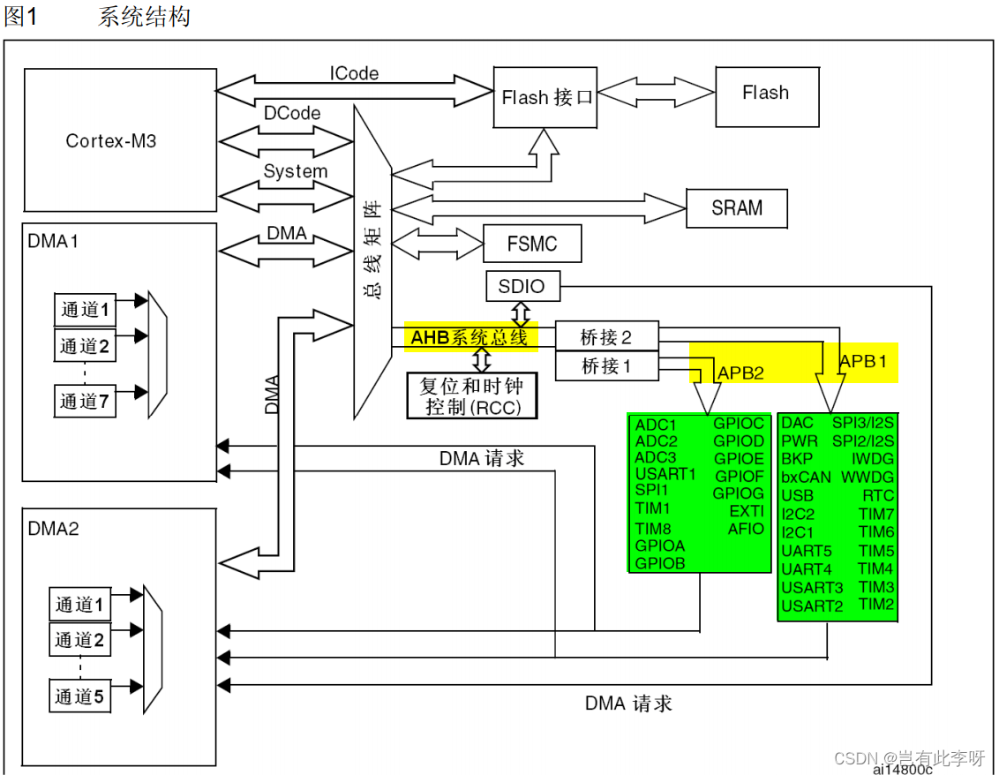
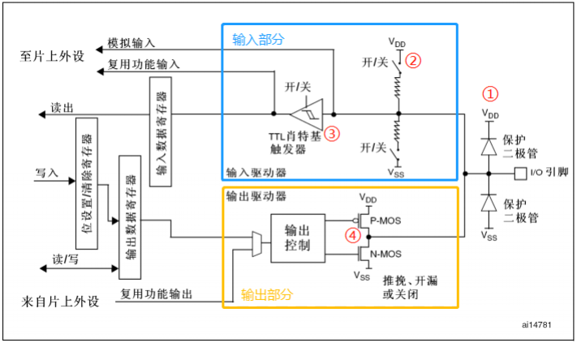
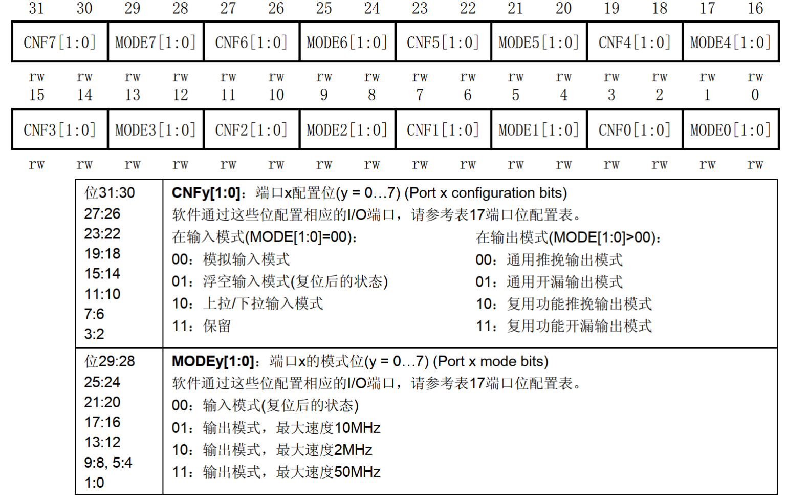
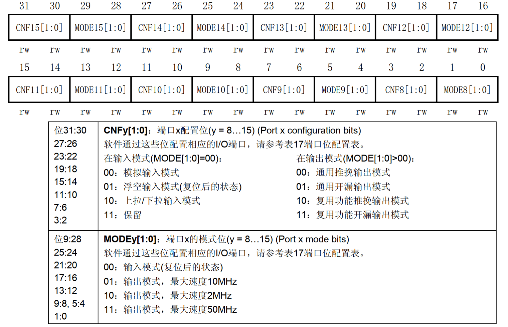
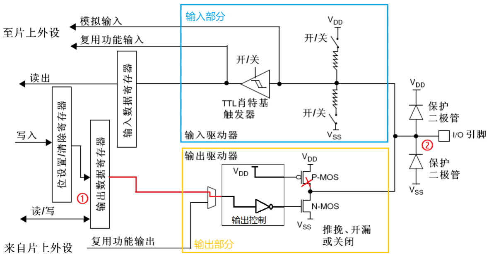
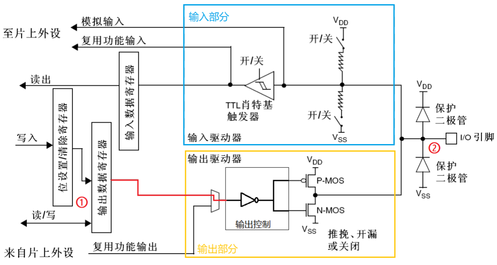
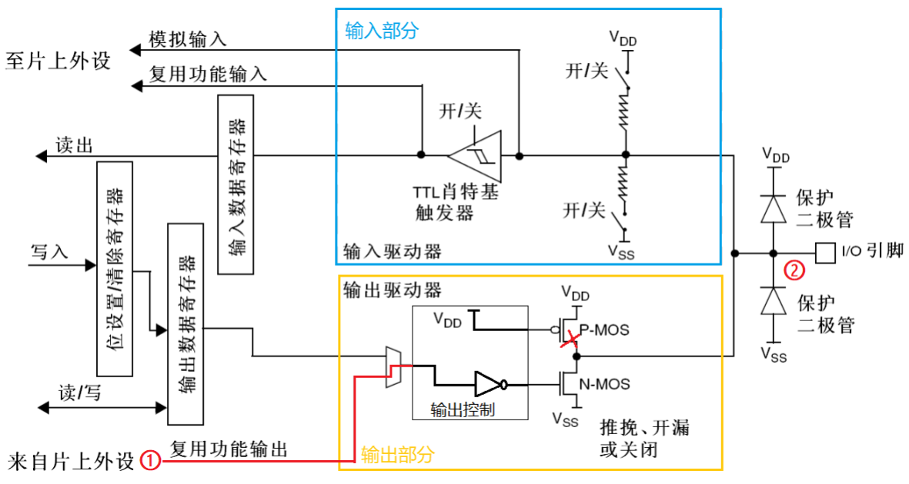
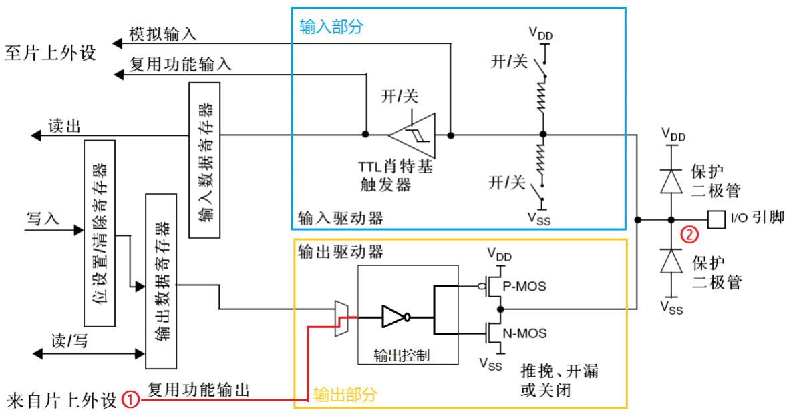

# STM32 从0开始系统学习4 编写LED驱动

​	编写一个LED驱动可以认为是搞嵌入式的一个Hello, World. 点亮一个LED于笔者看来就算是具备了一个驱动一个GPIO口输出的能力了。

​	看完这篇教程，你应该会编写一个简单的基于HAL库的点亮LED的程序，或者更近一步的完成一个简单的对GPIO输出封装的自己的库。

## 关于GPIO

​	GPIO是一场串英文单词的缩写：General Purpose Input Output。他的更加严肃的叫法是通用输入输出端口。现在，请你想象一个开关，这个开关可以做到这个事情

> 他允许我们的处理器对外驱动外设，或者从外设中获取信息（当然到底怎样个控制，笔者这里先讨论输出）

​	现在,我们暂时想做GPIO是处理器跟外界沟通的手段,下面我们来看看他的具体说明

## GPIO到底怎么看

​	GPIO自己是接在APB总线矩阵上的，这一点可以参考下图，或者我之前讲解架构的文章（我没有特别提及，所以可以不用折腾看）：



​	也就是说：**我们必须打开APB时钟才能操作GPIO，不然你可以理解为没有时钟，这玩意都动不起来**

​	GPIO的内部电路图：



​	我想大家可能没啥太强的意愿去看，但是笔者必须要提到的是，又一些概念仍然绕不过去：

- 推挽：Push - Pull，也就是芯片内部自己推出去电压。也就意味着我们不需要借助外力就可直接驱动外设（所以对于那些被动性强的外设比如说LED等完全就需要推挽输出）
- 开漏：Open Drain，自己不做输出，比较被动，需要高电平的时候是需要外部来拉起电压驱动工作。这个比较适合那些外接配置驱动的模块（也就是那些模块我们单片机内部自己管不了的需要外面的模块单独处理的部分）
- 复用：字如其名，就是复用！引脚可以在不同的时间执行不同的任务。这个事情你可能很快想到谁在干了：IIC通信。

​	组合一下，就得出了下面四种输出模式。

| 模式名称         | 描述                                   | 优点                       | 适用场景                       |
| ---------------- | -------------------------------------- | -------------------------- | ------------------------------ |
| 开漏输出模式     | 仅能拉低信号，需外部上拉电阻实现高电平 | 适合多个设备共享同一信号线 | I2C总线、开关电源控制          |
| 开漏复用输出模式 | 开漏模式下配置为特定功能               | 保持开漏特性，简化电路     | 数据传输的I2C、SPI等协议       |
| 推挽输出模式     | 可主动输出高电平或低电平               | 直接驱动负载，无需外部电阻 | LED驱动、继电器控制            |
| 推挽复用输出模式 | 推挽模式下配置为特定功能               | 高频率应用，支持特定协议   | 数据传输设备，连接传感器或模块 |

> 笔者这里强烈推介Keysking的视频！这里他的GPIO讲的易懂生动！

## 寄存器配置

​	笔者的目前目的是会使用，因此，不会详细说每一个部分是做啥的，寄存器库和HAL库已经封装到认不出来了，所以这里只是给一个参考：





​	如果您学过计算机体系架构的话，就会非常快速的认出来这跟指令的值的含义解析一个道理的。

# Practice And Detailed Used

## 理解HAL库提供的大部分选项

​	如果你只是想写一个LED驱动交差，可以直接看这里。当然笔者仍然建议你大致理解一下基本的原理。

​	我们作为客户程序员尝试使用硬件驱动LED，需要对GPIO口配置这些东西：GPIO的输出模式（推完还是开漏？要不要复用？），上拉下拉电阻（上拉还是下拉？），输出的速度多快？

> Mode

```
#define GPIO_MODE_INPUT (0x00000000U) /* 输入模式 */ 
#define GPIO_MODE_OUTPUT_PP (0x00000001U) /* 推挽输出 */ 
#define GPIO_MODE_OUTPUT_OD (0x00000011U) /* 开漏输出 */ 
#define GPIO_MODE_AF_PP (0x00000002U) /* 推挽式复用 */ 
#define GPIO_MODE_AF_OD (0x00000012U) /* 开漏式复用 */ 
#define GPIO_MODE_AF_INPUT GPIO_MODE_INPUT 
  
#define GPIO_MODE_ANALOG (0x00000003U) /* 模拟模式 */ 
 
#define GPIO_MODE_IT_RISING (0x10110000u) /* 外部中断，上升沿触发检测 */ 
#define GPIO_MODE_IT_FALLING (0x10210000u) /* 外部中断，下降沿触发检测 */ 
/* 外部中断，上升和下降双沿触发检测 */ 
#define GPIO_MODE_IT_RISING_FALLING (0x10310000u) 
 
#define GPIO_MODE_EVT_RISING (0x10120000U) /*外部事件，上升沿触发检测 */ 
#define GPIO_MODE_EVT_FALLING (0x10220000U) /*外部事件，下降沿触发检测 */ 
/* 外部事件，上升和下降双沿触发检测 */ 
#define  GPIO_MODE_EVT_RISING_FALLING  (0x10320000U) 
```

> Pull

```
#define GPIO_NOPULL (0x00000000U) /* 无上下拉 */ 
#define GPIO_PULLUP (0x00000001U) /* 上拉 */ 
#define GPIO_PULLDOWN (0x00000002U) /* 下拉 */
```

> Speed

```
#define GPIO_SPEED_FREQ_LOW (0x00000002U) /* 低速 */ 
#define GPIO_SPEED_FREQ_MEDIUM (0x00000001U) /* 中速 */ 
#define GPIO_SPEED_FREQ_HIGH (0x00000003U) /* 高速 */ 
```

​	我们的HAL库已经给我们做好了最基本的封装，这个结构体是
>stm32f1xx_hal_gpio.h

```
typedef struct
{
  uint32_t Pin;       /*!< Specifies the GPIO pins to be configured.
                           This parameter can be any value of @ref GPIO_pins_define */

  uint32_t Mode;      /*!< Specifies the operating mode for the selected pins.
                           This parameter can be a value of @ref GPIO_mode_define */

  uint32_t Pull;      /*!< Specifies the Pull-up or Pull-Down activation for the selected pins.
                           This parameter can be a value of @ref GPIO_pull_define */

  uint32_t Speed;     /*!< Specifies the speed for the selected pins.
                           This parameter can be a value of @ref GPIO_speed_define */
} GPIO_InitTypeDef;
```

​	我想你猜到了大致的流程是如何的

> 我们的GPIO是接在APB总线上的，就是说需要开启时钟，HAL库开启时钟的方式是：`__HAL_RCC_GPIOX_CLK_ENABLE()`。这里的X换成具体的字母，比如说开PA就是`__HAL_RCC_GPIOA_CLK_ENABLE()`函数
>
> 声明一个GPIO_InitTypeDef，初始化使用到的Pin，和对应的配置
>
> 使用一个函数初始化传递我们的Config和操作引脚的信息（P??），现在我们就可与进一步操作引脚了。

​	以HAL库给我们的代码为参考，当我们想要

```
/**
  * @brief GPIO Initialization Function
  * @param None
  * @retval None
  */
static void MX_GPIO_Init(void)
{
  GPIO_InitTypeDef GPIO_InitStruct = {0};

  /* GPIO Ports Clock Enable */
  __HAL_RCC_GPIOE_CLK_ENABLE();
  __HAL_RCC_GPIOB_CLK_ENABLE();

  /* Configure GPIO pin : LED1_Pin */
  /* 笔者在CubeMX给Pin起了别名 */
  GPIO_InitStruct.Pin = LED1_Pin;
  GPIO_InitStruct.Mode = GPIO_MODE_OUTPUT_PP;
  GPIO_InitStruct.Pull = GPIO_NOPULL;
  GPIO_InitStruct.Speed = GPIO_SPEED_FREQ_LOW;
  HAL_GPIO_Init(LED1_GPIO_Port, &GPIO_InitStruct);

  /*Configure GPIO pins : LED0_Pin BEEP_Pin */
  GPIO_InitStruct.Pin = LED0_Pin|BEEP_Pin;
  GPIO_InitStruct.Mode = GPIO_MODE_OUTPUT_PP;
  GPIO_InitStruct.Pull = GPIO_PULLUP;
  GPIO_InitStruct.Speed = GPIO_SPEED_FREQ_LOW;
  HAL_GPIO_Init(GPIOB, &GPIO_InitStruct);
}
```

​	现在OK了，GPIO能用了。HAL库给了我们两个函数来驱动改变GPIO：

| 功能     | HAL_GPIO_WritePin                                     | HAL_GPIO_TogglePin                       |
| -------- | ----------------------------------------------------- | ---------------------------------------- |
| 功能描述 | 设置引脚为高电平或低电平                              | 切换引脚电平状态                         |
| 参数     | 引脚、状态（`GPIO_PIN_SET`/`GPIO_PIN_RESET`）         | 引脚                                     |
| 返回值   | 无                                                    | 无                                       |
| 使用场景 | 当需要明确设置引脚状态时                              | 当需要周期性改变引脚状态时               |
| 例子     | `HAL_GPIO_WritePin(GPIOA, GPIO_PIN_0, GPIO_PIN_SET);` | `HAL_GPIO_TogglePin(GPIOA, GPIO_PIN_0);` |

**HAL_GPIO_WritePin**

- 用于设置指定 GPIO 引脚的电平状态。
- 可以将引脚设置为高电平（`GPIO_PIN_SET`）或低电平（`GPIO_PIN_RESET`）。

**HAL_GPIO_TogglePin**

- 用于切换指定 GPIO 引脚的电平状态。
- 如果引脚当前是高电平，则将其设置为低电平；如果当前是低电平，则将其设置为高电平

​	笔者设计了一个简单的库封装了这个流程，算是一个简单的编程练习了。

## 练习

​	请结合上面所学，摆脱CubeMX提供的初始化与驱动代码，写一个简单的初始化与辅助驱动代码。使用这套代码完成对LED的驱动点亮

​	可以参考笔者的头文件完成：

> led_driver

```
#pragma once
/*
    Time:           2024.10.26
    Program File:   LED_Driver.h
    Author:         Charliechen
    Desp:           This is the header file of Common GPIO Driver
*/

#ifdef CCSTMF1
// Currently we support the stm lib for f1 series as test :)
// ------------ Defined for stm f1 series ------------------
#include "stm32f1xx.h"

typedef GPIO_TypeDef* GPIO_Letter;
typedef uint16_t    GPIO_Offset;
typedef uint32_t    Common_configure_type;
typedef Common_configure_type SpeedConfigureType;
typedef Common_configure_type PullPushConfigureType;
typedef Common_configure_type ModeConfigureType;
// ------------ Defined for stm f1 series End ---------------
#else
#error "Current can not support other mcu :("
#endif

// Cummon Defines

typedef struct{ 
    GPIO_Letter letter_case;
    GPIO_Offset offset;
}CCGPIO;

typedef struct{
    SpeedConfigureType      speed;
    PullPushConfigureType   mode;
    ModeConfigureType       pull_or_push;
}CCGPIOConfig;

typedef enum{
    OFF     = 0,
    ON      = 1
}GPIO_OutputState;

void createGPIO(CCGPIO* blank, GPIO_Letter gpio_base, GPIO_Offset offset, char letter);
void createGPIOConfig(CCGPIOConfig* config, SpeedConfigureType speed, 
                                        PullPushConfigureType pull_push, 
                                        ModeConfigureType mode);
void setGPIOConfig(CCGPIO* gpio, CCGPIOConfig* config);
void setGPIOState(CCGPIO* gpio, GPIO_OutputState state);
void toggleGPIOState(CCGPIO* gpio);
#define setGPIOOn(GPIO) do{setGPIOState(GPIO, ON);}while(0)
#define setGPIOOff(GPIO) do{setGPIOState(GPIO, OFF);}while(0)
```

> common.h

```
#pragma once
/*
    Time:           2024.10.26
    Program File:   common.h
    Author:         Charliechen
    Desp:           This is the header file of Common Operations
*/

/*
    Parts of compound delay
*/

typedef struct{
    int second;
    int milisecond;
}DelayTime;
void tidyDelayTime(DelayTime* wait_tidy);
void systemGlobalDelay(DelayTime* delayTime);
```

# Details And Reference

## 输出模式更加详细的说明

### 开漏输出 

​	开漏输出模式：STM32 的开漏输出模式是数字电路输出的一种，从结果上看它只能输出低电平 Vss 或者高阻态，常用于 IIC 通讯（IIC_SDA）或其它需要进行电平转换的场景。

- P-MOS 被“输出控制”控制在截止状态，因此 IO 的状态取决于N-MOS 的导通状况； 
- 只有 N-MOS 还受控制于输出寄存器，“输出控制”对输入信号进行了逻辑非的操作；
- 施密特触发器是工作的，即可以输入，且上下拉电阻都断开了，可以看成浮空输入； 

​	开漏输出模式下 P-MOS 一直在截止状态，即不导通，所以 P-MOS 管的栅极相当于一直接 VDD。如果输出数据寄存器①的值为 0，那么 IO 引脚的输出状态②为低电平，这是我们需要的控制逻辑，怎么做到的呢？是这样的，输出数据寄存器的逻辑 0 经过“输出控制”的取反操作后，输出逻辑 1 到 N-MOS 管的栅极，这时 N-MOS 管就会导通，使得IO 引脚连接到VSS，即输出低电平。如果输出数据寄存器的值为1，经过“输出控制”的取反操作后，输出逻辑0 到N-MOS 管的栅极，这时N-MOS 管就会截止。又因为P-MOS管是一直截止的，使得IO 引脚呈现高阻态，即不输出低电平，也不输出高电平。因此要 IO 引脚输出高电平就必须接上拉电阻。 又由于 F1 系列的开漏输出模式下，**内部的上下拉电阻不可用，所以只能通过接芯片外部上拉电阻的方式，实现开漏输出模式下输出高电平。如果芯片外部不接上拉电阻，那么开漏输出模式下，IO 无法输出高电平。** 在开漏输出模式下，施密特触发器是工作的，所以 IO 口引脚的电平状态会被采集到输入数据寄存器中，如果对输入数据寄存器进行读访问可以得到 IO 口的状态。也就是说开漏输出模式下，我们可以读取IO 引脚状态。 



### 推挽输出 

​	从结果上看它会输出低电平 VSS 或者高电平VDD。推挽输出跟开漏输出不同的是，推挽输出模式 P-MOS 管和 N-MOS 管都用上。同样地，我们根据参考手册推挽模式的输出描述，可以得到等效原理图，可以把“输出控制”简单地等效为一个非门。

​	如果输出数据寄存器①的值为0，经过“输出控制”取反操作后，输出逻辑1 到P-MOS 管的栅极，这时 P-MOS 管就会截止，同时也会输出逻辑 1 到 N-MOS 管的栅极，这时 N-MOS 管就会导通，使得IO 引脚接到 VSS，即输出低电平。 如果输出数据寄存器的值为1 ，经过“输出控制”取反操作后，输出逻辑0 到N-MOS 管的栅极，这时 N-MOS 管就会截止，同时也会输出逻辑 0 到 P-MOS 管的栅极，这时 P-MOS 管就会导通，使得IO 引脚接到VDD，即输出高电平。 

​	由上述可知，推挽输出模式下，P-MOS 管和 N-MOS 管同一时间只能有一个管是导通的。当IO 引脚在做高低电平切换时，两个管子轮流导通，一个负责灌电流，一个负责拉电流，使其负载能力和开关速度都有较大的提高。 另外在推挽输出模式下，施密特触发器也是打开的，我们可以读取 IO 口的电平状态。 由于推挽输出模式下输出高电平时，是直接连接VDD，所以驱动能力较强，可以做电流型驱动，驱动电流最大可达25mA，但是芯片的总电流有限，所以并不建议这样用，最好还是使用芯片外部的电源。



### 开漏式复用功能

​	**一个IO 口可以是通用的IO 口功能，还可以是其他外设的特殊功能引脚，这就是 IO 口的复用功能**。一个IO 口可以是多个外设的功能引脚，我们需要选择作为其中一个
外设的功能引脚。当选择复用功能时，引脚的状态是由对应的外设控制，而不是输出数据寄存
器。除了复用功能外，其他的结构分析请参考开漏输出模式。 

​	另外在开漏式复用功能模式下，施密特触发器也是打开的，我们可以读取 IO 口的电平状
态，同时外设可以读取 IO 口的信息。 



### 推挽式复用功能

​	仍然一样，这是推挽的情况下仍然可以用来做特殊引脚



## 参考笔者的结果

```
#include "led_driver.h"

static inline void __open_gpio_clk(char letter){
    switch(letter){
        case 'A': 
        case 'a': __HAL_RCC_GPIOA_CLK_ENABLE()  ;break;
        case 'B': 
        case 'b': __HAL_RCC_GPIOB_CLK_ENABLE()  ;break;
        case 'C': 
        case 'c': __HAL_RCC_GPIOC_CLK_ENABLE()  ;break;
        case 'D': 
        case 'd': __HAL_RCC_GPIOD_CLK_ENABLE()  ;break;
        case 'E': 
        case 'e': __HAL_RCC_GPIOE_CLK_ENABLE()  ;break;
        case 'F': 
        case 'f': __HAL_RCC_GPIOF_CLK_ENABLE()  ;break;
        case 'G': 
        case 'g': __HAL_RCC_GPIOG_CLK_ENABLE()  ;break;
        default: break;
    }
}

void createGPIO(CCGPIO* blank, GPIO_Letter gpio_base, GPIO_Offset offset, char letter)
{
    blank->letter_case      = gpio_base;
    blank->offset           = offset;
    __open_gpio_clk(letter);
}

void createGPIOConfig(CCGPIOConfig* config, SpeedConfigureType speed, 
                                        PullPushConfigureType pull_push, 
                                        ModeConfigureType mode)
{
    config->mode = mode;
    config->pull_or_push = pull_push;
    config->speed = speed;
}

void setGPIOConfig(CCGPIO* gpio, CCGPIOConfig* config)
{
    GPIO_InitTypeDef initing_gpio;
    initing_gpio.Mode = config->mode;
    initing_gpio.Pin = gpio->offset;
    initing_gpio.Pull = config->pull_or_push;
    initing_gpio.Speed = config->speed;
    HAL_GPIO_Init(gpio->letter_case, &initing_gpio);
}

void setGPIOState(CCGPIO* gpio, GPIO_OutputState state)
{
    if(state){
        HAL_GPIO_WritePin(gpio->letter_case, gpio->offset, GPIO_PIN_SET);
    }else{
        HAL_GPIO_WritePin(gpio->letter_case, gpio->offset, GPIO_PIN_RESET);
    }
}

void toggleGPIOState(CCGPIO* gpio)
{
    HAL_GPIO_TogglePin(gpio->letter_case, gpio->offset);
}
```

```
#include "common.h"

#ifdef CCSTMF1
#include "stm32f1xx.h"
#endif

void tidyDelayTime(DelayTime* wait_tidy)
{
    wait_tidy->second += wait_tidy->milisecond / 1000;
    wait_tidy->milisecond = wait_tidy->milisecond % 1000;
}

void systemGlobalDelay(DelayTime* delayTime)
{
    /* first, gain ms delay supported by HAL */
    int real_time = delayTime->second * 1000 + delayTime->milisecond;
    if(real_time < 0) return; // overflow reject
    HAL_Delay(real_time);
}
```

​	在主代码中这样调用,笔者的LED的Output是PB5和PE5

```
int main(void)
{
  /* USER CODE BEGIN 1 */

  /* USER CODE END 1 */

  /* MCU Configuration--------------------------------------------------------*/

  /* Reset of all peripherals, Initializes the Flash interface and the Systick. */
  HAL_Init();

  /* USER CODE BEGIN Init */

  /* USER CODE END Init */

  /* Configure the system clock */
  SystemClock_Config();

  /* USER CODE BEGIN SysInit */

  /* USER CODE END SysInit */

  CCGPIO gpio1, gpio2;
  CCGPIOConfig config;
  DelayTime time;
  time.second = 1;
  createGPIO(&gpio1, GPIOB, GPIO_PIN_5, 'B');
  createGPIO(&gpio2, GPIOE, GPIO_PIN_5, 'E');
  createGPIOConfig(&config, GPIO_SPEED_FREQ_HIGH, GPIO_PULLDOWN, GPIO_MODE_OUTPUT_PP);
  setGPIOConfig(&gpio1, &config);
  setGPIOConfig(&gpio2, &config);
  /* USER CODE END 2 */

  /* Infinite loop */
  /* USER CODE BEGIN WHILE */
  while (1)
  {
    /* USER CODE END WHILE */

    /* USER CODE BEGIN 3 */
    toggleGPIOState(&gpio1);
    toggleGPIOState(&gpio2);
    systemGlobalDelay(&time);
  }
  /* USER CODE END 3 */
}

```

