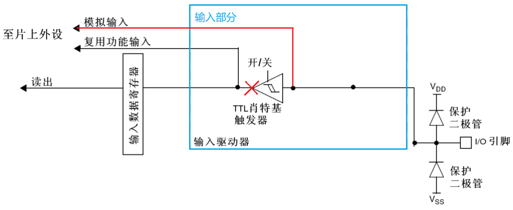

# STM32 从0开始系统学习5

​	我们下面聊一聊输入的事情，输入指的是我们的处理器从外部端口接受外设发过来的信号。在我们没有接触外部中断的时候，我们仍然会选择以一种简单的手段（轮询）直接检测是否有外部信号输出来。

## STM32 GPIO输入的四种模式

​	当然，我们的输入也有四种模式。仔细思考一下，我们能动的就是处理器内部了。实际上，根据处理器最后选择使用电路的不同，我们的外在行为也不一样。这里写一下：

- **上拉输入**：在输入引脚上连接一个上拉电阻，将引脚默认拉至高电平（逻辑1）。当输入引脚被按键或其他设备拉至低电平（逻辑0）时，可以检测到状态变化。
- **下拉输入**：在输入引脚上连接一个下拉电阻，将引脚默认拉至低电平（逻辑0）。当输入引脚被按键或其他设备拉至高电平（逻辑1）时，可以检测到状态变化。
- **浮空输入**：输入引脚处于高阻状态，没有上拉或下拉电阻连接。此时引脚的状态不稳定，容易受到外部噪声的影响。通常用于不需要确定电平状态的场合。
- **模拟模式**：输入引脚被配置为模拟输入，可以读取连续的电压值。适用于接收模拟信号（如传感器输出），并将其转换为数字信号进行处理。

​	你可以看到：上拉下拉就是说明我们的电平摩恩被拉到哪里起作用，你可以理解为内部的水位被抬到高还是低，只有有高度差电流才会流动。我想这样说很明白了。

| 功能       | 上拉输入                 | 下拉输入                 | 浮空输入                   | 模拟模式                 |
| ---------- | ------------------------ | ------------------------ | -------------------------- | ------------------------ |
| 默认状态   | 高电平（逻辑1）          | 低电平（逻辑0）          | 不稳定，未定义             | 读取连续的模拟电压       |
| 连接方式   | 上拉电阻连接到电源       | 下拉电阻连接到地         | 无连接                     | 连接模拟信号源           |
| 噪声敏感性 | 较低（受到上拉电阻影响） | 较低（受到下拉电阻影响） | 较高（容易受外部噪声影响） | 视信号源质量而定         |
| 应用场景   | 按键输入、开关检测       | 按键输入、开关检测       | 不需要固定状态的输入       | 传感器输入、模拟信号读取 |

## Practice And Usage

​	还是GPIO的东西，但是只需要这些地方变动：

```
gpio_init_struct.Pin = KEY1_GPIO_PIN; /* KEY1引脚 */ 
gpio_init_struct.Mode = GPIO_MODE_INPUT;
gpio_init_struct.Pull = GPIO_PULLUP; 	// 这个地方就是选择何种上拉了
gpio_init_struct.Speed = GPIO_SPEED_FREQ_HIGH;
```

​	使用到的读取函数就是:

```
GPIO_PinState HAL_GPIO_ReadPin(GPIO_TypeDef* GPIOx, uint16_t GPIO_Pin);
```

​	读取指定 GPIO 引脚电平状态的函数。

## 练习与封装 

​	更改led_driver.c为gpio_driver.c, 使用一个按钮来控制LED是否闪烁!

提示:

> 新增加函数: 返回状态如何,
>
> ```
> GPIOState gainGPIOState(CCGPIO* gpio)
> ```
>
> 当然这个GPIOState是笔者修改了GPIO_OutputState的结果. 总而言之返回的就是高低电平的区别
>
> 编写测试样例的时候需要注意按钮另一侧接的是高电平还是低电平来决定是上拉还是下拉

[MCU_Libs/Drivers at main · Charliechen114514/MCU_Libs (github.com)](https://github.com/Charliechen114514/MCU_Libs/tree/main/Drivers)

参考代码在这里

# Detailed And Reference

## 更加具体的说明

### 输入浮空模式

上拉/下拉电阻为断开状态，施密特触发器打开，输出被禁止。输入浮空模式下，IO 口的电平完全是由外部电路决定。如果 IO 引脚没有连接其他的设备，那么检测其输入电平是不确定的。该模式可以用于按键检测等场景。


### 输入上拉模式

​	上拉电阻导通，施密特触发器打开，输出被禁止。在需要外部上拉电阻的时候，可以使用内部上拉电阻，这样可以节省一个外部电阻，但是内部上拉电阻的阻值较大，所以只是“弱上拉”，不适合做电流型驱动。 


### 输入下拉模式

​	下拉电阻导通，施密特触发器打开，输出被禁止。在需要外部下拉电阻的时候，可以使用内部下拉电阻，这样可以节省一个外部电阻，但是内部下拉电阻的阻值较大，所以不适合做电流型驱动。 


### 模拟功能 

​	上下拉电阻断开，施密特触发器关闭，双MOS 管也关闭。其他外设可以通过模拟通道输入输出。该模式下需要用到芯片内部的模拟电路单元单元，用于 ADC、DAC、MCO这类操作模拟信号的外设。


