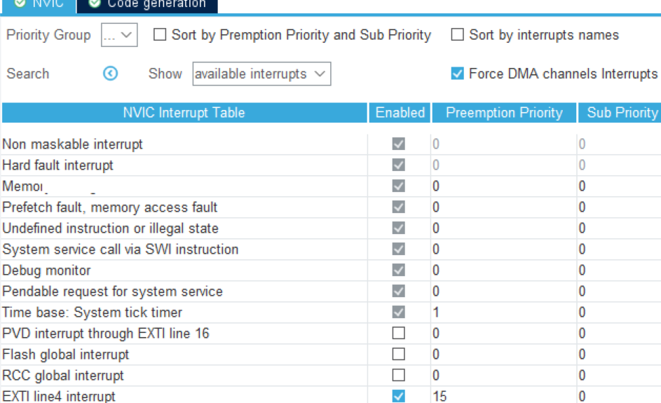

# 从0开始的STM32学习之旅：使用中断完成等待型任务

​	很好，我们在之前的学习中已经完成了简单的GPIO输入输出驱动的控制，我们的下一步就是仔细了解一下中断这个事情。

## 中断

​	中断这个事情字如其名：程序流好好的运转，来一个事件通知要求处理器放下手头的活来处理，流水线被挂起打断：这就是中断了！

​	中断可以认为是一种信号，通知处理器发生了某种事件，要求处理器暂停当前正在执行的任务，**转而执行相应的中断处理程序（Interrupt Service Routine, ISR）**（STM32在初始化的时候就布置好了传统的经典的中断向量表了）。中断的主要目的在于提高系统的响应速度和资源利用率。中断处理通常是异步的，这意味着中断可以在任何时刻发生。

​	中断的主要目的包括提高效率、响应外部事件以及实现多任务处理。通过中断机制，处理器可以在不需要主动查询设备状态的情况下处理设备请求。一般的，一个外部的中断（内部类似，不过设备变成了处理器本身罢了）几个步骤：

- 当设备发出中断请求时，处理器在执行指令时定期检测中断信号。
- 一旦检测到中断，处理器将保存当前的执行状态（上下文），
- 然后跳转到中断处理程序的入口地址，执行相关的中断处理逻辑。
- 最后，在中断处理完成后，处理器恢复之前保存的上下文，继续执行被中断的任务。

​	中断可以根据不同的标准进行分类。根据来源，中断可以分为外部中断和内部中断。外部中断由外部设备发起，如I/O设备和定时器；内部中断则由程序内部产生，如除零错误和非法操作。根据优先级，中断可以分为高优先级中断和低优先级中断。高优先级中断可以打断低优先级的中断处理程序，确保重要事件的及时响应。按照响应方式，中断可分为掩蔽中断和非掩蔽中断。掩蔽中断可以被处理器屏蔽，而非掩蔽中断则必须立即响应。

​	中断的实现原理涉及硬件和软件两个层面。在硬件方面，中断控制器是中断管理的核心组件，负责接收中断请求、处理优先级并将中断信号发送给处理器。中断向量表是一个存储中断处理程序地址的表格，处理器通过中断号查找中断向量表，从而找到相应的ISR地址。中断屏蔽寄存器则用于设置哪些中断可以被处理器响应，哪些可以被屏蔽。在软件层面，中断处理程序是响应中断请求的代码，通常是系统级别的函数。中断处理程序的设计需要尽量简洁快速，以减少对其他任务的影响。当中断发生时，处理器需要保存当前的执行上下文，以便在中断处理完成后恢复。操作系统还会根据中断的优先级设计调度策略，以确保高优先级中断能及时得到处理。

​	中断自身在计算机系统中的应用非常广泛，尤其在**I/O设备管理、定时器中断、错误处理和实时系统**中都发挥着重要作用。对于外设，如键盘、鼠标和打印机，中断机制使得设备能够在准备好数据时向处理器发送信号，处理器随即执行相应的处理程序，确保高效的数据传输。在操作系统中，定时器中断用于实现时间片轮转调度，定期唤醒调度程序，以确保各个进程能够公平地获得处理器使用权。

​	在程序执行过程中，发生的错误（如除零或无效指令）会产生内部中断，操作系统可以捕捉这些异常并进行相应的错误处理，以确保系统的稳定性。在实时系统中，快速响应外部事件至关重要，而中断机制则能够确保系统对实时事件的及时处理，提供高效的实时调度。

​	当然，我们这里打算了解的更多的是外部中断。让我们继续了解一下STM32的中断是如何做的。

## NVIC

​	Nested Vectored Interrupt Controller。嵌套中断向量控制器。嵌套，是为了说明当我们的中断发生了嵌套叠叠乐的时候，处理器仍然能保持最大限度的受理所有的向量，按照我们指定的方式进行事件的处理。向量，这个事情在我们前面分析启动文件的时候就差不多说过了：可以看到我们将中断排了号，成为了一个向量。当然控制器就是我们下面要说的，他是如何控制的事情了。

​	（不难看出确实是一个表，不是吗）

| 中断名称              | 中断向量地址 | 描述                       |
| --------------------- | ------------ | -------------------------- |
| NMI_Handler           | 0x00000004   | 非屏蔽中断处理程序         |
| HardFault_Handler     | 0x00000008   | 硬故障中断处理程序         |
| MemManage_Handler     | 0x0000000C   | 内存管理故障中断处理程序   |
| BusFault_Handler      | 0x00000010   | 总线故障中断处理程序       |
| UsageFault_Handler    | 0x00000014   | 使用故障中断处理程序       |
| SVC_Handler           | 0x00000018   | 服务调用中断处理程序       |
| DebugMon_Handler      | 0x0000001C   | 调试监视中断处理程序       |
| PendSV_Handler        | 0x00000020   | 延迟服务请求中断处理程序   |
| SysTick_Handler       | 0x00000024   | 系统滴答定时器中断处理程序 |
| WWDG_IRQHandler       | 0x00000028   | 看门狗定时器中断处理程序   |
| PVD_IRQHandler        | 0x0000002C   | 电压侦测中断处理程序       |
| TAMP_STAMP_IRQHandler | 0x00000030   | 时间戳/回调中断处理程序    |
| RTC_WKUP_IRQHandler   | 0x00000034   | 实时钟唤醒中断处理程序     |
| FLASH_IRQHandler      | 0x00000038   | 闪存控制器中断处理程序     |
| RCC_IRQHandler        | 0x0000003C   | 时钟控制器中断处理程序     |

​	当然，NVIC在C语言程序中的表达就显得十分的直接了：

```
typedef struct
{
  __IOM uint32_t ISER[8U];               /*!< Offset: 0x000 (R/W)  Interrupt Set Enable Register */
        uint32_t RESERVED0[24U];
  __IOM uint32_t ICER[8U];               /*!< Offset: 0x080 (R/W)  Interrupt Clear Enable Register */
        uint32_t RSERVED1[24U];
  __IOM uint32_t ISPR[8U];               /*!< Offset: 0x100 (R/W)  Interrupt Set Pending Register */
        uint32_t RESERVED2[24U];
  __IOM uint32_t ICPR[8U];               /*!< Offset: 0x180 (R/W)  Interrupt Clear Pending Register */
        uint32_t RESERVED3[24U];
  __IOM uint32_t IABR[8U];               /*!< Offset: 0x200 (R/W)  Interrupt Active bit Register */
        uint32_t RESERVED4[56U];
  __IOM uint8_t  IP[240U];               /*!< Offset: 0x300 (R/W)  Interrupt Priority Register (8Bit wide) */
        uint32_t RESERVED5[644U];
  __OM  uint32_t STIR;                   /*!< Offset: 0xE00 ( /W)  Software Trigger Interrupt Register */
}  NVIC_Type;
```

​	ISER[8]：ISER 全称是：Interrupt Set Enable Registers，这是一个中断使能寄存器组。上面
说了 CM3 内核支持 256 个中断，这里用 8 个 32 位寄存器来控制，每个位控制一个中断。但是STM32F103 的可屏蔽中断最多只有60 个，所以对我们来说，有用的就是两个(ISER[0]和ISER[1])，总共可以表示 64 个中断。而 STM32F103 只用了其中的 60 个。ISER[0]的 bit0~31 分别对应中断 0~31；ISER[1]的 bit0~27 对应中断 32~59，这样总共 60 个中断就可以分别对应上了。你要使能某个中断，必须设置相应的 ISER 位为 1，使该中断被使能(这里仅仅是使能，还要配合中断分组、屏蔽、IO 口映射等设置才算是一个完整的中断设置)。具体每一位对应哪个中断，请参考stm32f103xe.h 里面的第 69 行，笔者这里给出

```
/*!< Interrupt Number Definition */
typedef enum
{
/******  Cortex-M3 Processor Exceptions Numbers ***************************************************/
  NonMaskableInt_IRQn         = -14,    /*!< 2 Non Maskable Interrupt                             */
  HardFault_IRQn              = -13,    /*!< 3 Cortex-M3 Hard Fault Interrupt                     */
  MemoryManagement_IRQn       = -12,    /*!< 4 Cortex-M3 Memory Management Interrupt              */
  BusFault_IRQn               = -11,    /*!< 5 Cortex-M3 Bus Fault Interrupt                      */
  UsageFault_IRQn             = -10,    /*!< 6 Cortex-M3 Usage Fault Interrupt                    */
  SVCall_IRQn                 = -5,     /*!< 11 Cortex-M3 SV Call Interrupt                       */
  DebugMonitor_IRQn           = -4,     /*!< 12 Cortex-M3 Debug Monitor Interrupt                 */
  PendSV_IRQn                 = -2,     /*!< 14 Cortex-M3 Pend SV Interrupt                       */
  SysTick_IRQn                = -1,     /*!< 15 Cortex-M3 System Tick Interrupt                   */

/******  STM32 specific Interrupt Numbers *********************************************************/
  WWDG_IRQn                   = 0,      /*!< Window WatchDog Interrupt                            */
  PVD_IRQn                    = 1,      /*!< PVD through EXTI Line detection Interrupt            */
  TAMPER_IRQn                 = 2,      /*!< Tamper Interrupt                                     */
  RTC_IRQn                    = 3,      /*!< RTC global Interrupt                                 */
  FLASH_IRQn                  = 4,      /*!< FLASH global Interrupt                               */
  RCC_IRQn                    = 5,      /*!< RCC global Interrupt          
  ...
```

​	ICER[8]：全称是：Interrupt Clear Enable Registers，是一个中断除能寄存器组。该寄存器组与 ISER 的作用恰好相反，是用来清除某个中断的使能的。其对应位的功能，也和 ICER 一样。这里要专门设置一个ICER 来清除中断位，而不是向 ISER 写0 来清除，是因为 NVIC 的这些寄存器都是写1 有效的，写 0 是无效的。

​	ISPR[8]：全称是：Interrupt Set Pending Registers，是一个中断使能挂起控制寄存器组。每个位对应的中断和ISER 是一样的。通过置 1，可以将正在进行的中断挂起，而执行同级或更高级别的中断。写 0 是无效的。 

​	ICPR[8]：全称是：Interrupt Clear Pending Registers，是一个中断解挂控制寄存器组。其作用与 ISPR 相反，对应位也和 ISER 是一样的。通过设置 1，可以将挂起的中断解挂。写 0 无效。 

​	IABR[8]：全称是：Interrupt Active Bit Registers，是一个中断激活标志位寄存器组。对应位所代表的中断和 ISER 一样，如果为 1，则表示该位所对应的中断正在被执行。这是一个只读寄存器，通过它可以知道当前在执行的中断是哪一个。在中断执行完了由硬件自动清零。 

​	IP[240]：全称是：Interrupt Priority Registers，是一个中断优先级控制的寄存器组。这个寄存器组相当重要！STM32F103 的中断分组与这个寄存器组密切相关。IP 寄存器组由 240 个 8bit的寄存器组成，每个可屏蔽中断占用8bit，这样总共可以表示 240 个可屏蔽中断。而 STM32F103只用到了其中的 60 个。IP[59]~IP[0]分别对应中断 59~0。而每个可屏蔽中断占用的 8bit 并没有全部使用，而是只用了高 4 位。这 4 位，又分为抢占优先级和子优先级。抢占优先级在前，子优先级在后。而这两个优先级各占几个位又要根据 SCB->AIRCR 中的中断分组设置来决定。

## 中断优先级

​	这个事情是笔者之前遇到过的，你先想下为什么。

​	笔者决定写一个简单的Demo，我配置好中断 + 开启之后，写了一个如下的简单程序：

```
void HAL_GPIO_EXTI_Callback(uint16_t GPIO_Pin){
  HAL_GPIO_TogglePin(LED0_GPIO_Port, LED0_Pin);
}
int main(void)
{
  HAL_Init();
  SystemClock_Config();
  MX_GPIO_Init();
  while (1)
  {
    HAL_Delay(100);
  }
}
```

​	但是程序仍然直接挂了，无论我怎么施加以外部信号，程序不闻不顾。这是怎么回事呢？答案是：优先级配置错误，导致Systicks没法正常更新，时钟系统乱套了。

​	那怎么办呢？答案是正确的配置中断优先级。

### 先说说一般我们聊到的中断优先级

​	**中断优先级是指在多个中断请求同时到达处理器时，处理器根据预设的优先级规则决定哪个中断请求先被响应和处理。**优先级通常由系统设计者在编程时设定，反映了不同事件的重要性。例如，在某些应用中，紧急的硬件故障中断可能被设定为高优先级，而不太重要的传感器读取中断可能被设定为低优先级。

​	中断优先级的管理可以采用多种策略，其中包括固定优先级、动态优先级以及优先级反转处理。固定优先级意味着中断的优先级在系统运行期间保持不变，而动态优先级允许系统根据实时需求调整中断的优先级。优先级反转是指低优先级任务持有高优先级任务所需的资源，从而导致高优先级任务无法执行。

​	中断优先级通常可以分为硬件优先级和软件优先级。硬件优先级由中断控制器在硬件层面决定，处理器在收到中断信号时，会根据中断信号的优先级进行处理。软件优先级则是在操作系统或应用程序中定义的，允许开发者根据具体需求调整中断的响应行为。在一些系统中，中断优先级采用分级管理的方式。高优先级中断可以打断低优先级中断的处理，这种方式允许系统在高优先级事件发生时迅速做出响应。例如，在嵌入式系统中，定时器中断可能具有高优先级，而数据传输中断的优先级可能较低。

​	中断优先级的实现通常涉及中断控制器和中断向量表。中断控制器负责管理所有中断请求，判断各个中断的优先级并将最高优先级的中断信号发送给处理器。在STM32等微控制器中，开发者可以通过编程设置各个中断的优先级，以满足系统的需求。中断向量表则是一个包含所有中断处理程序入口地址的表格。当中断发生时，处理器通过中断向量表找到相应的中断处理程序，执行特定的逻辑。中断优先级在这个过程中起到决定哪个中断处理程序被调用的作用。在某些情况下，中断优先级可能会被动态调整。通过实时监控系统的运行状态，操作系统可以根据当前的任务需求和资源利用情况调整中断的优先级。这种动态调整的机制通常用于复杂的实时系统，以确保关键任务的优先级始终高于非关键任务。

​	在配置中断优先级时，开发者需要综合考虑系统的整体架构、实时性要求、任务特性等因素。合理的中断优先级设置能够显著提高系统的响应速度和稳定性。以下是一些优化中断优先级配置的建议。开发者应该评估每个中断的响应时间要求，并根据事件的重要性分配优先级。高优先级中断应优先处理响应时间敏感的任务，而低优先级中断则可以在系统空闲时处理。其次，应尽量减少中断处理程序的执行时间。中断处理程序应该尽可能简洁，避免在ISR中执行复杂的计算或阻塞操作。可以通过设置标志位或使用消息队列等方式，将较为复杂的处理逻辑放到主程序中进行，以减小ISR的负担。最后，定期评估和调整中断优先级设置。在系统运行过程中，可能会出现新的需求或问题，开发者应根据实际情况对中断优先级进行动态调整，以确保系统的稳定性和响应性。

### STM32中的NVIC中断优先级表示

​	STM32 中的中断优先级可以分为：抢占式优先级和响应优先级，响应优先级也称子优先级，每个中断源都需要被指定这两种优先级。抢占式优先级和响应优先级的区别： 

- 抢占优先级：抢占优先级高的中断可以打断正在执行的抢占优先级低的中断。 
- 响应优先级：抢占优先级相同，响应优先级高的中断不能打断响应优先级低的中断。 

​	还有一种情况就是当两个或者多个中断的抢占式优先级和响应优先级相同时，那么就遵循自然优先级，看中断向量表的中断排序，数值越小，优先级越高。

​	在 NVIC 中由寄存器 NVIC_IPR0-NVIC_IPR59 共 60 个寄存器控制中断优先级，每个寄存器的 8 位，所以就有了 240 个宽度为 8bit 的中断优先级控制寄存器，原则上每个外部中断配置的优先级为 0~255，数值越小，优先级越高。但是实际上 M3 芯片为了精简设计，只使用了高四位[7:4]，低四位取零，这样以至于最多只有 16 级中断嵌套，即 2^4=16。 

| 优先级分组 | AIRCR[10:8] | 抢占优先级位数 | 响应优先级位数 |
| ---------- | ----------- | -------------- | -------------- |
| 0          | 111         | 0              | 4              |
| 1          | 110         | 1              | 3              |
| 2          | 101         | 2              | 2              |
| 3          | 100         | 3              | 1              |
| 4          | 011         | 4              | 0              |

​	当然，数字越小，越优先！在强调一次。拿正点原子的举例：假定设置中断优先级分组为 2，然后设置中断 3(RTC_WKUP 中断)的抢占优先级为 2，响应优先级为 1。中断6（外部中断 0）的抢占优先级为 3，响应优先级为0。中断 7（外部中断 1）的抢占优先级为 2，响应优先级为 0。那么这 3 个中断的优先级顺序为：**中断 7>中断 3>中断 6。** 

### API

​	**HAL_NVIC_SetPriorityGrouping** 函数用于设置中断优先级分组。它的声明为 `void HAL_NVIC_SetPriorityGrouping(uint32_t PriorityGroup)`。该函数允许开发者选择不同的中断优先级分组，范围从 `NVIC_PRIORITYGROUP_0` 到 `NVIC_PRIORITYGROUP_4`。通常情况下，这个函数在一个项目中只需调用一次，通常是在程序的 HAL 库初始化阶段调用。后续如果再调用该函数更改优先级分组，可能会导致之前设置的抢占优先级和响应优先级不匹配。

​	 **HAL_NVIC_SetPriority** 函数，声明为 `void HAL_NVIC_SetPriority(IRQn_Type IRQn, uint32_t PreemptPriority, uint32_t SubPriority)`。该函数用于设置特定中断的抢占优先级和响应优先级。函数的第一个参数是中断号，范围由 `IRQn_Type` 定义的枚举类型决定；第二个参数是抢占优先级，范围为 0 到 15；第三个参数是响应优先级，同样范围为 0 到 15。此函数允许开发者灵活配置中断优先级，以满足不同应用的需求。

​	 **HAL_NVIC_EnableIRQ**，其声明为 `void HAL_NVIC_EnableIRQ(IRQn_Type IRQn)`。该函数用于使能指定的中断。参数为中断号，开发者可以通过这个函数启用特定的中断，使其可以被处理。

​	**HAL_NVIC_DisableIRQ** 函数用于中断的除能，其声明为 `void HAL_NVIC_DisableIRQ(IRQn_Type IRQn)`。通过这个函数，开发者可以禁用某个特定中断，防止其在未准备好时被处理。

​	**HAL_NVIC_SystemReset** 函数的声明为 `void HAL_NVIC_SystemReset(void)`，它用于执行软件复位。调用该函数后，系统将立即复位，所有外设和寄存器状态将被重置。

| 函数名                       | 函数描述                         | 声明                                                         | 参数                                                        | 返回值 | 注意事项                                                     |
| ---------------------------- | -------------------------------- | ------------------------------------------------------------ | ----------------------------------------------------------- | ------ | ------------------------------------------------------------ |
| HAL_NVIC_SetPriorityGrouping | 设置中断优先级分组               | void HAL_NVIC_SetPriorityGrouping(uint32_t PriorityGroup);   | PriorityGroup: NVIC_PRIORITYGROUP_0 到 NVIC_PRIORITYGROUP_4 | 无     | 该函数在一个工程里通常只调用一次，后续调用可能导致优先级不匹配。 |
| HAL_NVIC_SetPriority         | 设置中断的抢占优先级和响应优先级 | void HAL_NVIC_SetPriority(IRQn_Type IRQn, uint32_t PreemptPriority, uint32_t SubPriority); | IRQn: 中断号 PreemptPriority: 0 到 15 SubPriority: 0 到 15  | 无     | 抢占优先级和响应优先级的范围均为0到15。                      |
| HAL_NVIC_EnableIRQ           | 使能中断                         | void HAL_NVIC_EnableIRQ(IRQn_Type IRQn);                     | IRQn: 中断号                                                | 无     | 使能后对应的中断可以被处理。                                 |
| HAL_NVIC_DisableIRQ          | 中断除能                         | void HAL_NVIC_DisableIRQ(IRQn_Type IRQn);                    | IRQn: 中断号                                                | 无     | 除能后对应的中断将不会被处理。                               |
| HAL_NVIC_SystemReset         | 软件复位系统                     | void HAL_NVIC_SystemReset(void);                             | 无                                                          | 无     | 调用后系统会立即复位，所有的外设和寄存器将重置。             |


## CubeMx配置说明



​	可以在NVIC一栏中看到，当我们给一个检测的目标GPIO上中断配置的时候，这里会出现，以及需要配置优先级。可以看到外面需要给优先级配成如图所示的样子（防止中断死锁）

- 开启下降沿触发中断：即在 按下按键时 电平由高变为低时触发，则在 GPIO mode 中选择 External Interrupt Mode with Falling edge trigger detection

- 开启上升沿触发中断：即在 按下按键后松开时 电平由低变为高时触发，则在 GPIO mode 中选择 External Interrupt Mode with Rising edge trigger detection

- 开启下降沿上升沿都触发中断：即在 按下时触发，松开时再次触发，则在 GPIO mode 中选择 External Interrupt Mode with Rising/Falling edge trigger detection
- **External Event Mode with Rising Edge Trigger Detection**（外部事件上升沿触发检测）：在此模式下，当引脚检测到上升沿（即信号从低电平变为高电平）时，会生成一个外部事件。这种配置适用于需要响应信号开始变化的场合，例如按钮按下时。
- **External Event Mode with Falling Edge Trigger Detection**（外部事件下降沿触发检测）：此模式下，当引脚检测到下降沿（即信号从高电平变为低电平）时，会生成一个外部事件。适合用于监测信号关闭或变低的情况，例如按钮释放时。
- **External Event Mode with Rising/Falling Edge Trigger Detection**（外部事件上升/下降沿触发检测）：在这个模式下，引脚可以同时响应上升沿和下降沿的信号变化，任何边沿的变化都会生成一个外部事件。这提供了更高的灵活性，适合需要对信号变化全面响应的应用。

​	分为两组看的话，一个就是事件驱动，一个是中断驱动。后面的区别外面详细再说！

​	**第一个是通过硬件中断信号来处理的，执行的函数是中断服务程序。响应快。第二个是通过轮询的方式，就CPU每隔几ms或者us去询问，驱动写好的事件有没有被触发，然后响应时间比中断慢点。然后一般没有硬件信号可以触发就用事件中断**

