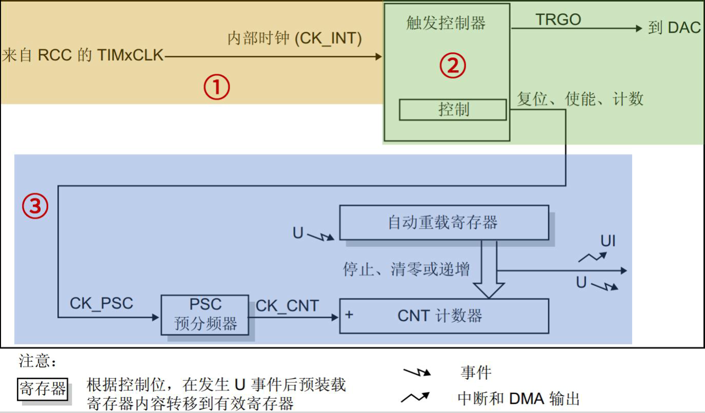
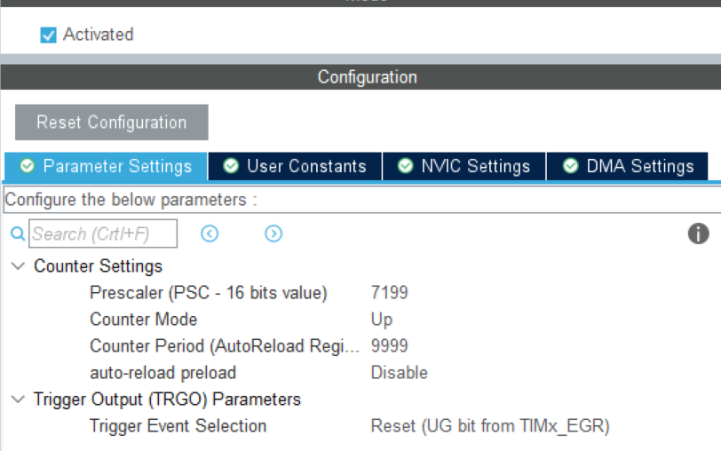
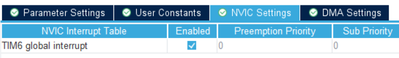

# 从0开始的STM32 定时器（I）：聊一聊基本定时器

​	在我们使用STM32解决一些问题的时候，常常会遇到说：我想要以一个周期做一些事情：比如说周期性的向我的上位机发送当前的温度和湿度，比如说周期性的点亮一个LED，刷新一次LCD屏幕。这都离不开我们定时器的身影。STM32有2个基本定时器，4个通用定时器，2个高级定时器。我们慢慢来阐述不同种类的定时器的作用。现在，让我们从最基础的最简单的基本定时器开始！



​	学过数电的朋友一眼就能知道这个图怎么回事了：我们对来自RCC时钟的信号进行分频，当到打分频计数的时候向计数器发起一次脉冲，计数器接受到脉冲后会自增1，直到到达我们设定的阈值的时候发起一次中断通知定时器超时。这就是定时器的最基本的工作原理！

​	这样来看，定时器的核心就是计算器！就是打点计数，到点发起通知重置！他有三个要素组成：

### 时钟源

​	要实现计数功能，首先要给它一个时钟源。打点计时，还是需要水滴下来的！基本定时器时钟挂载在 APB1 总线，所以它的时钟来自于 APB1 总线，但是基本定时器时钟不是直接由 APB1 总线直接提供，而是先经过一个倍频器。当APB1 的预分频器系数为 1 时，这个倍频器系数为 1，即定时器的时钟频率等于 APB1 总线时钟频率；当 APB1 的预分频器系数≥2 分频时，这个倍频器系数就为 2 ，即定时器的时钟频率等于 APB1 总线时钟频率的两倍。

### 控制器 

​	控制器除了控制定时器复位、使能、计数等功能之外，还可以用于触发DAC 转换。这个是我们的定时器可以被控制的根本。 

### 时基单元 

​	**时基单元包括：计数器寄存器(TIMx_CNT)、预分频器寄存器(TIMx_PSC)、自动重载寄存器(TIMx_ARR) 。**基本定时器的这三个寄存器都是 16 位有效数字，即可设置值范围是 0~65535。时基单元中的预分频器PSC，它有一个输入和一个输出。输入CK_PSC 来源于控制器部分，实际上就是来自于内部时钟（CK_INT），即2 倍的APB1 总线时钟频率（72MHz）。输出 CK_CNT是分频后的时钟，它是计数器实际的计数时钟，通过设置预分频器寄存器(TIMx_PSC)的值可以得到不同频率 CK_CNT，计算公式如下： 

```
fCK_CNT= fCK_PSC / (PSC[15:0]+1) 
```

​	上式中，PSC[15:0]是写入预分频器寄存器(TIMx_PSC)的值。 

​	另外：预分频器寄存器(TIMx_PSC)可以在运行过程中修改它的数值，新的预分频数值将在下一个更新事件时起作用。因为更新事件发生时，会把 TIMx_PSC 寄存器值更新到其**影子寄存器**中，这才会起作用。 

​	那什么是影子寄存器？从框图上看，可以看到图20.1.1.1中的预分频器PSC 后面有一个影子，自动重载寄存器也有个影子，这就表示这些寄存器有影子寄存器。影子寄存器是一个实际起作用的寄存器，不可直接访问。举个例子：我们可以把预分频系数写入预分频器寄存器(TIMx_PSC)，但是预分频器寄存器只是起到缓存数据的作用，只有等到更新事件发生时，预分频器寄存器的值才会被自动写入其影子寄存器中，这时才真正起作用。 也就是说，我们不能直接暴力的打断当前的计数，采用缓存的办法下一次更新，这确保系统至少是稳定的工作的！

​	自动重载寄存器及其影子寄存器的作用和上述同理。**不同点在于自动重载寄存器是否具有缓冲作用还受到 ARPE 位的控制，当该位置0 时，ARR 寄存器不进行缓冲，我们写入新的 ARR值时，该值会马上被写入 ARR 影子寄存器中，从而直接生效；当该位置 1 时，ARR 寄存器进行缓冲，我们写入新的 ARR 值时，该值不会马上被写入 ARR 影子寄存器中，而是要等到更新事件发生才会被写入 ARR 影子寄存器，这时才生效。预分频器寄存器则没有这样相关的控制位，**这就是它们不同点。 

​	值得注意的是，更新事件的产生有两种情况，**一是由软件产生，将 TIMx_EGR 寄存器的位UG 置 1，产生更新事件后，硬件会自动将 UG 位清零。二是由硬件产生，满足以下条件即可：计数器的值等于自动重装载寄存器影子寄存器的值。**

​	基本定时器的计数器（CNT）是一个递增的计数器，当寄存器（TIMx_CR1）的CEN 位置1，即使能定时器，每来一个 CK_CNT 脉冲，TIMx_CNT 的值就会递增加 1。当TIMx_CNT 值与 TIMx_ARR 的设定值相等时，TIMx_CNT 的值就会被自动清零并且会生成更新事件（如果开启相应的功能，就会产生 DMA 请求、产生中断信号或者触发 DAC 同步电路），然后下一个CK_CNT 脉冲到来，TIMx_CNT 的值就会递增加 1，**如此循环。在此过程中，TIMx_CNT 等于TIMx_ARR 时，我们称之为定时器溢出，因为是递增计数，故而又称为定时器上溢。定时器溢出就伴随着更新事件的发生。** 

​	由上述可知，我们只要设置预分频寄存器和自动重载寄存器的值就可以控制定时器更新事件发生的时间。自动重载寄存器(TIMx_ARR)是用于存放一个与计数器作比较的值，当计数器的值等于自动重载寄存器的值时就会生成更新事件，硬件自动置位相关更新事件的标志位，如：更新中断标志位。 

​	下面举个例子来学习如何设置预分频寄存器和自动重载寄存器的值来得到我们想要的定时器上溢事件发生的时间周期。比如我们需要一个500ms 周期的定时器更新中断，**一般思路是先设置预分频寄存器，然后才是自动重载寄存器。**

​	考虑到我们设置的 CK_INT 为72MHz，我们把预分频系数设置为 7200，即写入预分频寄存器的值为 7199，那么 fCK_CNT=72MHz/7200=10KHz。这样就得到计数器的计数频率为10KHz，即计数器 1 秒钟可以计 10000 个数。我们需要 500ms 的中断周期，所以我们让计数器计数 5000 个数就能满足要求，即需要设置自动重载寄存器的值为4999，另外还要把定时器更新中断使能位 UIE 置 1，CEN 位也要置 1。

## 关于HAL库如何配置基本定时器

​	下面给看官演示如何使用使用最基本的定时器完成定时触发任务：

​	首先，笔者现在用的STM32F103ZET6有两个基本的定时器TIM6和TIM7。笔者使用的是TIM6。现在，勾选Activate使能我们的定时器后，开始设置参数。

- Prescaler是我们上面提到的预分频的意思：这里笔者的RCC时钟是72MHz，现在做分频笔者按照经典的方案：分7200份，也就是每一份实际上是10KHz
- CounterMode：向上计数（如果只是定时无所谓）
- Counter Period：自动重装载值，笔者打算1s触发一次事件，那就是让1s计数1次，即1HZ，需要填入10000 - 1 = 9999（Btw，不太理解为什么非得要填一个很小的值然后在程序里自己维护一个计数，我后来想了想，可能是同步的其他周期的任务计时更加方便）（后补：实际上就是更细粒度的维护
- auto-reload preload：Disable的时候自动重装载寄存器写入新值后，**计数器立即产生计数溢出**，然后开始新的计数周期，也就是说，我们在Disable的时候马上修改我们在影子寄存器里的重载值，而在Enable的时候则是完成当前周期之后再将值写入影子寄存器里（多一个周期）




​	下面，我们就是使能一下我们的NVIC：



​	完成其他配置之后，我们就可以开始生成工程。值得注意的是，初始化结束我们的寄存器之后**记得开启定时器计时**（笑）

```
/* USER CODE BEGIN 0 */

void HAL_TIM_PeriodElapsedCallback(TIM_HandleTypeDef *htim)
{
  if(htim == &htim6){
    HAL_GPIO_TogglePin(LED0_GPIO_Port, LED0_Pin);
  }
}

/* USER CODE END 0 */

/**
  * @brief  The application entry point.
  * @retval int
  */
int main(void)
{
  /* USER CODE BEGIN 1 */

  /* USER CODE END 1 */

  /* MCU Configuration--------------------------------------------------------*/

  /* Reset of all peripherals, Initializes the Flash interface and the Systick. */
  HAL_Init();

  /* USER CODE BEGIN Init */

  /* USER CODE END Init */

  /* Configure the system clock */
  SystemClock_Config();

  /* USER CODE BEGIN SysInit */
  
  /* USER CODE END SysInit */

  /* Initialize all configured peripherals */
  MX_GPIO_Init();
  MX_TIM6_Init();
  /* USER CODE BEGIN 2 */
  HAL_TIM_Base_Start_IT(&htim6);
  /* USER CODE END 2 */

  /* Infinite loop */
  /* USER CODE BEGIN WHILE */
  while (1)
  {
    /* USER CODE END WHILE */

    /* USER CODE BEGIN 3 */
  }
  /* USER CODE END 3 */
}
```

​	回调事件请在HAL_TIM_PeriodElapsedCallback内完成。下面我们依次介绍HAL库的函数配置。

## HAL是如何初始化我们的定时器句柄的

​	HAL库这样抽象一个定时器：

```
/**
  * @brief  初始化 TIM6 定时器。
  * @note   此函数初始化 TIM6 为基础计时器，设置了预分频器和计数周期，并配置了触发和同步模式。
  * @retval None
  */
static void MX_TIM6_Init(void)
{
  /* USER CODE BEGIN TIM6_Init 0 */
  // 用户代码部分：可以在此处添加初始化之前的代码
  /* USER CODE END TIM6_Init 0 */

  TIM_MasterConfigTypeDef sMasterConfig = {0};  // 定义主配置结构体，用于配置 TIM6 的主从同步模式

  /* USER CODE BEGIN TIM6_Init 1 */
  // 用户代码部分：可以在此处添加初始化之后的代码
  /* USER CODE END TIM6_Init 1 */
  
  htim6.Instance = TIM6;  // 指定 TIM6 外设实例

  // 配置定时器参数
  htim6.Init.Prescaler = 7199;  // 设置预分频器值为 7199。定时器计数频率为系统时钟频率 / (Prescaler + 1)
  htim6.Init.CounterMode = TIM_COUNTERMODE_UP;  // 设置计数模式为向上计数模式
  htim6.Init.Period = 9999;  // 设置定时器周期为 9999。定时器将在计数到达此值时溢出
  htim6.Init.AutoReloadPreload = TIM_AUTORELOAD_PRELOAD_DISABLE;  // 禁用自动重载预加载功能

  // 初始化定时器
  if (HAL_TIM_Base_Init(&htim6) != HAL_OK)
  {
    Error_Handler();  // 如果定时器初始化失败，调用错误处理函数
  }

  // 配置定时器主输出触发（TRGO）和主从同步模式
  sMasterConfig.MasterOutputTrigger = TIM_TRGO_RESET;  // 配置主输出触发为重置
  sMasterConfig.MasterSlaveMode = TIM_MASTERSLAVEMODE_DISABLE;  // 禁用主从同步模式
  if (HAL_TIMEx_MasterConfigSynchronization(&htim6, &sMasterConfig) != HAL_OK)
  {
    Error_Handler();  // 如果主从同步配置失败，调用错误处理函数
  }

  /* USER CODE BEGIN TIM6_Init 2 */
  // 用户代码部分：可以在此处添加初始化后的代码
  /* USER CODE END TIM6_Init 2 */
}
```

​	按照流程，我们做了这一些事情：

> 配置好我们在CubeMx中设置的一系列的参数值。
>
> 使用`HAL_TIM_Base_Init(&htim6)` 函数用于初始化定时器的基本配置，包括预分频器、计数模式、周期等参数。如果初始化失败，程序将调用 `Error_Handler()` 进行错误处理。
>
> 主从同步配置：
>
> - **主输出触发（Master Output Trigger, TRGO）**：`sMasterConfig.MasterOutputTrigger = TIM_TRGO_RESET;` 设置定时器的主输出触发事件为重置信号。重置信号通常用于同步其他外设或触发其他操作。
> - **主从同步模式（Master Slave Mode）**：`sMasterConfig.MasterSlaveMode = TIM_MASTERSLAVEMODE_DISABLE;` 禁用主从同步模式，这意味着 TIM6 不与其他定时器或外设同步工作。

### HAL_TIM_Base_Init

​	这个是实际的IMPL函数：`HAL_TIM_Base_Init` 函数用于初始化一个基本定时器的配置。它检查传入的定时器句柄和配置信息是否有效，并根据用户的配置初始化相关硬件资源，包括定时器计数器、时钟和中断。

```
/**
  * @brief  初始化 TIM 基本定时器。
  * @param  htim 指向一个 TIM_HandleTypeDef 结构体，该结构体包含了定时器的配置信息。
  * @retval HAL 状态码（HAL_OK 或 HAL_ERROR）
  */
HAL_StatusTypeDef HAL_TIM_Base_Init(TIM_HandleTypeDef *htim)
{
  /* 检查 TIM 句柄是否有效 */
  if (htim == NULL)
  {
    return HAL_ERROR;  // 如果 TIM 句柄无效，返回错误
  }

  /* 检查定时器配置参数是否有效 */
  assert_param(IS_TIM_INSTANCE(htim->Instance));  // 确保传入的定时器实例有效
  assert_param(IS_TIM_COUNTER_MODE(htim->Init.CounterMode));  // 确保计数模式有效
  assert_param(IS_TIM_CLOCKDIVISION_DIV(htim->Init.ClockDivision));  // 确保时钟分频配置有效
  assert_param(IS_TIM_AUTORELOAD_PRELOAD(htim->Init.AutoReloadPreload));  // 确保自动重载预加载配置有效

  if (htim->State == HAL_TIM_STATE_RESET)
  {
    /* 如果定时器处于重置状态，初始化定时器 */
    htim->Lock = HAL_UNLOCKED;  // 解锁定时器资源

#if (USE_HAL_TIM_REGISTER_CALLBACKS == 1)
    /* 如果启用回调函数注册功能，重置中断回调为默认的弱回调 */
    TIM_ResetCallback(htim);

    if (htim->Base_MspInitCallback == NULL)
    {
      /* 如果没有用户提供的回调函数，则使用默认的硬件初始化回调函数 */
      htim->Base_MspInitCallback = HAL_TIM_Base_MspInit;
    }
    /* 初始化低级硬件配置：GPIO、时钟、NVIC */
    htim->Base_MspInitCallback(htim);
#else
    /* 如果没有启用回调函数注册，直接调用默认的硬件初始化函数 */
    HAL_TIM_Base_MspInit(htim);
#endif /* USE_HAL_TIM_REGISTER_CALLBACKS */
  }

  /* 设置定时器状态为忙碌 */
  htim->State = HAL_TIM_STATE_BUSY;

  /* 设置定时器时间基准配置 */
  TIM_Base_SetConfig(htim->Instance, &htim->Init);

  /* 初始化 DMA burst 操作状态 */
  htim->DMABurstState = HAL_DMA_BURST_STATE_READY;

  /* 初始化 TIM 通道的状态 */
  TIM_CHANNEL_STATE_SET_ALL(htim, HAL_TIM_CHANNEL_STATE_READY);  // 设置所有 TIM 通道为准备好状态
  TIM_CHANNEL_N_STATE_SET_ALL(htim, HAL_TIM_CHANNEL_STATE_READY);  // 设置所有通道的N状态为准备好

  /* 设置定时器状态为就绪 */
  htim->State = HAL_TIM_STATE_READY;

  return HAL_OK;  // 返回初始化成功
}
```

函数的中间部分是**参数验证**：

- `assert_param(IS_TIM_INSTANCE(htim->Instance))`：确保定时器实例（如 `TIM1`, `TIM2` 等）有效。
- `assert_param(IS_TIM_COUNTER_MODE(htim->Init.CounterMode))`：确保计数模式有效，如向上计数、向下计数或其它模式。
- `assert_param(IS_TIM_CLOCKDIVISION_DIV(htim->Init.ClockDivision))`：检查时钟分频配置是否有效。
- `assert_param(IS_TIM_AUTORELOAD_PRELOAD(htim->Init.AutoReloadPreload))`：检查自动重载预加载配置是否有效。

检查完毕，如果定时器的状态为 `HAL_TIM_STATE_RESET`（即未初始化或重置状态），则执行硬件资源的分配和初始化。此时，定时器的 `Lock` 锁定状态设置为解锁，准备进一步的配置。

- 如果启用了回调函数注册功能（通过宏 `USE_HAL_TIM_REGISTER_CALLBACKS`），则重置回调函数为默认的弱回调。
- 如果没有提供用户自定义的回调函数，则使用默认的初始化回调 `HAL_TIM_Base_MspInit`，进行定时器的低级硬件初始化。硬件初始化通常包括时钟、GPIO 和 NVIC（中断控制器）的配置。

**设置定时器配置**： 调用 `TIM_Base_SetConfig(htim->Instance, &htim->Init)` 设置定时器的时间基准配置。这包括预分频器、计数模式、自动重载等设置。

**DMA 状态初始化**： 设置定时器的 DMA burst 操作状态为 `HAL_DMA_BURST_STATE_READY`，表示 DMA 操作准备就绪，可以开始数据传输。

**定时器通道状态设置**： 使用 `TIM_CHANNEL_STATE_SET_ALL` 和 `TIM_CHANNEL_N_STATE_SET_ALL` 宏将所有的定时器通道状态设置为 `HAL_TIM_CHANNEL_STATE_READY`，表示通道准备好进行操作。

**函数结尾**： 最后，将定时器的状态设置为 `HAL_TIM_STATE_READY`，表示定时器配置完成并准备好工作。函数返回 `HAL_OK`，表示初始化成功。

## 开始定时

​	下面我们就要开始定时：定时使用的函数就是：HAL_TIM_Base_Start_IT： `HAL_TIM_Base_Start_IT` 函数用于启动基本定时器的更新中断模式。当启用中断模式时，定时器会定期触发更新事件，并通过中断通知用户。此函数适用于需要周期性执行任务的应用，比如定时器定时中断。这就是为什么我们要在上面开启他的中断

```
/**
  * @brief  启动 TIM 基本定时器的中断模式。
  * @param  htim TIM 基本定时器句柄
  * @retval HAL 状态码
  */
HAL_StatusTypeDef HAL_TIM_Base_Start_IT(TIM_HandleTypeDef *htim)
{
  uint32_t tmpsmcr;

  /* 检查传入的 TIM 实例是否有效 */
  assert_param(IS_TIM_INSTANCE(htim->Instance));

  /* 检查 TIM 的当前状态是否为就绪状态 */
  if (htim->State != HAL_TIM_STATE_READY)
  {
    return HAL_ERROR;  // 如果定时器不是就绪状态，返回错误
  }

  /* 设置定时器状态为忙碌 */
  htim->State = HAL_TIM_STATE_BUSY;

  /* 启用 TIM 更新中断 */
  __HAL_TIM_ENABLE_IT(htim, TIM_IT_UPDATE);

  /* 启用定时器外设，除非是触发模式（trigger mode），触发模式下定时器会自动启用 */
  if (IS_TIM_SLAVE_INSTANCE(htim->Instance))  // 检查是否为从模式定时器
  {
    tmpsmcr = htim->Instance->SMCR & TIM_SMCR_SMS;  // 获取定时器从模式的状态
    if (!IS_TIM_SLAVEMODE_TRIGGER_ENABLED(tmpsmcr))  // 如果不是触发模式，则启用定时器
    {
      __HAL_TIM_ENABLE(htim);  // 启动定时器
    }
  }
  else
  {
    __HAL_TIM_ENABLE(htim);  // 如果是主模式，直接启用定时器
  }

  /* 返回操作状态 */
  return HAL_OK;  // 返回成功
}
```


1. **函数概述**：
2. **参数检查**：
   - `assert_param(IS_TIM_INSTANCE(htim->Instance))`：检查传入的定时器实例是否有效。通过宏 `IS_TIM_INSTANCE`，确认 `htim->Instance` 属于有效的 TIM 实例（例如 `TIM1`, `TIM2` 等）。
3. **定时器状态检查**：
   - `if (htim->State != HAL_TIM_STATE_READY)`：检查定时器的当前状态是否为就绪状态。如果定时器处于其他状态（例如忙碌或未初始化状态），则返回错误 `HAL_ERROR`，表示不能启动定时器。
4. **定时器状态更新**：
   - `htim->State = HAL_TIM_STATE_BUSY`：将定时器状态设置为 `HAL_TIM_STATE_BUSY`，表示定时器正在被配置或启动，防止其他操作与当前操作冲突。
5. **启用 TIM 更新中断**：
   - `__HAL_TIM_ENABLE_IT(htim, TIM_IT_UPDATE)`：启用定时器的更新中断。定时器会在计数溢出时产生更新事件，触发相应的中断，用户可以在中断处理函数中执行定时任务。
6. **定时器启用**：
   - `if (IS_TIM_SLAVE_INSTANCE(htim->Instance))`：检查定时器是否是从模式（Slave mode）。从模式的定时器通常需要与主定时器同步运行，触发模式的定时器会自动启动，无需手动启用。
   - `tmpsmcr = htim->Instance->SMCR & TIM_SMCR_SMS`：获取定时器的从模式控制寄存器（SMCR）中的从模式选择字段（SMS）。
   - `if (!IS_TIM_SLAVEMODE_TRIGGER_ENABLED(tmpsmcr))`：如果定时器不是触发模式，调用 `__HAL_TIM_ENABLE(htim)` 启动定时器。
   - 如果是主模式定时器（非从模式），则直接启用定时器。
7. **返回状态**：
   - 如果一切顺利，函数返回 `HAL_OK`，表示定时器已成功启用并开始工作。

## 如何处理句柄？

​	定时中断现在被打开了，然后如何呢？答案是我们要重载我们的CallBack函数：

```
void HAL_TIM_PeriodElapsedCallback(TIM_HandleTypeDef *htim)
```

​	这个函数需要我们自己先判定一下句柄，然后接下来就是处理业务代码。