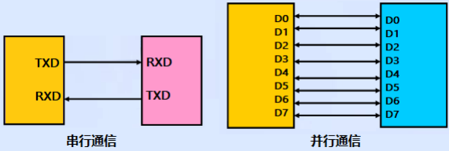
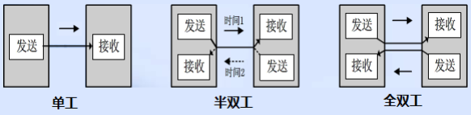
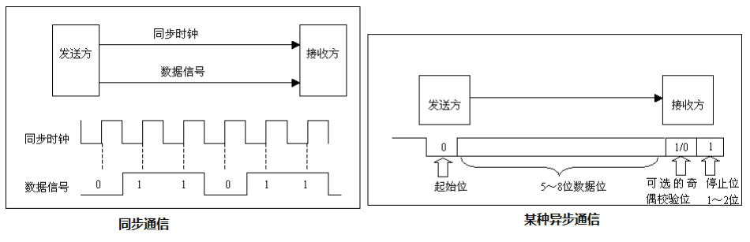
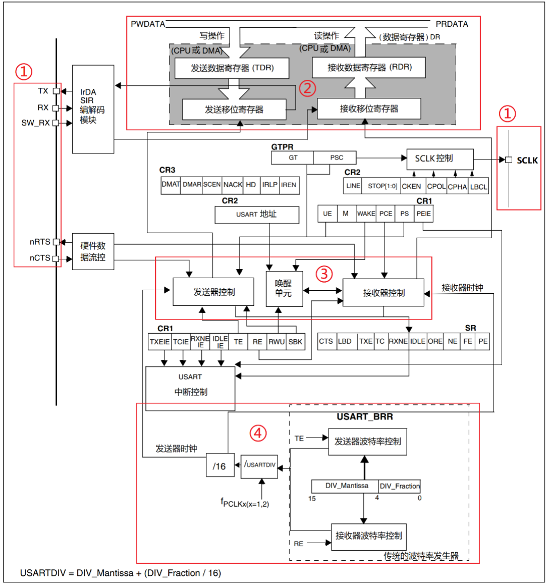

# 从0开始的STM32之旅 7 串口通信（I）

​	现在，我们终于可以做一些有趣的事情了：那就是来一点串口通信了。串口通信在一定程度上可以辅助我们程序的调试，传递信息，以及做其他令人激动的事情。下面我们就来看看如何开始我们的串口通信之旅。

## 关于数据通信

​	通信就是在传递信息，看中的是两或者是多台设备之间的信息交互和链接，是必不可少的一部分，比如：单片机和上位机、单片机和外围器件之间，它们都有数据通信的需求。由于设备之间的电气特性、传输速率、可靠性要求各不相同，于是就有了各种通信类型、通信协议，我们最常的有：**USART、IIC、SPI、CAN、USB**等。在这里我们说的串口通信更多的指代的是USART的通信。

### 串行与并行

​	串行通信的基本特征是**数据逐位顺序依次传输**，优点是**传输线少、布线成本低、灵活度高**等优点，一般用于**近距离人机交互，特殊处理后也可以用于远距离，缺点就是传输速率低**。 而并行通信是数据各位可以通过多条线同时传输，优点是传输速率高，**缺点就是布线成本高，抗干扰能力差因而适用于短距离、高速率的通信**。 



​	这一张图就可以说明白两种通信方式的差异了。

### 传播方向



​	分为三种：

- 单工是指数据传输仅能沿一个方向，不能实现反方向传输，如校园广播。 
- 半双工是指数据传输可以沿着两个方向，但是需要分时进行，如对讲机。 
- 全双工是指数据可以同时进行双向传输，日常的打电话属于这种情形。


### 同步的方式



​	通信需要协调传输的数据，如果不协调，就会出现错包乱包的情况。所以有这样一些办法

1. 要么，我们拉起一根时钟线，在时钟的督促下准时发送准时读取（同步于时钟）
2. 要么，我们在数据中动手，加入一定的校验 + 协调信息，解耦合我们的传送（异步）

​	同步通信要求通信双方共用同一时钟信号，在总线上保持统一的时序和周期完成信息传输。

- 优点：可以实现高速率、大容量的数据传输，以及点对多点传输。
- 缺点：要求发送时钟和接收时钟保持严格同步，收发双方时钟允许的误差较小，同时硬件复杂。 	

​	异步通信不需要时钟信号，而是在数据信号中加入开始位和停止位等一些同步信号，以便使接收端能够正确地将每一个字符接收下来，某些通信中还需要双方约定传输速率。

- 优点：没有时钟信号硬件简单，双方时钟可允许一定误差。
- 缺点：通信速率较低，只适用点对点传输。

### 通信速率 

​	在数字通信系统中，通信速率（传输速率）指数据在信道中传输的速度，它分为两种：传
信率和传码率。 

传信率：每秒钟传输的信息量，即每秒钟传输的二进制位数，单位为 bit/s（即比特每秒），
因而又称为比特率。 

传码率：每秒钟传输的码元个数，单位为 Baud（即波特每秒），因而又称为波特率。 
比特率和波特率这两个概念又常常被人们混淆。

​	比特率很好理解，我们来看看波特率，波特率被传输的是码元，码元是信号被调制后的概念，每个码元都可以表示一定 bit 的数据信息量。

​	举个例子，在 TTL 电平标准的通信中，用 0V 表示逻辑 0，5V 表示逻辑1，这时候这个码元就可以表示两种状态。如果电平信号 0V、2V、4V 和6V 分别表示二进制数 00、01、10、11，这时候每一个码元就可以表示四种状态。 

​	由上述可以看出，码元携带一定的比特信息，所以比特率和波特率也是有一定的关系的。 
比特率和波特率的关系可以用以下式子表示： 
$$
比特率 = 波特率 * log_2M
$$
​	其中 M 表示码元承载的信息量。我们也可以理解M 为码元的进制数。 

​	举个例子：波特率为100 Baud，即每秒传输 100 个码元，如果码元采用十六进制编码（即M=2，代入上述式子），那么这时候的比特率就是 400 bit/s。如果码元采用二进制编码（即M=2，代入上述式子），那么这时候的比特率就是 100 bit/s。 

​	可以看出采用二进制的时候，波特率和比特率数值上相等。但是这里要注意，它们的相等只是数值相等，其意义上不同，看波特率和波特率单位就知道。由于我们的所用的数字系统都是二进制的，所以有部分人久而久之就直接把波特率和比特率混淆了。 

## 串口通信协议简介 

​	串口通信是一种设备间常用的串行通信方式，串口按位（bit）发送和接收字节。尽管比特字节（byte）的串行通信慢，但是串口可以在使用一根线发送数据的同时用另一根线接收数据。
​	串口通信协议是指规定了数据包的内容，内容包含了起始位、主体数据、校验位及停止位，双方需要约定一致的数据包格式才能正常收发数据的有关规范。

​	串口通信的数据包由发送设备的 TXD 接口传输到接收设备的 RXD 接口。在串口通信的协议层中，规定了数据包的内容，它由起始位、主体数据、校验位以及停止位组成，通讯双方的数据包格式要约定一致才能正常收发数据，串口通信协议数据包组成可以分为波特率和数据帧格式两部分。 


​	本章主要讲解的是串口异步通信，异步通信是不需要时钟信号的，但是这里需要我们约定好两个设备的波特率。波特率表示每秒钟传送的码元符号的个数，所以它决定了数据帧里面每一个位的时间长度。两个要通信的设备的波特率一定要设置相同，我们常见的波特率是 4800、9600、115200 等。 

### 串口通信的数据帧格式

​	数据帧格式需要我们提前约定好，串口通信的数据帧包括起始位、停止位、有效数据位以及校验位。 起始位和停止位串口通信的一个数据帧是从起始位开始，直到停止位。数据帧中的起始位是由一个逻辑 0 的数据位表示，而数据帧的停止位可以是 0.5、1、1.5 或 2 个逻辑 1 的数据位表示，只要双方约定一致即可。 

- 有效数据位 ：数据帧的起始位之后，就接着是数据位，也称有效数据位，这就是我们真正需要的数据。有效数据位通常会被约定为 5、6、7 或者 8 个位长。有效数据位是低位（LSB）在前，高位（MSB）在后。 
- 校验位：校验位可以认为是一个特殊的数据位。校验位一般用来判断接收的数据位有无错误，检验方法有：奇检验、偶检验、0 检验、1 检验以及无检验。下面分别介绍一下： 
- 奇校验是指有效数据为和校验位中“1”的个数为奇数，比如一个 8 位长的有效数据为：10101001，总共有 4 个“1”，为达到奇校验效果，校验位设置为“1”，最后传输的数据是 8 位的有效数据加上 1 位的校验位总共 9 位。 
- 偶校验与奇校验要求刚好相反，要求帧数据和校验位中“1”的个数为偶数，比如数据帧：11001010，此时数据帧“1”的个数为 4 个，所以偶校验位为“0”。
- 0 校验是指不管有效数据中的内容是什么，校验位总为“0”，1 校验是校验位总为“1”。 
- 无校验是指数据帧中不包含校验位。我们一般是使用无检验的情况。 

### STM32的USART和UART

​	STM32F103ZET6 最多可提供 5 路串口，有分数波特率发生器、支持同步单线通信和半双工单线通讯、支持 LIN、支持调制解调器操作、智能卡协议和IrDA SIR ENDEC 规范、具有DMA 等。 
​	STM32F1 的串口分为两种：USART（即通用同步异步收发器）和UART（即通用异步收发器）。**UART 是在 USART 基础上裁剪掉了同步通信功能，只剩下异步通信功能。**简单区分同步和异步就是看通信时需不需要对外提供时钟输出，我们平时用串口通信基本都是异步通信。 STM32F1 有3 个USART 和2 个UART，其中USART1 的时钟源来于 APB2 时钟，其最大频率为 72MHz，其他 4 个串口的时钟源可以来于APB1 时钟，其最大频率为36MHz。 STM32 的串口输出的是 TTL 电平信号，



## 分析STM32CubeMX对串口启动的基本流程：

```
static void MX_USART1_UART_Init(void)
{

  /* USER CODE BEGIN USART1_Init 0 */

  /* USER CODE END USART1_Init 0 */

  /* USER CODE BEGIN USART1_Init 1 */

  /* USER CODE END USART1_Init 1 */
  // 这里是设置USART1实体的初始化
  huart1.Instance = USART1;
  huart1.Init.BaudRate = 115200;
  huart1.Init.WordLength = UART_WORDLENGTH_8B;
  huart1.Init.StopBits = UART_STOPBITS_1;
  huart1.Init.Parity = UART_PARITY_NONE;
  huart1.Init.Mode = UART_MODE_TX_RX;
  huart1.Init.HwFlowCtl = UART_HWCONTROL_NONE;
  huart1.Init.OverSampling = UART_OVERSAMPLING_16;
  // 正式的初始化：
  if (HAL_UART_Init(&huart1) != HAL_OK)
  {
    Error_Handler();
  }
  /* USER CODE BEGIN USART1_Init 2 */

  /* USER CODE END USART1_Init 2 */
}
```

```
HAL_StatusTypeDef HAL_UART_Init(UART_HandleTypeDef *huart)
{
  /* Check the UART handle allocation */
  if (huart == NULL)
  {
    return HAL_ERROR;
  }

  /* Check the parameters */
  if (huart->Init.HwFlowCtl != UART_HWCONTROL_NONE)
  {
    /* The hardware flow control is available only for USART1, USART2 and USART3 */
    assert_param(IS_UART_HWFLOW_INSTANCE(huart->Instance));
    assert_param(IS_UART_HARDWARE_FLOW_CONTROL(huart->Init.HwFlowCtl));
  }
  else
  {
    assert_param(IS_UART_INSTANCE(huart->Instance));
  }
  assert_param(IS_UART_WORD_LENGTH(huart->Init.WordLength));
#if defined(USART_CR1_OVER8)
  assert_param(IS_UART_OVERSAMPLING(huart->Init.OverSampling));
#endif /* USART_CR1_OVER8 */

  if (huart->gState == HAL_UART_STATE_RESET)
  {
    /* Allocate lock resource and initialize it */
    huart->Lock = HAL_UNLOCKED;

#if (USE_HAL_UART_REGISTER_CALLBACKS == 1)
    UART_InitCallbacksToDefault(huart);

    if (huart->MspInitCallback == NULL)
    {
      huart->MspInitCallback = HAL_UART_MspInit;
    }

    /* Init the low level hardware */
    huart->MspInitCallback(huart);
#else
    /* Init the low level hardware : GPIO, CLOCK */
    HAL_UART_MspInit(huart);
#endif /* (USE_HAL_UART_REGISTER_CALLBACKS) */
  }

  huart->gState = HAL_UART_STATE_BUSY;

  /* Disable the peripheral */
  __HAL_UART_DISABLE(huart);

  /* Set the UART Communication parameters */
  UART_SetConfig(huart);

  /* In asynchronous mode, the following bits must be kept cleared:
     - LINEN and CLKEN bits in the USART_CR2 register,
     - SCEN, HDSEL and IREN  bits in the USART_CR3 register.*/
  CLEAR_BIT(huart->Instance->CR2, (USART_CR2_LINEN | USART_CR2_CLKEN));
  CLEAR_BIT(huart->Instance->CR3, (USART_CR3_SCEN | USART_CR3_HDSEL | USART_CR3_IREN));

  /* Enable the peripheral */
  __HAL_UART_ENABLE(huart);

  /* Initialize the UART state */
  huart->ErrorCode = HAL_UART_ERROR_NONE;
  huart->gState = HAL_UART_STATE_READY;
  huart->RxState = HAL_UART_STATE_READY;

  return HAL_OK;
}
```

这个函数无非就是在做这些事情：

**参数检查**：检查传入的 `huart` 是否为 NULL，若是，则返回 `HAL_ERROR`。

**参数验证**：

- 如果启用了硬件流控制，则确保所使用的 UART 实例支持该功能，并验证流控制类型的合法性。
- 对其他 UART 参数（如字长、过采样等）进行验证，确保它们符合预定义的条件。

**状态初始化**：

- 如果 `huart` 的状态为重置，初始化锁资源。
- 根据是否使用回调函数，调用相应的初始化函数，通常是 `HAL_UART_MspInit`，以进行底层硬件的初始化（如 GPIO 和时钟设置）。

**状态设置**：将 `huart` 的状态设为忙碌。

**禁用外设**：调用宏 `__HAL_UART_DISABLE` 禁用 UART 外设。

**设置通信参数**：调用 `UART_SetConfig` 函数配置 UART 通信参数。

**清除不必要的位**：在异步模式下，清除 USART_CR2 和 USART_CR3 中的特定位，以确保 UART 正常工作。

**启用外设**：调用宏 `__HAL_UART_ENABLE` 启用 UART 外设。

**最终状态设置**：将错误代码和状态设置为初始值，标志 UART 处于准备就绪状态。

## HAL_UART_Transmit和HAL_UART_Receive

`HAL_UART_Receive` 是 STM32 HAL 库中的一个函数，用于从 UART 接口接收数据。它通常用于单向通信场景，接收来自外部设备的数据。

函数的基本原型如下：

```
HAL_StatusTypeDef HAL_UART_Receive(UART_HandleTypeDef *huart, 
                                    uint8_t *pData, 
                                    uint16_t Size, 
                                    uint32_t Timeout);
```

参数说明：

- `huart`: 指向 UART 句柄的指针。
- `pData`: 用于存储接收到的数据的缓冲区指针。
- `Size`: 要接收的数据大小（字节数）。
- `Timeout`: 操作的超时时间，单位是毫秒。

`HAL_UART_Receive` 是 STM32 HAL 库中的一个函数，用于从 UART 接口接收数据。它通常用于单向通信场景，接收来自外部设备的数据。

函数的基本原型如下：

```
c复制代码HAL_StatusTypeDef HAL_UART_Receive(UART_HandleTypeDef *huart, 
                                    uint8_t *pData, 
                                    uint16_t Size, 
                                    uint32_t Timeout);
```

参数说明：

- `huart`: 指向 UART 句柄的指针。
- `pData`: 用于存储接收到的数据的缓冲区指针。
- `Size`: 要接收的数据大小（字节数）。
- `Timeout`: 操作的超时时间，单位是毫秒。

目前我们使用的是这两个函数完成接受和收发数据的。