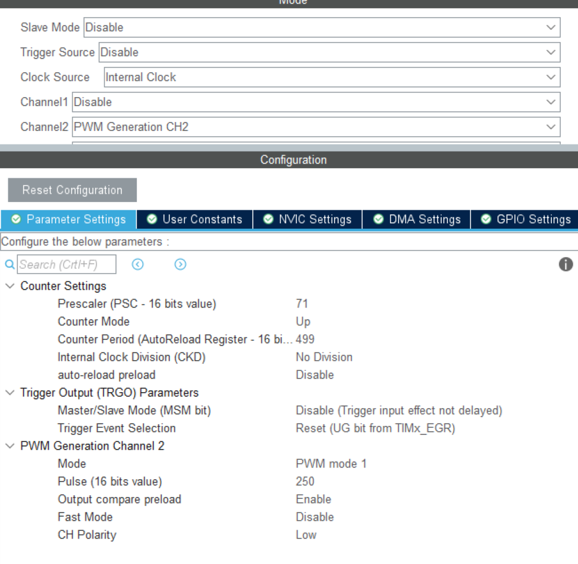

# 从0开始的STM32学习之旅之定时器2：通用定时器

​	我们下面来学习一下通用定时器这个东西。通用定时器比基本定时器功能还要再多一些


​	这我想体现出来的STM32的通用定时器的复杂性

## 时钟源

​	这是（1）的部分，通用定时器时钟可以选择下面四类时钟源之一： 

- 内部时钟(CK_INT) 
- 外部时钟模式 1：外部输入引脚(TIx)，x=1，2（即只能来自于通道 1 或者通道2） 
- 外部时钟模式 2：外部触发输入(ETR) 
- 内部触发输入(ITRx)：使用一个定时器作为另一定时器的预分频器 

​	说了有啥，下面说说怎么设置：

| 时钟类型                         | 设置方法                         | 寄存器/位设置                                |
| -------------------------------- | -------------------------------- | -------------------------------------------- |
| 内部时钟（CK_INT）               | 设置TIMx_SMCR寄存器的SMS位为0000 | `TIMx_SMCR.SMS = 0000`                       |
| 外部时钟模式1（外部输入引脚TIx） | 设置TIMx_SMCR寄存器的SMS位为1111 | `TIMx_SMCR.SMS = 1111`                       |
| 外部时钟模式2（外部触发输入ETR） | 设置TIMx_SMCR寄存器的ECE位为1    | `TIMx_SMCR.ECE = 1`                          |
| 内部触发输入（ITRx）             | 设置为指定的触发源               | 按照手册中的要求配置定时器触发源及相关寄存器 |

### 内部时钟（CK_INT） 

​	STM32F1 系列的定时器 TIM2/TIM3/TIM4/TIM5/ TIM6/TIM7 都是挂载在APB1 总线上，这些定时器的内部时钟(CK_INT)实际上来自于APB1 总线提供的时钟。但是这些定时器时钟不是由 APB1 总线直接提供，而是要先经过一个倍频器。在 HAL 库版本例程源码的 sys.c 文件中，系统时钟初始化函数 sys_stm32_clock_init 已经设置 APB1 总线时钟频率为 36MHz，APB1预分频器的预分频系数为 2，所以这些定时器时钟源频率为 72MHz。因为当 APB1 预分频器的预分频系数≥2 分频时，挂载在 APB1 总线上的定时器时钟频率是该总线时钟频率的两倍。这个和基本定时器一样

### 外部时钟模式 1（TI1、TI2） 

​	外部时钟模式 1 这类时钟源，**顾名思义时钟信号来自芯片外部**。时钟源进入定时器的流程如下：外部时钟源信号→IO→TIMx_CH1（或者TIMx_CH2），这里需要注意的是：外部时钟模式 1 下，时钟源信号只能从 CH1 或者 CH2 输入到定时器，CH3 和 CH4 都是不可以的。从 IO到 TIMx_CH1（或者 TIMx_CH2），就需要我们配置 IO 的复用功能，才能使IO 和定时器通道相连通。 
​	时钟源信号来到定时器 CH1 或 CH2 后，需要经过什么“关卡”才能到达计数器作为计数的时钟频率的，这个事情看图说话：


​	首先，**TI2信号**经过一个滤波器，滤波方式由 `ICF[3:0]` 位设置。你可以选择启用或禁用滤波器，以确保信号的质量。如果启用了滤波器，它将对输入信号进行处理，过滤掉高频噪声。

​	接着，信号进入**边沿检测器**，此时通过 `CC2P` 位来选择检测的边沿。你可以设置为上升沿或下降沿触发，这取决于应用需求。

​	然后，信号通过**触发输入选择器**，由 `TS[4:0]` 位来选择触发输入信号（TRGI）的来源。在这一步，定时器提供了多个触发输入信号，图中框出了 `TI1F_ED`、`TI1FP1` 和 `TI2FP2` 三个触发输入信号。以 **CH2** 为例，信号会选择 `TI2FP2`，这是来自 CH2 且经过边沿检测器处理后的信号。如果是 **CH1**，则可以选择 `TI1F_ED`（未经边沿检测器处理的双边沿信号）或 `TI1FP1`（经过边沿检测器后的信号）。

​	最后，信号经过**从模式选择器**，由 `ECE` 位和 `SMS[2:0]` 位来选择定时器的时钟源。以外部时钟模式 1 为例，`ECE` 位应为 0，`SMS[2:0]` 位设置为 `111`。经过预分频器的分频后，信号将最终进入计数器进行计数。

### 外部时钟模式2

​	对于**外部时钟模式 2**，时钟信号来自外部设备，输入过程略有不同：外部时钟源信号通过 IO 引脚进入定时器的 `TIMx_ETR` 引脚。在这一过程中，需要配置相应的 IO 引脚的复用功能，使 IO 引脚与定时器相连通，确保信号能够正确传输到定时器。


接着经过外部触发极性选择器，由 ETP 位来设置上升沿有效还是下降沿有效，选择下降沿有效的话，信号会经过反相器。 

然后经过外部触发预分频器，由 ETPS[1:0]位来设置预分频系数，系数范围：1、2、4、8。紧接着经过滤波器器，由 ETF[3:0]位来设置滤波方式，也可以设置不使用滤波器。fDTS 由TIMx_CR1 寄存器的 CKD 位设置。 

最后经过从模式选择器，由 ECE 位和 SMS[2:0]位来选择定时器的时钟源。这里我们介绍的是外部时钟模式 2，直接把 ECE 位置 1 即可。CK_PSC 需要经过定时器的预分频器分频后，最终就能到达计数器进行计数了。

### 内部触发输入


## 控制器 

​	这是我们的第二个部分。控制器包括：从模式控制器、编码器接口和触发控制器（TRGO）。从模式控制器可以控制计数器复位、启动、递增/递减、计数。编码器接口针对编码器计数。触发控制器用来提供触发信号给别的外设，比如为其它定时器提供时钟或者为DAC/ADC 的触发转换提供信号。 

## 时基单元 

​	时基单元包括：计数器寄存器(TIMx_CNT)、预分频器寄存器(TIMx_PSC)、自动重载寄存器(TIMx_ARR)。这部分内容和基本定时器基本一样的，大家可以参考基本定时器的介绍。 

​	不同点是：通用定时器的计数模式有三种：递增计数模式、递减计数模式和中心对齐模式；TIM2 和TIM5 的计数器是 32 位的。递增计数模式在讲解基本定时器的时候已经讲过了，那么对应到递减计数模式就很好理解了。就是来了一个计数脉冲，计数器就减 1，直到计数器寄存器的值减到 0，减到 0 时定时器溢出，由于是递减计数，故而称为定时器下溢，定时器溢出就会伴随着更新事件的发生。然后计数器又从自动重载寄存器影子寄存器的值开始继续递减计数，如此循环。

​	最后是中心对齐模式，字面上不太好理解。该模式下，计数器先从 0 开始递增计数，直到计数器的值等于自动重载寄存器影子寄存器的值减 1 时，定时器上溢，同时生成更新事件，然后从自动重载寄存器影子寄存器的值开始递减计算，直到计数值等于 1 时，定时器下溢，同时生成更新事件，然后又从 0 开始递增计数，依此循环。每次定时器上溢或下溢都会生成更新事件。计数器的计数模式的设置请参考TIMx_CR1 寄存器的位 CMS 和位DIR。 


横轴表示时间，ARR 表示自动重载寄存器的值，小红点就是更新事件发生的时间点。举个例子，递增计数模式下，当计数值等于ARR 时，计数器的值被复位为 0，定时器溢出，并伴随着更新事件的发生，后面继续递增计数。递减计数模式和中
心对齐模式

## 输入捕获 

​	第④部分是输入捕获。TIMx_CH1~ TIMx_CH4 表示定时器的 4 个通道，这 4 个通道都是可以独立工作的。IO 端口通过复用功能与这些通道相连。配置好 IO 端口的复用功能后，将需要测量的信号输入到相应的IO 端口，输入捕获部分可以对输入的信号的上升沿，下降沿或者双边沿进行捕获，常见的测量有：测量输入信号的脉冲宽度、测量 PWM 输入信号的频率和占空比等。后续有相应的实验。
​	下面简单说一下测量高电平脉冲宽度的工作原理，方便大家的理解：一般先要设置输入捕获的边沿检测极性，如：我们设置上升沿检测，那么当检测到上升沿时，定时器会把计数器 CNT的值锁存到相应的捕获/比较寄存器 TIMx_CCRy 里，y=1~4。然后我们再设置边沿检测为下降沿检测，当检测到下降沿时，定时器会把计数器 CNT 的值再次锁存到相应的捕获/比较寄存器TIMx_CCRy 里。最后，我们将前后两次锁存的 CNT 的值相减，就可以算出高电平脉冲期间内计数器的计数个数，再根据定时器的计数频率就可以计算出这个高电平脉冲的时间。如果要测量的高电平脉宽时间长度超过定时器的溢出时间期，就会发生溢出，这时候我们还需要做定时器溢出的额外处理。低电平脉冲捕获同理。 


待测量信号到达 TIMx_CH1 后，那么这里我们把这个待测量信号用 TI1 表示，原因在讲解外部时钟模式 1 的时候说过，所谓“入乡随俗”。 TI1 首先经过一个滤波器，由 ICF[3:0]位来设置滤波方式，也可以设置不使用滤波器。fDTS由 TIMx_CR1 寄存器的 CKD 位设置。 接着经过边沿检测器，由 CC1P 位来设置检测的边沿，可以上升沿或者下降沿检测。CC1NP是配置互补通道的边沿检测的，在高级定时器才有，通用定时器没有。 然后经过输入捕获映射选择器，由 CC1S[1:0]位来选择把 IC1 映射到 TI1、TI2 还是 TRC。这里我们的待测量信号从通道1 进来，所以选择IC1 映射到TI1 上即可。 紧接着经过输入捕获 1 预分频器，由 ICPS[1:0]位来设置预分频系数，范围：1、2、4、8。最后需要把 CC1E 位置 1，使能输入捕获，IC1PS 就是分频后的捕获信号。这个信号将会到达第⑤部分。 


## 输出比较


​	灰色阴影部分是输入捕获功能部分，前面已经讲过。这里我们看到右边没有阴影部分就是输出比较功能部分了。
​	首先程序员写 CCR1 寄存器，即写入比较值。这个比较值需要转移到对应的捕获/比较影子寄存器后才会真正生效。什么条件下才能转移？可以看到 compare_transfer 旁边的与门，需要满足三个条件：CCR1 不在写入操作期间、CC1S[1:0] = 0 配置为输出、OC1PE 位置0（或者 OC1PE 位置 1，并且需要发生更新事件，这个更新事件可以软件产生或者硬件产生）。当 CCR1 寄存器的值转移到其影子寄存器后，新的值就会和计数器的值进行比较，它们的比较结果将会通过第⑥部分影响定时器的输出


## PWM玩玩呼吸灯

​	我们下面来玩玩PWM呼吸灯。这个事情很简单。跟着我的步伐开始搞。

​	首先，你需要确保你的观察的LED等已经是初始化了的（有人忘记初始化LED导致灯死活不亮）。笔者选择TIM3的Channal 2，这是因为可以很方便的摆烂：


​	我的开发板上因为LED0是接在了PB5上，意味着我直接梭哈复用就完事了。PWM会推送到我的PB5，我只需要把时钟开起来就行。

​	笔者是正点原子家的STM32F103ZET6开发板，他把LED0接到了PB5上，所以：


​	需要开启的是我们的TIM3的Channal2，这是笔者设置的表：



​	可以照抄一份，下面给出一些参数说明设置。

- pwm1：向上计数时，一旦TIMx_CNT<TIMx_CCR1时通道1为有效电平，否则为无效电平；在向下计数时，一旦TIMx_CNT>TIMx_CCR1时通道1为无效电平(OC1REF=0)，否则为有效电平(OC1REF=1)。
- pwm2：在向上计数时，一旦TIMx_CNT<TIMx_CCR1时通道1为无效电平，否则为有效电平；在向下计数时，一旦TIMx_CNT>TIMx_CCR1时通道1为有效电平，否则为无效电平。


​	这个Palse就是我们的占空比调整，其实在这你可以粗略的理解为LED灯的亮度。这里的Polarity是极性，LED是PWD低电平有效。

## 生成的HAL代码解读

```
static void MX_TIM3_Init(void)
{
  // 定义用于定时器配置的结构体
  TIM_ClockConfigTypeDef sClockSourceConfig = {0};  // 时钟源配置
  TIM_MasterConfigTypeDef sMasterConfig = {0};      // 主从模式配置
  TIM_OC_InitTypeDef sConfigOC = {0};               // 输出比较配置（PWM配置）

  /* USER CODE BEGIN TIM3_Init 1 */
  // 用户可以在此处添加自定义的初始化代码
  /* USER CODE END TIM3_Init 1 */

  // 设置定时器3的基本参数
  htim3.Instance = TIM3;                            // 选择定时器3作为定时器实例
  htim3.Init.Prescaler = 71;                        // 设置预分频器为71，即定时器输入时钟为系统时钟除以72
  htim3.Init.CounterMode = TIM_COUNTERMODE_UP;      // 设置计数模式为向上计数
  htim3.Init.Period = 499;                          // 设置计数周期为499，定时器的计数范围是 0~499
  htim3.Init.ClockDivision = TIM_CLOCKDIVISION_DIV1; // 设置时钟分频系数为1（不进行分频）
  htim3.Init.AutoReloadPreload = TIM_AUTORELOAD_PRELOAD_DISABLE; // 禁用自动重载寄存器预装载

  // 初始化定时器3基础功能
  if (HAL_TIM_Base_Init(&htim3) != HAL_OK)  // 调用HAL库初始化定时器
  {
    Error_Handler();  // 如果初始化失败，进入错误处理函数
  }

  // 配置定时器时钟源
  sClockSourceConfig.ClockSource = TIM_CLOCKSOURCE_INTERNAL;  // 设置时钟源为内部时钟
  if (HAL_TIM_ConfigClockSource(&htim3, &sClockSourceConfig) != HAL_OK)
  {
    Error_Handler();  // 如果时钟源配置失败，进入错误处理函数
  }

  // 初始化PWM模式
  if (HAL_TIM_PWM_Init(&htim3) != HAL_OK)  // 调用HAL库初始化PWM模式
  {
    Error_Handler();  // 如果PWM初始化失败，进入错误处理函数
  }

  // 配置主从模式及触发输出
  sMasterConfig.MasterOutputTrigger = TIM_TRGO_RESET;  // 设置主输出触发为复位
  sMasterConfig.MasterSlaveMode = TIM_MASTERSLAVEMODE_DISABLE;  // 禁用主从模式
  if (HAL_TIMEx_MasterConfigSynchronization(&htim3, &sMasterConfig) != HAL_OK)
  {
    Error_Handler();  // 如果同步配置失败，进入错误处理函数
  }

  // 配置输出比较通道以生成PWM信号
  sConfigOC.OCMode = TIM_OCMODE_PWM1;   // 设置输出比较模式为PWM模式1
  sConfigOC.Pulse = 250;                 // 设置PWM信号的占空比，250/500 = 50%
  sConfigOC.OCPolarity = TIM_OCPOLARITY_LOW;  // 设置输出极性为低，即低电平有效
  sConfigOC.OCFastMode = TIM_OCFAST_DISABLE; // 禁用输出比较的快速模式

  // 配置定时器3的PWM通道2
  if (HAL_TIM_PWM_ConfigChannel(&htim3, &sConfigOC, TIM_CHANNEL_2) != HAL_OK)
  {
    Error_Handler();  // 如果PWM通道配置失败，进入错误处理函数
  }

  // 初始化定时器3的硬件资源（GPIO配置等）
  HAL_TIM_MspPostInit(&htim3);  // 调用HAL库函数初始化与定时器3相关的硬件资源
}
```

​	来看看主干代码

```
int main(void)
{
  /* USER CODE BEGIN 1 */

  /* USER CODE END 1 */

  /* MCU Configuration--------------------------------------------------------*/

  /* Reset of all peripherals, Initializes the Flash interface and the Systick. */
  HAL_Init();

  /* USER CODE BEGIN Init */

  /* USER CODE END Init */

  /* Configure the system clock */
  SystemClock_Config();

  /* USER CODE BEGIN SysInit */

  /* USER CODE END SysInit */

  /* Initialize all configured peripherals */
  MX_GPIO_Init();
  MX_TIM3_Init();
  /* USER CODE BEGIN 2 */
  uint16_t pwmVal=0;  
  HAL_TIM_PWM_Start(&htim3, TIM_CHANNEL_2);
  /* USER CODE END 2 */

  /* Infinite loop */
  /* USER CODE BEGIN WHILE */
  while (1)
  {
    /* USER CODE END WHILE */

    /* USER CODE BEGIN 3 */

	  while (pwmVal< 500)
	  {
		  pwmVal++;
		  __HAL_TIM_SetCompare(&htim3, TIM_CHANNEL_2, pwmVal);  
		  HAL_Delay(1);
	  }
	  while (pwmVal)
	  {
		  pwmVal--;
		  __HAL_TIM_SetCompare(&htim3, TIM_CHANNEL_2, pwmVal);    
		  HAL_Delay(1);
	  }
	  HAL_Delay(200);

  }
  /* USER CODE END 3 */
}
```

