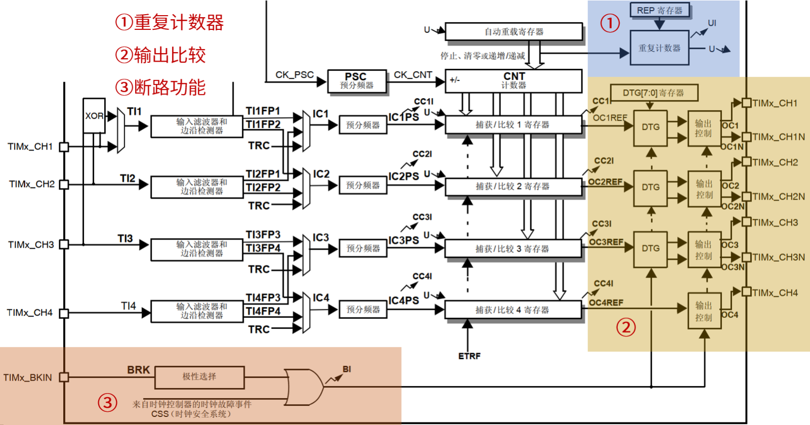
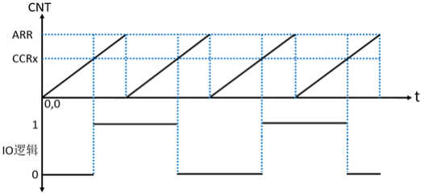
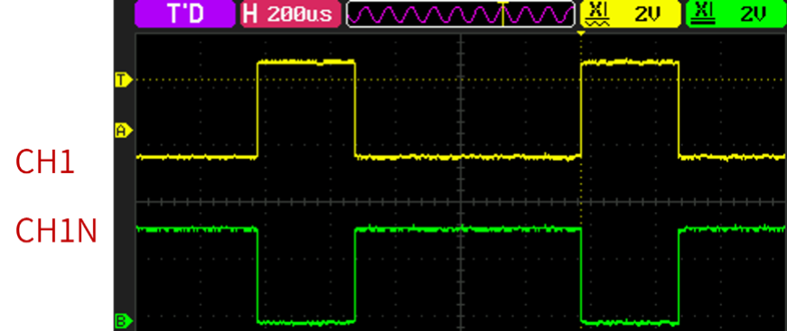
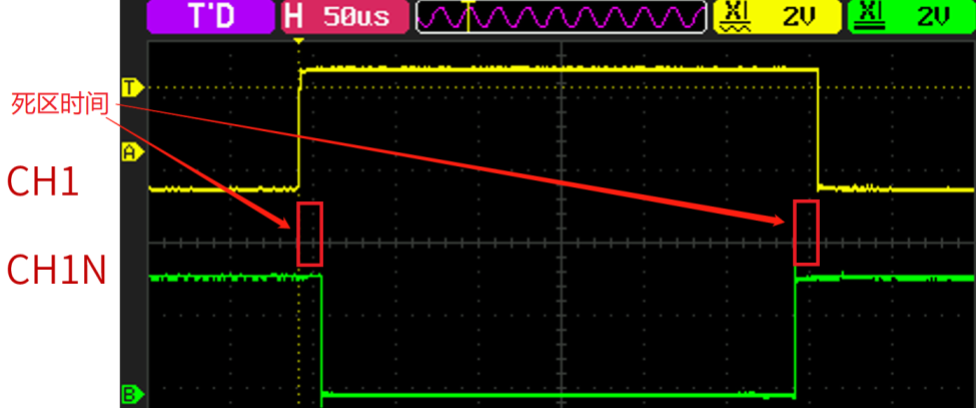
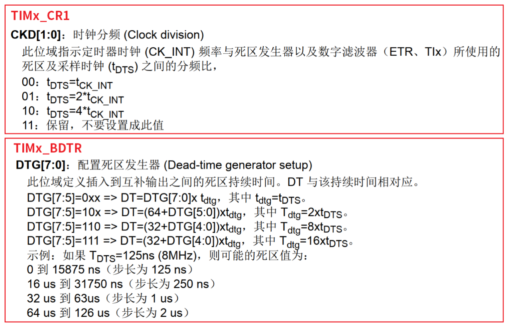
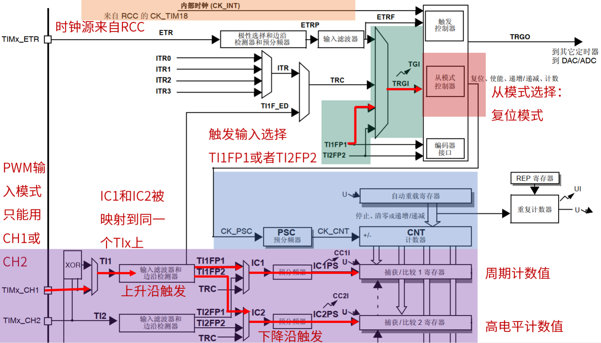

# 从0开始的STM32学习之旅之定时器3：高级定时器

​	高级定时器的框图和通用定时器框图很类似，只是添加了其它的一些功能，如：重复计数
器、带死区控制的互补输出通道、断路输入等。

​	可以认为高级定时器是对通用定时器的一次扩展。下面来看看不同之处：

### 重复计数器 

​	在 F1 系列中，高级定时器TIM1 和 TIM8 都有重复计数器。下面来介绍一下重复计数器有什么作用？在学习基本定时器和通用定时器的时候，我们知道定时器发生上溢或者下溢时，会直接生成更新事件。但是有重复计数器的定时器并不完全是这样的，定时器每次发生上溢或下溢时，重复计数器的值会减一，当重复计数器的值为 0 时，再发生一次上溢或者下溢才会生成定时器更新事件。如果我们设置重复计数器寄存器 RCR 的值为N，那么更新事件将在定时器发生 N+1 次上溢或下溢时发生。 
​	这里需要注意的是重复计数器寄存器是具有影子寄存器的，所以 RCR 寄存器只是起缓冲的作用。RCR 寄存器的值会在更新事件发生时，被转移至其影子寄存器中，从而真正生效。 重复计数器的特性，在控制生成 PWM 信号时很有用，后面会有相应的实验。 

### 输出比较

高级定时器输出比较部分和通用定时器相比，多了带死区控制的互补输出功能。TIMx_CH1N、TIMx_CH2N 和 TIMx_CH3N 分别是定时器通道 1、通道 2 和通道 3的互补输出通道，通道 4 是没有互补输出通道的。DTG 是死区发生器，死区时间由 DTG[7:0]位来配置。如果不使用互补通道和死区时间控制，那么高级定时器 TIM1 和 TIM8 和通用定时器的输出比较部分使用方法基本一样，只是要注意MOE 位得置 1 定时器才能输出。 如果使用互补通道，那么就有一定的区别了。 

### 断路功能 

​	断路功能也称刹车功能，一般用于电机控制的刹车。F1 系列有一个断路通道，断路源可以是刹车输入引脚（TIMx_BKIN），也可以是一个时钟失败事件。时钟失败事件由复位时钟控制器中的时钟安全系统产生。系统复位后，断路功能默认被禁止，MOE 位为低。 使能断路功能的方法：将 TIMx_BDTR 的位 BKE 置 1。断路输入引脚 TIMx_BKIN 的输入有效电平可通过 TIMx_BDTR 寄存器的位 BKP 设置。 使能刹车功能后：由TIMx_BDTR 的 MOE、OSSI、OSSR 位，TIMx_CR2 的OISx、OISxN位，TIMx_CCER 的CCxE、CCxNE 位控制 OCx 和 OCxN 输出状态。无论何时，OCx 和OCxN输出都不能同时处在有效电平。 当发生断路输入后，会怎么样？ 

- MOE 位被异步地清零，OCx 和 OCxN 为无效、空闲或复位状态(由OSSI 位选择)。 
- OCx 和 OCxN 的状态：由相关控制位状态决定，当使用互补输出时：根据情况自动控制输出电平。
- BIF 位置 1，如果使能了 BIE 位，还会产生刹车中断；如果使能了 TDE 位，会产生DMA请求。 
- 如果AOE 位置 1，在下一个 更新事件UEV 时，MOE 位被自动置 1。 高级定时器框图部分就简单介绍到这里，下面通过实际的实验来学习高级定时器。 

## 输出比较模式

​	输出比较模式下翻转功能作用是：当计数器的值等于捕获/比较寄存器影子寄存器的值时，OC1REF 发生翻转，进而控制通道输出（OCx）翻转。通过翻转功能实现输出 PWM 的具体原理如下：PWM 频率由自动重载寄存器（TIMx_ARR）的值决定，在这个过程中，只要自动重载寄存器的值不变，那么PWM 占空比就固定为50%。我们可以通过捕获/比较寄存器（TIMx_CCRx）的值改变 PWM 的相位。

## 互补输出带死区控制

​	上图中，CH1 输出黄色的 PWM，它的互补通道 CH1N 输出绿色的 PWM。通过对比，可以知道这两个 PWM 刚好是反过来的，CH1 的PWM 为高电平期间，CH1N 的 PWM 则是低电平，反之亦然，这就是互补输出。

​	上图中，CH1 输出的 PWM 和CH1N 输出的 PWM 在高低电平转换间，插入了一段时间才实现互补输出。这段时间称为死区时间，可以通过DTG[7:0]位配置控制死区时间的长度，后面会详细讲解如何配置死区时间。上图中，箭头指出的两段死区时间的长度是一样的，因为都是由同一个死区发生器产生。

### 死区时间计算 

​	下面来看一下定时器的死区时间是怎么计算并设置的？死区时间是由TIMx_CR1 寄存器的CKD[1:0]位和 TIMx_BDTR 寄存器的 DTG[7:0]位来设置

死区时间计算分三步走： 
第一步：通过 CKD[1:0]位确定 tDTS。根据 CKD[1:0]位的描述，可以得到下面的式子： 
$$
tDTS = 2^{𝐶𝐾𝐷[1: 0]}/Tclk
$$
其中： 

- CKD[1:0]：CKD[1:0]位设置的值。 
- Tclk：定时器的时钟源频率（单位为 MHz）。 

##  PWM 输入模式

1. 第一，确定定时器时钟源。本实验中我们使用内部时钟（CK_INT），F1 系列高级定时器挂载在 APB2 总线上，按照 sys_stm32_clock_init 函数的配置，定时器时钟频率等于APB2 总线时钟频率，即 72MHz。计数器的计数频率确定了测量的精度。 
2. 第二，确定 PWM 输入的通道。PWM 输入模式下测量 PWM，PWM 信号输入只能从通道1（CH1）或者通道 2（CH2）输入。 
3. 第三，确定 IC1 和IC2 的捕获边沿。这里以通道 1（CH1）输入 PWM 为例，一般我们习惯设置 IC1 捕获边沿为上升沿捕获，IC2 捕获边沿为下降沿捕获。 
4. 第四，选择触发输入信号（TRGI）。这里也是以通道1（CH1）输入PWM 为例，那么我们就应该选择TI1FP1 为触发输入信号。如果是通道 2（CH2）输入 PWM，那就选择TI2FP2 为触发输入信号。可以看到这里并没有对应通道 3（CH3）或者通道4（CH4）的触发输入信号，所以我们只选择通道 1 或者通道2 作为 PWM 输入的通道。 
5. 第五，从模式选择：复位模式。复位模式的作用是：在出现所选触发输入 (TRGI) 上升沿时，重新初始化计数器并生成一个寄存器更新事件。 
6. 第六，读取一个 PWM 周期内计数器的计数个数，以及高电平期间的计数个数，再结合计数器的计数周期（即计一个数的时间），最终通过计算得到输入的 PWM 周期和占空比等参数。以通道 1（CH1）输入 PWM，设置IC1 捕获边沿为上升沿捕获，IC2 捕获边沿为下降沿捕获为例，那么 CCR1 寄存器的值+1 就是 PWM 周期内计数器的计数个数，CCR2 寄存器的值+1 就是PWM 高电平期间计数器的计数个数。通过这两个值就可以计算出 PWM 的周期或者占空比等参数。 
