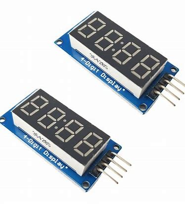

# 从0开始的STM32开发之旅——TM1637数码管

## 前言

​	在知识内容上，他算是软件IIC模拟的一个例子，所以实际上也算是使用GPIO来驱动外设的demo。但是这里打算为后面的驱动协议篇打下一个比较好的开始。所以笔者在这里打算写一篇使用GPIO来模拟驱动协议的博客笔记。

​	当然，程序中出现的结构体是笔者自己的封装代码。如果您成功跑通了示例驱动了数码管，但是想要让原先的程序不要那么史山，可以查看本教程随之进行封装。

​	笔者给的示例代码是跑在STM32C8T6上，只需要将时钟设置为72MHZ即可，然后使用的是CubeMX生成自动代码+PlatformIO完成的工程创建和书写。具体的demo在：https://github.com/Charliechen114514/MCU_Libs/tree/main/TM1637


## 数码管介绍

​	嗯，笔者第一次对数码管有认知是在数码管时钟的地方。你看到的这个


​	这就是一个典型的数码管闹钟。可以看到这里的数码管是4位的。我们下面需要为之写驱动的TM1637也是四位的数码管。

## 一般数码管的显示原理

​	为了节约端口，数码管的每个LED的两端分别连接电极，其中一个电极与对应的数码管引脚相连，另一个电极连接到公共端（共阳或共阴）。数码管有两种常见的连接方式：

- **共阳数码管**：所有的LED的阳极（正极）连接在一起，控制信号通过控制各个LED的阴极（负极）来选择显示的内容。
- **共阴数码管**：所有的LED的阴极（负极）连接在一起，控制信号通过控制各个LED的阳极（正极）来选择显示的内容。


​	我们的TIM1637使用的都是**共阴极数码**，这点是需要我们注意的。

​	想要让我们的数码管显示数字，就需要驱动对应的管子亮起来。比如说，如果我们想要点亮管子显示0，那么，我们就需要让a~f的管子亮起来，也就是abcdef。使用进制表达就是0x3F（gfedcba = 0111 1111）。如果是共阳管，只需要取反即可（0xC0)

​	我们当然可以这样继续列写得到一个表：

| 显示的数字 | 点亮的LED | 十六进制 (共阳极) | 十六进制 (共阴极) |
| ---------- | --------- | ----------------- | ----------------- |
| 0          | abcdef    | 0xC0              | 0x3F              |
| 1          | bc        | 0xF9              | 0x06              |
| 2          | abdeg     | 0xA4              | 0x5B              |
| 3          | abcdg     | 0xb0              | 0x4F              |
| 4          | bcfg      | 0x99              | 0x66              |
| 5          | acdfg     | 0x92              | 0x6D              |
| 6          | acdefg    | 0x82              | 0x7D              |
| 7          | abc       | 0xF8              | 0x07              |
| 8          | abcdefg   | 0x80              | 0x7F              |
| 9          | abcdfg    | 0x90              | 0x6F              |
| A          | abcefg    | 0x88              | 0x77              |
| B          | cdefg     | 0x83              | 0x7C              |
| C          | adef      | 0xC6              | 0x39              |
| D          | bcdeg     | 0xA1              | 0x5E              |
| E          | adefg     | 0x86              | 0x79              |
| F          | aefg      | 0x8E              | 0x71              |

​	笔者后面的驱动中会给出更多的字符。先不要着急。

## 编写驱动第一步——观察我们的TM1637

​	TM1637是这样的一个四位数码管，如果您在淘宝或者其他电子器件购买的话，看到的器件是长这样的：



​	一共四个管脚，VCC, GND，CLK和DIO。在板子的背面上可以从丝印上读取到这些信息。我们查阅TM1637的手册。可以看到这样的一段话：

> 微处理器的数据通过两线总线接口和 TM1637 通信，**在输入数据时当 CLK 是高电平时，DIO 上的信号必须保持不变；只有 CLK 上的时钟信号为低电平时，DIO 上的信号才能改变**。**数据输入的开始条件是 CLK为高电平时，DIO 由高变低**；结束条件是 CLK 为高时，DIO 由低电平变为高电平。 TM1637 的数据传输带有应答信号 ACK，当传输数据正确时，会在第八个时钟的下降沿，**芯片内部会产生一个应答信号 ACK 将 DIO 管脚拉低，在第九个时钟结束之后释放 DIO 口线。** 

​	TMD，熟悉IIC的人都会知道这个就是类似于IIC的玩意，但是又跟IIC有所不同，所以只能自己写软件模拟上面的协议。这是因为：

1. 该总线传输位的顺序与iic相反
2. 该设备独占该总线（没有设备地址可言）

​	所以，我们封装这样的结构体作为我们操作的handle

```
typedef struct {
    /* CLK(SCK) */
    CCGPIO*  CLK;
    CCGPIO*  DIO;
}CCTIM1637_Handle;
```

​	其中CCGPIO是笔者之前封装过的GPIO驱动库。[STM32 从0开始系统学习4 编写LED驱动_specifies the pull-up or pull-down activation for -CSDN博客](https://blog.csdn.net/charlie114514191/article/details/143318243)。这里不做赘述。后面的代码会放出来。

​	这下看懂了，所以，我们要做的就是手搓协议了。

## 编写驱动第二步——查看如何发起通信

​	

​	我们就是采用如上的办法自动的传递我们写入的数据。流程就是：发起通信，等待应答，结束通信。

​	第一步就是发起一次通信：

```
static void TIM1637_IIC_Start(CCGPIO* CLK, CCGPIO* DIO)
{
    __fast_set_dio_gpio_out(DIO);
    setGPIOOn(CLK);
    setGPIOOn(DIO);
    delay_us(2);
    setGPIOOff(DIO);
}
```

​	首先就是复原时钟线和数据线，为DIO被拉低做准备。因此，需要设置GPIO的模式是：

```
// 0011输出模式   1000上下拉输入模式
static void inline __fast_set_dio_gpio_out(CCGPIO* DIO){
    DIO->letter_case->CRL &= 0X0FFFFFFF;	    # 清空原先的GPIO模式
    DIO->letter_case->CRL |= (uint32_t)3<<28;	# 设置为输入
}
```

​	这就是快速的调整我们的GPIO的输出输入模式从而加快通信的速度，毕竟使用HAL库做一大堆设置然后commit我们的settings还是有点抽象。

​	现在我们等待2us，就可以拉低我们的DIO的线了。这个是手册的示例得知的。


​	应答部分如下：（吐槽，手册的是想写ACK写成了ASK了）


```
static void TIM1637_IIC_ACK(CCGPIO* CLK, CCGPIO* DIO)	// 看我们的TM1637活没活，实际上这里去除了应答检测部分，因为很多人测试标识实际上没有做应答。所以这里笔者直接去掉了，或者进一步提升效率甚至可以不理会应答部分！
{
    __fast_set_dio_gpio_in(DIO);
    setGPIOOff(CLK);
    delay_us(5);
    // while(gainGPIOState(DIO));
    setGPIOOn(CLK);
    delay_us(2);
    setGPIOOff(CLK);
}
```

​	停止通信，也是如法炮制。


```
static void TIM1637_IIC_Stop(CCGPIO* CLK, CCGPIO* DIO)
{
    __fast_set_dio_gpio_out(DIO);
    setGPIOOff(CLK);
    delay_us(2);
    setGPIOOff(DIO);
    delay_us(2);
    setGPIOOn(CLK);
    delay_us(2);
    setGPIOOn(DIO);
}
```

​	有趣的是这些参数delay的秒数不是看手册而是看示例。总而言之，应该能跑。

## 第三步——封装协议层

​	现在我们就可以封装协议层了。按照手册，我们一次是发送一个byte。那么，就要请出我们常见的writebyte方法了：


```
static void TIM1637_writeByte(CCGPIO* DIO, CCGPIO* CLK, uint8_t byte)
{
	// 调用此函数需要通信已经开始 
    __fast_set_dio_gpio_out(DIO);
    for(uint8_t i = 0; i < 8; i++){
        setGPIOOff(CLK);			// 拉低CLK
        // 结合手册，只有拉低CLK的时候才允许读写
        setGPIOState(DIO, (byte & 0x01 ? ON : OFF));
        delay_us(3);
        byte >>= 1;
        setGPIOOn(CLK);				// 拉高CLK
        delay_us(3);
    }
}
```

​	笔者的writeByte函数比较干练。实际上就是依次的移位将低字节的比特送到寄存器中写出去给TM1637。可以查看笔者给出的时序图来搞明白为什么上下电平等。

​	现在我们就可以传送比特了。比如说我想要显示一个数字：

> 1. 发起通信TIM1637_IIC_Start
>
> 2. 写数据到显示寄存器 40H 地址自动加1 模式，也就是说让我们设置成只管卡卡写就行的模式（也就是送入0x40这个比特）TIM1637_writeByte
>
> 3. 等待应答TIM1637_IIC_ACK
>
> 4. 结束通信TIM1637_IIC_Stop
>
> 5. 再次发起通信TIM1637_IIC_Start
>
> 6. 告知地址命令设置 显示地址 00H，也就是送入比特0xC0（1100 0000）TIM1637_writeByte
>
>    
>
> 7. 等待应答TIM1637_IIC_ACK
>
> 8. 结束通信TIM1637_IIC_Stop
>
> 9. 发起通信准备写入显示数据TIM1637_IIC_Start
>
> 10. 写入对应目标的魔数显示码后（TIM1637_writeByte）等待应答，完成应答后（TIM1637_IIC_ACK）继续写入数据。直到写完为止
>
> 11. 结束通信TIM1637_IIC_Stop

​	所以，程序看起来就是这个样子的：

```
/*
	handle是上面封装的结构体指针
	arr是显示arr的
*/
void commit_display_auto_upgrade(CCTIM1637_Handle* handle, const DisplayArray arr)
{
    TIM1637_IIC_Start(handle->CLK, handle->DIO);
    TIM1637_writeByte(handle->DIO, handle->CLK, 0x40);
    TIM1637_IIC_ACK(handle->CLK, handle->DIO);
    TIM1637_IIC_Stop(handle->CLK, handle->DIO);

    TIM1637_IIC_Start(handle->CLK, handle->DIO);
    TIM1637_writeByte(handle->DIO, handle->CLK, 0xC0);
    TIM1637_IIC_ACK(handle->CLK, handle->DIO);

    for(uint8_t i = 0; i < SUPPORT_DISP_N; i++){	// 这里是6位（看手册），所以写入6
        TIM1637_writeByte(handle->DIO, handle->CLK, arr[i]);
        TIM1637_IIC_ACK(handle->CLK, handle->DIO);
    }

    TIM1637_IIC_Stop(handle->CLK, handle->DIO);
}
```


​	到这里，我们的基本的操作就已经完成了。

### bonus：亮度设置

​	手册里给出了亮度设置的表格：


​	可以看到，我们可以这样设置我们的亮度：

```
void    set_TIM1637_Brightness(CCTIM1637_Handle* handle, uint8_t level)
{
    TIM1637_IIC_Start(handle->CLK, handle->DIO);
    // 高八位总是1000 第八位中的第一位是开，后面就是0~7级别的level，置位法秒了
    TIM1637_writeByte(handle->DIO, handle->CLK,  0x88 | level );
    TIM1637_IIC_ACK(handle->CLK, handle->DIO);
    TIM1637_IIC_Stop(handle->CLK, handle->DIO);
}
```

下面就是我们的上层软件封装时间。

## 第四步：上升为业务逻辑

​	我们关心的是自己显示的数组的大小与需要的mapping映射表，我们的handle还有我们的小数点的问题。查看示例就会发现他是这样处理我们的小数点的：就是直接对着我们的第二位与上我们的0x80。这里给出可移植的代码：

```
#pragma once

/*
    This file is gonna support the Params of TIM1637
*/

/*
    TIM1637 Support Display 6 bits, the array size shell be used
    Support settings in building :)
*/
#ifndef __SUPPORT_DISP_N
#define SUPPORT_DISP_N  (6) 
#else
#define SUPPORT_DISP_N  __SUPPORT_DISP_N
#endif

/*
	COLON的下标附属，这里就是对第一位下标直接上 | 操作
*/
#ifndef __COLON_INDEX_N
#define COLON_INDEX_N (1)
#else
#define COLON_INDEX_N __COLON_INDEX_N
#endif

#if COLON_INDEX_N >= SUPPORT_DISP_N
#error  "Error in setting colon index! index are overflowed!"
#endif

#define COLON_DISP_MAGIC 0x80

#define SET_COLON(DISP_ARR) do{DISP_ARR[COLON_INDEX_N] |= COLON_DISP_MAGIC;}while(0)
#define OFF_COLON(DISP_ARR) do{DISP_ARR[COLON_INDEX_N] &= ~COLON_DISP_MAGIC;}while(0)

/* Minimize the includings */
typedef unsigned char uint8_t;
typedef uint8_t DisplayArray[SUPPORT_DISP_N];

/*
    Followings are struct Tables
*/
typedef struct{
    uint8_t char_;
    uint8_t disp_magic;
}TIMDisplaySrcPair;

// 这个是查询魔数，也就是说，我们给定一个1, 他能返回显示1的显示数据。
#define FAILED_SEARCH       (-1)
uint8_t search_display_one(uint8_t wanna);
```

​	实际上需要实现的部分只有search_display_one。所以：

```
#include "tim1637_params.h"

static const TIMDisplaySrcPair DisplaySources[] = {
        {0,     0x3F},
        {1,     0x06},
        {2,     0x5B},
        {3,     0x4F},
        {4,     0x66},
        {5,     0x6D},
        {6,     0x7D},
        {7,     0x07},
        {8,     0x7F},
        {9,     0x6F},
        {'0',     0x3F},
        {'1',     0x06},
        {'2',     0x5B},
        {'3',     0x4F},
        {'4',     0x66},
        {'5',     0x6D},
        {'6',     0x7D},
        {'7',     0x07},
        {'8',     0x7F},
        {'9',     0x6F},
        {'a',     0x77},
        {'b',     0x7C},
        {'c',     0x58},
        {'d',     0x5E},
        {'e',     0x79},
        {'f',     0x71},
        {'h',     0x76},
        {'l',     0x38},
        {'n',     0x54},
        {'p',     0x73},
        {'u',     0x3E},
        {'A',     0x77},
        {'B',     0x7C},
        {'C',     0x39},
        {'D',     0x5E},
        {'E',     0x79},
        {'F',     0x71},
        {'H',     0x76},
        {'L',     0x38},
        {'N',     0x54},
        {'P',     0x73},
        {'U',     0x3E},
        {' ',     0x00}
};

#define SRC_SIZE    (sizeof(DisplaySources)/sizeof(DisplaySources[0]))

uint8_t search_display_one(uint8_t wanna)
{
    for(int each_one = 0; each_one < SRC_SIZE; each_one++){
        if(wanna == DisplaySources[each_one].char_){
            return DisplaySources[each_one].disp_magic;
        }
    }
    return FAILED_SEARCH;
}
```


## 第五步：构建demo示例

​	笔者使用的是STM32C8T6跑的demo，我写的扩展库是相对架构无关的，不需要在CubeMX设置任何东西，代码里面直接开启就好。

```
void config_my_tim(CCGPIO* CLK, CCGPIO* DIO){
    createGPIO(CLK, GPIOB, GPIO_PIN_6, 'B');
    createGPIO(DIO, GPIOB, GPIO_PIN_7, 'B');
    CCGPIOConfig config;
    createGPIOConfig(&config, GPIO_SPEED_FREQ_HIGH, GPIO_NOPULL, GPIO_MODE_OUTPUT_PP);
    setGPIOConfig(CLK, &config);
    setGPIOConfig(DIO, &config);
}

void config_my_tim2(CCGPIO* CLK, CCGPIO* DIO){
    createGPIO(CLK, GPIOA, GPIO_PIN_6, 'A');
    createGPIO(DIO, GPIOA, GPIO_PIN_7, 'A');
    CCGPIOConfig config;
    createGPIOConfig(&config, GPIO_SPEED_FREQ_HIGH, GPIO_NOPULL, GPIO_MODE_OUTPUT_PP);
    setGPIOConfig(CLK, &config);
    setGPIOConfig(DIO, &config);
}

void adjust_num(uint8_t disp[]){
  // the two and third one is seconds
  disp[3]++;
  if(disp[3] >= 10){
    disp[2] += 1;
    disp[3] = 0;
  }

  if(disp[2] >= 6)
  {
    disp[1] += 1;
    disp[2] = 0;
  }

    if(disp[1] >= 10){
    disp[0] += 1;
    disp[1] = 0;
  }
}

/* USER CODE END 0 */

/**
  * @brief  The application entry point.
  * @retval int
  */
int main(void)
{
  ... // 省略自动生成的代码
  DisplayArray arr;
  CCGPIO CLK, DIO, CLK2, DIO2;
  CCTIM1637_Handle handle, handle2;
  config_my_tim(&CLK, &DIO);
  config_my_tim2(&CLK2, &DIO2);
  init_cctim1637(&handle, &CLK, &DIO);
  init_cctim1637(&handle2, &CLK2, &DIO2);
  set_TIM1637_Brightness(&handle, 7);
  set_TIM1637_Brightness(&handle2, 3);
  uint8_t shell_disp = 1;
  uint8_t disp_num[4] = {0, 0, 0, 0}; 
  while (1)
  {
    /* USER CODE END WHILE */

    /* USER CODE BEGIN 3 */
    set_display_array_at_index(disp_num[0] , arr, 0);
    set_display_array_at_index(disp_num[1], arr, 1);
    set_accuired_disp_colon(arr, shell_disp);
    set_display_array_at_index(disp_num[2], arr, 2);
    set_display_array_at_index(disp_num[3], arr, 3);
    commit_display_auto_upgrade(&handle, arr);
    commit_display_auto_upgrade(&handle2, arr);
    HAL_Delay(1000);
    shell_disp = !shell_disp;
    adjust_num(disp_num);
  }
  /* USER CODE END 3 */
}
```

效果图：


​	完整的工程示例在这里：https://github.com/Charliechen114514/MCU_Libs/tree/main/TM1637。