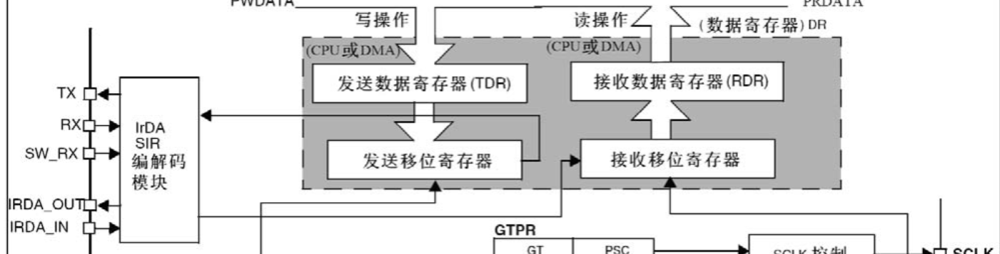

# 嵌入式MCU面试笔记2

## 串口通信

### 概论

​	我们知道，通信桥接了两个设备之间的交流。一个经典的例子就是使用串口通信交换上位机和单片机之间的数据。

​	比较常见的串口通信协议是下面这两个：

​	UART（通用异步收发传输器，Universal Asynchronous Receiver/Transmitter）：这里可以看到，这样的协议只有Asynchronous，提示你这个协议是异步的。异步通信，需要在传递数据的同时，添加起始位、停止位、校验位等进行帧同步放置进行数据裁剪和区分。

​	USART（通用同步异步收发传输器）则更进一步，支持了同步的通信方式在同步模式下，USART通过时钟信号与从设备同步数据传输，在异步模式下工作与UART相似。

### 原理

​	本质上，就是数据通过数据线移动，从一个设备传递到另一个设备。在串口通信中，这是通过移位寄存器移位实现的。移出去的位被派发到传输线上传递出去，给下一个移进来的比特腾出来位置。对于接受的设备，那就是接受到来的比特，给下一个到来的比特腾出位置。



​	仔细看，这里的移位寄存器示意图就是在移动将它发送到TX端上从数据线上流出去，另一端如果有来者，则从RX端进入接收移位寄存器进来。

### 配置

​	上面的笼统概述没有统一问题：咋个长度？咋个校验？收发速度如何？不讨论这些问题，双方无法保证数据的接受和发送是一一呼应的，极易导致数据接受和发送异常。所以就有了协议，协议约定了两者的动作。

- **波特率**，串口通信的速率，一般需要配置波特率寄存器实现。其计算公式是：$baud = \frac{clock_freq}{16 \times USART\_DIV}$

- **空闲**，一般为高电平

- **起始位**，标志一个数据帧的开始，固定为低电平。当数据开始发送时，产生一个下降沿。(空闲–>起始位)

- **数据位**，发送数据帧，1为高电平，0为低电平。低位先行。
  比如 发送数据帧0x0F 在数据帧里就是低位线性 即 1111 0000

- **校验位**，用于数据验证，根据数据位的计算得来。有奇校验，偶校验和无校验。

  奇校验（Odd Parity）：确保数据帧中1的数量为奇数。
  偶校验（Even Parity）：确保数据帧中1的数量为偶数。

- **停止位**，用于数据的间隔，固定为高电平。数据帧发送完成后，产生一个上升沿。(数据传输–>停止位)

### HAL库代码

#### 1. **初始化函数**

- **HAL_UART_Init()**

  ​	这个函数一般如果使用CubeMx配置的话就会给你写好了，它用于初始化UART外设，包括**波特率、数据位、停止位、奇偶校验和硬件流控制**。通常在程序开始时调用此函数，以配置UART通信的基本参数。

  ```
  HAL_StatusTypeDef HAL_UART_Init(UART_HandleTypeDef *huart);
  ```

  **参数说明**：

  - `huart`：指向UART句柄的指针，句柄包含了UART的所有配置参数，如波特率、数据位、停止位等。

  **返回值**：

  - `HAL_OK`：初始化成功。
  - `HAL_ERROR`：初始化失败。

  **使用示例**：

  ```
  UART_HandleTypeDef huart1;
  huart1.Instance = USART1;
  huart1.Init.BaudRate = 9600;
  huart1.Init.WordLength = UART_WORDLENGTH_8B;
  huart1.Init.StopBits = UART_STOPBITS_1;
  huart1.Init.Parity = UART_PARITY_NONE;
  huart1.Init.Mode = UART_MODE_TX_RX;
  huart1.Init.HwFlowCtl = UART_HWCONTROL_NONE;
  huart1.Init.OverSampling = UART_OVERSAMPLING_16;
  
  HAL_UART_Init(&huart1);
  ```

#### 2. **数据发送和接收函数**

- **HAL_UART_Transmit()**

  ​	用于通过UART发送数据。此函数可以在阻塞模式、非阻塞模式或中断模式下工作。

  ```
  HAL_StatusTypeDef HAL_UART_Transmit(UART_HandleTypeDef *huart, uint8_t *pData, uint16_t Size, uint32_t Timeout);
  ```

  **参数说明**：

  - `huart`：指向UART句柄的指针。
  - `pData`：指向要发送的数据的指针。
  - `Size`：要发送的数据字节数。
  - `Timeout`：超时时间，单位为毫秒。

  **返回值**：

  - `HAL_OK`：数据发送成功。
  - `HAL_ERROR`：发送失败。

  **使用示例**：

  ```
  uint8_t msg[] = "Hello UART!";
  HAL_UART_Transmit(&huart1, msg, sizeof(msg)-1, 1000);
  ```

- **HAL_UART_Receive()**

  用于从UART接收数据。该函数也可以在阻塞模式、非阻塞模式或中断模式下工作。

  ```
  HAL_StatusTypeDef HAL_UART_Receive(UART_HandleTypeDef *huart, uint8_t *pData, uint16_t Size, uint32_t Timeout);
  ```

  **参数说明**：

  - `huart`：指向UART句柄的指针。
  - `pData`：指向接收数据的缓冲区。
  - `Size`：要接收的数据字节数。
  - `Timeout`：超时时间，单位为毫秒。

  **返回值**：

  - `HAL_OK`：数据接收成功。
  - `HAL_ERROR`：接收失败。

  **使用示例**：

  ```
  uint8_t receivedData[10];
  HAL_UART_Receive(&huart1, receivedData, 10, 1000);
  ```

#### 3. **中断和DMA函数**

- **HAL_UART_Transmit_IT()**

  这种方式就是异步的，执行完这个函数只是委托函数开始转发，程序流继续执行。用于通过中断方式发送数据。当数据发送完成时，会触发中断。

  ```
  HAL_StatusTypeDef HAL_UART_Transmit_IT(UART_HandleTypeDef *huart, uint8_t *pData, uint16_t Size);
  ```

  **参数说明**：

  - `huart`：指向UART句柄的指针。
  - `pData`：指向要发送的数据的指针。
  - `Size`：要发送的数据字节数。

  **返回值**：

  - `HAL_OK`：数据发送任务已启动。
  - `HAL_ERROR`：启动失败。

  **使用示例**：

  ```
  uint8_t msg[] = "Hello UART!";
  HAL_UART_Transmit_IT(&huart1, msg, sizeof(msg)-1);
  ```

- **HAL_UART_Receive_IT()**

  用于通过中断方式接收数据。接收的数据将在中断服务程序（ISR）中处理。

  ```
  HAL_StatusTypeDef HAL_UART_Receive_IT(UART_HandleTypeDef *huart, uint8_t *pData, uint16_t Size);
  ```

  **参数说明**：

  - `huart`：指向UART句柄的指针。
  - `pData`：指向接收数据的缓冲区。
  - `Size`：要接收的数据字节数。

  **返回值**：

  - `HAL_OK`：接收任务已启动。
  - `HAL_ERROR`：启动失败。

  **使用示例**：

  ```
  uint8_t receivedData[10];
  HAL_UART_Receive_IT(&huart1, receivedData, 10);
  ```

- **HAL_UART_Transmit_DMA()**

  用于通过DMA（直接内存访问）发送数据。DMA可以使数据传输不占用CPU，从而提高数据传输效率。

  ```
  HAL_StatusTypeDef HAL_UART_Transmit_DMA(UART_HandleTypeDef *huart, uint8_t *pData, uint16_t Size);
  ```

  **参数说明**：

  - `huart`：指向UART句柄的指针。
  - `pData`：指向要发送的数据的指针。
  - `Size`：要发送的数据字节数。

  **返回值**：

  - `HAL_OK`：DMA传输已启动。
  - `HAL_ERROR`：启动失败。

  **使用示例**：

  ```
  uint8_t msg[] = "Hello UART!";
  HAL_UART_Transmit_DMA(&huart1, msg, sizeof(msg)-1);
  ```

- **HAL_UART_Receive_DMA()**

  用于通过DMA接收数据。DMA可以有效地将数据从UART缓冲区传输到内存，而无需CPU干预。

  ```
  HAL_StatusTypeDef HAL_UART_Receive_DMA(UART_HandleTypeDef *huart, uint8_t *pData, uint16_t Size);
  ```

  **参数说明**：

  - `huart`：指向UART句柄的指针。
  - `pData`：指向接收数据的缓冲区。
  - `Size`：要接收的数据字节数。

  **返回值**：

  - `HAL_OK`：DMA接收已启动。
  - `HAL_ERROR`：启动失败。

  **使用示例**：

  ```
  uint8_t receivedData[10];
  HAL_UART_Receive_DMA(&huart1, receivedData, 10);
  ```

### 4. **中断服务函数**

在使用中断模式时，需要实现中断回调函数。这些函数由HAL库调用。我们需要做的就是实现这些函数（有趣的是默认的实现是__weak的，意味着用户的定义隶属于强定义，编译器优先采纳用户实现。）

- **HAL_UART_TxCpltCallback()**

  当数据发送完成时，这个回调函数会被调用。

  ```
  void HAL_UART_TxCpltCallback(UART_HandleTypeDef *huart);
  ```

- **HAL_UART_RxCpltCallback()**

  当数据接收完成时，这个回调函数会被调用。

  ```
  void HAL_UART_RxCpltCallback(UART_HandleTypeDef *huart);
  ```