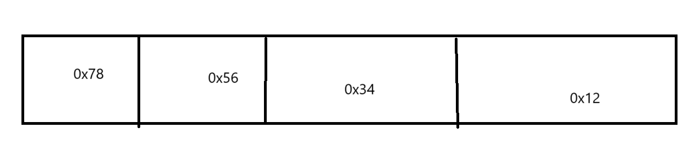

# 嵌入式面试学习笔记（入门1）

## 1. 指针的大小问题

​	指针对于不少新手而言是一道难关，但是不必恐惧于指针。他的本质其实就是一个地址。请冷静下来仔细思考。回顾一下对于当今已经普及的“64位计算机”这个说法。这个64不是空穴来风，他指代的是CPU内部的机器字长（一次运算可以处理的最大位数）的大小。那么，我们都知道计算机想要知道你想操作的数在哪，就很有必要提供一个“地址”告知操作数在何处。这就是“地址”。对于64位平台，地址显然是64位（MAR64位长度）。

​	那么指针实际上就是地址的一个“别称”了，当我们说一个指向某一个对象的指针，实际上就是再说这个对象的地址如何。

```
void handleTheDemo(int* ptr);
...
int  demo 	= 3;
int* ptr 	= &demo;
handleTheDemo(ptr)
```

​	回到这个问题，既然指针只是一个地址的存储器，那么，他显然跟类型完全无关！你想，对于你根据地址找人，这个人胖还是瘦，半毛钱关系没有，不会影响他的家庭住址地址丝毫。这样我们就可以猜到，对于如下的代码：

```
#include <stdio.h>

void displayPtrSize()
{
    printf("Size of pointer: %d\n", sizeof(void*));
    printf("Size of int pointer: %d\n", sizeof(int*));
    printf("Size of double pointer: %d\n", sizeof(double*));
    printf("Size of char pointer: %d\n", sizeof(char*));
    printf("Size of long pointer: %d\n", sizeof(long*));
    printf("Size of float pointer: %d\n", sizeof(float*));
    printf("Size of long long pointer: %d\n", sizeof(long long*));
    printf("Size of short pointer: %d\n", sizeof(short*));
    printf("Size of unsigned int pointer: %d\n", sizeof(unsigned int*));
    printf("Size of unsigned long pointer: %d\n", sizeof(unsigned long*));
    printf("Size of unsigned long long pointer: %d\n", sizeof(unsigned long long*));
    printf("Size of unsigned short pointer: %d\n", sizeof(unsigned short*));
    return;
}

int main()
{
    displayPtrSize();
    return 0;
}
```

​	其打印出来的结果是可想而知的。

​	那么，难道所有的平台上都是如此吗？显然不是，再仔细看看我的第一段话，我们只是在讨论64位平台，事实上还存在一个32位平台，如法炮制，不难猜出地址在这里就是32位了

```
# 64位平台运行结果
Size of pointer: 8
Size of int pointer: 8
Size of double pointer: 8
Size of char pointer: 8
Size of long pointer: 8
Size of float pointer: 8
Size of long long pointer: 8
Size of short pointer: 8
Size of unsigned int pointer: 8
Size of unsigned long pointer: 8
Size of unsigned long long pointer: 8
Size of unsigned short pointer: 8
# 32位平台运行结果
Size of pointer: 4
Size of int pointer: 4
Size of double pointer: 4
Size of char pointer: 4
Size of long pointer: 4
Size of float pointer: 4
Size of long long pointer: 4
Size of short pointer: 4
Size of unsigned int pointer: 4
Size of unsigned long pointer: 4
Size of unsigned long long pointer: 4
Size of unsigned short pointer: 4
```

## sizeof和strlen

​	这个话题于我看来有些莫名其妙，后来笔者想到大部分学校喜欢在教授字符串的时候扣这些颇为无聊的小玩意，笔者决定分享一下我的看法。

​	我们认为sizeof这个东西是操作符，在C文件编译的时候就已经静态的计算好了，如果不信，可以看看这一份简单的C文件的汇编结果：

```
int main()
{
	int intSize = sizeof(int);
	return 0;
}
```

```
	.file	"demo.c"
	.text
	.globl	main
	.def	main;	.scl	2;	.type	32;	.endef
	.seh_proc	main
main:
	pushq	%rbp
	.seh_pushreg	%rbp
	movq	%rsp, %rbp
	.seh_setframe	%rbp, 0
	subq	$48, %rsp
	.seh_stackalloc	48
	.seh_endprologue
	call	__main
	movl	$4, -4(%rbp)
	movl	$0, %eax
	addq	$48, %rsp
	popq	%rbp
	ret
	.seh_endproc
	.def	__main;	.scl	2;	.type	32;	.endef
	.ident	"GCC: (MinGW-W64 x86_64-ucrt-posix-seh, built by Brecht Sanders, r3) 14.1.0"

```

​	可以看到我们的sizeof(int)直接被替换成为4了。这个玩意纯粹的是计算目标占用内存的大小。

​	那strlen呢？他又是怎么一回事呢，**其实他是一个string.h里的库函数，用于求解字符串长度的**。

​	一个函数！一个操作符！首先差别就很大！

​	我们下一步是思考他们在字符串使用上的区别

```
#include <stdio.h>
#include <string.h>

int main() {
	char str[] = "buffer";
	printf("sizeof: %d\n strlen: %d\n", sizeof(str), strlen(str));
	return 0;
}
```

​	这段代码是显而易见的。不难猜出一个结果是

```
sizeof: 7 strlen: 6
```

​	为什么？我们知道，strlen在实现上不考虑`'\0'`的存在，他是我们字符串的公认终止符。

```c
size_t strlen(const char* str){
    int size = 0;
	while(*str++) size++;
    return size;
}
```

​	可以查看各个编译器对string.h标准库的实现，这里笔者提供的是一个比较好理解的实现，可以发现当我们的*str == '\\0'的时候，循环退出，size不自增。

​	而sizeof不在乎这些，他只知道我们的字符数组的大小是7个（6个字符，一个`\0`），因此事情就很简单。

> Questions:如果我改变为
>
> ```
> #include <stdio.h>
> #include <string.h>
> 
> int main() {
> 	const char* str = "buffer";
> 	printf("sizeof: %d\n strlen: %d\n", sizeof(str), strlen(str));
> 	return 0;
> }
> ```
>
> 请问此时又该如何呢？
>
> 仔细思考指针和数组是否严肃等价！

## C语言分配内存的方式

​	其实就三种：

```
void display_bufferAllocation()
{
	static int _inDataSegment = 1; // 可以在任何地方定义，通通放到静态区
	int _inStackSegment = 2;
	int* __inHeapSegment = (int*)malloc(sizeof(int));
	...
	free(__inHeapSegment);
}
```

1、静态存储区分配

内存分配在程序编译之前完成，且在程序的整个运行期间都存在，例如全局变量、静态变量等。

2、栈上分配

在函数执行时，函数内的局部变量的存储单元在栈上创建，函数执行结束时这些存储单元自动释放。

3、堆上分配

堆分配（又称动态内存分配）。程序在运行时用malloc或者new申请内存，程序员自己用free或者delete释放，动态内存的生存期由我们自己决定。

## 数组（的）指针和指针（的）数组

​	啥？好奇这个区别，嗨老铁，加一个（的）就搞定了。

```
int arr[10];
int* ptr_of_array = arr;

int* ptr_arr[10];
...
```

​	可以看到：数组的声明方式无非就是：

```
type var_name[size];
```

​	type是指针，那就是指针（的）数组。

## union

​	这个有意思，我第一次看到的时候是在确定机器的大小端的时候出现的

```
#include <stdio.h>
union TestEndian
{
    unsigned int a;
    char b;
};

int check_endian()
{
    union TestEndian te;
    te.a = 0x12345678;
    if (te.b == 0x78)
        return 1;
    else
        return 0;
}

int main()
{
    printf("Endian: %d\n", check_endian());
    return 0;
}
```

​	为了理解这段代码，我们需要首先需要理解联合体是什么。

​	我们假想一种有意思的场景

> 我们需要对一系列的人进行信息存储，对于学生，我们需要存储的是学号；另一方面，对于教师只需要知道名字即可。

​	当然这个例子没有联合体在Linux进程信息应用上来的好，但是笔者还是决定考虑用这个蹩脚的例子来说明事情。除了抽象两个结果体之外，我们还可以这样做：

```C
#include <stdio.h>
#include <stdlib.h>
typedef enum {
	STUDENT,
	TEACHER
}FellowType;

typedef struct 
{
	FellowType type;
	union {
		char studentName[20];
		unsigned int teacherID;
	} data;
}FellowInSchool;

FellowInSchool* createFellowStuent(FellowType type, char* name)
{
	FellowInSchool* fellow = (FellowInSchool*)malloc(sizeof(FellowInSchool));
	fellow->type = type;
	strcpy(fellow->data.studentName, name);
	return fellow;
}

FellowInSchool* createFellowTeacher(FellowType type, unsigned int id)
{
	FellowInSchool* fellow = (FellowInSchool*)malloc(sizeof(FellowInSchool));
	fellow->type = type;
	fellow->data.teacherID = id;
	return fellow;
}

void freeFellow(FellowInSchool* fellow)
{
	free(fellow);
}

void displayFellow(FellowInSchool* fellow)
{
	switch (fellow->type)
	{
	case STUDENT:
		printf("Student Name: %s\n", fellow->data.studentName);
		break;
	case TEACHER:
		printf("Teacher ID: %d\n", fellow->data.teacherID);
		break;
	default:
		printf("Invalid Fellow Type\n");
		break;
	}
}

int main()
{
	FellowInSchool* fellow1 = createFellowStuent(STUDENT, "John");
	FellowInSchool* fellow2 = createFellowTeacher(TEACHER, 1234);
	displayFellow(fellow1);
	displayFellow(fellow2);
	freeFellow(fellow1);
	freeFellow(fellow2);
	return 0;
}
```

​	**你看，对于同一个FellowInSchool结构体可以产生复用，而大大节约内存，让一块内存根据条件的不同按照不同的姿势进行解读。就这个用处**

​	仔细品鉴一下这句话,就会高兴的发现

```
union TestEndian
{
    unsigned int a;
    char b;
};
```

​	其实很简单：



​	你看，这就是小端法的存0x12345678的方式，可以看到，如果我们采取char 的方式读取读到的就是0x78，大端法这里填写的就是0x12，这样我们就实际上测试了这个机器是不是小端法的机器了

