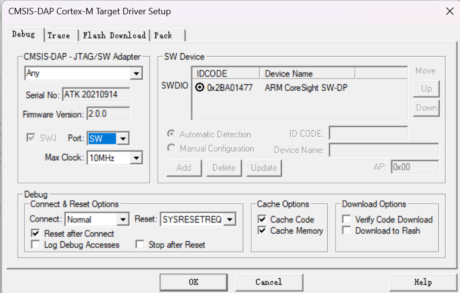

# （萌新入门）如何从起步阶段开始学习STM32 —— 0.碎碎念

## 前言与导论

​	非常感谢[2301_77816627-CSDN博客](https://blog.csdn.net/2301_77816627?type=blog)的提问，他非常好奇如何在起步的阶段学习STM32。笔者自己也是没学多久的STM32，当然下面的说法会有一些漏洞。但是，我仍然想分享一下自己对学习STM32的看法。中间肯定会有不少的疏漏，烦请各位看官大佬见笑了，如果有任何错误，可以直接犀利的在评论区指出，或者给我任何建议，我会第一时间同您交流！

### 碎碎念

​	大部分人可能是从51单片机开始学习，笔者自己也是大一的时候学习过非常粗浅的51单片机，在后来需要项目应用的时候才去学习STM32，我相信不少人更多的是从应用层开始接触我们的STM32的。

​	一个非常经典的疑问就是——我手头有一块非常巨大的开发板，比如说笔者现在敲电脑的旁边就是一块STM32G431RBT6开发板和正点原子家的STM32F103ZET6精英开发板，或者是一块非常迷你的核心板（最小系统板），比如我的左手边就是若干的STM32F103C8T6核心板。当然，这些概念可能会一下把萌新吓跑，在你慌张的准备退出这个标签的时候不妨留步，烦请听我慢慢道来。

​	嵌入式单片机领域，如果没有上过前置的课程，那可能会显得相当困难。

​	比如说微机原理（这里属于单片机开发体系当中的架构层次，也就是说，我们眼中的STM32单片机，是一个叫做ARM架构派生的一个产品，您不妨理解为根据这个arm架构的模板，开发出来的），在这个层次上，我们正在讨论的，会是非常具体的（对于架构具体，对萌新而言是灾难）行为——比如说，我如何操作寄存器来控制一个GPIO口的高低电平呢？我如何通过向一个地址写东西来控制实际映射到的外设呢？

​	比如说数电和模电——这样的电路怎么样就实现了我们GPIO的开漏推挽输出呢？如何实现了IIC协议的硬件层次通信呢？如何就让我们的USART就可以进行一定的串行通信了，又如何进行一定的收发呢？SPI硬件电如何保证了我们描述是否接受到信号发出信号的呢？

​	比如说C语言甚至是ARM架构汇编，编程语言是我们操纵手头的小单片机，焕发巨大魔力的有利的，直接的工具，他是我们应用层代码——何为应用层？就是直接看得到，摸的着的现象。比如说，当我们讨论

> 喂！把PA3上外接的LED灯点亮！
>
> 好嘞！我这边手头刚处理好使用硬件IIC完成OLED的通信业务逻辑！

的时候，我们就是在完成应用层，也就是最后直接跟用户对接的部分。

​	还有其他非常多的，甚至包括不少人不屑一谈，但是实际上劝退大把人的代码移植（隶属于编译技术），报错处理（笔者甚至遇到大把完全不懂编译器链接器的），软件工程（完全不知道如何组织自己项目的）等等，单片机的学习，在这里就可以提现出来了——**非常的杂，软件硬件都有所交叉，甚至还要延伸到最底层的计算机架构（**可以不懂嘛？可以不懂，但代价就是出现问题了你只能两手一摆，拿着示波器逻辑分析仪一顿瞎分析，还没有所以然，写一个代码完全没办法移植修修改改，对面的哥们更改两行代码就完成了整个工程的移植）

​	所以，笔者在这里，需要尝试整理一下，学习单片机，哪些领域，哪些层级是你需要注意的

> 会用的层级：你不需要关心你的板子到底做了什么，你只需要知道**常见的单片机自身的概念，常用外设的概念，常见协议的概念**。你知道如何**配置Cubemx完成你的目的**，你知道如何**操作Keil来烧录上传你的板子**，你知道如何使用**STLink或者是DAP完成你对你手头板子的调试工作**。你知道如何使用常见的排查手段——**硬件上是示波器，万用表，逻辑分析仪；软件上是打串口日志，对非时序敏感的器件做调试操作等等。**你不知道，也会葫芦吞枣的去根据别人的博客猜测可能的步骤。
>
> 理解的层级：慢慢的，会开始关注拿到**新器件的手册，新开发板的手册**，知道如何去根据自己的目的查询对应的关键词查询你的问题，你会去熟悉常见的你需要看的配置和资源有哪些（IO口？使用的协议和对应的状态？），你会去查询常见协议的设计的思路和实现的原理，甚至去扒电路图看看特定的你感兴趣的部分的电路实现。
>
> 更高的层次：现在，可能会去查询arm的手册看看你手头的芯片到底是怎么一回事。他是如何被设计的，因此可以用在哪些场景。你会设计一个庞大的嵌入式系统完成一个特定的任务，而且知道出现在眼前的问题如何使用更加准确的手段排查。笔者完全没到这个地步，但是认识的佬不少远超于这个水平，实在让人难以追赶，哈哈！

### 所以，我到底需要知道哪些东西呢

1. 首先，如果完全没有接触过**C语言，电路分析和派生的数电模电**课程，笔者真心的建议你好好学学，不着急立马开始玩单片机，否则，你也不过是照搬别人的东西，自己什么也学不会，别人一问三不知。
2. 你需要学习如何使用常见的工具：对于初学者，你会使用MDK5(Keil)完成单片机的开发（当然可以是CubeIDE），或者使用CubeMX快速的生成对ST家的芯片的配置模板。你要理解**编辑器，编译器，链接器的存在，和他们到底在干什么的作用**，笔者之前潜伏在正点原子的群里，就发现大量的人完全混淆这些概念，导致MDK的抛错完全看不懂，这是嵌入式教学中的一个巨大的失误——不对你使用的工具进行详细的介绍和说明他们到底在做什么的讲解，导致不少新人完全不知道发生了什么，代码怎么就跑起来了。当然，笔者比较温和，实际上现在不知道问题也不大，多接触一些慢慢会有所感觉。这里不过是抛出这些概念罢了
3. 你需要理解常见的概念。当我们讨论——GPIO口，上拉下拉，外设等等的概念的时候，你可以对应的查询相关的概念。**递归式的学习每一个出现的新名词，直到达到自己学习的极限**。对于单片机，我们会说GPIO口（如何跟外围的设备进行交互），时钟树和晶振速度（你的单片机工作的速度多快？），定时器（字面含义）等等的概念，具体的你购买开发板的时候肯定会附送资料，跟着学！
4. **你需要学习如何阅读手册**，教程可以算作你的手册，购买外设商家附送的网盘资料可以是你的手册，一些datasheet网站上收录的手册也可以是你的参考资料，**学习根据手册进行编程，是一个嵌入式人的标准素养**
5. **你需要学会使用单片机提供的能力操作你的外设**，事实上这个是最先的。大部分的人首先会完成点亮一个LED的小实验，请记住，拿到一个板子，当你学会点亮一个LED的时候，你就正式的入门这个板子的使用了。随后，你还会驱动比如说其他更加复杂的外设。对摁键的检测，对OLED的控制，对电机舵机的把控等等。从这里开始，你就进入了应用层的学习，逐步走上正轨了。

​	最基本的步骤就是如此。

## 从一些基础的概念入手

### 常见的工具和说法

#### ST公司

​	当你打开这篇文章的时候，你肯定已经拥有了一块ST家的单片机（比如说STM32F103ZET6），但是不知道如何进行学习。ST是一个搞单片机的公司，你可以认为手中的这个芯片就是他们家的东西。

#### MDK5 (Keil5)

​	还记得你写C语言嘛？在大学里，笔者的老师要求我们使用老毕等VC6.0编辑器编辑我们的代码，我自己是VSCode/QtCreator写C/C++，算法竞赛党喜欢使用Code Block或者是Dev C++ 完成开发，他们都属于一个叫做IDE的产物。IDE,也就是集成开发环境，为你包揽万象，你不需要关心如何完全的配置你的编译器链接器，编辑器，调试器设置，他们通通被IDE接管了。你只需要在IDE中点点瞧瞧，点这个摁扭点那个按钮，事情就结束了。

​	在嵌入式中，一个最为经典的方案就是拿MDK5作为IDE开发单片机。

> [Keil MDK5安装详细步骤-CSDN博客](https://blog.csdn.net/DaXiongRen/article/details/120072979)

​	笔者随手搜了一下就搜到了安装的办法。**学会使用搜索引擎是你学习嵌入式的一个重要的保障！**

#### CubeMX

​	CubeMX是ST家为了让他们的芯片更加容易的被开发，使用Java开发的一个好用的快速配置软件，它可以快速的生成一个已经完成了初始化代码的工程模板，比如说，正点原子的教程幸苦的写了2个小时的代码，CubeMX点几下，然后生成工程，进去把LED电平差拉起来，LED就点亮了，前后不超过3分钟。对于初学者，这个软件能够快速的方便的生成一部分代码，但是对自己更长远的发展和学习不利，笔者建议是——写业务速速用，学习的时候，还是先理解每一个文件在做什么比较好。

[STM32CubeMX - STM32Cube initialization code generator - STMicroelectronics](https://www.st.com/en/development-tools/stm32cubemx.html)

​	具体的介绍，请参考官方网站，注意的是——学习英文也是嵌入式中不可或缺的一部分，因为大部分的文档都是英文的（笑）。

### 如何使用MDK5的一些常用功能

#### MDK5的一些常见的设置

​	笔者写了两年的单片机，大大小小的项目过来，发现常见的需要改动的配置，这里我会说明一下。笔者随手打开了一个STM32F407ZGT6的，正点原子的工程。

​	打开界面，在你的左手侧的栏内，这是一个讲述的点：


这就是一个典型的目录工程结构。**当然，如何分类是自由的，笔者就不喜欢分成这样，喜欢分成include和source后，根据是哪个外设的控制进行单独的分类**，你喜欢分成如何，需要自己在开发当中慢慢体会，慢慢就会知道每一种分发的优缺点何在。这不是讲博客就能说的彻底。笔者决定将这个问题留给即将启程学习STM单片机的你。


​	（笔者使用的VSCode下自己开发的图形显示框架目录结构）

​	你当然可以添加你自己的C语言文件和头文件，甚至后面可以是汇编文件，取决于你的开发的场景，还有你的水平（笑）

> [Keil工程添加源文件和头文件（.c和.h）的方法_keil添加头文件.h-CSDN博客](https://blog.csdn.net/bankexinan/article/details/109640994)


​	另一个我们打交道的是这个地方。前四个图标设计到的概念是构建。

​	翻开你的C语言教程，自己默念五次自己写的程序如何从C语言文件到汇编文件再到二进制可执行文件。一般而言，我们会生成.hex文件（关于hex文件的生成规则和到底如何使用，这不属于萌新范畴的知识，感兴趣的朋友自行查阅，对于完全无基础的朋友，我打赌你会灰溜溜的回来继续看我写的内容的），也就是说，我们的IDE，会**收集我上面显示工程内的所有的C语言源文件**。注意，**是所有的！**，所以，小心重复的添加C语言源文件，否则它会被编译两次！在链接的时候就会触发符号重定义的错误。

​	我们先到魔术棒（也就是LED下拉框的右侧），点一下他，就会跳出来这个界面👇常见的一般我们会接触到这些设置：

1. arm编译器的版本——这是设计到编译器的特征的时候会考虑的，一般而言，萌新不需要考虑这个，直到就好
2. 是否使用微库——微库是编译器自身实现的一些常见的C语言的工具函数，一般的除非明确启用，一般我们都是自己实现。


​	**来到Output选项卡，如果你是使用一个完全空白的工程，一般而言，不会生成可以进行烧录的hex，我们就是在这里进行更改！勾选Create HEX File生成可以被烧录的二进制文件。**


​	旁边的C/C++编译器设置则是更加高级的一些C/C++设置。一般而言，**找不到头文件/目标代码没被参与编译/更改编译的选项**等的议题，都是在这里进行解决的。如果不清楚具体改什么，笔者建议自己到搜索引擎上查明白。

​	这里，重点介绍Define和IncludePath两个选项：

- define则是说明预定义的宏，不懂什么是宏的，去查`#define`，这是C语言的知识的范畴

- includePath说明了头文件的检索路径，当你发现你的头文件找不到的时候，需要设置头文件的检索路径，你需要点击includePath后面的三个...进行添加，一般而言，添加哪个文件夹，他只会扫描当前文件夹的所有文件，如果你的头文件在这个路径之下的一个子文件夹中，他是不会递归搜索的

  ```
  当只有include ./Core
  -Core
  |-----a.h		// #include "a.h"可以找到
  |-----b.h		// #include "b.h"可以找到
  |-----c
  	  |---d.h	// #include "d.h"找不到，但是#include"c/d.h"可找到
  	  |---e.h	// #include "e.h"找不到，但是#include"c/e.h"可找到
  ```


​	下面的内容跟调试精密相关了

​	笔者使用的是STLink和DAP比较多，你需要做的是在笔者框处的地方做设置


​	设置下拉框为你使用的调试器。STLink V2那就是STLink-Debugger，DAP那就是如图所示的，JLink那就是JLink Debugger.


​	点击Settings，在这里，你可以看到调试器现在的工作状态，正常的说，当你选择好调试器之后，给板子和调试器上电，就会看到ID号，举个例子：

​	笔者连接好了DAP和STM32F407ZGT6后，就会出现这样的界面，到这里，基本上板子就可与被烧录了，

记住，你还需要到这个地方，也就是讲选项卡从Debug切换到Flash Download去，勾选Reset And Run，这是因为调试器上传结束程序后，默认的行为是等待我们手动RESET后才会重新执行（比如嗯下开发板上的reset摁扭），这里我们勾选后就不用设置了。


​	回到这里，下面框处的摁扭，就是在完成上述的工作后，点击就会进行你编译结束的程序的上传（注意**每一次上传之前，必须编译！**不然会烧老的代码，就会发现你写的代码没有实现效果的更改！）。


​	关于调试，实在太多，请看大佬的博客：

[Keil5软件使用-进阶调试篇_keil调试教程-CSDN博客](https://blog.csdn.net/yli001/article/details/130505875)

