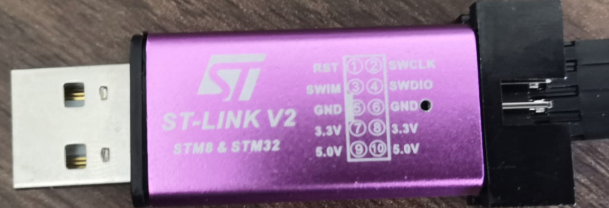
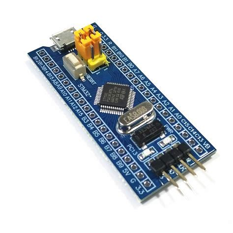
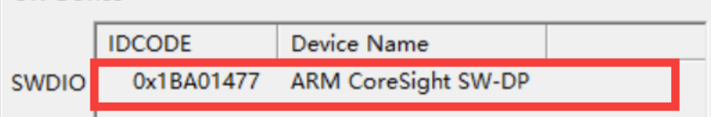
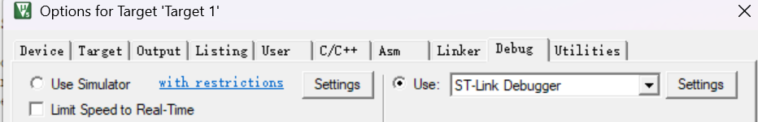
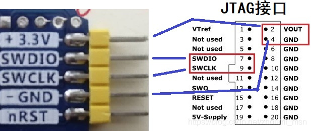

# （萌新入门）如何从起步阶段开始学习STM32 2——关于单片机程序的下载和调试办法

## 前言

​	你看完了我前面三篇的文章，选择了一个自己喜欢的方式进行路线的学习。比如说，你非常辛苦的——也许还带有一定不理解的完成了跑马灯的实验。现在，你的编译器高兴的宣布你的项目通过了编译和链接检查。马上，你就要把你的第一个程序送到你的单片机上，操作自己单片机的GPIO口了。

​	根据笔者之前的博客所述，一般的，你可能会购买STLink或者DAP等调试器将程序上传到你的板子上，对于调试器，功能也更加的强大，你也可以单步调试你的板子。

​	对于初学者，常见的程序下载的方式，就包括通过串口ISP和STLink（ST家的芯片是这样的），JLink等方式进行下载，我们下面一一说明。

## 程序下载概念

​	我们的代码写完了，也编译链接结束了之后，就会生成一个hex文件，这个文件就是要拷贝到单片机上运行的代码，问题来了，我们如何把程序传递到板子上去呢？

​	其中一个办法就是使用我们的串口来完成这个工作。串口就是串行的交流通口，我们的数据，在这里是我们的程序，通过一位一位的传递，送到我们的单片机上去。但是这也马上牵扯到一个问题，送到单片机的哪里去呢？

## 使用串口ISP下载程序

​	现在仔细看看自己的ST开发板，找到一个丝印上会写着BOOT0和BOOT1的引脚组，我们知道，程序可以拷贝到Flash上（注意，Flash是一个电可擦可编程只读的存储器，也就是EEPROM）上，习惯上，我们会把哪些不变的东西，比如说代码和常量送到这个地方，跟我们的RAM分开进行存储。

​	我们的BOOT引脚，通过调整跳帽选择接通不同的逻辑高低电平，他的含义并不一样。比如说，

- **BOOT0=1，BOOT1=0**：系统从系统存储器启动，进入Bootloader模式。
- 其他状态（如BOOT0=0）：芯片从主闪存或SRAM启动用户程序。
  在Bootloader模式下，芯片会初始化指定的通信接口（如USART1），并等待接收来自上位机（如PC）的固件数据。

​	当然，我们正常的串口下载，一般都是使用将BOOT0引脚拽低，然后使用串口（对于STMF1系列，一般是使用USART串口下载），这个时候，开发板上的USART的复用GPIO接口（关于这个概念，笔者做简单的解释就是——GPIO既可以用来驱动外设，比如说点亮LED，干其他的事情，也可以用来完成其他特定的任务，比如说这里的串口通信等等）必须跟板子上的USB-TTL上的RX，TX接好，**这样我们的程序才能从RX和TX引脚传递进单片机的GPIO口（笔者默认的开发板已经都接好了，所以无需担心）**，从而下载程序！

​	常见的串口烧录工具，笔者使用的有正点家的XISP软件和FlyMCU。

> 注意的是：
>
> F1系列没有串口波特率的要求：你可以认为是下载程序双方约定的速度，这样才能进行正确的收发
>
> F4系列则会限制在76800以下，笔者猜测是硬件的限制。但是笔者不熟悉，我是使用DAP直接烧录程序的

​	现在，我们使用常见的，比如说XISP或者是FlyMCU，开始点击类似“Download to Device”的选项，去把程序使用串口传递到我们的板子上。此时软件会擦除芯片原有程序，写入新固件，并在完成后验证校验和。**若过程中出现错误，需检查串口连接、BOOT引脚状态、电源稳定性，或尝试降低波特率（如改用9600）**。某些情况下，**还需在下载前手动复位芯片，或在软件中勾选“复位后运行”选项。（这是因为使用串口下载好程序之后，单片机默认会停机等待执行）**

> 笔者提示：
>
> 现在去查查自己板子上的JTAG复用的GPIO口和SWD的复用GPIO接口，注意，初学者尽可能不要去拿这几个GPIO空来操作外设，因为他跟我们的板子的烧录和调试密切相关，很容易出现程序死活烧不上去，芯片锁死等行为，这样的话焦头烂额到半夜也不知道怎么解决。
>
> 如果确实出现了因为不小心的操作失误触发了写保护的问题（也就是把芯片锁死了），尝试拉高BOOT0引脚烧录程序后，在更改回来尝试砍能不能将芯片回复正常

## （ST芯片特有）使用STLink进行烧录和调试

​	对于进一步更加专业的开发ST芯片，笔者认为还是购买一块STLink调试器比较好，因为它既可以下载程序，也可以调试程序为我们进一步学习单片机打下良好的基础和环境。笔者随手在淘宝上截取了我购买的STLink。

​	下面的图是一个非常经典的STM32F103C8T6开发板，看到右下角引出的四个口了嘛，这就是接进去STLink的四个口

​	

说一下如何连接：

| STM32F103C8T6 | STLink（四端口）                |
| ------------- | ------------------------------- |
| 3V3           | 3.3V（STLink的供电）            |
| SWIO          | SWDIO（传递调试数据和指令的线） |
| SWCLK         | SWCLK（STLink的时钟线）         |
| GND           | GND（接地）                     |

​	现在，回到我们的Keil上，将STLink的USB端口接入我们的电脑上，如果正确的连接，就会出现类似于这样的图例：

（你这提示——你使用何种调试器，就需要将debug的调试器类型设置为哪一个种类，办法和介绍参见笔者的博客：https://blog.csdn.net/charlie114514191/article/details/145632255）

## DAP调试

​	笔者现在玩的F4系列就是使用DAP进行调试的。

​	**DAP（Debug Access Port，调试访问端口）是ARM Cortex-M系列微控制器中用于调试和编程的核心接口。它是ARM调试架构的一部分，通过标准的JTAG或SWD（Serial Wire Debug）协议与外部调试工具（如ST-Link、J-Link、DAPLink等）通信，实现对芯片的调试、烧录和性能分析功能。**

​	DAP的核心功能是通过调试接口访问芯片内部的调试模块，从而控制CPU的运行状态、读写寄存器、访问内存以及设置断点等。DAP通常由两部分组成：DP（Debug Port，调试端口）和AP（Access Port，访问端口）。DP负责与外部调试工具通信，而AP则负责与芯片内部的调试资源交互。常见的AP类型包括AHB-AP（用于访问系统总线）和MEM-AP（用于访问内存）。

​	DAP支持两种物理接口：JTAG和SWD。JTAG是一种传统的调试接口，使用多根信号线（如TDI、TDO、TCK、TMS等），适合高速调试和复杂场景。SWD是ARM推出的一种简化接口，仅需两根信号线（SWDIO和SWCLK），在引脚资源有限的情况下非常实用。SWD在性能和功能上与JTAG相当，但占用的硬件资源更少，因此在Cortex-M系列芯片中广泛应用。

​	DAP的工作原理是通过调试工具发送命令，控制芯片的调试模块。例如，调试工具可以通过DAP暂停CPU运行、读取寄存器值、修改内存内容，或者设置硬件断点。

​	笔者的开发板上已经预留了DAP的接口，所以对于预留接口的开发板，直接使用杜邦线进行连接即可：

