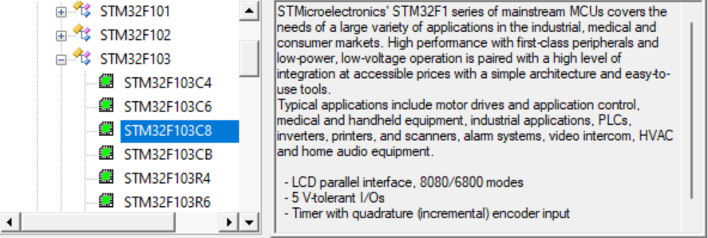
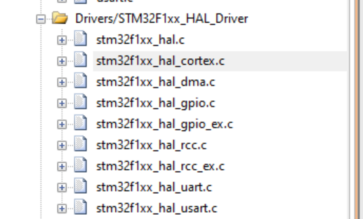
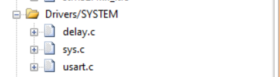

# （萌新入门）如何从起步阶段开始学习STM32 —— 1如何迁移一个开发版的工程

## 前言

​	本篇博客是我的粉丝：[2301_77816627](https://blog.csdn.net/2301_77816627?type=blog)请求的，介绍如何入门STM32中他最关心的一个问题。他现在手头拥有的是STM32的正点原子开发资料，但是却有STM32F103C8T6，前者一般的资料是F103ZET6，跟后者虽然同属于STM32F1系列的单片机，但是又在配置上略有不同。这个问题非常好的代表了一个嵌入式领域当中，非常常见的一个任务和话题

## 如何迁移一个开发版的工程到其他单片机上？

### Step 1：明确你单片机的型号

​	这位粉丝私信我说，他使用的单片机是STM32F103C8T6，**一个很好的习惯，那就是阐述明白自己的开发环境是如何的，而不是丢过来几句话就仙然离去！这位粉丝就非常好的说明了自己使用的单片机和他的开发环境，他所遇到的困难**。

​	我们打开MDK，转到Project菜单栏上的新建uVision工程上（注意，如果你没有做汉化，请自行搜索uVision的汉化，笔者是看得懂无所谓），在设置好自己的工程根目录后，就会请求你使用的单片机的型号。

> 概念科普：工程的根目录是一个项目存放的地址，拿到这个根目录就等价于拿到了整个项目，我的意思是——所有的你写的代码都会放到整个目录之下。

​	显然，我们的单片机是STM32F103C8系列，而不是STM32F103ZE系列，如果你后续购买了其他板子，也请知晓自己的板子的型号，关于板子型号的含义，可以自行百度之。

​	下面就是迁移使用到的板子的文件。注意，板子迁移的工作非常的累。笔者建议是寻找一个模板工程跟着做。一般而言，我们的项目工程迁移分为三个部分

### STEP2 确定环境后移植代码

0. 启动代码的移植。一般而言，启动代码说的是我们的单片机初始化的一些工作，比如说，给你的程序清理地方，建立必要的硬件服务等等，一般的，我们是使用啥样类型的板子就会使用如何的启动文件。

1. 底层代码移植——这一部分代码直接跟我们的单片机的硬件所对接。这部分的移植需要我们有ST家的库，这些库就是一个例子。

   

2. 中间层的代码移植——比如说一些常见的系统上层的全局库移植和一些常见功能的移植，他需要依赖于我们的底层代码，所以需要正确的保证底层代码的正确的移植。

   

3. 顶层驱动的业务代码的移植——比如说点灯代码，OLED菜单显示代码等等

   

4. 最后就是我们的主函数类的文件

   

#### 提示：正常而言，我们是使用的套模板建立工程

​	笔者这里建议的是江科大的代码作为一个模板：[资料下载 (jiangxiekeji.com)](https://jiangxiekeji.com/download.html)，自己对照正点原子的书逐步认真的学习每一个文件的作用，可以不着急搞明白，但是最好知晓里面的文件到底在干嘛，建立一个大的框架体系，从点灯开始在慢慢的填充。

​	如果坚持使用正点原子的风格，也有博主已经做出了移植：[STM32F103C8T6工程模板 ——固件库版、正点原子代码风格、包含SYSTEM文件夹-CSDN博客](https://blog.csdn.net/sjdoasjdoias/article/details/127275600)

#### 提示：笔者自身不使用这些模板，我是使用CubeMX快速配置工程进行开发

​	如果你不想费大功夫建立工程，不如考虑使用CubeMX快速生成代码后，在进行功能的书写，笔者认为这个需要你结束过STM32的学习后，在谈论使用这个办法进行代码移植。

### STEP3 代码移植结束后，需要做的配置部分

​	使用了别人的模板后，实际上这里不需要做任何更改。但是这些是你需要注意的地方：

1. 有没有需要更改的宏的部分？比如说，C8T6的chip的RAM大小跟ZET6不一致，就需要采用不一样的宏。可以看看这些模板中定义的宏的含义，做笔记进行学习

2. 有没有需要修正的include path?复习一下，include path声明了我们包含头文件的路径的位置

3. 有没有修改debugger的种类？其他人可能会使用jlink调试，手头上，一般你只会有stlink，所以记得更改debug选项和勾选reset and run 选项（具体参考上一篇博客）

4. （可能）需不需要更改编译器的一些参数？当然，对于萌新，别人用啥就是啥就OK，等到后面的学习再重新回来认识就好了

   

## 概念

​	笔者下面需要介绍的是库寄存器和HAL库两个重要的概念，在各位看完之后，需要决定自己的学习路线到底是学习HAL呢？还是寄存器呢？还是两者都学习呢？

### 库寄存器

​	库寄存器就是简单的封装了我们对寄存器的操作，至少，不用咔咔访问结构体去嗯改里面的数据，否则开发效率会低到发指。

​	库寄存器的特征如下：

- **低层级**：直接操作硬件寄存器，代码与硬件紧密相关。
- **高效**：由于直接操作寄存器，代码执行效率高，资源占用少。
- **灵活性**：我们可以完全控制硬件的每一个细节。但是代价是 —— 需要深入了解硬件手册和寄存器配置，开发难度较大。
- **可移植性差**：代码高度依赖特定硬件，移植到其他平台时需大量修改。

​	库寄存器的优秀的教学视频自然就属于江科大了[STM32入门教程-2023版 细致讲解 中文字幕_哔哩哔哩_bilibili](https://www.bilibili.com/video/BV1th411z7sn/)

### HAL库

​	HAL库是STMicroelectronics为STM32系列微控制器提供的一个硬件抽象层库。使用HAL库可以让我们无缝的移植代码到其他ST家的平台上，它封装了底层寄存器的操作，提供了统一的API接口，简化了开发过程。

- **高层级**：通过API接口操作硬件，开发者无需直接操作寄存器。
- **易用性**：提供了丰富的函数库，简化了外设的配置和控制。
- **可移植性**：代码在不同STM32系列间的移植性较好。
- **效率较低**：由于增加了抽象层，代码执行效率相对较低，资源占用较多。
- **开发速度快**：适合快速开发和原型设计。

​	HAL库的教程，笔者建议是Keysking的教程，他的教学非常的顶层，基本原理是使用动画演示，非常的直观：

[【STM32入门教程-2024】第2集 点灯大师 点亮你的第一颗小灯 | keysking的stm32教程_哔哩哔哩_bilibili](https://www.bilibili.com/video/av607797911/)

​	当然，其他的开发板的供应商，比如说野火/正点原子的视频也是不错的，这里就自行搜索吧！