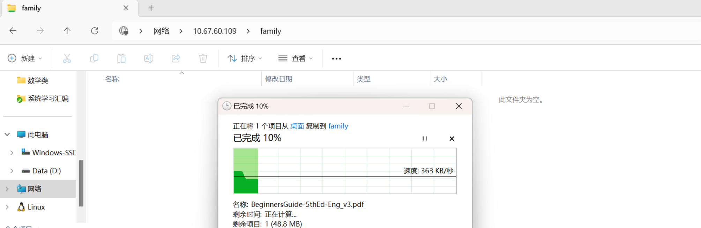

# 树莓派4B快速部署Samba服务

​	笔者前段时间正在体验树莓派的应用层编程体验。这里记录一下个人规模级别的设备的Samba服务部署过程，供各位看官评判参考。

> 树莓派：4B
>
> 使用的操作系统：RaspberryPi OS
>
> 使用的包管理工具：apt（所以下载的软件请各位看官自行评判）

## 啥是Samba

​	Samba是一个开源软件，让你可以在不同操作系统之间共享文件和打印机。我知道可能对于刚刚入门使用不同操作系统的人来讲有点难以想象：Windows、Linux 和 macOS之间可以相互之间传递文件，但是中间似乎没有做什么事情。

​	事实上，它使用了SMB的通信协议（一种很典型的CS架构的、请求/响应的协议），从不同操作系统中取出来文件的元生数据进行封装传递，映射到共同的文件共享区域。

​	关于这个协议到底是如何定义的，可以查看这篇博客：[SMB详解-CSDN博客](https://blog.csdn.net/qq_44002418/article/details/125508092)，我们这里简单的带过。

## 部署Samba

### 下载依赖

​	我们假定将树莓派下的某一个文件夹作为被共享的对象。因此，我们需要使用将samba部署到我们的树莓派上：

```
sudo apt-get install samba
```

​	值得注意的是一些老教程还会让你下载其他的比如说samba-common等，实际上已经不需要了。只需要下载这个即可。

### 创建一个独立的分享区域

​	文件分享最好还是独立划分给一个用户来隔离我们的主用户比较好，所以这里我们需要创建一个用户：

```
# 添加一个用户，而且设置密码
sudo useradd samba_share
sudo passwd samba_share
# 添加一个文件夹，这个文件夹就是我们想要最后共享的文件夹
sudo mkdir /var/samba_share
# 更改权限，否则可能会运行出现问题
sudo chown -R samba_share /var/samba_share
```

### 更改配置

​	我们下一步就是修改配置文件，增加我们的共享区的描述：

​	我们的配置文件在：

```
/etc/samba/smb.conf
```

​	使用你最顺手的编辑器（笔者是vim，我看有老古董喜欢用nano，这个随个人而见），以root权限进行编辑，所以再三小心。

```
[family]
# 一些说明
comment = My Family's Share
# 你要共享那个文件夹
path = /var/samba_share
# 可以被允许的用户登录名称
valid users = samba_share
# 安全性设置
public = no
writable = yes
browseable = yes
create mask = 0765
```

- “[family]”：我们将在Windows中看到的共享文件夹的名字；
-  “comment”，共享文件夹的说明；
-  “path”，共享文件夹在Linux文件系统中的实际路径；
-  “valid users”，允许访问共享文件夹的用户；
-  “public”，允许匿名访问；
-  “writable”，是否允许写入；
-  “browseable”，是否允许浏览；
-  “create mask”，创建文件时，对应的标志位设置。

​	更加具体的参数设置请参看Samba服务的文档：[Samba Documentation](https://www.samba.org/samba/docs/)

### 为Samba添加服务用户，让我们有访问接口

​	下一步就是将我们的这个单独为之开的用户设置为Samba服务用户，请看操作：

```
sudo smbpasswd -a homeuser
```

​	重启Samba服务

```
sudo service samba restart
```

​	欸！你可能会去看Samba服务的状态然后发现状态是dead，其实这个是Samba的架构导致的，他是一个启动服务，作为总的初始化服务，执行结束后就会退出。是它背后的三个子服务负责我们的Samba服务的运行。所以，正确查看Samba服务是否正确运行的姿势是：

```
testparm
```

​	他会校验你的设置有没有问题，根据程序爆的错去修改。

### 以Windows为例子访问我们的文件共享区域

​	下面我们在Windows上测试我们的Samba服务的部署情况：

​	在文件资源管理器中输入`\\` + 树莓派的可被访问的IP地址，然后输入我们配置的用户和密码就OK了，笔者这里截取一张我从Windows移动我的树莓派引导指南到文件共享区域。

