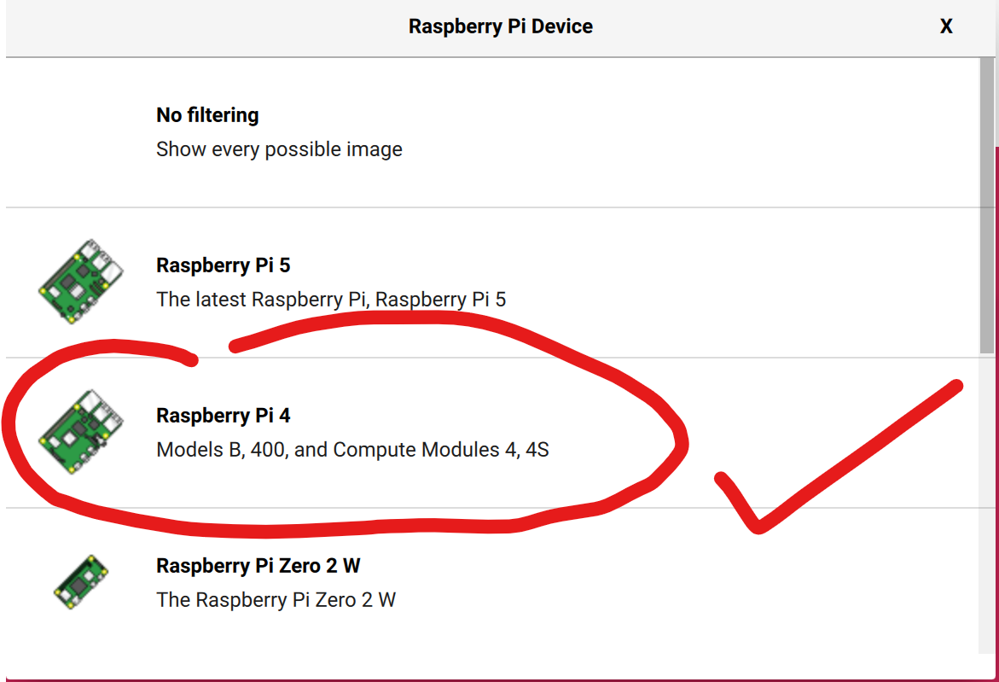

# 树莓派初次入门

​	笔者最近入门了树莓派4b，打算后续使用树莓派做点小东西玩玩。

​	新到手的树莓派，默认是一块白板，我们是需要使用到的有如下这些东西：

> 使用一块崭新的sd卡作为树莓派的启动盘（这是我们树莓派的文件系统的存储地点，必备）
>
> 上位机上的烧录软件，这里个人主推官方提供的：https://downloads.raspberrypi.org/imager/imager_latest.exe

## 树莓派系统烧录

​	下载官方提供的链接后，点击安装这个烧录程序，看到如下的界面

​	截至到2024年9月18日，官方提供的树莓派烧录程序的版本是1.8.5，也正是笔者正在使用的版本。

​	笔者购买的树莓派是树莓派4B，所以笔者勾选了如下的Device，请先确认自己的设备型号！

