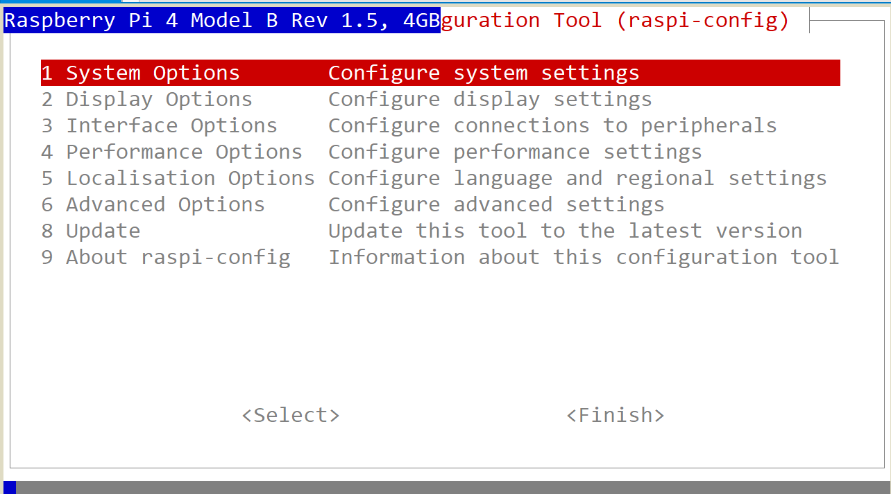

# 树莓派初次入门

​	笔者最近入门了树莓派4b，打算后续使用树莓派做点小东西玩玩。

​	新到手的树莓派，默认是一块白板，我们是需要使用到的有如下这些东西：

> 使用一块崭新的sd卡作为树莓派的启动盘（这是我们树莓派的文件系统的存储地点，必备）
>
> 上位机上的烧录软件，这里个人主推官方提供的：https://downloads.raspberrypi.org/imager/imager_latest.exe

## 树莓派系统烧录

​	请看官将自己的SD卡插入读卡器当中，然后将读卡器通过USB口接入我们的笔记本当中。

​	下载官方提供的链接后，点击安装这个烧录程序，看到如下的界面


​	截至到2024年9月18日，官方提供的树莓派烧录程序的版本是1.8.5，也正是笔者正在使用的版本。

​	笔者购买的树莓派是树莓派4B，所以笔者勾选了如下的Device，请先确认自己的设备型号！


​	下一步就是确定自己选择的操作系统。笔者是初次接触树莓派，因此，我选择最为稳健的


​	笔者后续将会在树莓派上跑yolo玩，因此，就必须安装64位操作系统，防止库太少，自己搓自己改——折磨人！

​	之后就是选择SD卡，如果看官已经插入读卡器，那么，这里的设备列表将会出现


​	选择自己打算烧录的SD卡。确认后就会提示你设置


​	选择编辑设置


​	在这里，就可以配置自己的主机信息和WiFi

- 设置主机名称：这个比较重要，网上流行的：

  ```
  ping raspberrypi.local
  ```

  实际上就是ping自己本地子网的树莓派主机名，也就是说，如果我们设置了主机名，这个指令才有可能被使用，否则不会认识这个主机名，从而显示Destination Unreachable!这就很操蛋了！

- 设置自己的用户名和密码：现代操作系统都支持多用户的，任何玩过一点点操作系统的都知道：想要标识自己就必须给自己上用户名，为了安全就必须设置一个密码。

  - 值得注意的是：在不久之前，树莓派官方就取消了默认raspberrypi的默认用户设置了，也就是说，现在提供的操作系统镜像是没有这个默认的用户的，必须在这里设置（其实还有其他办法，但是在这里设置最简单）


​	同时建议开启SSH，一般默认是开启的，但是这个事情需要我们给树莓派联网之后才可以ssh。现在就可以退出编辑设置界面开启烧录了。

## 开启树莓派

​	我们的下一步，就是将这个烧录好了的SD卡，插到树莓派的SD卡插槽里，笔者的插槽在树莓派主板的背面。

​	现在，插入它！确保安全后上电。可以看到树莓派的两个灯——一个红灯一个绿灯开始会亮起。

- 红灯是电源灯，指示树莓派有没有通电。
- 绿灯是SD卡工作状态显示灯，指示SD卡现在的工作状态。

​	耐心一些，我们可以放下手头的工作，系统第一次初始化需要一些时间。当我们看到我们的红灯常亮，绿灯几乎熄灭的时候，OK，系统已经初始化完成，等待我们的登录了。

## 为树莓派配置SSH和VNC远程服务

​	这一步比较艰难。我没有为树莓派配置专门的屏幕，意味着我需要使用一些手段来得知我的树莓派的IP。笔者采用的方法是使用网线将树莓派和自己的电脑组成一个子网从而分配本地可以访问到的IP。先进入树莓派操作再说。

​	网线不是热插拔的，所以没有屏幕的朋友，只好先拔下电源线，然后将网线插好了接入电脑再开启树莓派了！

​	很简单其实，跟随我来控制面板。笔者使用的是无线网络（有线网络一回事情）


​	这需要我们更改网络的分享属性，将树莓派接入我们的本地子网就好了。


​	可以看到电脑识别到了我们的以太网（网线连到了树莓派，如果你发现以太网下面写着网络电缆被拔出的话，请检查连线，反正就是网线都没通），下一步就是对自己正在使用的网络右键——属性


​	默认的，这里是没有勾选的，改成勾选且设置自己的链接是自己的树莓派——电脑子网，笔者这里是以太网。稍等片刻，我们的树莓派就会被分到IP了

​	打开终端

```
➜  arp -a
...
Interface: 192.168.137.1 --- 0x6
  Internet Address      Physical Address      Type
  192.168.137.101       d8-3a-dd-77-48-da     static
  192.168.137.255       ff-ff-ff-ff-ff-ff     static
  224.0.0.22            01-00-5e-00-00-16     static
  224.0.0.251           01-00-5e-00-00-fb     static
  224.0.0.252           01-00-5e-00-00-fc     static
  239.255.255.250       01-00-5e-7f-ff-fa     static
  255.255.255.255       ff-ff-ff-ff-ff-ff     static
```

​	找到这个，树莓派的子网端一般分配到了192.168.137.x上，笔者这里是这个。

​	学过计算机网络的同志们都知道，.1一般表达的是路由器，也就是自己的Gate IP，这个是用不了的，我们需要往下看这个IP

```
  192.168.137.101       d8-3a-dd-77-48-da     static
```

​	这个才是有用的，下面的是广播IP，也是用不了，锁定不到树莓派上的。现在，我们就可以使用我们拿到的子网私有IP梭哈树莓派了。


​	笔者没有使用Putty，有好用的XShell（，这里可以按照如下的属性进行配置。


​	第一次链接会让你填写用户名称和密码，这里填写你烧入系统时设置的用户和密码就行。下一步就是开启VNC远程桌面服务。笔者这里给出下载地址：https://www.realvnc.com/en/connect/download/viewer/

​	下一步就是设置root的密码，这里给出一个方案：[初次使用树莓派并启用root管理员（登录root管理员）_树莓派 设置管理员-CSDN博客](https://blog.csdn.net/faryang/article/details/50779767)，笔者就是这样完成设置的。

​	开启VNC的办法很简单，在自己的终端输入树莓派makemenu设置指令：

```
sudo raspi-config
```



依次操作：Interfacing Options -> VNC -> Yes，等待依赖配置结束，就OK了。

下一步就是使用我们的VNC客户端登录，输入我们的IP，链接成功会提示你登录的用户和密码，输入结束，就可看到自己的桌面了！


​	笔者的桌面设置已经配置结束了。我会在下一篇博客讲述如何设置源等内容！

​	最后一步就是——伸个懒腰，辛苦了，我们把树莓派关机，点击左上角的终端，输入poweroff指令。为什么不是直接断开电源呢？这就相当于你的台式机要先点击关机然后拔出电源一个道理，树莓派需要在关机的时候像SD卡写入数据保存，这样的话我们后续开发需要设计到操作系统关机的操作的时候，就需要先关机再拔电源。

​	OK，现在去休息吧！
