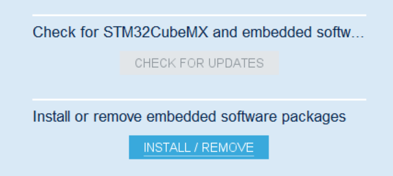
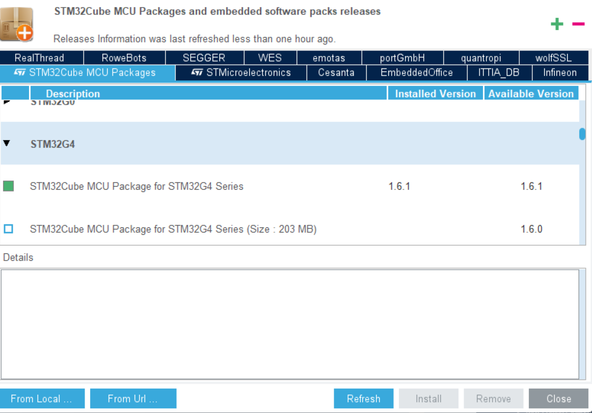
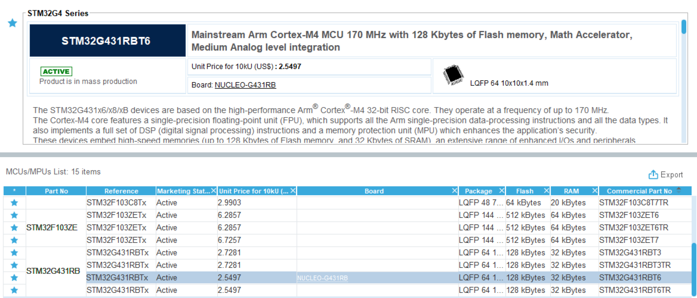
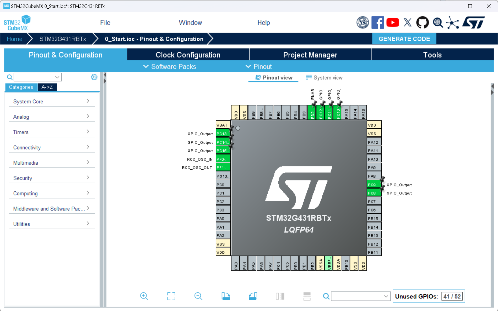
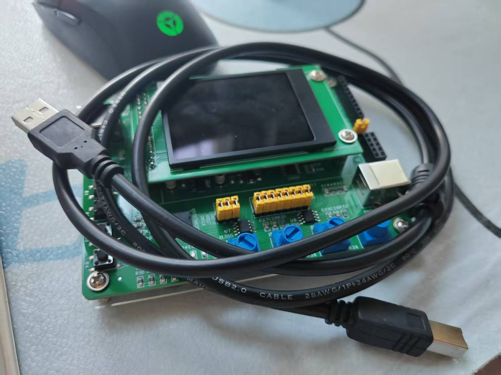
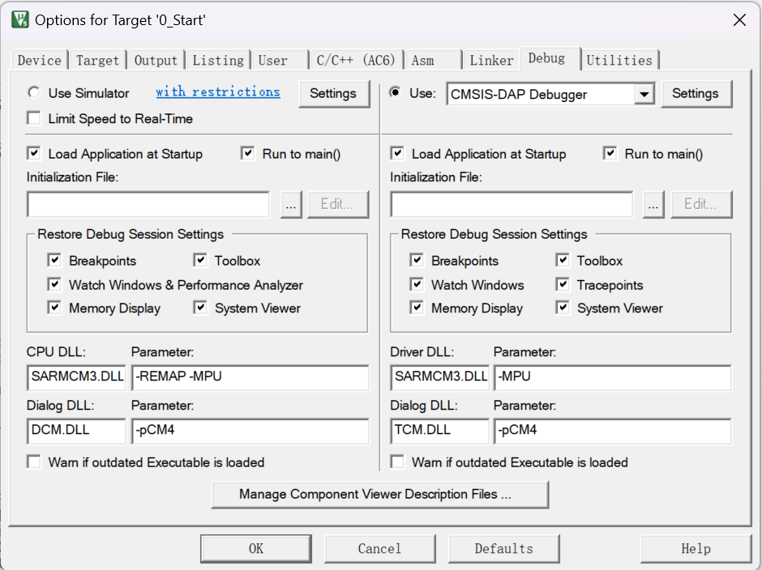
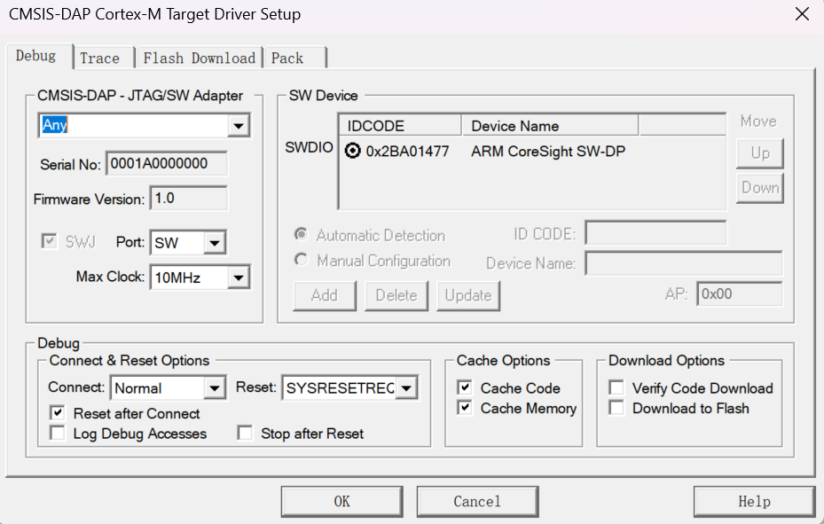
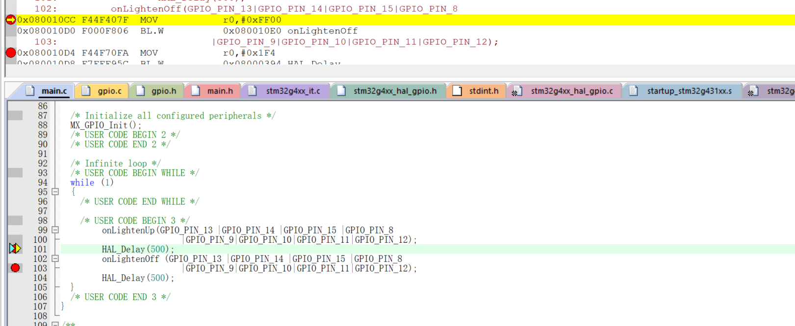

# 备考蓝桥杯嵌入式0：环境准备

## 说明

​	我们的蓝桥杯嵌入式使用的单片机是STM32G431RBT6，这个配置需要注意的是，如果你先前没有使用过这个板子，这是要在CubeMX下下载对应的固件包。步骤见下图。

​	现在这个板子就可以被选中进行配置了。

​	现在这个板子看起来就是这样的。我们就可以开始进行配置了。

## Keil配置

​	你可以随便设置点东西生成MDK5工程，打开工程，Keil会自动告诉你需要下载一些固件的包作为工程的补全。遵循其指示下载包就OK了。下面要做的就是设置Keil内部的一些配置。

​	这个就是我们的板子，随身附上一根线，将线一段连到电脑上，另一端连到我们的USB下载口（板子上有丝印）。然后，设置Keil的这些设置。

## 下载与运行

​	调整debug设置中的USE改成CMSIS-DAP Debugger，里面的Settings如下：

​	可以看到Keil这边已经识别到了我们的板子。现在，你可以去随意找一个可以跑的程序（比如说点灯）。直接拿过来试试可不可以跑了，编译无错后，按LOAD摁扭就可以直接刷到板子上了。

## 调试

​	很简单，当我们上面的配置做好了之后，直接debug就行了。

> 注意，只有左侧栏是灰色的地方是可以被打断点的，其他的地方会显示不可以打断点。这点请注意。
>
> 还有，提供的调试步子大小有：
>
> - 全速运行：直到遇到一个合法的断点才会停下来。
> - 进入: Step Into，这个是进入函数内部（如果可以进入的话），一般用在确定这个函数是出问题的，或者是想了解的
> - 迈过: Step Over，这个是跨过函数，感觉还是这个更加的常用。一般都是确定这个函数功能正常才会迈过去
> - 迈出: Step Out：我们step over了后，如果不想再看了，直接点击这个跳出去这个函数，没必要硬等。

