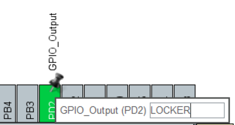

# 蓝桥杯嵌入式赛道备考

## 1. 点亮一个LED

​	蓝桥杯的板子资料的URL，笔者是从https://github.com/JoyRiderJie/LanQiaoBei-QianRuShi.git拉去下来的。这个是Github仓库地址。

​	从应用层去玩一个开发板子，首先需要的是去尝试是点亮一个LED。让我们切换到手册《CT117E——产品手册》的第11页，笔者截取了一张图。


​	我们分析一下这个图。首先，从左侧看起，VDD给LED提供了高电平，也就是使用了上拉电阻上拉到了VCC，想要点亮这个LED，只需要给对应的电平一个低电平。所以事情变得非常的简单。只需要使能对应的GPIO拉低就好了。

​	问题和难点就在这个SN74HC753ADWR，这是什么呢？这是一个锁存器。[锁存器芯片74HC573芯片的用法，及其在实际电路中的应用_74hc573真值表-CSDN博客](https://blog.csdn.net/bhniunan/article/details/104344519)，这一博客介绍了锁存器的用法。

​	笔者建议使用MX偷懒，给一个推挽输出的GPIO，然后HAL_GPIO_WritePin就完事。



​	我们需要注意的是，我们对锁存器编程只需要关心他的输入输出即可，对于这个锁存器，给一个高电平的时候。锁存器释放状态，允许将状态通到右侧。当给一个低电平的时候则是将状态锁住。所以，对LED编程，我们首先需要给寄存器释放状态，给一个高电平，然后写入LED电平后给一个低电平。

```
void led_set_status(uint8_t states)
{
    HAL_GPIO_WritePin(LOCKER_GPIO_Port, LOCKER_Pin, GPIO_PIN_SET);
    // 这个compose_all_led_gpio稍后说明，理解为生成所有LED的Pin即可
    HAL_GPIO_WritePin(GPIOC, __compose_all_led_gpio(), !states);
    
    HAL_GPIO_WritePin(LOCKER_GPIO_Port, LOCKER_Pin, GPIO_PIN_RESET);
}
```

​	现在麻烦之处在于，我们如何方便的操作8个LED呢？我们难道必须给具体的Pin吗？其实不然，下面就来揭晓笔者写的__compose_all_led_gpio

```
uint16_t __compose_all_led_gpio(void)
{
    uint16_t gpio_type = 0;
    for(uint8_t i = 0; i < 8; i++)
    {
        gpio_type |= (GPIO_PIN_8 << (i) );
    }
    return gpio_type;
}
```

​	关心的是中间的`(GPIO_PIN_8 << (i))`，这个操作让我们到hal_gpio.h文件中仔细瞧瞧。

```
#define GPIO_PIN_0                 ((uint16_t)0x0001)  /* Pin 0 selected    */
#define GPIO_PIN_1                 ((uint16_t)0x0002)  /* Pin 1 selected    */
#define GPIO_PIN_2                 ((uint16_t)0x0004)  /* Pin 2 selected    */
#define GPIO_PIN_3                 ((uint16_t)0x0008)  /* Pin 3 selected    */
#define GPIO_PIN_4                 ((uint16_t)0x0010)  /* Pin 4 selected    */
#define GPIO_PIN_5                 ((uint16_t)0x0020)  /* Pin 5 selected    */
#define GPIO_PIN_6                 ((uint16_t)0x0040)  /* Pin 6 selected    */
#define GPIO_PIN_7                 ((uint16_t)0x0080)  /* Pin 7 selected    */
#define GPIO_PIN_8                 ((uint16_t)0x0100)  /* Pin 8 selected    */
#define GPIO_PIN_9                 ((uint16_t)0x0200)  /* Pin 9 selected    */
#define GPIO_PIN_10                ((uint16_t)0x0400)  /* Pin 10 selected   */
#define GPIO_PIN_11                ((uint16_t)0x0800)  /* Pin 11 selected   */
#define GPIO_PIN_12                ((uint16_t)0x1000)  /* Pin 12 selected   */
#define GPIO_PIN_13                ((uint16_t)0x2000)  /* Pin 13 selected   */
#define GPIO_PIN_14                ((uint16_t)0x4000)  /* Pin 14 selected   */
#define GPIO_PIN_15                ((uint16_t)0x8000)  /* Pin 15 selected   */
#define GPIO_PIN_All               ((uint16_t)0xFFFF)  /* All pins selected */
```

​	眼尖的朋友已经一眼看到了要点。那就是我们完全可以通过移位得到一个GPIO的Pin。Pin9就是Pin8左移移位得到的。基于这个技巧，我们可以迅速的写出这样的方便的代码

```
/* index is from 0 for the gpio8 */
void led_set_single_status(uint8_t states, uint8_t index)
{
    HAL_GPIO_WritePin(LOCKER_GPIO_Port, LOCKER_Pin, GPIO_PIN_SET);
    
    HAL_GPIO_WritePin(GPIOC, GPIO_PIN_8 << (index), !states);
    
    HAL_GPIO_WritePin(LOCKER_GPIO_Port, LOCKER_Pin, GPIO_PIN_RESET);
}
```

​	所以，现在我们来看看流水线灯的代码吧：

```
/* USER CODE BEGIN Header */
/**
  ******************************************************************************
  * @file           : main.c
  * @brief          : Main program body
  ******************************************************************************
  * @attention
  *
  * <h2><center>&copy; Copyright (c) 2025 STMicroelectronics.
  * All rights reserved.</center></h2>
  *
  * This software component is licensed by ST under BSD 3-Clause license,
  * the "License"; You may not use this file except in compliance with the
  * License. You may obtain a copy of the License at:
  *                        opensource.org/licenses/BSD-3-Clause
  *
  ******************************************************************************
  */
/* USER CODE END Header */
/* Includes ------------------------------------------------------------------*/
#include "main.h"
#include "gpio.h"

/* Private includes ----------------------------------------------------------*/
/* USER CODE BEGIN Includes */
#include "led.h"
/* USER CODE END Includes */

/* Private typedef -----------------------------------------------------------*/
/* USER CODE BEGIN PTD */

/* USER CODE END PTD */

/* Private define ------------------------------------------------------------*/
/* USER CODE BEGIN PD */
/* USER CODE END PD */

/* Private macro -------------------------------------------------------------*/
/* USER CODE BEGIN PM */

/* USER CODE END PM */

/* Private variables ---------------------------------------------------------*/

/* USER CODE BEGIN PV */

/* USER CODE END PV */

/* Private function prototypes -----------------------------------------------*/
void SystemClock_Config(void);
/* USER CODE BEGIN PFP */

/* USER CODE END PFP */

/* Private user code ---------------------------------------------------------*/
/* USER CODE BEGIN 0 */

/* USER CODE END 0 */

/**
  * @brief  The application entry point.
  * @retval int
  */
int main(void)
{
  /* USER CODE BEGIN 1 */

  /* USER CODE END 1 */

  /* MCU Configuration--------------------------------------------------------*/

  /* Reset of all peripherals, Initializes the Flash interface and the Systick. */
  HAL_Init();

  /* USER CODE BEGIN Init */

  /* USER CODE END Init */

  /* Configure the system clock */
  SystemClock_Config();

  /* USER CODE BEGIN SysInit */

  /* USER CODE END SysInit */

  /* Initialize all configured peripherals */
  MX_GPIO_Init();
  /* USER CODE BEGIN 2 */
  // 对LED进行初始化
  LED_GPIO_Init();
  /* USER CODE END 2 */

  /* Infinite loop */
  /* USER CODE BEGIN WHILE */
  // states是LED的点亮点灭状态，i表达的是第几个GPIO
  uint8_t states = 1;
  uint8_t i = 0;
  while (1)
  {
    led_set_single_status(states, i);
    i++;
    if(i == 8){
        states = !states;
        i = 0;
    }
    HAL_Delay(500);
    /* USER CODE END WHILE */
    
    /* USER CODE BEGIN 3 */
  }
  /* USER CODE END 3 */
}
...
```

## 按键Key

​	GPIO除了编程为对外输出，还可以编程为输入。让我们看看产品手册的指导


​	很好，我们可以看到，板子已经有了上拉和下拉，所以事情变得非常的简单，让我们简单的配置一下...

```
void key_init(void)
{
    GPIO_InitTypeDef GPIO_InitStruct = {0};
    
    // enables the led clocks
    __HAL_RCC_GPIOB_CLK_ENABLE();
    __HAL_RCC_GPIOA_CLK_ENABLE();
    
    uint16_t key_pins = GPIO_PIN_0 | GPIO_PIN_1 | GPIO_PIN_2 ;
    
    GPIO_InitStruct.Pin = key_pins;
    GPIO_InitStruct.Mode = GPIO_MODE_INPUT;
    GPIO_InitStruct.Pull = GPIO_NOPULL;	// 无所谓上下，因为已经有外置的上下拉电阻了
    GPIO_InitStruct.Speed = GPIO_SPEED_FREQ_LOW;
    
    HAL_GPIO_Init(GPIOB, &GPIO_InitStruct);
    
    key_pins = GPIO_PIN_0;
    GPIO_InitStruct.Pin = key_pins;
    HAL_GPIO_Init(GPIOA, &GPIO_InitStruct);
}
```

​	笔者比较喜欢自己配置，比较自由，但是代价就是不熟练就会发生低级错误。所以建议是少的就直接MX梭哈。

### 状态机编程

​	我们的PBX和PAX读取我们的按钮，无非就是确定的高低电平。在按钮没有嗯下的时候，则是高电平，嗯下了就是低电平。为此，抽象一个状态机变得非常有必要

```
static struct {
    GPIO_TypeDef*   key_port;
    uint16_t        pin_state;
    uint8_t         state;
    uint8_t         prev_state;
}states[4] = {
    {GPIOB, GPIO_PIN_0, 1, 1},
    {GPIOB, GPIO_PIN_1, 1, 1},
    {GPIOB, GPIO_PIN_2, 1, 1},
    {GPIOA, GPIO_PIN_0, 1, 1}
};
```

​	解释一下笔者抽象的结构体，首先是对应Key的GPIO表达，其次是两个state作为状态。我们检测的是——摁扭嗯下和摁扭抬起的操作。摁扭嗯下，此时此刻，我们使用GPIO_ReadPin来读取我们的GPIO状态

```
uint8_t key_scanner(uint8_t index)
{
    uint8_t result = 0;
    states[index].state = HAL_GPIO_ReadPin(states[index].key_port, states[index].pin_state);
```

​	此时，我们应该得到的是低电平（若我们嗯下的话），这样就跟我们的先前的高电平的状态反过来了，说明摁扭被嗯下。

```
    if(!states[index].state && states[index].prev_state){
        result = 1;
    }
```

​	很好象，反过来当摁扭被抬起来的时候，原先是低电平，现在换成了高电平。但是笔者这里就不写检测了。我们判断好了结果后快速的薄记转移状态。并把检测的结果返回回去。

```
    states[index].prev_state = states[index].state;
    return result;
}
```

​	补充一个使用TogglePin来完成电平反转的LED操作函数

```
void led_flip_status(uint8_t index)
{
    HAL_GPIO_WritePin(LOCKER_GPIO_Port, LOCKER_Pin, GPIO_PIN_SET);
    
    HAL_GPIO_TogglePin(GPIOC, GPIO_PIN_8 << (index));
    
    HAL_GPIO_WritePin(LOCKER_GPIO_Port, LOCKER_Pin, GPIO_PIN_RESET);   
}
```

​	我们来看看我们的主代码

```
key_init();
...
  while (1)
  {
      if(key_scanner(0)){led_flip_status(0); }
      if(key_scanner(1)){led_flip_status(1); }
      if(key_scanner(2)){led_flip_status(2); }
      if(key_scanner(3)){led_flip_status(3); }
      
    /* USER CODE END WHILE */
  }
...
```

​	完事，这也就意味着检测到摁扭摁下就反转对应LED的电平。

​	所有代码的地址都在：[MCU_Libs/Competitions at main · Charliechen114514/MCU_Libs (github.com)](https://github.com/Charliechen114514/MCU_Libs/tree/main/Competitions)