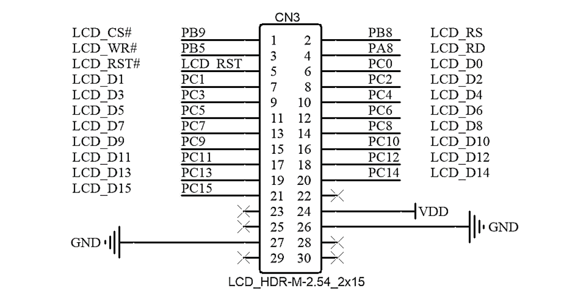
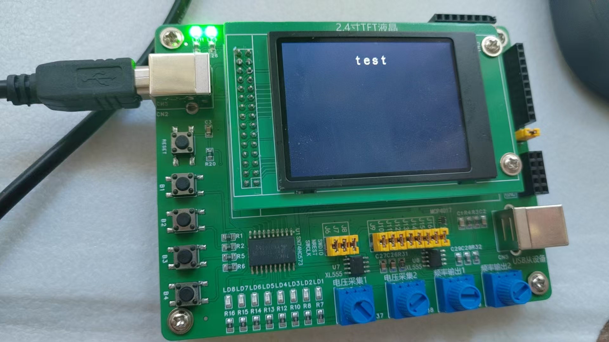

# 备考蓝桥杯嵌入式2：使用LCD完成显示

## LCD

​	LCD（液晶显示器，Liquid Crystal Display）是一种常见的平面显示技术，广泛应用于电视、电脑显示器、手机屏幕等设备。蓝桥杯中，也有涉及到使用LCD来完成字符串显示的要求和操作。

​	考场上会给予LCD的驱动包，所以并不需要我们来书写LCD驱动的开发，直接使用完成赛题任务即可。

## 一些准备

​	我们先打开产品手册，分析一下我们的LCD设计到的电平和引脚。



​	不妙，我们的LCD复用了PC8到PC15的引脚，显然，当我们对LCD发生操作的时候，会跟LED发生装车。具体对LED的分析参考我的博客：[蓝桥杯嵌入式赛道备考1 —— 基础GPIO实战-CSDN博客](https://blog.csdn.net/charlie114514191/article/details/145414589)。

​	所以，我们需要做的，首先是在操作LCD的时候，对GPIOC端口的使能进行压栈，然后恢复。笔者考察后，发现最后只有三个函数作为LCD的底层操作是需要做保存处理的。他们分别是：

```
void LCD_WriteRAM(u16 RGB_Code);
void LCD_WriteRAM_Prepare(void);
void LCD_WriteReg(u8 LCD_Reg, u16 LCD_RegValue);
```

​	这三个函数分别保存GPIOC的ODR状态值，在结尾进行恢复：

```
    // 保存目前GPIOC的值
    uint16_t temp = GPIOC->ODR;
    // ... 原始代码
    GPIOC->ODR = temp;
```

​	在初始化LCD之前，我们还需要对LED做初始化且关闭所有的LED。所以：

```
  MX_GPIO_Init();	// 初始化PD2，配置为输入模式
  HAL_GPIO_WritePin(GPIOD, GPIO_PIN_2, GPIO_PIN_SET);	// 解锁锁存器
  LED_GPIO_Init();	// 让LED有效的进行带有高电平的初始化，这样就会关闭LED了
  HAL_GPIO_WritePin(GPIOD, GPIO_PIN_2, GPIO_PIN_RESET);	// 对锁存器上锁，不要影响LCD的初始化
  lcdInit();	// LCD的初始化代码，封装了LCD_Init等函数
```

​	完整的魔改LCD驱动代码会放到博客的最后。

## 使用LCD的代码

​	我们下面来尝试的使用LCD的代码。首先，LCD初始化后，会随机显示一些内容，所以，调用LCD驱动包后的LCD_Init函数之后，还需要调用LCD_Clear(Black)来清理内容。我们随后设置LCD是黑底白字作为显示的基准。整体初始化代码如下所示：

```
    //HAL库的初始化
    LCD_Init();
    //设置LCD的背景色
    LCD_Clear(Black);
    //设置LCD字体颜色
    LCD_SetTextColor(White);
    //设置LCD字体的背景色
    LCD_SetBackColor(Black);
```

​	笔者封装了一个lcdInit函数，这样调用就会显得干净一些

```
/******************************************************************************
* 函数功能：LCD初始化
* 函数参数：无
* 函数返回值：无
*******************************************************************************/
void lcdInit(void)
{
    //HAL库的初始化
    LCD_Init();
    //设置LCD的背景色
    LCD_Clear(Black);
    //设置LCD字体颜色
    LCD_SetTextColor(White);
    //设置LCD字体的背景色
    LCD_SetBackColor(Black);
}
```

​	我们下面来居中的显示一个字符串。需要注意的是——这个LCD屏幕一行就只可以显示20个字符。所以，我们方便起见，完全可以准备20个字符的缓冲区，直接使用snprintf安全的格式化打印。笔者准备了一个居中函数。如果有需要可以查阅

```
/******************************************************************************
* 函数功能：LCD居中打印
* 函数参数：u8, provides Lines; char* sources: sources waiting printed
* 函数返回值：无
*******************************************************************************/
#include <string.h>
#include <stdio.h>
char buffer[20];
void lcd_middledisplay(u8 Line, char* sources)
{
    int paddling = (20 - strlen(sources)) / 2;
    snprintf(buffer, 20, "%*s%s%*s", paddling, "", sources,paddling, "");
    LCD_DisplayStringLine(Line, (u8*)buffer);
}
```

​	在主函数中这样使用即可

```
char* sources = "test";
lcd_middledisplay(Line1, sources);
```

​	这样看起来就会干净利落一些。

​	效果图如下所示：



## 附录：修订的LCD驱动代码

> LCD.h

```c
/*
  程序说明: CT117E嵌入式竞赛板LCD驱动程序
  软件环境: Keil uVision 4.10 
  硬件环境: CT117E嵌入式竞赛板
  日    期: 2011-8-9
*/
/* Define to prevent recursive inclusion -------------------------------------*/
#ifndef __LCD_H
#define __LCD_H

/* Includes ------------------------------------------------------------------*/
#include "main.h"
/* Exported types ------------------------------------------------------------*/
/* Exported constants --------------------------------------------------------*/
/* LCD Registers */
#define R0             0x00
#define R1             0x01
#define R2             0x02
#define R3             0x03
#define R4             0x04
#define R5             0x05
#define R6             0x06
#define R7             0x07
#define R8             0x08
#define R9             0x09
#define R10            0x0A
#define R12            0x0C
#define R13            0x0D
#define R14            0x0E
#define R15            0x0F
#define R16            0x10
#define R17            0x11
#define R18            0x12
#define R19            0x13
#define R20            0x14
#define R21            0x15
#define R22            0x16
#define R23            0x17
#define R24            0x18
#define R25            0x19
#define R26            0x1A
#define R27            0x1B
#define R28            0x1C
#define R29            0x1D
#define R30            0x1E
#define R31            0x1F
#define R32            0x20
#define R33            0x21
#define R34            0x22
#define R36            0x24
#define R37            0x25
#define R40            0x28
#define R41            0x29
#define R43            0x2B
#define R45            0x2D
#define R48            0x30
#define R49            0x31
#define R50            0x32
#define R51            0x33
#define R52            0x34
#define R53            0x35
#define R54            0x36
#define R55            0x37
#define R56            0x38
#define R57            0x39
#define R59            0x3B
#define R60            0x3C
#define R61            0x3D
#define R62            0x3E
#define R63            0x3F
#define R64            0x40
#define R65            0x41
#define R66            0x42
#define R67            0x43
#define R68            0x44
#define R69            0x45
#define R70            0x46
#define R71            0x47
#define R72            0x48
#define R73            0x49
#define R74            0x4A
#define R75            0x4B
#define R76            0x4C
#define R77            0x4D
#define R78            0x4E
#define R79            0x4F
#define R80            0x50
#define R81            0x51
#define R82            0x52
#define R83            0x53
#define R96            0x60
#define R97            0x61
#define R106           0x6A
#define R118           0x76
#define R128           0x80
#define R129           0x81
#define R130           0x82
#define R131           0x83
#define R132           0x84
#define R133           0x85
#define R134           0x86
#define R135           0x87
#define R136           0x88
#define R137           0x89
#define R139           0x8B
#define R140           0x8C
#define R141           0x8D
#define R143           0x8F
#define R144           0x90
#define R145           0x91
#define R146           0x92
#define R147           0x93
#define R148           0x94
#define R149           0x95
#define R150           0x96
#define R151           0x97
#define R152           0x98
#define R153           0x99
#define R154           0x9A
#define R157           0x9D
#define R192           0xC0
#define R193           0xC1
#define R227           0xE3
#define R229           0xE5
#define R231           0xE7
#define R239           0xEF

/* LCD Control pins */
//#define CtrlPin_NCS    GPIO_Pin_9   /* PB.9 */
//#define CtrlPin_RS     GPIO_Pin_8   /* PB.8 */
//#define CtrlPin_NWR    GPIO_Pin_5  /* Pb.5 */
//#define CtrlPin_NRD    GPIO_Pin_10  /* Pb.10 */

/* LCD color */
#define White          0xFFFF
#define Black          0x0000
#define Grey           0xF7DE
#define Blue           0x001F
#define Blue2          0x051F
#define Red            0xF800
#define Magenta        0xF81F
#define Green          0x07E0
#define Cyan           0x7FFF
#define Yellow         0xFFE0

#define Line0          0
#define Line1          24
#define Line2          48
#define Line3          72
#define Line4          96
#define Line5          120
#define Line6          144
#define Line7          168
#define Line8          192
#define Line9          216

#define Horizontal     0x00
#define Vertical       0x01


/* Exported macro ------------------------------------------------------------*/
/* Exported functions ------------------------------------------------------- */
/*----- High layer function -----*/
typedef int32_t  s32;
typedef int16_t s16;
typedef int8_t  s8;
typedef __IO uint32_t  vu32;
typedef __IO uint16_t vu16;
typedef __IO uint8_t  vu8;
typedef uint32_t  u32;
typedef uint16_t u16;
typedef uint8_t  u8;
typedef const uint32_t uc32;  /*!< Read Only */
typedef const uint16_t uc16;  /*!< Read Only */
typedef const uint8_t uc8;   /*!< Read Only */


void LCD_Init(void);
void LCD_SetTextColor(vu16 Color);
void LCD_SetBackColor(vu16 Color);
void LCD_ClearLine(u8 Line);
void LCD_Clear(u16 Color);
void LCD_SetCursor(u8 Xpos, u16 Ypos);
void LCD_DrawChar(u8 Xpos, u16 Ypos, uc16 *c);
void LCD_DisplayChar(u8 Line, u16 Column, u8 Ascii);
void LCD_DisplayStringLine(u8 Line, u8 *ptr);
void LCD_SetDisplayWindow(u8 Xpos, u16 Ypos, u8 Height, u16 Width);
void LCD_WindowModeDisable(void);
void LCD_DrawLine(u8 Xpos, u16 Ypos, u16 Length, u8 Direction);
void LCD_DrawRect(u8 Xpos, u16 Ypos, u8 Height, u16 Width);
void LCD_DrawCircle(u8 Xpos, u16 Ypos, u16 Radius);
void LCD_DrawMonoPict(uc32 *Pict);
void LCD_WriteBMP(u32 BmpAddress);
void LCD_DrawBMP(u32 BmpAddress);
void LCD_DrawPicture(const u8* picture);

/*----- Medium layer function -----*/
void LCD_WriteReg(u8 LCD_Reg, u16 LCD_RegValue);
u16 LCD_ReadReg(u8 LCD_Reg);
void LCD_WriteRAM_Prepare(void);
void LCD_WriteRAM(u16 RGB_Code);
u16 LCD_ReadRAM(void);
void LCD_PowerOn(void);
void LCD_DisplayOn(void);
void LCD_DisplayOff(void);

/*----- Low layer function -----*/
void LCD_CtrlLinesConfig(void);

void LCD_BusIn(void);
void LCD_BusOut(void);

/*------ 自定义程序 ------------*/
/******************************************************************************
* 函数功能：LCD初始化
* 函数参数：无
* 函数返回值：无
*******************************************************************************/
void lcdInit(void);
void lcd_middledisplay(u8 Line, char* sources);
#endif /* __LCD_H */

/******************* (C) COPYRIGHT 2008 STMicroelectronics *****END OF FILE****/
```

> LCD.c

```c
/*
  程序说明: CT117E嵌入式竞赛板LCD驱动程序
  软件环境: Keil uVision 4.10
  硬件环境: CT117E嵌入式竞赛板
  日    期: 2011-8-9
*/
#include "lcd.h"
#include "fonts.h"
//#include "systick.h"
static  vu16 TextColor = 0x0000, BackColor = 0xFFFF;
vu16 dummy;

/*******************************************************************************
* Function Name  : Delay_LCD
* Description    : Inserts a delay time.
* Input          : nCount: specifies the delay time length.
* Output         : None
* Return         : None
*******************************************************************************/
void Delay_LCD(u16 n)
{
    u16 i,j;
    for (i = 0; i<n; ++i)
        for(j=0; j<3000; ++j);
}

/*
	uC8230型液晶控制器寄存器配置
*/
void REG_8230_Init(void)
{
    LCD_WriteReg(0x0000,0x0001);
    Delay_LCD(1000);
    LCD_WriteReg(0x0001,0x0000);
    LCD_WriteReg(0x0010,0x1790);
    LCD_WriteReg(0x0060,0x2700);
    LCD_WriteReg(0x0061,0x0001);
    LCD_WriteReg(0x0046,0x0002);
    LCD_WriteReg(0x0013,0x8010);
    LCD_WriteReg(0x0012,0x80fe);
    LCD_WriteReg(0x0002,0x0500);
    LCD_WriteReg(0x0003,0x1030);

    LCD_WriteReg(0x0030,0x0303);
    LCD_WriteReg(0x0031,0x0303);
    LCD_WriteReg(0x0032,0x0303);
    LCD_WriteReg(0x0033,0x0300);
    LCD_WriteReg(0x0034,0x0003);
    LCD_WriteReg(0x0035,0x0303);
    LCD_WriteReg(0x0036,0x0014);
    LCD_WriteReg(0x0037,0x0303);
    LCD_WriteReg(0x0038,0x0303);
    LCD_WriteReg(0x0039,0x0303);
    LCD_WriteReg(0x003a,0x0300);
    LCD_WriteReg(0x003b,0x0003);
    LCD_WriteReg(0x003c,0x0303);
    LCD_WriteReg(0x003d,0x1400);

    LCD_WriteReg(0x0092,0x0200);
    LCD_WriteReg(0x0093,0x0303);
    LCD_WriteReg(0x0090,0x080d);
    LCD_WriteReg(0x0003,0x1018);
    LCD_WriteReg(0x0007,0x0173);
}

void REG_932X_Init(void)
{
    LCD_WriteReg(R227, 0x3008);   // Set internal timing
    LCD_WriteReg(R231, 0x0012); // Set internal timing
    LCD_WriteReg(R239, 0x1231);   // Set internal timing
    LCD_WriteReg(R1, 0x0000);   // set SS and SM bit		  //0x0100
    LCD_WriteReg(R2, 0x0700);   // set 1 line inversion
    LCD_WriteReg(R3, 0x1030);     // set GRAM write direction and BGR=1.
    LCD_WriteReg(R4, 0x0000);     // Resize register
    LCD_WriteReg(R8, 0x0207);     // set the back porch and front porch
    LCD_WriteReg(R9, 0x0000);     // set non-display area refresh cycle ISC[3:0]
    LCD_WriteReg(R10, 0x0000);    // FMARK function
    LCD_WriteReg(R12, 0x0000);  // RGB interface setting
    LCD_WriteReg(R13, 0x0000);    // Frame marker Position
    LCD_WriteReg(R15, 0x0000);  // RGB interface polarity
    /**************Power On sequence ****************/
    LCD_WriteReg(R16, 0x0000);    // SAP, BT[3:0], AP, DSTB, SLP, STB
    LCD_WriteReg(R17, 0x0007);    // DC1[2:0], DC0[2:0], VC[2:0]
    LCD_WriteReg(R18, 0x0000);  // VREG1OUT voltage
    LCD_WriteReg(R19, 0x0000);    // VDV[4:0] for VCOM amplitude
//	Delay_Ms(200);                    // Delay 200 MS , Dis-charge capacitor power voltage
    HAL_Delay(200);
    LCD_WriteReg(R16, 0x1690);    // SAP, BT[3:0], AP, DSTB, SLP, STB
    LCD_WriteReg(R17, 0x0227);  // R11H=0x0221 at VCI=3.3V, DC1[2:0], DC0[2:0], VC[2:0]
//	Delay_Ms(50);      // Delay 50ms
    HAL_Delay(50);
    LCD_WriteReg(R18, 0x001D);  // External reference voltage= Vci;
//	Delay_Ms(50);      // Delay 50ms
    HAL_Delay(50);
    LCD_WriteReg(R19, 0x0800);  // R13H=1D00 when R12H=009D;VDV[4:0] for VCOM amplitude
    LCD_WriteReg(R41, 0x0014);  // R29H=0013 when R12H=009D;VCM[5:0] for VCOMH
    LCD_WriteReg(R43, 0x000B);    // Frame Rate = 96Hz
//	Delay_Ms(50);      // Delay 50ms
    HAL_Delay(50);
    LCD_WriteReg(R32, 0x0000);  // GRAM horizontal Address
    LCD_WriteReg(R33, 0x0000);  // GRAM Vertical Address
    /* ----------- Adjust the Gamma Curve ---------- */
    LCD_WriteReg(R48, 0x0007);
    LCD_WriteReg(R49, 0x0707);
    LCD_WriteReg(R50, 0x0006);
    LCD_WriteReg(R53, 0x0704);
    LCD_WriteReg(R54, 0x1F04);
    LCD_WriteReg(R55, 0x0004);
    LCD_WriteReg(R56, 0x0000);
    LCD_WriteReg(R57, 0x0706);
    LCD_WriteReg(R60, 0x0701);
    LCD_WriteReg(R61, 0x000F);
    /* ------------------ Set GRAM area --------------- */
    LCD_WriteReg(R80, 0x0000);    // Horizontal GRAM Start Address
    LCD_WriteReg(R81, 0x00EF);    // Horizontal GRAM End Address
    LCD_WriteReg(R82, 0x0000);  // Vertical GRAM Start Address
    LCD_WriteReg(R83, 0x013F);  // Vertical GRAM Start Address
    LCD_WriteReg(R96, 0x2700);  // Gate Scan Line		  0xA700
    LCD_WriteReg(R97, 0x0001);  // NDL,VLE, REV
    LCD_WriteReg(R106, 0x0000); // set scrolling line
    /* -------------- Partial Display Control --------- */
    LCD_WriteReg(R128, 0x0000);
    LCD_WriteReg(R129, 0x0000);
    LCD_WriteReg(R130, 0x0000);
    LCD_WriteReg(R131, 0x0000);
    LCD_WriteReg(R132, 0x0000);
    LCD_WriteReg(R133, 0x0000);
    /* -------------- Panel Control ------------------- */
    LCD_WriteReg(R144, 0x0010);
    LCD_WriteReg(R146, 0x0000);
    LCD_WriteReg(R147, 0x0003);
    LCD_WriteReg(R149, 0x0110);
    LCD_WriteReg(R151, 0x0000);
    LCD_WriteReg(R152, 0x0000);
    /* Set GRAM write direction and BGR = 1 */
    /* I/D=01 (Horizontal : increment, Vertical : decrement) */
    /* AM=1 (address is updated in vertical writing direction) */
    LCD_WriteReg(R3, 0x01018);    //0x1018

    LCD_WriteReg(R7, 0x0173);   // 262K color and display ON
}
/*******************************************************************************
* Function Name  : STM3210B_LCD_Init
* Description    : Initializes the LCD.
* Input          : None
* Output         : None
* Return         : None
*******************************************************************************/
void LCD_Init(void)
{
    LCD_CtrlLinesConfig();
    dummy = LCD_ReadReg(0);
    if(dummy == 0x8230) {
        REG_8230_Init();
    }
    else {
        REG_932X_Init();
    }
    dummy = LCD_ReadReg(0);
}
/*******************************************************************************
* Function Name  : LCD_SetTextColor
* Description    : Sets the Text color.
* Input          : - Color: specifies the Text color code RGB(5-6-5).
* Output         : - TextColor: Text color global variable used by LCD_DrawChar
*                  and LCD_DrawPicture functions.
* Return         : None
*******************************************************************************/
void LCD_SetTextColor(vu16 Color)
{
    TextColor = Color;
}
/*******************************************************************************
* Function Name  : LCD_SetBackColor
* Description    : Sets the Background color.
* Input          : - Color: specifies the Background color code RGB(5-6-5).
* Output         : - BackColor: Background color global variable used by
*                  LCD_DrawChar and LCD_DrawPicture functions.
* Return         : None
*******************************************************************************/
void LCD_SetBackColor(vu16 Color)
{
    BackColor = Color;
}
/*******************************************************************************
* Function Name  : LCD_ClearLine
* Description    : Clears the selected line.
* Input          : - Line: the Line to be cleared.
*                    This parameter can be one of the following values:
*                       - Linex: where x can be 0..9
* Output         : None
* Return         : None
*******************************************************************************/
void LCD_ClearLine(u8 Line)
{
    LCD_DisplayStringLine(Line,(uint8_t*) "                    ");
}
/*******************************************************************************
* Function Name  : LCD_Clear
* Description    : Clears the hole LCD.
* Input          : Color: the color of the background.
* Output         : None
* Return         : None
*******************************************************************************/
void LCD_Clear(u16 Color)
{
    u32 index = 0;
    LCD_SetCursor(0x00, 0x0000);
    LCD_WriteRAM_Prepare(); /* Prepare to write GRAM */
    for(index = 0; index < 76800; index++)
    {
        LCD_WriteRAM(Color);
    }
}
/*******************************************************************************
* Function Name  : LCD_SetCursor
* Description    : Sets the cursor position.
* Input          : - Xpos: specifies the X position.
*                  - Ypos: specifies the Y position.
* Output         : None
* Return         : None
*******************************************************************************/
void LCD_SetCursor(u8 Xpos, u16 Ypos)
{
    LCD_WriteReg(R32, Xpos);
    LCD_WriteReg(R33, Ypos);
}
/*******************************************************************************
* Function Name  : LCD_DrawChar
* Description    : Draws a character on LCD.
* Input          : - Xpos: the Line where to display the character shape.
*                    This parameter can be one of the following values:
*                       - Linex: where x can be 0..9
*                  - Ypos: start column address.
*                  - c: pointer to the character data.
* Output         : None
* Return         : None
*******************************************************************************/
void LCD_DrawChar(u8 Xpos, u16 Ypos, uc16 *c)
{
    u32 index = 0, i = 0;
    u8 Xaddress = 0;

    Xaddress = Xpos;
    LCD_SetCursor(Xaddress, Ypos);

    for(index = 0; index < 24; index++)
    {
        LCD_WriteRAM_Prepare(); /* Prepare to write GRAM */
        for(i = 0; i < 16; i++)
        {
            if((c[index] & (1 << i)) == 0x00)
            {
                LCD_WriteRAM(BackColor);
            }
            else
            {
                LCD_WriteRAM(TextColor);
            }
        }
        Xaddress++;
        LCD_SetCursor(Xaddress, Ypos);
    }
}
/*******************************************************************************
* Function Name  : LCD_DisplayChar
* Description    : Displays one character (16dots width, 24dots height).
* Input          : - Line: the Line where to display the character shape .
*                    This parameter can be one of the following values:
*                       - Linex: where x can be 0..9
*                  - Column: start column address.
*                  - Ascii: character ascii code, must be between 0x20 and 0x7E.
* Output         : None
* Return         : None
*******************************************************************************/
void LCD_DisplayChar(u8 Line, u16 Column, u8 Ascii)
{
    Ascii -= 32;
    LCD_DrawChar(Line, Column, &ASCII_Table[Ascii * 24]);
}
/*******************************************************************************
* Function Name  : LCD_DisplayStringLine
* Description    : Displays a maximum of 20 char on the LCD.
* Input          : - Line: the Line where to display the character shape .
*                    This parameter can be one of the following values:
*                       - Linex: where x can be 0..9
*                  - *ptr: pointer to string to display on LCD.
* Output         : None
* Return         : None
*******************************************************************************/
void LCD_DisplayStringLine(u8 Line, u8 *ptr)
{
    u32 i = 0;
    u16 refcolumn = 319;//319;

    while ((*ptr != 0) && (i < 20))	 //	20
    {
        LCD_DisplayChar(Line, refcolumn, *ptr);
        refcolumn -= 16;
        ptr++;
        i++;
    }
}
/*******************************************************************************
* Function Name  : LCD_SetDisplayWindow
* Description    : Sets a display window
* Input          : - Xpos: specifies the X buttom left position.
*                  - Ypos: specifies the Y buttom left position.
*                  - Height: display window height.
*                  - Width: display window width.
* Output         : None
* Return         : None
*******************************************************************************/
void LCD_SetDisplayWindow(u8 Xpos, u16 Ypos, u8 Height, u16 Width)
{
    if(Xpos >= Height)
    {
        LCD_WriteReg(R80, (Xpos - Height + 1));
    }
    else
    {
        LCD_WriteReg(R80, 0);
    }
    LCD_WriteReg(R81, Xpos);
    if(Ypos >= Width)
    {
        LCD_WriteReg(R82, (Ypos - Width + 1));
    }
    else
    {
        LCD_WriteReg(R82, 0);
    }
    /* Vertical GRAM End Address */
    LCD_WriteReg(R83, Ypos);
    LCD_SetCursor(Xpos, Ypos);
}
/*******************************************************************************
* Function Name  : LCD_WindowModeDisable
* Description    : Disables LCD Window mode.
* Input          : None
* Output         : None
* Return         : None
*******************************************************************************/
void LCD_WindowModeDisable(void)
{
    LCD_SetDisplayWindow(239, 0x13F, 240, 320);
    LCD_WriteReg(R3, 0x1018);
}
/*******************************************************************************
* Function Name  : LCD_DrawLine
* Description    : Displays a line.
* Input          : - Xpos: specifies the X position.
*                  - Ypos: specifies the Y position.
*                  - Length: line length.
*                  - Direction: line direction.
*                    This parameter can be one of the following values: Vertical
*                    or Horizontal.
* Output         : None
* Return         : None
*******************************************************************************/
void LCD_DrawLine(u8 Xpos, u16 Ypos, u16 Length, u8 Direction)
{
    u32 i = 0;

    LCD_SetCursor(Xpos, Ypos);
    if(Direction == Horizontal)
    {
        LCD_WriteRAM_Prepare(); /* Prepare to write GRAM */
        for(i = 0; i < Length; i++)
        {
            LCD_WriteRAM(TextColor);
        }
    }
    else
    {
        for(i = 0; i < Length; i++)
        {
            LCD_WriteRAM_Prepare(); /* Prepare to write GRAM */
            LCD_WriteRAM(TextColor);
            Xpos++;
            LCD_SetCursor(Xpos, Ypos);
        }
    }
}
/*******************************************************************************
* Function Name  : LCD_DrawRect
* Description    : Displays a rectangle.
* Input          : - Xpos: specifies the X position.
*                  - Ypos: specifies the Y position.
*                  - Height: display rectangle height.
*                  - Width: display rectangle width.
* Output         : None
* Return         : None
*******************************************************************************/
void LCD_DrawRect(u8 Xpos, u16 Ypos, u8 Height, u16 Width)
{
    LCD_DrawLine(Xpos, Ypos, Width, Horizontal);
    LCD_DrawLine((Xpos + Height), Ypos, Width, Horizontal);

    LCD_DrawLine(Xpos, Ypos, Height, Vertical);
    LCD_DrawLine(Xpos, (Ypos - Width + 1), Height, Vertical);
}
/*******************************************************************************
* Function Name  : LCD_DrawCircle
* Description    : Displays a circle.
* Input          : - Xpos: specifies the X position.
*                  - Ypos: specifies the Y position.
*                  - Height: display rectangle height.
*                  - Width: display rectangle width.
* Output         : None
* Return         : None
*******************************************************************************/
void LCD_DrawCircle(u8 Xpos, u16 Ypos, u16 Radius)
{
    s32  D;
    u32  CurX;
    u32  CurY;

    D = 3 - (Radius << 1);
    CurX = 0;
    CurY = Radius;

    while (CurX <= CurY)
    {
        LCD_SetCursor(Xpos + CurX, Ypos + CurY);
        LCD_WriteRAM_Prepare(); /* Prepare to write GRAM */
        LCD_WriteRAM(TextColor);

        LCD_SetCursor(Xpos + CurX, Ypos - CurY);
        LCD_WriteRAM_Prepare(); /* Prepare to write GRAM */
        LCD_WriteRAM(TextColor);

        LCD_SetCursor(Xpos - CurX, Ypos + CurY);
        LCD_WriteRAM_Prepare(); /* Prepare to write GRAM */
        LCD_WriteRAM(TextColor);

        LCD_SetCursor(Xpos - CurX, Ypos - CurY);
        LCD_WriteRAM_Prepare(); /* Prepare to write GRAM */
        LCD_WriteRAM(TextColor);

        LCD_SetCursor(Xpos + CurY, Ypos + CurX);
        LCD_WriteRAM_Prepare(); /* Prepare to write GRAM */
        LCD_WriteRAM(TextColor);

        LCD_SetCursor(Xpos + CurY, Ypos - CurX);
        LCD_WriteRAM_Prepare(); /* Prepare to write GRAM */
        LCD_WriteRAM(TextColor);

        LCD_SetCursor(Xpos - CurY, Ypos + CurX);
        LCD_WriteRAM_Prepare(); /* Prepare to write GRAM */
        LCD_WriteRAM(TextColor);

        LCD_SetCursor(Xpos - CurY, Ypos - CurX);
        LCD_WriteRAM_Prepare(); /* Prepare to write GRAM */
        LCD_WriteRAM(TextColor);

        if (D < 0)
        {
            D += (CurX << 2) + 6;
        }
        else
        {
            D += ((CurX - CurY) << 2) + 10;
            CurY--;
        }
        CurX++;
    }
}
/*******************************************************************************
* Function Name  : LCD_DrawMonoPict
* Description    : Displays a monocolor picture.
* Input          : - Pict: pointer to the picture array.
* Output         : None
* Return         : None
*******************************************************************************/
void LCD_DrawMonoPict(uc32 *Pict)
{
    u32 index = 0, i = 0;

    LCD_SetCursor(0, 319);

    LCD_WriteRAM_Prepare(); /* Prepare to write GRAM */
    for(index = 0; index < 2400; index++)
    {
        for(i = 0; i < 32; i++)
        {
            if((Pict[index] & (1 << i)) == 0x00)
            {
                LCD_WriteRAM(BackColor);
            }
            else
            {
                LCD_WriteRAM(TextColor);
            }
        }
    }
}
/*******************************************************************************
* Function Name  : LCD_WriteBMP
* Description    : Displays a bitmap picture loaded in the internal Flash.
* Input          : - BmpAddress: Bmp picture address in the internal Flash.
* Output         : None
* Return         : None
*******************************************************************************/
void LCD_WriteBMP(u32 BmpAddress)
{
    u32 index = 0, size = 0;

    size = *(vu16 *) (BmpAddress + 2);
    size |= (*(vu16 *) (BmpAddress + 4)) << 16;

    index = *(vu16 *) (BmpAddress + 10);
    index |= (*(vu16 *) (BmpAddress + 12)) << 16;
    size = (size - index)/2;
    BmpAddress += index;

    LCD_WriteReg(R3, 0x1008);
    LCD_WriteRAM_Prepare();
    for(index = 0; index < size; index++)
    {
        LCD_WriteRAM(*(vu16 *)BmpAddress);
        BmpAddress += 2;
    }
    LCD_WriteReg(R3, 0x1018);
}

/*******************************************************************************
* Function Name  : LCD_WriteReg
* Description    : Writes to the selected LCD register.
* Input          : - LCD_Reg: address of the selected register.
*                  - LCD_RegValue: value to write to the selected register.
* Output         : None
* Return         : None
*******************************************************************************/
void LCD_WriteReg(u8 LCD_Reg, u16 LCD_RegValue)
{
    // 保存目前GPIOC的值
    uint16_t temp = GPIOC->ODR;

    GPIOB->BRR  |= GPIO_PIN_9;
    GPIOB->BRR  |= GPIO_PIN_8;
    GPIOB->BSRR |= GPIO_PIN_5;

    GPIOC->ODR = LCD_Reg;
    GPIOB->BRR  |= GPIO_PIN_5;
    __nop();
    __nop();
    __nop();
    GPIOB->BSRR |= GPIO_PIN_5;
    GPIOB->BSRR |= GPIO_PIN_8;

    GPIOC->ODR = LCD_RegValue;
    GPIOB->BRR  |= GPIO_PIN_5;
    __nop();
    __nop();
    __nop();
    GPIOB->BSRR |= GPIO_PIN_5;
    GPIOB->BSRR |= GPIO_PIN_8;

    // 恢复以前保存GPIOC的值
    GPIOC->ODR = temp;
}
/*******************************************************************************
* Function Name  : LCD_ReadReg
* Description    : Reads the selected LCD Register.
* Input          : None
* Output         : None
* Return         : LCD Register Value.
*******************************************************************************/
u16 LCD_ReadReg(u8 LCD_Reg)
{
    u16 temp;

    GPIOB->BRR |= GPIO_PIN_9;
    GPIOB->BRR |= GPIO_PIN_8;
    GPIOB->BSRR |= GPIO_PIN_5;

    GPIOC->ODR = LCD_Reg;
    GPIOB->BRR |= GPIO_PIN_5;
    __nop();
    __nop();
    __nop();
    GPIOB->BSRR |= GPIO_PIN_5;
    GPIOB->BSRR |= GPIO_PIN_8;

    LCD_BusIn();
    GPIOA->BRR |= GPIO_PIN_8;
    __nop();
    __nop();
    __nop();
    temp = GPIOC->IDR;
    GPIOA->BSRR |= GPIO_PIN_8;

    LCD_BusOut();
    GPIOB->BSRR |= GPIO_PIN_9;

    return temp;
}
/*******************************************************************************
* Function Name  : LCD_WriteRAM_Prepare
* Description    : Prepare to write to the LCD RAM.
* Input          : None
* Output         : None
* Return         : None
*******************************************************************************/
void LCD_WriteRAM_Prepare(void)
{
    // 保存目前GPIOC的值
    u16 temp = GPIOC->ODR;

    GPIOB->BRR  |=  GPIO_PIN_9;
    GPIOB->BRR  |=  GPIO_PIN_8;
    GPIOB->BSRR |=  GPIO_PIN_5;

    GPIOC->ODR = R34;
    GPIOB->BRR  |=  GPIO_PIN_5;
    __nop();
    __nop();
    __nop();
    GPIOB->BSRR |=  GPIO_PIN_5;
    GPIOB->BSRR |=  GPIO_PIN_8;
    __nop();
    __nop();
    __nop();
    GPIOB->BSRR |=  GPIO_PIN_9;

    // 恢复以前保存GPIOC的值
    GPIOC->ODR = temp;
}
/*******************************************************************************
* Function Name  : LCD_WriteRAM
* Description    : Writes to the LCD RAM.
* Input          : - RGB_Code: the pixel color in RGB mode (5-6-5).
* Output         : None
* Return         : None
*******************************************************************************/
void LCD_WriteRAM(u16 RGB_Code)
{
    // 保存目前GPIOC的值
    u16 temp = GPIOC->ODR;

    GPIOB->BRR  |=  GPIO_PIN_9;
    GPIOB->BSRR |=  GPIO_PIN_8;
    GPIOB->BSRR |=  GPIO_PIN_5;

    GPIOC->ODR = RGB_Code;
    GPIOB->BRR  |=  GPIO_PIN_5;
    __nop();
    __nop();
    __nop();
    GPIOB->BSRR |=  GPIO_PIN_5;
    GPIOB->BSRR |=  GPIO_PIN_8;
    __nop();
    __nop();
    __nop();
    GPIOB->BSRR |=  GPIO_PIN_9;

    // 恢复以前保存GPIOC的值
    GPIOC->ODR = temp;
}
/*******************************************************************************
* Function Name  : LCD_ReadRAM
* Description    : Reads the LCD RAM.
* Input          : None
* Output         : None
* Return         : LCD RAM Value.
*******************************************************************************/
u16 LCD_ReadRAM(void)
{
    u16 temp;

    GPIOB->BRR  |=  GPIO_PIN_9;
    GPIOB->BRR  |=  GPIO_PIN_8;
    GPIOB->BSRR |=  GPIO_PIN_5;

    GPIOC->ODR = R34;
    GPIOB->BRR  |=  GPIO_PIN_5;
    __nop();
    __nop();
    __nop();
    GPIOB->BSRR |=  GPIO_PIN_5;
    GPIOB->BSRR |=  GPIO_PIN_8;

    LCD_BusIn();
    GPIOA->BRR |=  GPIO_PIN_8;
    __nop();
    __nop();
    __nop();
    temp = GPIOC->IDR;
    GPIOA->BSRR |=  GPIO_PIN_8;

    LCD_BusOut();
    GPIOB->BSRR |=  GPIO_PIN_9;

    return temp;
}
/*******************************************************************************
* Function Name  : LCD_PowerOn
* Description    : Power on the LCD.
* Input          : None
* Output         : None
* Return         : None
*******************************************************************************/
void LCD_PowerOn(void)
{
    LCD_WriteReg(R16, 0x0000);
    LCD_WriteReg(R17, 0x0000);
    LCD_WriteReg(R18, 0x0000);
    LCD_WriteReg(R19, 0x0000);
    Delay_LCD(20);
    LCD_WriteReg(R16, 0x17B0);
    LCD_WriteReg(R17, 0x0137);
    Delay_LCD(5);
    LCD_WriteReg(R18, 0x0139);
    Delay_LCD(5);
    LCD_WriteReg(R19, 0x1d00);
    LCD_WriteReg(R41, 0x0013);
    Delay_LCD(5);
    LCD_WriteReg(R7, 0x0173);
}
/*******************************************************************************
* Function Name  : LCD_DisplayOn
* Description    : Enables the Display.
* Input          : None
* Output         : None
* Return         : None
*******************************************************************************/
void LCD_DisplayOn(void)
{
    LCD_WriteReg(R7, 0x0173);
}
/*******************************************************************************
* Function Name  : LCD_DisplayOff
* Description    : Disables the Display.
* Input          : None
* Output         : None
* Return         : None
*******************************************************************************/
void LCD_DisplayOff(void)
{
    LCD_WriteReg(R7, 0x0);
}
/*******************************************************************************
* Function Name  : LCD_CtrlLinesConfig
* Description    : Configures LCD Control lines.
                   Push-Pull mode.
* Input          : None
* Output         : None
* Return         : None
*******************************************************************************/
void LCD_CtrlLinesConfig(void)
{
    GPIO_InitTypeDef GPIO_InitStruct = {0};

    __HAL_RCC_GPIOC_CLK_ENABLE();
    __HAL_RCC_GPIOA_CLK_ENABLE();
    __HAL_RCC_GPIOB_CLK_ENABLE();

    GPIO_InitStruct.Pin = GPIO_PIN_5 | GPIO_PIN_8 | GPIO_PIN_9;
    GPIO_InitStruct.Mode = GPIO_MODE_OUTPUT_PP;
    GPIO_InitStruct.Speed = GPIO_SPEED_FREQ_LOW;
    GPIO_InitStruct.Pull = GPIO_NOPULL;
    HAL_GPIO_Init(GPIOB, &GPIO_InitStruct);

    GPIO_InitStruct.Pin =  GPIO_PIN_8 ;
    GPIO_InitStruct.Mode = GPIO_MODE_OUTPUT_PP;
    GPIO_InitStruct.Speed = GPIO_SPEED_FREQ_LOW;
    GPIO_InitStruct.Pull = GPIO_NOPULL;
    HAL_GPIO_Init(GPIOA, &GPIO_InitStruct);

    LCD_BusOut();

    GPIOA->BSRR |= 0x0100;
    GPIOB->BSRR |= 0x0220;
}

/*******************************************************************************
* Function Name  : LCD_BusIn
* Description    : Configures the Parallel interface for LCD(PortC)
* Input          : None
* Output         : None
* Return         : None
*******************************************************************************/
void LCD_BusIn(void)
{
    GPIO_InitTypeDef GPIO_InitStruct = {0};

    GPIO_InitStruct.Pin = GPIO_PIN_All;
    GPIO_InitStruct.Mode = GPIO_MODE_INPUT;
    GPIO_InitStruct.Speed = GPIO_SPEED_FREQ_VERY_HIGH;
    GPIO_InitStruct.Pull = GPIO_NOPULL;
    HAL_GPIO_Init(GPIOC, &GPIO_InitStruct);
}

/*******************************************************************************
* Function Name  : LCD_BusOut
* Description    : Configures the Parallel interface for LCD(PortC)
* Input          : None
* Output         : None
* Return         : None
*******************************************************************************/
void LCD_BusOut(void)
{
    GPIO_InitTypeDef GPIO_InitStruct = {0};

    GPIO_InitStruct.Pin = GPIO_PIN_All;
    GPIO_InitStruct.Mode = GPIO_MODE_OUTPUT_PP;
    GPIO_InitStruct.Speed = GPIO_SPEED_FREQ_VERY_HIGH;
    GPIO_InitStruct.Pull = GPIO_NOPULL;
    HAL_GPIO_Init(GPIOC, &GPIO_InitStruct);
}

/*******************************************************************************
* Function Name  : LCD_DrawPicture
* Description    : Displays a 16 color picture.
* Input          : - picture: pointer to the picture array.
* Output         : None
* Return         : None
*******************************************************************************/
void LCD_DrawPicture(const u8* picture)
{
    int index;
    LCD_SetCursor(0x00, 0x0000);

    LCD_WriteRAM_Prepare(); /* Prepare to write GRAM */

    for(index = 0; index < 76800; index++)
    {
        LCD_WriteRAM(picture[2*index+1]<<8|picture[2*index]);
    }
}

/******************************************************************************
* 函数功能：LCD初始化
* 函数参数：无
* 函数返回值：无
*******************************************************************************/
void lcdInit(void)
{
    //HAL库的初始化
    LCD_Init();
    //设置LCD的背景色
    LCD_Clear(Black);
    //设置LCD字体颜色
    LCD_SetTextColor(White);
    //设置LCD字体的背景色
    LCD_SetBackColor(Black);
}

/******************************************************************************
* 函数功能：LCD居中打印
* 函数参数：无
* 函数返回值：无
*******************************************************************************/
#include <string.h>
#include <stdio.h>
char buffer[20];
void lcd_middledisplay(u8 Line, char* sources)
{
    int paddling = (20 - strlen(sources)) / 2;
    snprintf(buffer, 20, "%*s%s%*s", paddling, "", sources,paddling, "");
    LCD_DisplayStringLine(Line, (u8*)buffer);
}
```

> font,h

```
/*
  程序说明: CT117E嵌入式竞赛板LCD驱动程序
  软件环境: Keil uVision 4.10 
  硬件环境: CT117E嵌入式竞赛板
  日    期: 2011-8-9
*/
/* Define to prevent recursive inclusion -------------------------------------*/
#ifndef __FONTS_H
#define __FONTS_H


/* Includes ------------------------------------------------------------------*/
#include "main.h"

typedef const uint16_t uc16;  /*!< Read Only */

/* Exported types ------------------------------------------------------------*/
     /* ASCII Table: each character is 16 column (16dots large) 
        and 24 raw (24 dots high) */
     uc16 ASCII_Table[] =
       {
         /* Space ' ' */
		 //0x0000,0x0000,0x0000,0x0FF8,0x4808,0x4808,0x4808,0x4B88 ,
         //0x4A48,0x4A4C,0x4A44,0x4A44,0x4A44,0x4A44,0x4A64,0x4B24 ,
        // 0x4924,0x4824,0x49E4,0x4E04,0x4004,0x6004,0x3FFC,0x0000 ,
         0x0000, 0x0000, 0x0000, 0x0000, 0x0000, 0x0000, 0x0000, 0x0000,
         0x0000, 0x0000, 0x0000, 0x0000, 0x0000, 0x0000, 0x0000, 0x0000,
         0x0000, 0x0000, 0x0000, 0x0000, 0x0000, 0x0000, 0x0000, 0x0000,

		     //0x0000, 0xC000, 0xE001, 0x3003, 0xD81E, 0xCC18, 0xC438, 0xC000,
        // 0xC000, 0xC002, 0xC000, 0xC000, 0xC000, 0xC000, 0xC000, 0xC000,
        // 0xC000, 0xC000, 0xFFFF, 0xFFFF, 0xFFFF, 0xFFFF, 0x0000, 0x0000,
         /* '!' */
         0x0000, 0x0180, 0x0180, 0x0180, 0x0180, 0x0180, 0x0180, 0x0180,
         0x0180, 0x0180, 0x0180, 0x0180, 0x0180, 0x0180, 0x0000, 0x0000,
         0x0180, 0x0180, 0x0000, 0x0000, 0x0000, 0x0000, 0x0000, 0x0000,
         /* '"' */
         0x0000, 0x0000, 0x00CC, 0x00CC, 0x00CC, 0x00CC, 0x00CC, 0x00CC,
         0x0000, 0x0000, 0x0000, 0x0000, 0x0000, 0x0000, 0x0000, 0x0000,
         0x0000, 0x0000, 0x0000, 0x0000, 0x0000, 0x0000, 0x0000, 0x0000,
         /* '#' */
         0x0000, 0x0000, 0x0000, 0x0000, 0x0000, 0x0000, 0x0C60, 0x0C60,
         0x0C60, 0x0630, 0x0630, 0x1FFE, 0x1FFE, 0x0630, 0x0738, 0x0318,
         0x1FFE, 0x1FFE, 0x0318, 0x0318, 0x018C, 0x018C, 0x018C, 0x0000,
         /* '$' */
         0x0000, 0x0080, 0x03E0, 0x0FF8, 0x0E9C, 0x1C8C, 0x188C, 0x008C,
         0x0098, 0x01F8, 0x07E0, 0x0E80, 0x1C80, 0x188C, 0x188C, 0x189C,
         0x0CB8, 0x0FF0, 0x03E0, 0x0080, 0x0080, 0x0000, 0x0000, 0x0000,
         /* '%' */
         0x0000, 0x0000, 0x0000, 0x180E, 0x0C1B, 0x0C11, 0x0611, 0x0611,
         0x0311, 0x0311, 0x019B, 0x018E, 0x38C0, 0x6CC0, 0x4460, 0x4460,
         0x4430, 0x4430, 0x4418, 0x6C18, 0x380C, 0x0000, 0x0000, 0x0000,
         /* '&' */
         0x0000, 0x01E0, 0x03F0, 0x0738, 0x0618, 0x0618, 0x0330, 0x01F0,
         0x00F0, 0x00F8, 0x319C, 0x330E, 0x1E06, 0x1C06, 0x1C06, 0x3F06,
         0x73FC, 0x21F0, 0x0000, 0x0000, 0x0000, 0x0000, 0x0000, 0x0000,
         /* ''' */
         0x0000, 0x0000, 0x000C, 0x000C, 0x000C, 0x000C, 0x000C, 0x000C,
         0x0000, 0x0000, 0x0000, 0x0000, 0x0000, 0x0000, 0x0000, 0x0000,
         0x0000, 0x0000, 0x0000, 0x0000, 0x0000, 0x0000, 0x0000, 0x0000,
         /* '(' */
         0x0000, 0x0200, 0x0300, 0x0180, 0x00C0, 0x00C0, 0x0060, 0x0060,
         0x0030, 0x0030, 0x0030, 0x0030, 0x0030, 0x0030, 0x0030, 0x0030,
         0x0060, 0x0060, 0x00C0, 0x00C0, 0x0180, 0x0300, 0x0200, 0x0000,
         /* ')' */
         0x0000, 0x0020, 0x0060, 0x00C0, 0x0180, 0x0180, 0x0300, 0x0300,
         0x0600, 0x0600, 0x0600, 0x0600, 0x0600, 0x0600, 0x0600, 0x0600,
         0x0300, 0x0300, 0x0180, 0x0180, 0x00C0, 0x0060, 0x0020, 0x0000,
         /* '*' */
         0x0000, 0x0000, 0x0000, 0x0000, 0x0000, 0x0000, 0x00C0, 0x00C0,
         0x06D8, 0x07F8, 0x01E0, 0x0330, 0x0738, 0x0000, 0x0000, 0x0000,
         0x0000, 0x0000, 0x0000, 0x0000, 0x0000, 0x0000, 0x0000, 0x0000,
         /* '+' */
         0x0000, 0x0000, 0x0000, 0x0000, 0x0000, 0x0000, 0x0180, 0x0180,
         0x0180, 0x0180, 0x0180, 0x3FFC, 0x3FFC, 0x0180, 0x0180, 0x0180,
         0x0180, 0x0180, 0x0000, 0x0000, 0x0000, 0x0000, 0x0000, 0x0000,
         /* ',' */
         0x0000, 0x0000, 0x0000, 0x0000, 0x0000, 0x0000, 0x0000, 0x0000,
         0x0000, 0x0000, 0x0000, 0x0000, 0x0000, 0x0000, 0x0000, 0x0000,
         0x0000, 0x0180, 0x0180, 0x0100, 0x0100, 0x0080, 0x0000, 0x0000,
         /* '-' */
         0x0000, 0x0000, 0x0000, 0x0000, 0x0000, 0x0000, 0x0000, 0x0000,
         0x0000, 0x0000, 0x0000, 0x0000, 0x07E0, 0x07E0, 0x0000, 0x0000,
         0x0000, 0x0000, 0x0000, 0x0000, 0x0000, 0x0000, 0x0000, 0x0000,
         /* '.' */
         0x0000, 0x0000, 0x0000, 0x0000, 0x0000, 0x0000, 0x0000, 0x0000,
         0x0000, 0x0000, 0x0000, 0x0000, 0x0000, 0x0000, 0x0000, 0x0000,
         0x0000, 0x00C0, 0x00C0, 0x0000, 0x0000, 0x0000, 0x0000, 0x0000,
         /* '/' */
         0x0000, 0x0C00, 0x0C00, 0x0600, 0x0600, 0x0600, 0x0300, 0x0300,
         0x0300, 0x0380, 0x0180, 0x0180, 0x0180, 0x00C0, 0x00C0, 0x00C0,
         0x0060, 0x0060, 0x0000, 0x0000, 0x0000, 0x0000, 0x0000, 0x0000,
         /* '0' */
         0x0000, 0x03E0, 0x07F0, 0x0E38, 0x0C18, 0x180C, 0x180C, 0x180C,
         0x180C, 0x180C, 0x180C, 0x180C, 0x180C, 0x180C, 0x0C18, 0x0E38,
         0x07F0, 0x03E0, 0x0000, 0x0000, 0x0000, 0x0000, 0x0000, 0x0000,
         /* '1' */
         0x0000, 0x0100, 0x0180, 0x01C0, 0x01F0, 0x0198, 0x0188, 0x0180,
         0x0180, 0x0180, 0x0180, 0x0180, 0x0180, 0x0180, 0x0180, 0x0180,
         0x0180, 0x0180, 0x0000, 0x0000, 0x0000, 0x0000, 0x0000, 0x0000,
         /* '2' */
         0x0000, 0x03E0, 0x0FF8, 0x0C18, 0x180C, 0x180C, 0x1800, 0x1800,
         0x0C00, 0x0600, 0x0300, 0x0180, 0x00C0, 0x0060, 0x0030, 0x0018,
         0x1FFC, 0x1FFC, 0x0000, 0x0000, 0x0000, 0x0000, 0x0000, 0x0000,
         /* '3' */
         0x0000, 0x01E0, 0x07F8, 0x0E18, 0x0C0C, 0x0C0C, 0x0C00, 0x0600,
         0x03C0, 0x07C0, 0x0C00, 0x1800, 0x1800, 0x180C, 0x180C, 0x0C18,
         0x07F8, 0x03E0, 0x0000, 0x0000, 0x0000, 0x0000, 0x0000, 0x0000,
         /* '4' */
         0x0000, 0x0C00, 0x0E00, 0x0F00, 0x0F00, 0x0D80, 0x0CC0, 0x0C60,
         0x0C60, 0x0C30, 0x0C18, 0x0C0C, 0x3FFC, 0x3FFC, 0x0C00, 0x0C00,
         0x0C00, 0x0C00, 0x0000, 0x0000, 0x0000, 0x0000, 0x0000, 0x0000,
         /* '5' */
         0x0000, 0x0FF8, 0x0FF8, 0x0018, 0x0018, 0x000C, 0x03EC, 0x07FC,
         0x0E1C, 0x1C00, 0x1800, 0x1800, 0x1800, 0x180C, 0x0C1C, 0x0E18,
         0x07F8, 0x03E0, 0x0000, 0x0000, 0x0000, 0x0000, 0x0000, 0x0000,
         /* '6' */
         0x0000, 0x07C0, 0x0FF0, 0x1C38, 0x1818, 0x0018, 0x000C, 0x03CC,
         0x0FEC, 0x0E3C, 0x1C1C, 0x180C, 0x180C, 0x180C, 0x1C18, 0x0E38,
         0x07F0, 0x03E0, 0x0000, 0x0000, 0x0000, 0x0000, 0x0000, 0x0000,
         /* '7' */
         0x0000, 0x1FFC, 0x1FFC, 0x0C00, 0x0600, 0x0600, 0x0300, 0x0380,
         0x0180, 0x01C0, 0x00C0, 0x00E0, 0x0060, 0x0060, 0x0070, 0x0030,
         0x0030, 0x0030, 0x0000, 0x0000, 0x0000, 0x0000, 0x0000, 0x0000,
         /* '8' */
         0x0000, 0x03E0, 0x07F0, 0x0E38, 0x0C18, 0x0C18, 0x0C18, 0x0638,
         0x07F0, 0x07F0, 0x0C18, 0x180C, 0x180C, 0x180C, 0x180C, 0x0C38,
         0x0FF8, 0x03E0, 0x0000, 0x0000, 0x0000, 0x0000, 0x0000, 0x0000,
         /* '9' */
         0x0000, 0x03E0, 0x07F0, 0x0E38, 0x0C1C, 0x180C, 0x180C, 0x180C,
         0x1C1C, 0x1E38, 0x1BF8, 0x19E0, 0x1800, 0x0C00, 0x0C00, 0x0E1C,
         0x07F8, 0x01F0, 0x0000, 0x0000, 0x0000, 0x0000, 0x0000, 0x0000,
         /* ':' */
         0x0000, 0x0000, 0x0000, 0x0000, 0x0000, 0x0000, 0x0180, 0x0180,
         0x0000, 0x0000, 0x0000, 0x0000, 0x0000, 0x0000, 0x0000, 0x0000,
         0x0180, 0x0180, 0x0000, 0x0000, 0x0000, 0x0000, 0x0000, 0x0000,
         /* ';' */
         0x0000, 0x0000, 0x0000, 0x0000, 0x0000, 0x0000, 0x0180, 0x0180,
         0x0000, 0x0000, 0x0000, 0x0000, 0x0000, 0x0000, 0x0000, 0x0000,
         0x0180, 0x0180, 0x0100, 0x0100, 0x0080, 0x0000, 0x0000, 0x0000,
         /* '<' */
         0x0000, 0x0000, 0x0000, 0x0000, 0x0000, 0x0000, 0x0000, 0x0000,
         0x1000, 0x1C00, 0x0F80, 0x03E0, 0x00F8, 0x0018, 0x00F8, 0x03E0,
         0x0F80, 0x1C00, 0x1000, 0x0000, 0x0000, 0x0000, 0x0000, 0x0000,
         /* '=' */
         0x0000, 0x0000, 0x0000, 0x0000, 0x0000, 0x0000, 0x0000, 0x0000,
         0x1FF8, 0x0000, 0x0000, 0x0000, 0x1FF8, 0x0000, 0x0000, 0x0000,
         0x0000, 0x0000, 0x0000, 0x0000, 0x0000, 0x0000, 0x0000, 0x0000,
         /* '>' */
         0x0000, 0x0000, 0x0000, 0x0000, 0x0000, 0x0000, 0x0000, 0x0000,
         0x0008, 0x0038, 0x01F0, 0x07C0, 0x1F00, 0x1800, 0x1F00, 0x07C0,
         0x01F0, 0x0038, 0x0008, 0x0000, 0x0000, 0x0000, 0x0000, 0x0000,
         /* '?' */
         0x0000, 0x03E0, 0x0FF8, 0x0C18, 0x180C, 0x180C, 0x1800, 0x0C00,
         0x0600, 0x0300, 0x0180, 0x00C0, 0x00C0, 0x00C0, 0x0000, 0x0000,
         0x00C0, 0x00C0, 0x0000, 0x0000, 0x0000, 0x0000, 0x0000, 0x0000,
         /* '@' */
         0x0000, 0x0000, 0x07E0, 0x1818, 0x2004, 0x29C2, 0x4A22, 0x4411,
         0x4409, 0x4409, 0x4409, 0x2209, 0x1311, 0x0CE2, 0x4002, 0x2004,
         0x1818, 0x07E0, 0x0000, 0x0000, 0x0000, 0x0000, 0x0000, 0x0000,
         /* 'A' */
         0x0000, 0x0380, 0x0380, 0x06C0, 0x06C0, 0x06C0, 0x0C60, 0x0C60,
         0x1830, 0x1830, 0x1830, 0x3FF8, 0x3FF8, 0x701C, 0x600C, 0x600C,
         0xC006, 0xC006, 0x0000, 0x0000, 0x0000, 0x0000, 0x0000, 0x0000,
         /* 'B' */
         0x0000, 0x03FC, 0x0FFC, 0x0C0C, 0x180C, 0x180C, 0x180C, 0x0C0C,
         0x07FC, 0x0FFC, 0x180C, 0x300C, 0x300C, 0x300C, 0x300C, 0x180C,
         0x1FFC, 0x07FC, 0x0000, 0x0000, 0x0000, 0x0000, 0x0000, 0x0000,
         /* 'C' */
         0x0000, 0x07C0, 0x1FF0, 0x3838, 0x301C, 0x700C, 0x6006, 0x0006,
         0x0006, 0x0006, 0x0006, 0x0006, 0x0006, 0x6006, 0x700C, 0x301C,
         0x1FF0, 0x07E0, 0x0000, 0x0000, 0x0000, 0x0000, 0x0000, 0x0000,
         /* 'D' */
         0x0000, 0x03FE, 0x0FFE, 0x0E06, 0x1806, 0x1806, 0x3006, 0x3006,
         0x3006, 0x3006, 0x3006, 0x3006, 0x3006, 0x1806, 0x1806, 0x0E06,
         0x0FFE, 0x03FE, 0x0000, 0x0000, 0x0000, 0x0000, 0x0000, 0x0000,
         /* 'E' */
         0x0000, 0x3FFC, 0x3FFC, 0x000C, 0x000C, 0x000C, 0x000C, 0x000C,
         0x1FFC, 0x1FFC, 0x000C, 0x000C, 0x000C, 0x000C, 0x000C, 0x000C,
         0x3FFC, 0x3FFC, 0x0000, 0x0000, 0x0000, 0x0000, 0x0000, 0x0000,
         /* 'F' */
         0x0000, 0x3FF8, 0x3FF8, 0x0018, 0x0018, 0x0018, 0x0018, 0x0018,
         0x1FF8, 0x1FF8, 0x0018, 0x0018, 0x0018, 0x0018, 0x0018, 0x0018,
         0x0018, 0x0018, 0x0000, 0x0000, 0x0000, 0x0000, 0x0000, 0x0000,
         /* 'G' */
         0x0000, 0x0FE0, 0x3FF8, 0x783C, 0x600E, 0xE006, 0xC007, 0x0003,
         0x0003, 0xFE03, 0xFE03, 0xC003, 0xC007, 0xC006, 0xC00E, 0xF03C,
         0x3FF8, 0x0FE0, 0x0000, 0x0000, 0x0000, 0x0000, 0x0000, 0x0000,
         /* 'H' */
         0x0000, 0x300C, 0x300C, 0x300C, 0x300C, 0x300C, 0x300C, 0x300C,
         0x3FFC, 0x3FFC, 0x300C, 0x300C, 0x300C, 0x300C, 0x300C, 0x300C,
         0x300C, 0x300C, 0x0000, 0x0000, 0x0000, 0x0000, 0x0000, 0x0000,
         /* 'I' */
         0x0000, 0x0180, 0x0180, 0x0180, 0x0180, 0x0180, 0x0180, 0x0180,
         0x0180, 0x0180, 0x0180, 0x0180, 0x0180, 0x0180, 0x0180, 0x0180,
         0x0180, 0x0180, 0x0000, 0x0000, 0x0000, 0x0000, 0x0000, 0x0000,
         /* 'J' */
         0x0000, 0x0600, 0x0600, 0x0600, 0x0600, 0x0600, 0x0600, 0x0600,
         0x0600, 0x0600, 0x0600, 0x0600, 0x0600, 0x0618, 0x0618, 0x0738,
         0x03F0, 0x01E0, 0x0000, 0x0000, 0x0000, 0x0000, 0x0000, 0x0000,
         /* 'K' */
         0x0000, 0x3006, 0x1806, 0x0C06, 0x0606, 0x0306, 0x0186, 0x00C6,
         0x0066, 0x0076, 0x00DE, 0x018E, 0x0306, 0x0606, 0x0C06, 0x1806,
         0x3006, 0x6006, 0x0000, 0x0000, 0x0000, 0x0000, 0x0000, 0x0000,
         /* 'L' */
         0x0000, 0x0018, 0x0018, 0x0018, 0x0018, 0x0018, 0x0018, 0x0018,
         0x0018, 0x0018, 0x0018, 0x0018, 0x0018, 0x0018, 0x0018, 0x0018,
         0x1FF8, 0x1FF8, 0x0000, 0x0000, 0x0000, 0x0000, 0x0000, 0x0000,
         /* 'M' */
         0x0000, 0xE00E, 0xF01E, 0xF01E, 0xF01E, 0xD836, 0xD836, 0xD836,
         0xD836, 0xCC66, 0xCC66, 0xCC66, 0xC6C6, 0xC6C6, 0xC6C6, 0xC6C6,
         0xC386, 0xC386, 0x0000, 0x0000, 0x0000, 0x0000, 0x0000, 0x0000,
         /* 'N' */
         0x0000, 0x300C, 0x301C, 0x303C, 0x303C, 0x306C, 0x306C, 0x30CC,
         0x30CC, 0x318C, 0x330C, 0x330C, 0x360C, 0x360C, 0x3C0C, 0x3C0C,
         0x380C, 0x300C, 0x0000, 0x0000, 0x0000, 0x0000, 0x0000, 0x0000,
         /* 'O' */
         0x0000, 0x07E0, 0x1FF8, 0x381C, 0x700E, 0x6006, 0xC003, 0xC003,
         0xC003, 0xC003, 0xC003, 0xC003, 0xC003, 0x6006, 0x700E, 0x381C,
         0x1FF8, 0x07E0, 0x0000, 0x0000, 0x0000, 0x0000, 0x0000, 0x0000,
         /* 'P' */
         0x0000, 0x0FFC, 0x1FFC, 0x380C, 0x300C, 0x300C, 0x300C, 0x300C,
         0x180C, 0x1FFC, 0x07FC, 0x000C, 0x000C, 0x000C, 0x000C, 0x000C,
         0x000C, 0x000C, 0x0000, 0x0000, 0x0000, 0x0000, 0x0000, 0x0000,
         /* 'Q' */
         0x0000, 0x07E0, 0x1FF8, 0x381C, 0x700E, 0x6006, 0xE003, 0xC003,
         0xC003, 0xC003, 0xC003, 0xC003, 0xE007, 0x6306, 0x3F0E, 0x3C1C,
         0x3FF8, 0xF7E0, 0xC000, 0x0000, 0x0000, 0x0000, 0x0000, 0x0000,
         /* 'R' */
         0x0000, 0x0FFE, 0x1FFE, 0x3806, 0x3006, 0x3006, 0x3006, 0x3806,
         0x1FFE, 0x07FE, 0x0306, 0x0606, 0x0C06, 0x1806, 0x1806, 0x3006,
         0x3006, 0x6006, 0x0000, 0x0000, 0x0000, 0x0000, 0x0000, 0x0000,
         /* 'S' */
         0x0000, 0x03E0, 0x0FF8, 0x0C1C, 0x180C, 0x180C, 0x000C, 0x001C,
         0x03F8, 0x0FE0, 0x1E00, 0x3800, 0x3006, 0x3006, 0x300E, 0x1C1C,
         0x0FF8, 0x07E0, 0x0000, 0x0000, 0x0000, 0x0000, 0x0000, 0x0000,
         /* 'T' */
         0x0000, 0x7FFE, 0x7FFE, 0x0180, 0x0180, 0x0180, 0x0180, 0x0180,
         0x0180, 0x0180, 0x0180, 0x0180, 0x0180, 0x0180, 0x0180, 0x0180,
         0x0180, 0x0180, 0x0000, 0x0000, 0x0000, 0x0000, 0x0000, 0x0000,
         /* 'U' */
         0x0000, 0x300C, 0x300C, 0x300C, 0x300C, 0x300C, 0x300C, 0x300C,
         0x300C, 0x300C, 0x300C, 0x300C, 0x300C, 0x300C, 0x300C, 0x1818,
         0x1FF8, 0x07E0, 0x0000, 0x0000, 0x0000, 0x0000, 0x0000, 0x0000,
         /* 'V' */
         0x0000, 0x6003, 0x3006, 0x3006, 0x3006, 0x180C, 0x180C, 0x180C,
         0x0C18, 0x0C18, 0x0E38, 0x0630, 0x0630, 0x0770, 0x0360, 0x0360,
         0x01C0, 0x01C0, 0x0000, 0x0000, 0x0000, 0x0000, 0x0000, 0x0000,
         /* 'W' */
         0x0000, 0x6003, 0x61C3, 0x61C3, 0x61C3, 0x3366, 0x3366, 0x3366,
         0x3366, 0x3366, 0x3366, 0x1B6C, 0x1B6C, 0x1B6C, 0x1A2C, 0x1E3C,
         0x0E38, 0x0E38, 0x0000, 0x0000, 0x0000, 0x0000, 0x0000, 0x0000,
         /* 'X' */
         0x0000, 0xE00F, 0x700C, 0x3018, 0x1830, 0x0C70, 0x0E60, 0x07C0,
         0x0380, 0x0380, 0x03C0, 0x06E0, 0x0C70, 0x1C30, 0x1818, 0x300C,
         0x600E, 0xE007, 0x0000, 0x0000, 0x0000, 0x0000, 0x0000, 0x0000,
         /* 'Y' */
         0x0000, 0xC003, 0x6006, 0x300C, 0x381C, 0x1838, 0x0C30, 0x0660,
         0x07E0, 0x03C0, 0x0180, 0x0180, 0x0180, 0x0180, 0x0180, 0x0180,
         0x0180, 0x0180, 0x0000, 0x0000, 0x0000, 0x0000, 0x0000, 0x0000,
         /* 'Z' */
         0x0000, 0x7FFC, 0x7FFC, 0x6000, 0x3000, 0x1800, 0x0C00, 0x0600,
         0x0300, 0x0180, 0x00C0, 0x0060, 0x0030, 0x0018, 0x000C, 0x0006,
         0x7FFE, 0x7FFE, 0x0000, 0x0000, 0x0000, 0x0000, 0x0000, 0x0000,
         /* '[' */
         0x0000, 0x03E0, 0x03E0, 0x0060, 0x0060, 0x0060, 0x0060, 0x0060,
         0x0060, 0x0060, 0x0060, 0x0060, 0x0060, 0x0060, 0x0060, 0x0060,
         0x0060, 0x0060, 0x0060, 0x0060, 0x0060, 0x03E0, 0x03E0, 0x0000,
         /* '\' */
         0x0000, 0x0030, 0x0030, 0x0060, 0x0060, 0x0060, 0x00C0, 0x00C0,
         0x00C0, 0x01C0, 0x0180, 0x0180, 0x0180, 0x0300, 0x0300, 0x0300,
         0x0600, 0x0600, 0x0000, 0x0000, 0x0000, 0x0000, 0x0000, 0x0000,
         /* ']' */
         0x0000, 0x03E0, 0x03E0, 0x0300, 0x0300, 0x0300, 0x0300, 0x0300,
         0x0300, 0x0300, 0x0300, 0x0300, 0x0300, 0x0300, 0x0300, 0x0300,
         0x0300, 0x0300, 0x0300, 0x0300, 0x0300, 0x03E0, 0x03E0, 0x0000,
         /* '^' */
         0x0000, 0x0000, 0x01C0, 0x01C0, 0x0360, 0x0360, 0x0360, 0x0630,
         0x0630, 0x0C18, 0x0C18, 0x0000, 0x0000, 0x0000, 0x0000, 0x0000,
         0x0000, 0x0000, 0x0000, 0x0000, 0x0000, 0x0000, 0x0000, 0x0000,
         /* '_' */
         0x0000, 0x0000, 0x0000, 0x0000, 0x0000, 0x0000, 0x0000, 0x0000,
         0x0000, 0x0000, 0x0000, 0x0000, 0x0000, 0x0000, 0x0000, 0x0000,
         0x0000, 0xFFFF, 0xFFFF, 0x0000, 0x0000, 0x0000, 0x0000, 0x0000,
         /* ''' */
         0x0000, 0x000C, 0x000C, 0x000C, 0x000C, 0x000C, 0x000C, 0x0000,
         0x0000, 0x0000, 0x0000, 0x0000, 0x0000, 0x0000, 0x0000, 0x0000,
         0x0000, 0x0000, 0x0000, 0x0000, 0x0000, 0x0000, 0x0000, 0x0000,
         /* 'a' */
         0x0000, 0x0000, 0x0000, 0x0000, 0x0000, 0x0000, 0x03F0, 0x07F8,
         0x0C1C, 0x0C0C, 0x0F00, 0x0FF0, 0x0CF8, 0x0C0C, 0x0C0C, 0x0F1C,
         0x0FF8, 0x18F0, 0x0000, 0x0000, 0x0000, 0x0000, 0x0000, 0x0000,
         /* 'b' */
         0x0000, 0x0018, 0x0018, 0x0018, 0x0018, 0x0018, 0x03D8, 0x0FF8,
         0x0C38, 0x1818, 0x1818, 0x1818, 0x1818, 0x1818, 0x1818, 0x0C38,
         0x0FF8, 0x03D8, 0x0000, 0x0000, 0x0000, 0x0000, 0x0000, 0x0000,
         /* 'c' */
         0x0000, 0x0000, 0x0000, 0x0000, 0x0000, 0x0000, 0x03C0, 0x07F0,
         0x0E30, 0x0C18, 0x0018, 0x0018, 0x0018, 0x0018, 0x0C18, 0x0E30,
         0x07F0, 0x03C0, 0x0000, 0x0000, 0x0000, 0x0000, 0x0000, 0x0000,
         /* 'd' */
         0x0000, 0x1800, 0x1800, 0x1800, 0x1800, 0x1800, 0x1BC0, 0x1FF0,
         0x1C30, 0x1818, 0x1818, 0x1818, 0x1818, 0x1818, 0x1818, 0x1C30,
         0x1FF0, 0x1BC0, 0x0000, 0x0000, 0x0000, 0x0000, 0x0000, 0x0000,
         /* 'e' */
         0x0000, 0x0000, 0x0000, 0x0000, 0x0000, 0x0000, 0x03C0, 0x0FF0,
         0x0C30, 0x1818, 0x1FF8, 0x1FF8, 0x0018, 0x0018, 0x1838, 0x1C30,
         0x0FF0, 0x07C0, 0x0000, 0x0000, 0x0000, 0x0000, 0x0000, 0x0000,
         /* 'f' */
         0x0000, 0x0F80, 0x0FC0, 0x00C0, 0x00C0, 0x00C0, 0x07F0, 0x07F0,
         0x00C0, 0x00C0, 0x00C0, 0x00C0, 0x00C0, 0x00C0, 0x00C0, 0x00C0,
         0x00C0, 0x00C0, 0x0000, 0x0000, 0x0000, 0x0000, 0x0000, 0x0000,
         /* 'g' */
         0x0000, 0x0000, 0x0000, 0x0000, 0x0000, 0x0000, 0x0DE0, 0x0FF8,
         0x0E18, 0x0C0C, 0x0C0C, 0x0C0C, 0x0C0C, 0x0C0C, 0x0C0C, 0x0E18,
         0x0FF8, 0x0DE0, 0x0C00, 0x0C0C, 0x061C, 0x07F8, 0x01F0, 0x0000,
         /* 'h' */
         0x0000, 0x0018, 0x0018, 0x0018, 0x0018, 0x0018, 0x07D8, 0x0FF8,
         0x1C38, 0x1818, 0x1818, 0x1818, 0x1818, 0x1818, 0x1818, 0x1818,
         0x1818, 0x1818, 0x0000, 0x0000, 0x0000, 0x0000, 0x0000, 0x0000,
         /* 'i' */
         0x0000, 0x00C0, 0x00C0, 0x0000, 0x0000, 0x0000, 0x00C0, 0x00C0,
         0x00C0, 0x00C0, 0x00C0, 0x00C0, 0x00C0, 0x00C0, 0x00C0, 0x00C0,
         0x00C0, 0x00C0, 0x0000, 0x0000, 0x0000, 0x0000, 0x0000, 0x0000,
         /* 'j' */
         0x0000, 0x00C0, 0x00C0, 0x0000, 0x0000, 0x0000, 0x00C0, 0x00C0,
         0x00C0, 0x00C0, 0x00C0, 0x00C0, 0x00C0, 0x00C0, 0x00C0, 0x00C0,
         0x00C0, 0x00C0, 0x00C0, 0x00C0, 0x00C0, 0x00F8, 0x0078, 0x0000,
         /* 'k' */
         0x0000, 0x000C, 0x000C, 0x000C, 0x000C, 0x000C, 0x0C0C, 0x060C,
         0x030C, 0x018C, 0x00CC, 0x006C, 0x00FC, 0x019C, 0x038C, 0x030C,
         0x060C, 0x0C0C, 0x0000, 0x0000, 0x0000, 0x0000, 0x0000, 0x0000,
         /* 'l' */
         0x0000, 0x00C0, 0x00C0, 0x00C0, 0x00C0, 0x00C0, 0x00C0, 0x00C0,
         0x00C0, 0x00C0, 0x00C0, 0x00C0, 0x00C0, 0x00C0, 0x00C0, 0x00C0,
         0x00C0, 0x00C0, 0x0000, 0x0000, 0x0000, 0x0000, 0x0000, 0x0000,
         /* 'm' */
         0x0000, 0x0000, 0x0000, 0x0000, 0x0000, 0x0000, 0x3C7C, 0x7EFF,
         0xE3C7, 0xC183, 0xC183, 0xC183, 0xC183, 0xC183, 0xC183, 0xC183,
         0xC183, 0xC183, 0x0000, 0x0000, 0x0000, 0x0000, 0x0000, 0x0000,
         /* 'n' */
         0x0000, 0x0000, 0x0000, 0x0000, 0x0000, 0x0000, 0x0798, 0x0FF8,
         0x1C38, 0x1818, 0x1818, 0x1818, 0x1818, 0x1818, 0x1818, 0x1818,
         0x1818, 0x1818, 0x0000, 0x0000, 0x0000, 0x0000, 0x0000, 0x0000,
         /* 'o' */
         0x0000, 0x0000, 0x0000, 0x0000, 0x0000, 0x0000, 0x03C0, 0x0FF0,
         0x0C30, 0x1818, 0x1818, 0x1818, 0x1818, 0x1818, 0x1818, 0x0C30,
         0x0FF0, 0x03C0, 0x0000, 0x0000, 0x0000, 0x0000, 0x0000, 0x0000,
         /* 'p' */
         0x0000, 0x0000, 0x0000, 0x0000, 0x0000, 0x0000, 0x03D8, 0x0FF8,
         0x0C38, 0x1818, 0x1818, 0x1818, 0x1818, 0x1818, 0x1818, 0x0C38,
         0x0FF8, 0x03D8, 0x0018, 0x0018, 0x0018, 0x0018, 0x0018, 0x0000,
         /* 'q' */
         0x0000, 0x0000, 0x0000, 0x0000, 0x0000, 0x0000, 0x1BC0, 0x1FF0,
         0x1C30, 0x1818, 0x1818, 0x1818, 0x1818, 0x1818, 0x1818, 0x1C30,
         0x1FF0, 0x1BC0, 0x1800, 0x1800, 0x1800, 0x1800, 0x1800, 0x0000,
         /* 'r' */
         0x0000, 0x0000, 0x0000, 0x0000, 0x0000, 0x0000, 0x07B0, 0x03F0,
         0x0070, 0x0030, 0x0030, 0x0030, 0x0030, 0x0030, 0x0030, 0x0030,
         0x0030, 0x0030, 0x0000, 0x0000, 0x0000, 0x0000, 0x0000, 0x0000,
         /* 's' */
         0x0000, 0x0000, 0x0000, 0x0000, 0x0000, 0x0000, 0x03E0, 0x03F0,
         0x0E38, 0x0C18, 0x0038, 0x03F0, 0x07C0, 0x0C00, 0x0C18, 0x0E38,
         0x07F0, 0x03E0, 0x0000, 0x0000, 0x0000, 0x0000, 0x0000, 0x0000,
         /* 't' */
         0x0000, 0x0000, 0x0080, 0x00C0, 0x00C0, 0x00C0, 0x07F0, 0x07F0,
         0x00C0, 0x00C0, 0x00C0, 0x00C0, 0x00C0, 0x00C0, 0x00C0, 0x00C0,
         0x07C0, 0x0780, 0x0000, 0x0000, 0x0000, 0x0000, 0x0000, 0x0000,
         /* 'u' */
         0x0000, 0x0000, 0x0000, 0x0000, 0x0000, 0x0000, 0x1818, 0x1818,
         0x1818, 0x1818, 0x1818, 0x1818, 0x1818, 0x1818, 0x1818, 0x1C38,
         0x1FF0, 0x19E0, 0x0000, 0x0000, 0x0000, 0x0000, 0x0000, 0x0000,
         /* 'v' */
         0x0000, 0x0000, 0x0000, 0x0000, 0x0000, 0x0000, 0x180C, 0x0C18,
         0x0C18, 0x0C18, 0x0630, 0x0630, 0x0630, 0x0360, 0x0360, 0x0360,
         0x01C0, 0x01C0, 0x0000, 0x0000, 0x0000, 0x0000, 0x0000, 0x0000,
         /* 'w' */
         0x0000, 0x0000, 0x0000, 0x0000, 0x0000, 0x0000, 0x41C1, 0x41C1,
         0x61C3, 0x6363, 0x6363, 0x6363, 0x3636, 0x3636, 0x3636, 0x1C1C,
         0x1C1C, 0x1C1C, 0x0000, 0x0000, 0x0000, 0x0000, 0x0000, 0x0000,
         /* 'x' */
         0x0000, 0x0000, 0x0000, 0x0000, 0x0000, 0x0000, 0x381C, 0x1C38,
         0x0C30, 0x0660, 0x0360, 0x0360, 0x0360, 0x0360, 0x0660, 0x0C30,
         0x1C38, 0x381C, 0x0000, 0x0000, 0x0000, 0x0000, 0x0000, 0x0000,
         /* 'y' */
         0x0000, 0x0000, 0x0000, 0x0000, 0x0000, 0x0000, 0x3018, 0x1830,
         0x1830, 0x1870, 0x0C60, 0x0C60, 0x0CE0, 0x06C0, 0x06C0, 0x0380,
         0x0380, 0x0380, 0x0180, 0x0180, 0x01C0, 0x00F0, 0x0070, 0x0000,
         /* 'z' */
         0x0000, 0x0000, 0x0000, 0x0000, 0x0000, 0x0000, 0x1FFC, 0x1FFC,
         0x0C00, 0x0600, 0x0300, 0x0180, 0x00C0, 0x0060, 0x0030, 0x0018,
         0x1FFC, 0x1FFC, 0x0000, 0x0000, 0x0000, 0x0000, 0x0000, 0x0000,
         /* '{' */
         0x0000, 0x0300, 0x0180, 0x00C0, 0x00C0, 0x00C0, 0x00C0, 0x00C0,
         0x00C0, 0x0060, 0x0060, 0x0030, 0x0060, 0x0040, 0x00C0, 0x00C0,
         0x00C0, 0x00C0, 0x00C0, 0x00C0, 0x0180, 0x0300, 0x0000, 0x0000,
         /* '|' */
         0x0000, 0x0180, 0x0180, 0x0180, 0x0180, 0x0180, 0x0180, 0x0180,
         0x0180, 0x0180, 0x0180, 0x0180, 0x0180, 0x0180, 0x0180, 0x0180,
         0x0180, 0x0180, 0x0180, 0x0180, 0x0180, 0x0180, 0x0180, 0x0000,
         /* '}' */
         0x0000, 0x0060, 0x00C0, 0x01C0, 0x0180, 0x0180, 0x0180, 0x0180,
         0x0180, 0x0300, 0x0300, 0x0600, 0x0300, 0x0100, 0x0180, 0x0180,
         0x0180, 0x0180, 0x0180, 0x0180, 0x00C0, 0x0060, 0x0000, 0x0000,
         /* '~' */
         0x0000, 0x0000, 0x0000, 0x0000, 0x0000, 0x0000, 0x0000, 0x0000,
         0x10F0, 0x1FF8, 0x0F08, 0x0000, 0x0000, 0x0000, 0x0000, 0x0000,
         0x0000, 0x0000, 0x0000, 0x0000, 0x0000, 0x0000, 0x0000, 0x0000,
      };
#endif

/* __FONTS_H */

```

