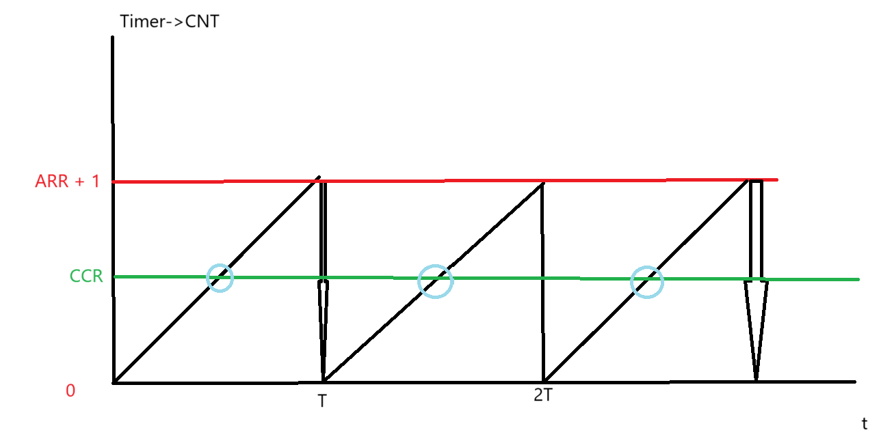
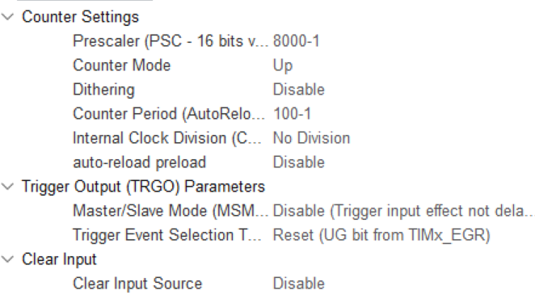
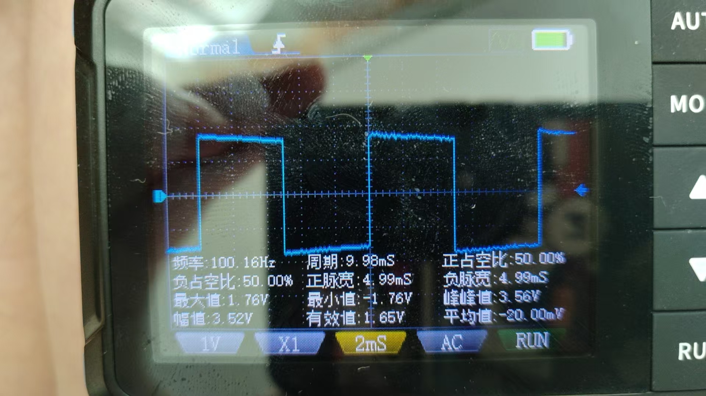
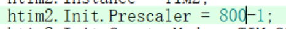
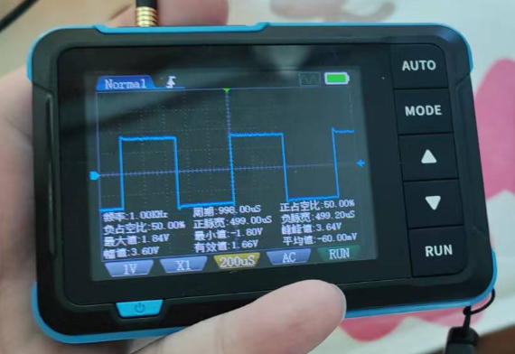

# 备考蓝桥杯嵌入式3：产生PWM波并捕获它

​	这一章节更加难了，现在我们开始要使用定时器来完成我们的编程任务。

## 关于STM32定时器

​	定时器本质上可以看作是一个根据给定周期时间进行自增或者是自减的硬件。我们需要做的就是围绕这个定时器进行一些列的编程。

​	刚刚我们谈论到，我们将定时器看作一个周期自增自减的部件，对于此，我们想要产生一个PWM波（PWM就是一个占空比为若干的一个方波，高低电平来回按照一个范式震荡的，满足周期波），一个办法就是设置一个检查门槛。当我们的定时器的CNT计数到达了门槛，直接将电平反转回来即可。这个门槛就是我们定时器的CCR，也就是Capture Compare Register。简单的说，就是Capture我们的Value，然后compare自身的值做出反应。这样，我们就会产生这样的一个情况



​	我们的定时器按照自己的频率递增。。。

​	欸！你看出现问题了，定时器的频率是如何设置的呢？答案是定时器自己内部的部件存在一个小玩意叫做预分频器。他对我们整体的系统时钟进行一个分频。举个例子，当我们的定时器使用的全局资源的一个频率是`80MHz`RCC振荡器中的震荡作为节拍的时候，我们把定时器的预分频器设置成了`8000 - 1`，欸！为什么要减一个1呢，答案是，我们的定时器计数是从0开始的，所以，0到7999，一共是8000个数。

​	所以，对于定时器的节拍，就变成了`80M / 8000 = 10Khz`的一个定时器。所以，这个意思就是，我们的定时器每隔`1/10000s`自增一个1.为此，想要让我们的定时器成为一个周期为T的定时器，或者说频率为f的定时器，办法就是设置我们的ARR（**Auto-Reload Register 自动重装载寄存器**）为**`Period `**就好了。比如说，当我们想要设置一个100Hz的寄存器，我们就配置我们的Period是100 - 1就好了（还是因为从0开始！这个事情随了C语言的下标为0开始就很好理解了）。

​	回到上面的图，我们还想要产生一个占空比是若干的方波，那应该怎么做呢？答案是设置CCR，我们知道设置了CCR可以反转对应定时器输出Channel的引脚产生的电平，用一句话就是到达CCR了反转一次电平（向上串和向下串都反转），所以，上面的定时器，如果我们设置了CCR，那么，产生的占空比就可以这样表达：
$$
K = \frac{CCR \cdot t_0}{(ARR + 1)\cdot t_0} = \frac{CCR}{ARR+1} 
$$
​	也就是说，设置占空比只需要保证我们的CCR和ARR+1的比例匹配即可。举个例子，50%占空比的方波，在上面的场景就是设置为`100 x 50% = 50`，所以只需要将CCR装入50，就能产生一个50%占空比的方波。

## CubeMX设置

​	先打开我们的CubeMX，配置好基础的工程后，看向PA1。


​	我们开启PA1的TIM2的二通道定时器（定时器分为多个通道，我们要操作对应的通道才能现象正确），设置我们的TIM2的Channel2如下的属性：




​	现在，我们就可以去写工程了。

## 代码

​	注意，定时器是一个资源，我们需要在正确的时间启用它：

```
HAL_TIM_PWM_Start(&htim2, TIM_CHANNEL_2);
TIM2->CCR2 = 50;
```

​	也就是开启我们的TIM2的Channel2定时器，且设置我们的CCR2寄存器（Channel2的CCR寄存器）是50，让我们看看效果如何：



​	现在，我们进入tim.c文件（如果你没有分.c和.h，那就直接进入对应的TIM初始化函数更改一下）更改一下我们的预分频，比如说，我们想看1000HZ的方波，那办法一样很简单：





​	重新编译下载，就会得到这个结果。

​	有朋友可能会问，如果我们没有示波器，那有该如何获取它的波形呢？答案是，使用定时器的输入捕获办法获取我们的频率。（参考笔者下一篇博客）