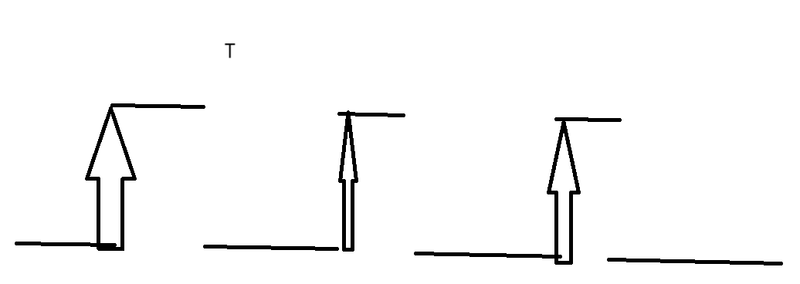
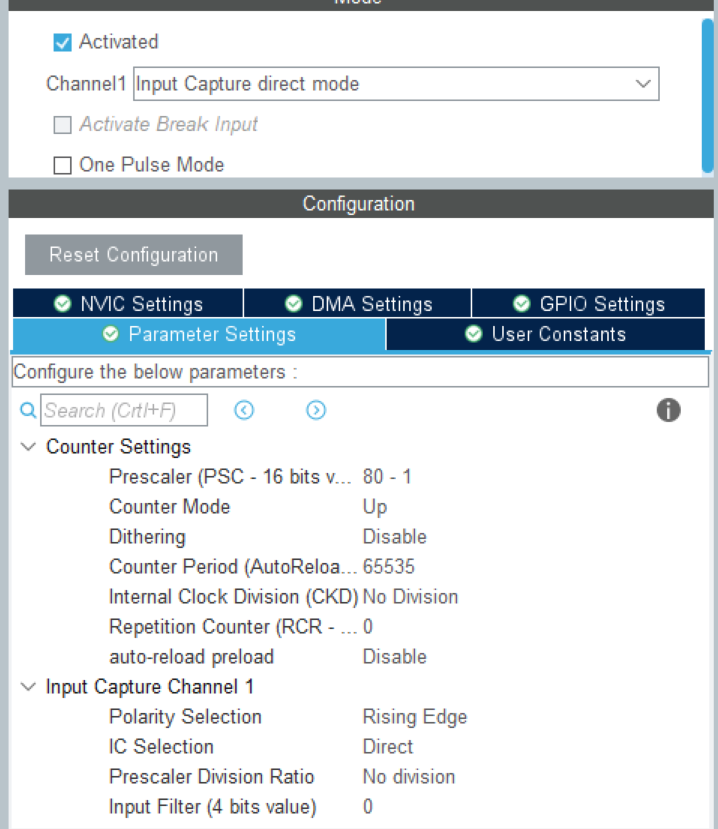
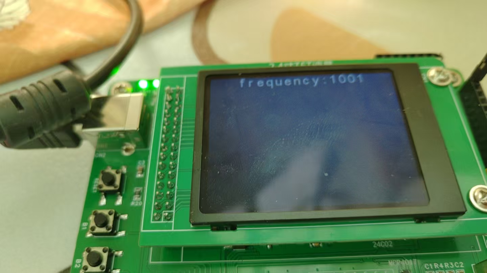

# 备考蓝桥杯嵌入式4：使用LCD显示我们捕捉的PWM波

​	上一篇博客我们提到了定时器产生PWM波，现在，我们尝试的想要捕获我们的PWM波，测量它的频率，我们应该怎么做呢？答案还是回到我们的定时器上。

​	我们知道，定时器是一个高级的秒表（参考笔者的比喻：https://blog.csdn.net/charlie114514191/article/details/145439125），它可以根据我们的设置向主处理器发送中断，所以，我们的一个测量办法就是，捕获其中的上升沿（或者是下降沿，两次上升沿的间隔就是我们的方波周期），如何知道上升沿或者是下降沿到来呢？答案是使用中断，我们将上升沿捕获进来，度量其中的CNT变化了多少，这个时候，我们就获得了相对于自身的频率，我们的PWM方波的频率是自身工作的频率的倍数。



​	我们让自身的CNT为0，再下一次捕获的时候得到CNT减去0就是CNT个度量的单位时间，其中，单位的度量时间笔者上一篇博客已经给出，这里不再给定，最终的结果就是
$$
f = \frac{1}{T} = \frac{1}{t_0 \cdot capture_{CNT}}=\frac{f_{sys}}{(prescalar + 1) \cdot capture_{CNT}}
$$
​	这里笔者建议进行预分频，因为我们需要保证我们的计次不会击穿我们的接受CNT的值的变量范围，否则就会出错。

## 代码实战

​	笔者以PA7作为捕获，来接受上一博客中笔者设置的PA1引脚产生的PWM波形。办法是配置PA7为输入捕获模式，且设置分频为80。



​	其他的部分可以不设置。我们采取的是上升沿的捕获！**记得使能一下中断！**我们生成MDK5工程，下一步就是我们来看看，如何完成软件的部分。

​	显然，我们的时钟输入捕获需要按照使能中断的方式进行开启：

```
HAL_TIM_IC_Start_IT(&htim17, TIM_CHANNEL_1);
```

​	重要的是，我们需要捕获我们的上升沿，其回调函数是：

```
uint32_t frequency, capture_value;
void HAL_TIM_IC_CaptureCallback(TIM_HandleTypeDef *htim)
{
    if(htim->Instance == TIM17)
    {
        capture_value = HAL_TIM_ReadCapturedValue(htim, TIM_CHANNEL_1);
        TIM17->CNT = 0;
        frequency = HAL_RCC_GetSysClockFreq()/((htim->Init.Prescaler + 1) * capture_value);
    }
}
```

​	我们按照管理获取我们的捕获值，当然，如果要追求迅速，可以直接将`htim->Instance->CCR1`抓出来赋值，来进行加速。笔者的建议是不要这样，除非有明显的效率提升，否则可读性不好。

​	我们在主循环中，调用一个时时刻刻进行刷新的display函数

```
char value[20];
void display_current_captured_freq(void)
{
    snprintf(value, 20, "frequency:%d", frequency);
    lcd_middledisplay(Line0, value);
}
```

​	关于LCD的使用和笔者进行的小幅度的修改，参考笔者的博客：[备考蓝桥杯嵌入式2：使用LCD完成显示-CSDN博客](https://blog.csdn.net/charlie114514191/article/details/145420605)

​	现在我们将PA7和PA1使用杜邦线或者是导线连接。再将我们的代码上传上去。笔者采用的是1000HZ的PWM方波，这里的显示稍有误差：

