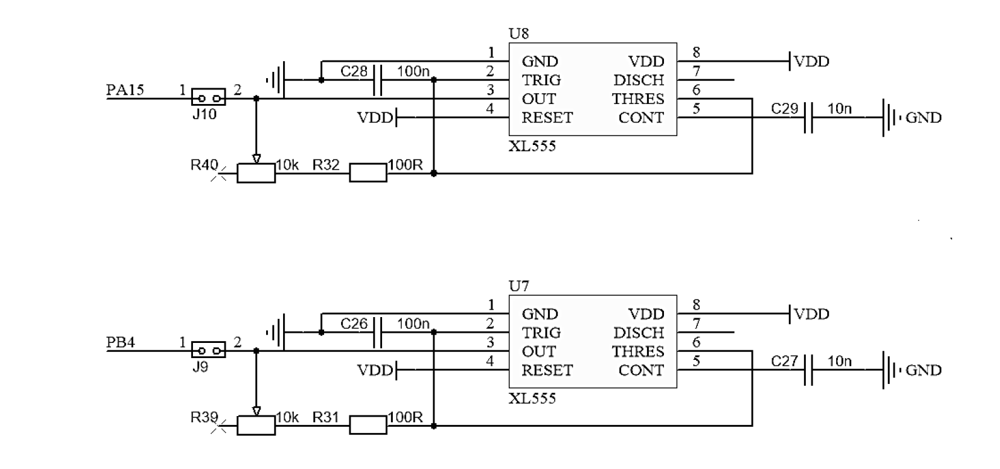
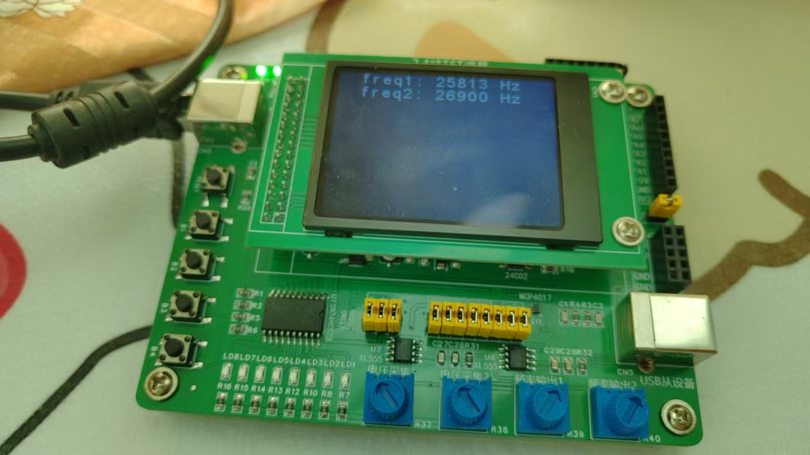
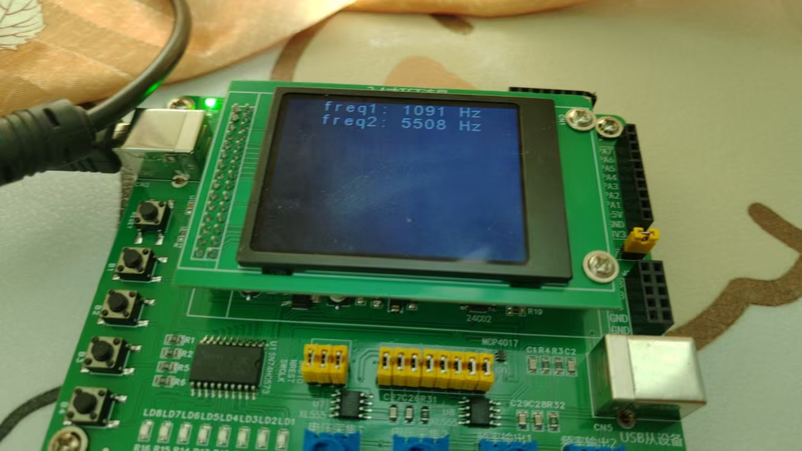

# 备考蓝桥杯嵌入式5：捕获两个XL555产生的可调频率方波的频率

​	我们蓝桥杯的板子上有2个XL555定时器，这里，我们需要做的就是捕获我们PA15和PB4接口上产生的PWM定时器。还记得上一篇博客我们是怎么做的吗？这里是一样的：https://blog.csdn.net/charlie114514191/article/details/145439350



​	我们仍然设置PA15和PB4上的定时器为输入捕获模式，配置我们的预分频为80，当然，在使能全局中断后，不要忘记把使用回调函数记载一下捕获的频率。如下所示：

```
void HAL_TIM_IC_CaptureCallback(TIM_HandleTypeDef *htim)
{
    uint32_t capture_value = HAL_TIM_ReadCapturedValue(htim, TIM_CHANNEL_1);
    htim->Instance->CNT = 0;
    if(htim->Instance == TIM2){
        freq2 = HAL_RCC_GetSysClockFreq() / ((htim->Init.Prescaler + 1) * capture_value);
    }
    if(htim->Instance == TIM16)
    {
        freq1 = HAL_RCC_GetSysClockFreq() / ((htim->Init.Prescaler + 1) * capture_value);
    }
}
```

​	到这里，我们把捕获的示数写一个display

```
void display_captured_frequency555(void)
{
    snprintf(buffer, 20, "freq1: %d Hz", display_freq1);
    lcd_middledisplay(Line0, buffer);
    snprintf(buffer, 20, "freq2: %d Hz", display_freq2);
    lcd_middledisplay(Line1, buffer);
}
```

​	但是笔者发现，这样直接丢尽主函数循环内部，示数非常的不稳定，特别是对于高频部分，甚至千分位都起飞了！所以，我们需要做一些改进。也就是完成一些简单的滤波。

​	笔者采用的是最最简单的平均滤波办法。也就是多次采集取平均值，求解完成了平均值在做显示。所以：

```
// frequency that fetch as raw
uint32_t freq1, freq2;
// frequency using in storing the accumulations
uint32_t capture_freq1, capture_freq2;
// frequency that finally using in display
uint32_t display_freq1, display_freq2;
// captures recording
uint16_t capture_time;
static char buffer[20];

static void __make_real_display(void)
{
    snprintf(buffer, 20, "freq1: %d Hz", display_freq1);
    lcd_middledisplay(Line0, buffer);
    snprintf(buffer, 20, "freq2: %d Hz", display_freq2);
    lcd_middledisplay(Line1, buffer);
}

#define BETTER_ALG
void display_captured_frequency555(void)
{
#ifdef BETTER_ALG
    capture_time++;
    capture_freq1 += freq1;
    capture_freq2 += freq2;
    if(capture_time == MAKE_SCALAR){
        display_freq1 = capture_freq1 / MAKE_SCALAR;
        display_freq2 = capture_freq2 / MAKE_SCALAR;
        capture_freq1 = 0;
        capture_freq2 = 0;
        capture_time = 0;
        __make_real_display();
    }
#else
    __make_real_display();    
#endif
}
```

​	还有一种改进的方式是直到发生了中断我们才去做求取平均，而不是一个劲的加数据导致产生了无效的平均算法。

```
void HAL_TIM_IC_CaptureCallback(TIM_HandleTypeDef *htim)
{
    uint32_t capture_value = HAL_TIM_ReadCapturedValue(htim, TIM_CHANNEL_1);
    htim->Instance->CNT = 0;
    if(htim->Instance == TIM2){
        freq2 = HAL_RCC_GetSysClockFreq() / ((htim->Init.Prescaler + 1) * capture_value);
        display_captured_frequency555();	// 直到发生采集了我们才求取
    }
    if(htim->Instance == TIM16)
    {
        freq1 = HAL_RCC_GetSysClockFreq() / ((htim->Init.Prescaler + 1) * capture_value);
        display_captured_frequency555();	// 直到发生采集了我们才求取
    }
}
```

​	现在我们的示数就会稳定许多了！



