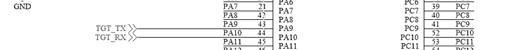
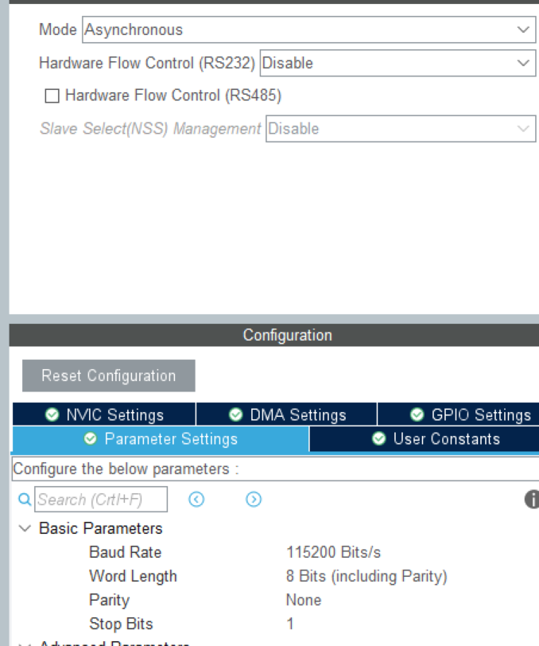
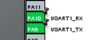
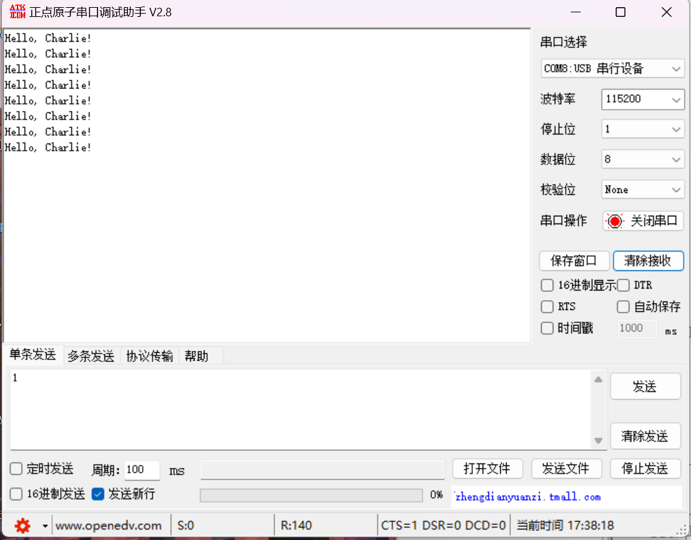
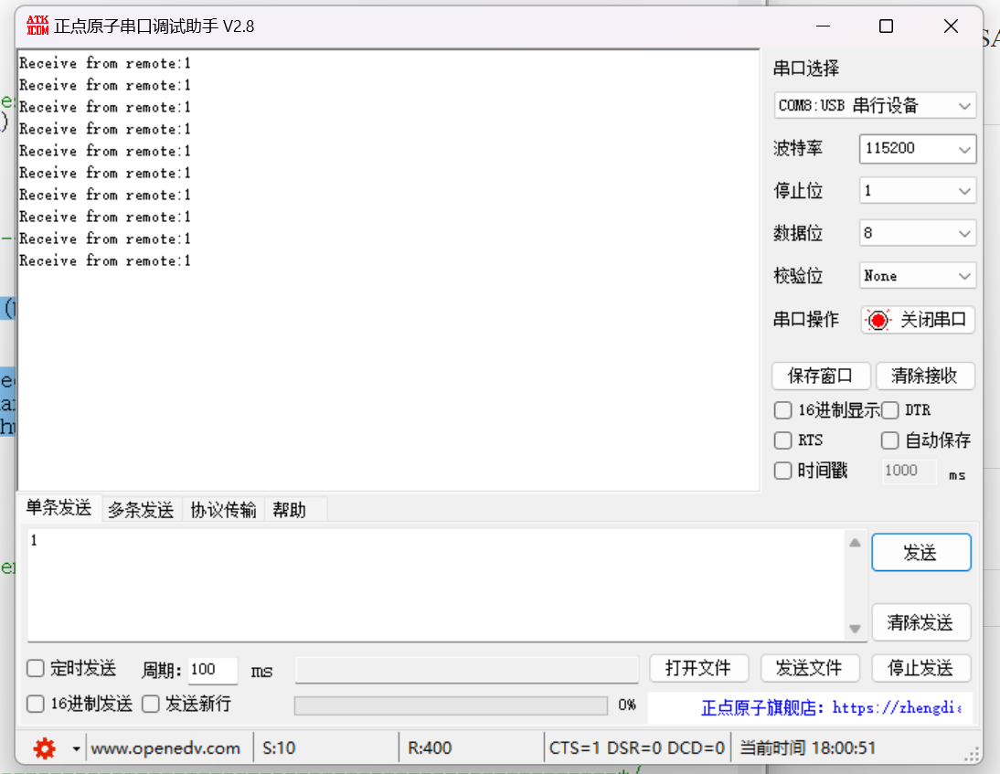
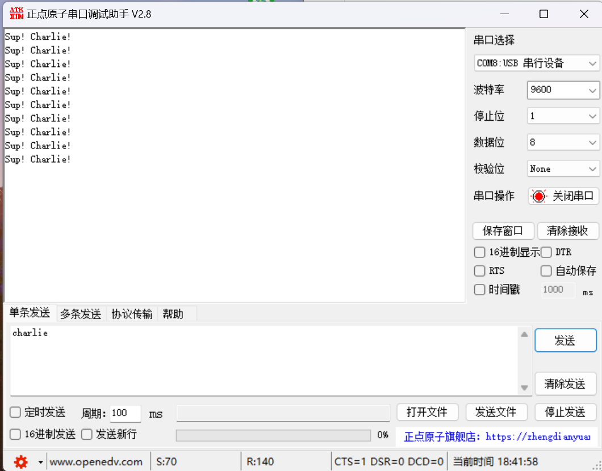
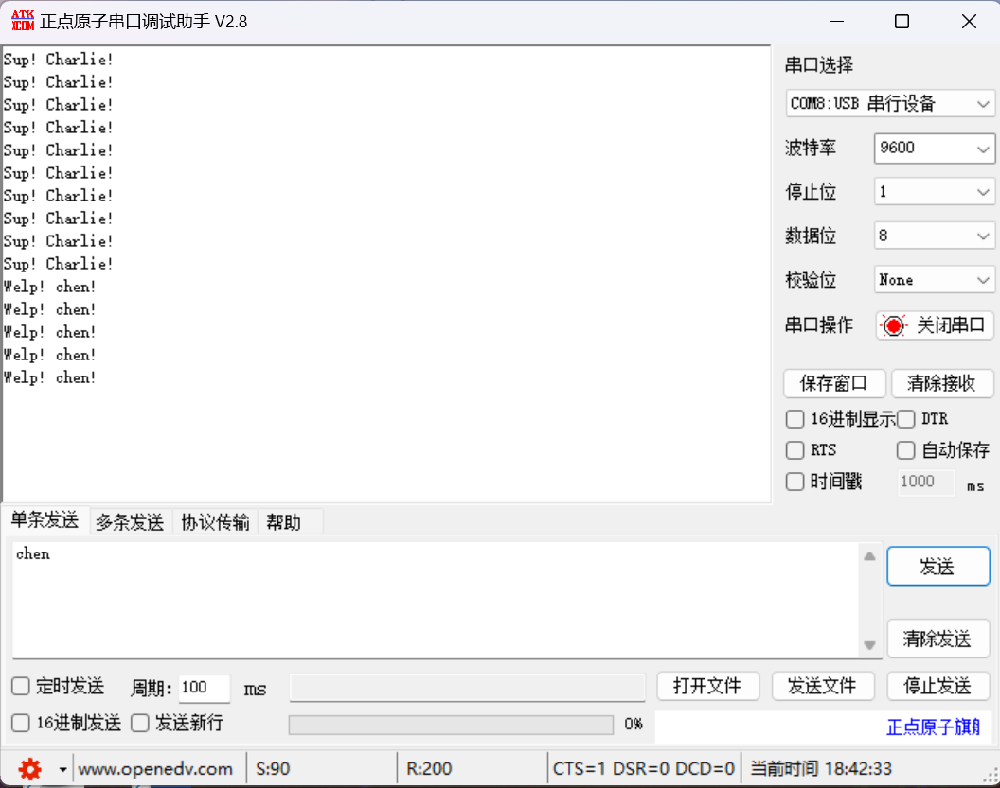
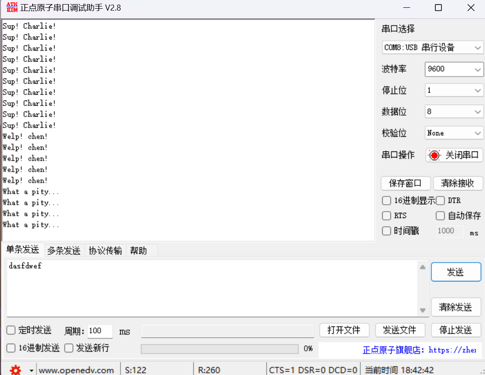

# 备考蓝桥杯嵌入式6：串口

## 串口

​	USART异步串口通信这个地方，我们一般对编程上就是关心的RX端和TX端。也就是发送端和接受端。注意到的是，**开发板上的已经为我们安排好了特定的RX端和TX端，这跟默认的配置是不一样的**，所以，我们需要做的就是当设计到串口的时候，将UART使用的RX和TX串口更改到板子指定的位置。



​	很好，这里就是我们指定的TX和RX，所以，在我们打开USART的时候，配置要更改我们的串口的RX和TX.就是这样的简单。

## 工程设置

​	我们打开我们的USART1后，配置串口的界面是如下的



​		然后注意的是，我们需要

1. 使能我们的串口中断

   

2. 更改我们的串口GPIO的TX和RX



其他部分的工程就照常设置即可。这里不再赘述。

## 代码书写

### 测试同步发送

​	首先，让我们测试一下我们的发送是不是正常的：

​	在循环里，往复的发送我们的代码，试试看：

```c
  while (1)
  {
    /* USER CODE END WHILE */

    /* USER CODE BEGIN 3 */
	snprintf(buffer, 20, "Hello, Charlie!\n");
	HAL_UART_Transmit(&huart1, (uint8_t*)buffer, 20, HAL_MAX_DELAY);
	HAL_Delay(1000);
  }
```



​	请注意，需要保证我们的串口设置的波特率和串口的端口开启的是正确的。这样我们才会正确的接受到信息。

### 测试异步接受

​	异步接受则会简单一些，我们知道，采用异步发送的一个方式就是使用中断来完成我们的代码接受，当底层USART的接受移位寄存器结束工作的时候向主机通知接受结束，我们在HAL库层只需要调用代码即可。

```
char buf[40];
void HAL_UART_RxCpltCallback(UART_HandleTypeDef *huart)
{
    if(huart == &huart1){
        snprintf(buf, 40, "Receive from remote:%c\n", rec);
        HAL_UART_Transmit(huart, (uint8_t*)buf, 40, HAL_MAX_DELAY);
        HAL_UART_Receive_IT(huart, &rec, 1);
    }
}
```

​	必须要注意的是，在这个逻辑下，如果我们是在需要接受的时候主动的调用Receive函数，也就是

```
HAL_UART_Receive_IT(&huart1, &rec, 1);
```

​	这样，我们的echo才能流转起来。



​	现在，我们测试结束我们的串口，我们马上就来讨论一个高阶的主题。那就是使用定时器来完成对不定长的信息的接受和分析。

## 一个例子

​	现在我们加难，我们并不知道我们接受的字符到底多少个，只知道一个上限，比如说20个字符，我们应该如何使用定时器来辅助我们进行判断。

​	我们知道，串口使用移位寄存器移位来传递字符，对于给定的波特率，他向我们保证了在1/波特率的时间之内传递到我们的设备当中去。以9600波特率为例子，他就说明了我们的字符会在1.04ms内完成我们的传递，只要我们的定时器在检测的时候发现CNT到达了1.04ms以上的时间才会增加到的CNT，也就是说我们的定时器已经计时了超过1.04ms，我们就可以认为我们的接受已经结束了，该处理拿到的数据了。

​	基于这个办法，我们只需要把定时器一开，在接受回调里对定时器进行复位，然后一个字节一个字节的搬运我们的字符就好了。

​	当然，笔者这里将CNT设置为了15，预分频8000，也就是留足1.5ms的时间作为阈值。

```c++
uint8_t is_received = 0;
uint8_t received;
// contains the buffer
uint8_t current_receive_offset = 0;
uint8_t buffer_receive[20];

// buffer wait send
uint8_t buffer_send[20];
void HAL_UART_RxCpltCallback(UART_HandleTypeDef *huart)
{
    if(huart != &huart1) return; // don't handle!
    
    TIM4->CNT = 0;  // clear the CNT, meaning that we received the char, dont quit
    
    is_received = 1;
    buffer_receive[current_receive_offset] = received;
    current_receive_offset++;
    // waiting for the next buffer
    HAL_UART_Receive_IT(huart, &received, 1);
}

// for each bit received about 1.04ms(1 / 9600 s), we choose to let CNT > 15 for end finished!
uint8_t inline is_timeout(){
    return TIM4->CNT > 15;  // if is timeout, then we think the receivings is finished
} 
```

​	我们可以写一个检测的函数来辅助我们完成检测：

```
#include <string.h>
void checking_result(void)
{
    // if is equal
    char* sources = "";
    if(!strcmp("charlie", (char*)buffer_receive)){
        sources = "Sup! Charlie!\n";
    }else if(!strcmp("chen", (char*)buffer_receive)){
        sources = "Welp! chen!\n";    
    }else{
        sources = "What a pity...\n";    
    }
    HAL_UART_Transmit(&huart1, (uint8_t*)sources, strlen(sources), HAL_MAX_DELAY);
    is_received = 0;
    for(uint8_t i = 0; i < current_receive_offset; i++){
        buffer_receive[i] = 0;
    }
    current_receive_offset = 0;
}

void loop_check_data(void)
{
    if(!is_received) return;    // nothing comes, directly quit issue
    
    if(!is_timeout()) return;   // still owns buffer waiting received!
    
    checking_result();
    
}
```

​	不要忘记在主函数中开定时器和检测：

```
  /* USER CODE BEGIN 2 */
  HAL_TIM_Base_Start(&htim4);
  HAL_UART_Receive_IT(&huart1, &received, 1);
  /* USER CODE END 2 */

  /* Infinite loop */
  /* USER CODE BEGIN WHILE */
  while (1)
  {
    /* USER CODE END WHILE */
      // buad rate is 9600, remenber to set currectly...
    loop_check_data();
    /* USER CODE BEGIN 3 */
  }
  /* USER CODE END 3 */
```






