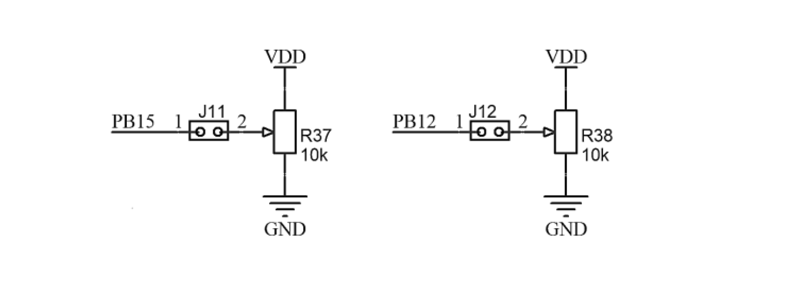
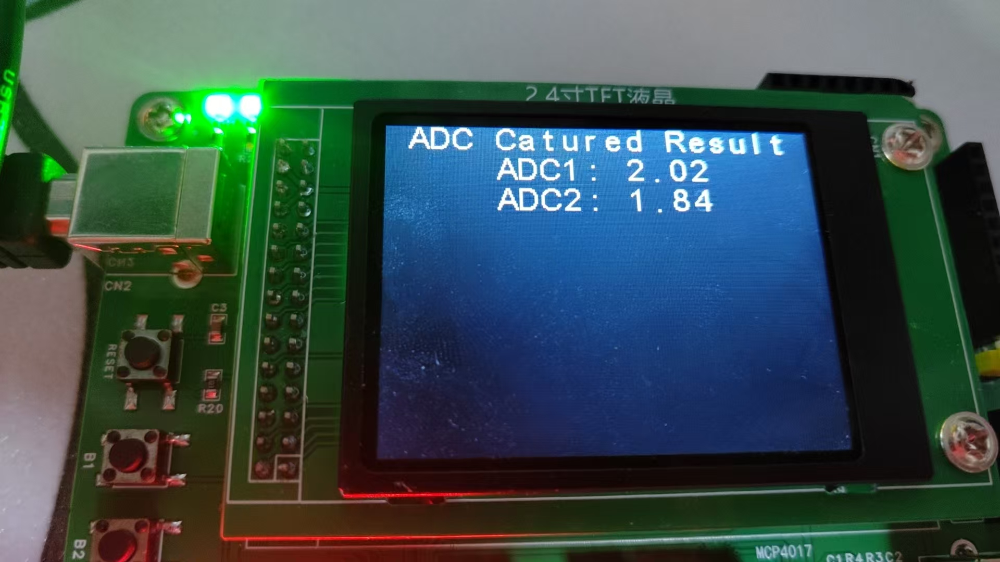

# 备考蓝桥杯嵌入式7——ADC电压采集

## ADC电压采集

​	ADC的含义就是将一个范围内的电压映射成为数字传入进来。举个例子，当我们想要做一个非常简单的电压测量计的时候，使用ADC就会将我们的模拟电压信号转化为数字电压信号。

​	我们的板子上有两个电压采集旋钮，对应我们的开发手册上，我们可以看到：



​	实际上，我们只需要将对应GPIO的ADC通道使能就好了。


​	好在配置ADC在CubeMX中是非常简单的。就这样就好了。

## 代码书写

```
static char buf[20];
static double __from_adc(ADC_HandleTypeDef* def){
    HAL_ADC_Start(def);
    return 3.3 * (HAL_ADC_GetValue(def)) / 4096.0;
}


void display_captured_adc(void)
{
    lcd_middledisplay(Line0, "ADC Catured Result");
    
    snprintf(buf, 20, "ADC1: %.2lf", __from_adc(&hadc1));
    lcd_middledisplay(Line1, buf);
    
    snprintf(buf, 20, "ADC2: %.2lf", __from_adc(&hadc2));
    lcd_middledisplay(Line2, buf);
}
```

​	当我们想要采集电压的时候，就需要打开一次ADC，然后，将我们的电压值做这样的映射，值得注意的是，我们的ADC都是12位通道的，也就是说我们的采集粒度是1/4096，所以才会除以4096.

