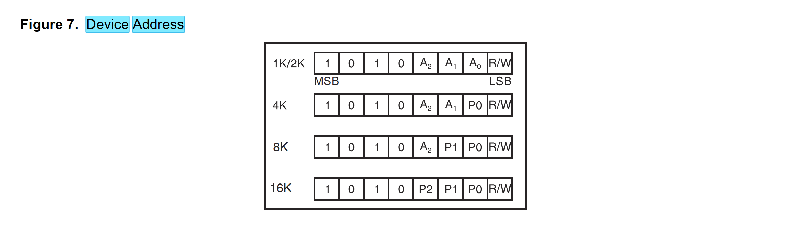
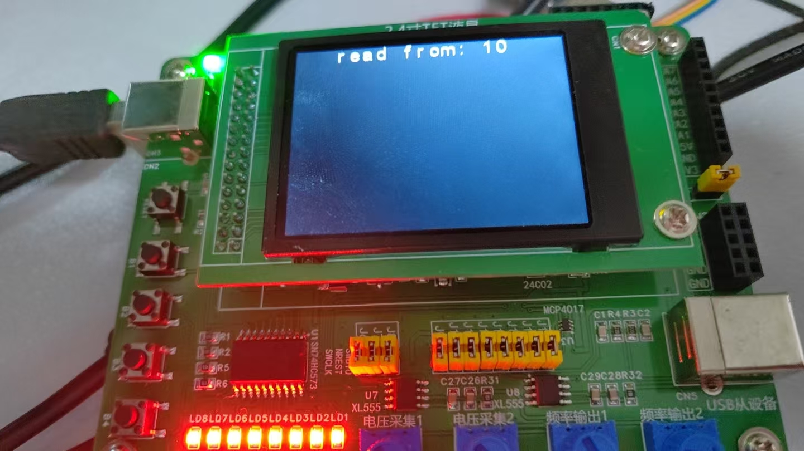

# 备考蓝桥杯8——EEPROM读写

## 看手册时间

​	我们主要是搞编程，所以，我们一般会非常关心我们如何对EEPROM进行编程。特别的，EEPROM要做读写，首先是看它的IIC设备地址。

​	有趣的是——我们的EEPROM的IIC地址是根据地址进行选择的，高四位是固定地址，对于低地址，我们的A2A1A0则是选择在哪一篇地址写，一般的我们的比赛不会用到超过1K的ROM，所以，我们往往习惯上默认我们的IIC前七位地址是1010 000，最后一位用于通知我们的IIC设备是读还是写的。



## 关于IIC

​	对于IIC一个通信协议，一个经典的步骤就是——

- 主机发送信息：开启通信，发送信息，接受应答，发送信息，接受应答......然后结束通信。
- 主机接受信息：开启通信，发送必要的信息，接受应答......接受信息，不予应答，结束通信

​	基于这个思路，我们使用官方提供的软IIC来完成代码：

```
#include "eeprom.h"
#include "i2c.h"
#define EEPROM_WRITE_DEV_ADDR   (0xA0)
#define EEPROM_READ_DEV_ADDR    (0xA1)


void eeprom_write(uint8_t dev_addr, uint8_t data)
{
    I2CStart();
    
    I2CSendByte(EEPROM_WRITE_DEV_ADDR);
    I2CWaitAck();
    
    I2CSendByte(dev_addr);
    I2CWaitAck();
    
    I2CSendByte(data);
    I2CWaitAck();
    
    I2CStop();
    HAL_Delay(20); // for i2c delay
}

uint8_t eeprom_read(uint8_t dev_addr)
{
    I2CStart();
    
    I2CSendByte(EEPROM_WRITE_DEV_ADDR);
    I2CWaitAck();
    
    I2CSendByte(dev_addr);
    I2CWaitAck();
    I2CStop();
    
    I2CStart();
    I2CSendByte(EEPROM_READ_DEV_ADDR);
    I2CWaitAck();
    
    uint8_t result = I2CReceiveByte();
    
    I2CSendNotAck();
    I2CStop();
    
    return result;
}
```

​	我们测试一下，读写一个字节：

```
  I2CInit();
  eeprom_write(0, 10);
  char disp[20];
  uint8_t result = eeprom_read(0);
  snprintf(disp, 20, "read from: %d", result);
  lcd_middledisplay(Line0, disp);
```



## 附录 IIC代码

​	这个代码是官方的赛题会随身给的，这里为了不去下那2.3GB的玩意，直接在下面贴出来给大家参考

> i2c.h

```
#ifndef __I2C_H
#define __I2C_H

#include "main.h"

void I2CStart(void);
void I2CStop(void);
unsigned char I2CWaitAck(void);
void I2CSendAck(void);
void I2CSendNotAck(void);
void I2CSendByte(unsigned char cSendByte);
unsigned char I2CReceiveByte(void);
void I2CInit(void);

#endif
```

> i2c.c

```
#include "i2c.h"

#define DELAY_TIME	20

void SDA_Input_Mode()
{
    GPIO_InitTypeDef GPIO_InitStructure = {0};

    GPIO_InitStructure.Pin = GPIO_PIN_7;
    GPIO_InitStructure.Mode = GPIO_MODE_INPUT;
    GPIO_InitStructure.Pull = GPIO_PULLUP;
    GPIO_InitStructure.Speed = GPIO_SPEED_FREQ_HIGH;
    HAL_GPIO_Init(GPIOB, &GPIO_InitStructure);
}

void SDA_Output_Mode()
{
    GPIO_InitTypeDef GPIO_InitStructure = {0};

    GPIO_InitStructure.Pin = GPIO_PIN_7;
    GPIO_InitStructure.Mode = GPIO_MODE_OUTPUT_OD;
    GPIO_InitStructure.Pull = GPIO_NOPULL;
    GPIO_InitStructure.Speed = GPIO_SPEED_FREQ_HIGH;
    HAL_GPIO_Init(GPIOB, &GPIO_InitStructure);
}

void SDA_Output( uint16_t val )
{
    if ( val )
    {
        GPIOB->BSRR |= GPIO_PIN_7;
    }
    else
    {
        GPIOB->BRR |= GPIO_PIN_7;
    }
}

void SCL_Output( uint16_t val )
{
    if ( val )
    {
        GPIOB->BSRR |= GPIO_PIN_6;
    }
    else
    {
        GPIOB->BRR |= GPIO_PIN_6;
    }
}

uint8_t SDA_Input(void)
{
	if(HAL_GPIO_ReadPin(GPIOB, GPIO_PIN_7) == GPIO_PIN_SET){
		return 1;
	}else{
		return 0;
	}
}

static void delay1(unsigned int n)
{
    uint32_t i;
    for ( i = 0; i < n; ++i);
}

void I2CStart(void)
{
    SDA_Output(1);
    delay1(DELAY_TIME);
    SCL_Output(1);
    delay1(DELAY_TIME);
    SDA_Output(0);
    delay1(DELAY_TIME);
    SCL_Output(0);
    delay1(DELAY_TIME);
}

void I2CStop(void)
{
    SCL_Output(0);
    delay1(DELAY_TIME);
    SDA_Output(0);
    delay1(DELAY_TIME);
    SCL_Output(1);
    delay1(DELAY_TIME);
    SDA_Output(1);
    delay1(DELAY_TIME);

}

unsigned char I2CWaitAck(void)
{
    unsigned short cErrTime = 5;
    SDA_Input_Mode();
    delay1(DELAY_TIME);
    SCL_Output(1);
    delay1(DELAY_TIME);
    while(SDA_Input())
    {
        cErrTime--;
        delay1(DELAY_TIME);
        if (0 == cErrTime)
        {
            SDA_Output_Mode();
            I2CStop();
            return ERROR;
        }
    }
    SDA_Output_Mode();
    SCL_Output(0);
    delay1(DELAY_TIME);
    return SUCCESS;
}

void I2CSendAck(void)
{
    SDA_Output(0);
    delay1(DELAY_TIME);
    delay1(DELAY_TIME);
    SCL_Output(1);
    delay1(DELAY_TIME);
    SCL_Output(0);
    delay1(DELAY_TIME);
}

void I2CSendNotAck(void)
{
    SDA_Output(1);
    delay1(DELAY_TIME);
    delay1(DELAY_TIME);
    SCL_Output(1);
    delay1(DELAY_TIME);
    SCL_Output(0);
    delay1(DELAY_TIME);
}

void I2CSendByte(unsigned char cSendByte)
{
    unsigned char  i = 8;
    while (i--)
    {
        SCL_Output(0);
        delay1(DELAY_TIME);
        SDA_Output(cSendByte & 0x80);
        delay1(DELAY_TIME);
        cSendByte += cSendByte;
        delay1(DELAY_TIME);
        SCL_Output(1);
        delay1(DELAY_TIME);
    }
    SCL_Output(0);
    delay1(DELAY_TIME);
}

unsigned char I2CReceiveByte(void)
{
    unsigned char i = 8;
    unsigned char cR_Byte = 0;
    SDA_Input_Mode();
    while (i--)
    {
        cR_Byte += cR_Byte;
        SCL_Output(0);
        delay1(DELAY_TIME);
        delay1(DELAY_TIME);
        SCL_Output(1);
        delay1(DELAY_TIME);
        cR_Byte |=  SDA_Input();
    }
    SCL_Output(0);
    delay1(DELAY_TIME);
    SDA_Output_Mode();
    return cR_Byte;
}

void I2CInit(void)
{
	GPIO_InitTypeDef GPIO_InitStructure = {0};

	 GPIO_InitStructure.Pin = GPIO_PIN_7 | GPIO_PIN_6;
	 GPIO_InitStructure.Mode = GPIO_MODE_OUTPUT_PP;
	 GPIO_InitStructure.Pull = GPIO_PULLUP;
	 GPIO_InitStructure.Speed = GPIO_SPEED_FREQ_HIGH;
	 HAL_GPIO_Init(GPIOB, &GPIO_InitStructure);
}
```

