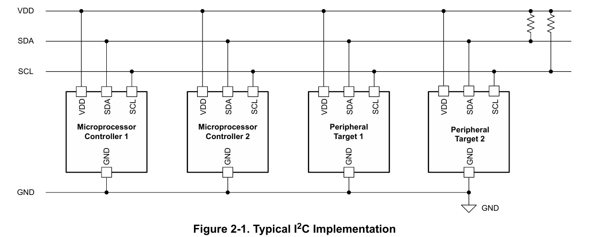

# 嵌入式通信协议学习——IIC篇

## 前言

​	我们下面就是来仔细的聊一聊IIC通信协议。回顾一下通信协议存在的目的，就是为了让两个物理甚至是逻辑不同的电路模块进行信息交换，为了让信息的交换存在可能，我们自然会选择让双方都遵守一个君子协定，这个君子协定就是“通信协议”。我们

## 简单说一说什么是IIC

​	我们下面就来聊聊什么是IIC，IIC的全称是：Inter-Integrated Circuit。它是一种由飞利浦公司在1980年代初开发的**串行通信协议(通信由主设备提供时钟信号（SCL）进行同步，确保数据在正确的时序下传输)**，旨在简化微控制器与外围设备之间的连接。它采用两线制设计，仅需一根串行数据线（SDA）和一根串行时钟线（SCL），即可实现多设备之间的通信。这种设计不仅减少了引脚数量，还降低了系统的复杂性和成本。这个说法是相对于线的使用上相对豪横的SPI的，SPI会在后续的文章中笔者详细的进行介绍，但是不是现在。

​	IIC依赖于本次通信时谁是主动方（主动的发送数据）和谁是被动方（被动的接受数据）划分出来了IIC主机和IIC从机。有趣的是，IIC是支持多主机多从机的，这是我们下面中，IIC的具体的通信细节中我们还会再聊的内容。

## IIC通信绘景与细节特征

​	这个小节中，我们才会认真的理解IIC到底是如何工作的。在我们勾勒具体的细节之前，最好是有一个大纲。

​	下图就把IIC的绘景说清楚了（图的来源：[A Basic Guide to I2C](https://www.ti.com/lit/an/sbaa565/sbaa565.pdf?ts=1748150475461)）



​	可以看到，我们的所有设备都存在相同的GND和VCC，确保这一蔟设备中对0和1的定义都是一致的，有趣的是如下的特性：

- 这个图笃定了我在摘要中谈到的，I²C 使用两根线进行通信：串行数据线（SDA）和串行时钟线（SCL）。对于这两根线都是双向开漏连接，需要上拉电阻（外部供电上拉），以确保线路在空闲时为高电平，这种设计允许多个设备同时连接到总线，避免了信号冲突。
- IIC对于多个主设备和从设备的支持体现是通过唯一的设备地址，或者说，我们能找到一个IIC设备，不与其他设备进行混淆，全靠**IIC设备地址**，主设备通过发送目标设备的地址来发起通信。IIC 使用 7 位或 10 位地址空间，理论上支持最多 128 个或 1024 个设备，但实际应用中，地址冲突和总线电容限制了设备数量。
- IIC 是一种半双工协议，意味着数据可以在两个方向上传输，但不能同时进行。是的，写代码的朋友都知道，当我们对一个IIC设备进行通信的时候，我们往往不能够对同一个设备进行同时的读写
- IIC 支持多种传输速率，包括标准模式（100 kbps）、快速模式（400 kbps）、高速模式（3.4 Mbps）和超高速模式（5 Mbps）。

## IIC通信流程说明

​	我们下面就来说明一下IIC的一个通信流程。

​	通信开始前，总线处于空闲状态，SDA和SCL均为高电平。主设备通过生成起始条件启动通信：在SCL为高电平时，**SDA从高电平跳变为低电平**。起始条件后，主设备发送地址帧。地址帧包含7位从设备地址和1位读写控制位（共8位）。读写位为**0时表示主设备向从设备写入数据，为1时表示读取数据**。例如，若从设备地址为0x50且主设备要写入数据，地址帧为0xA0（0x50左移1位后补0）。

​	每传输完一个字节（8位），接收方需在第9个时钟周期发送应答信号。若接收方成功接收数据，会将SDA线拉低（ACK）；若接收失败或要求终止传输，SDA保持高电平（NACK）。若从设备未对地址帧返回ACK，主设备可发送停止条件终止通信。

​	地址帧确认后，数据传输根据读写方向进行。写入模式下，主设备依次发送数据字节，每发送一字节后等待从设备的ACK；读取模式下，从设备发送数据字节，主设备每接收一字节后返回ACK（继续接收）或NACK（终止接收）。通信结束时，主设备发送停止条件：**在SCL为高电平时，SDA从低电平跳变为高电平。**

​	以主设备向地址0x50的从设备写入数据0xAA为例：主设备首先发送起始条件，接着发送地址帧0xA0；从设备返回ACK后，主设备发送数据0xAA，从设备再次返回ACK；最后主设备发送停止条件结束通信。若需连续操作（如先写寄存器地址再读数据），主设备可在不发送停止条件时插入重复起始条件，直接开启新操作。

​	当多个主设备同时操作时，SCL线通过“线与”逻辑合并时钟信号，以最慢时钟为准；若多主设备同时发送数据，**SDA线上先释放高电平的一方退出仲裁，避免冲突。协议支持不同速度模式，包括标准模式（100kbps）、快速模式（400kbps）和高速模式（3.4Mbps）**。对于10位地址扩展，主设备需先发送特殊前缀（0b11110XX），再发送完整地址的两个字节。

## HAL库的API说明

### 1. **主机模式通信**

- **HAL_I2C_Master_Transmit()**
   用于主设备向从设备发送数据。

  **函数原型：**

```c
  HAL_StatusTypeDef HAL_I2C_Master_Transmit(I2C_HandleTypeDef *hi2c, 
                                            uint16_t DevAddress, 
                                            uint8_t *pData, 
                                            uint16_t Size, 
                                            uint32_t Timeout);
```

**参数说明：**

- `hi2c`：指向 I2C 句柄的指针。
- `DevAddress`：目标设备地址（7 位地址左移 1 位）。
- `pData`：指向要发送的数据缓冲区的指针。
- `Size`：要发送的数据长度。
- `Timeout`：超时时间（毫秒）。

**示例：**

```c
  uint8_t data[] = {0x01, 0x02};
  HAL_I2C_Master_Transmit(&hi2c1, (0x40 << 1), data, 2, HAL_MAX_DELAY);
```

- **HAL_I2C_Master_Receive()**
   用于主设备从从设备接收数据。

  **函数原型：**

```c
  HAL_StatusTypeDef HAL_I2C_Master_Receive(I2C_HandleTypeDef *hi2c, 
                                           uint16_t DevAddress, 
                                           uint8_t *pData, 
                                           uint16_t Size, 
                                           uint32_t Timeout);
```


**参数说明：**

- `hi2c`：指向 I2C 句柄的指针。
- `DevAddress`：目标设备地址（7 位地址左移 1 位）。
- `pData`：指向接收数据缓冲区的指针。
- `Size`：要接收的数据长度。
- `Timeout`：超时时间（毫秒）。

**示例：**

```c
  uint8_t buffer[10];
  HAL_I2C_Master_Receive(&hi2c1, (0x40 << 1), buffer, 10, HAL_MAX_DELAY);
```


------

### 2. **内存读写操作**

- **HAL_I2C_Mem_Write()**
   用于向从设备的特定内存地址写入数据。

  **函数原型：**

```c
  HAL_StatusTypeDef HAL_I2C_Mem_Write(I2C_HandleTypeDef *hi2c, 
                                      uint16_t DevAddress, 
                                      uint16_t MemAddress, 
                                      uint16_t MemAddSize, 
                                      uint8_t *pData, 
                                      uint16_t Size, 
                                      uint32_t Timeout);
```


**参数说明：**

- `hi2c`：指向 I2C 句柄的指针。
- `DevAddress`：目标设备地址（7 位地址左移 1 位）。
- `MemAddress`：目标内存地址。
- `MemAddSize`：内存地址大小（`I2C_MEMADD_SIZE_8BIT` 或 `I2C_MEMADD_SIZE_16BIT`）。
- `pData`：指向要写入的数据缓冲区的指针。
- `Size`：要写入的数据长度。
- `Timeout`：超时时间（毫秒）。

**示例：**

```c
  uint8_t data = 0x55;
  HAL_I2C_Mem_Write(&hi2c1, (0x50 << 1), 0x10, I2C_MEMADD_SIZE_8BIT, &data, 1, HAL_MAX_DELAY);
```


- **HAL_I2C_Mem_Read()**
   用于从从设备的特定内存地址读取数据。

  **函数原型：**

```c
  HAL_StatusTypeDef HAL_I2C_Mem_Read(I2C_HandleTypeDef *hi2c, 
                                     uint16_t DevAddress, 
                                     uint16_t MemAddress, 
                                     uint16_t MemAddSize, 
                                     uint8_t *pData, 
                                     uint16_t Size, 
                                     uint32_t Timeout);
```


**参数说明：**

- `hi2c`：指向 I2C 句柄的指针。
- `DevAddress`：目标设备地址（7 位地址左移 1 位）。
- `MemAddress`：目标内存地址。
- `MemAddSize`：内存地址大小（`I2C_MEMADD_SIZE_8BIT` 或 `I2C_MEMADD_SIZE_16BIT`）。
- `pData`：指向接收数据缓冲区的指针。
- `Size`：要读取的数据长度。
- `Timeout`：超时时间（毫秒）。

**示例：**

```c
  uint8_t buffer;
  HAL_I2C_Mem_Read(&hi2c1, (0x50 << 1), 0x10, I2C_MEMADD_SIZE_8BIT, &buffer, 1, HAL_MAX_DELAY);
```


------

### 3. **非阻塞模式（中断和 DMA）**

为了提高效率，HAL 库还提供了非阻塞的中断和 DMA 模式的 API，例如：

- **中断模式：**
  - `HAL_I2C_Master_Transmit_IT()`
  - `HAL_I2C_Master_Receive_IT()`
  - `HAL_I2C_Mem_Write_IT()`
  - `HAL_I2C_Mem_Read_IT()`
- **DMA 模式：**
  - `HAL_I2C_Master_Transmit_DMA()`
  - `HAL_I2C_Master_Receive_DMA()`
  - `HAL_I2C_Mem_Write_DMA()`
  - `HAL_I2C_Mem_Read_DMA()`

这些函数的参数与其阻塞模式的对应函数类似，但在调用后不会阻塞主程序，而是通过中断或 DMA 完成数据传输。使用这些函数时，需要实现相应的回调函数，如 `HAL_I2C_MasterTxCpltCallback()`、`HAL_I2C_MasterRxCpltCallback()` 等，以处理传输完成后的操作。([disca.upv.es](https://www.disca.upv.es/aperles/arm_cortex_m3/llibre/st/STM32F439xx_User_Manual/group__i2c__exported__functions__group2.html?utm_source=chatgpt.com))

## Reference

- [I2C Communication Protocol | GeeksforGeeks](https://www.geeksforgeeks.org/i2c-communication-protocol/)
- [I2C-bus specification and user manual - NXP Semiconductors](https://www.nxp.com/docs/en/user-guide/UM10204.pdf)
- [A Basic Guide to I2C - Texas Instruments](https://www.ti.com/lit/pdf/sbaa565)