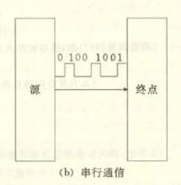

# 嵌入式通信协议学习——UART篇（1）

## 前言

​	笔者最近正在比较深入的了解通信协议的一些内容，UART作为大部分（包括笔者）通知学习嵌入式的起点，打算在这里整理一下UART的相关内容。

## 从通信大概论开始说起

#### 通信的方式

​	通信的方式分为串行通信和并行通信两种。这里的区别就是字面意思。串行通信中，我们的串行通信中，往往**数据是按照一个队列一般的，依次从起始的源送到我们的终点，如下图所示那样**



​	**并行通信突出在“并”，数据是一次发送多位**。这样，我们建立好大致的印象之后，就可以开始进一步更加仔细的了解里面的细节和差异了。


#### 通信的方向

​	通信的方向上分为三大类——单工，半双工和全双工。这一点我们是针对通信信道（你可以认为是这些数据传输需要占用车道，这个车道可以允许的方向）讨论的，对于单工，数据只能从一个地方向另一个地方传输，也就是只能从A到B，从B到A那是不行的。半双工则是可以双向的通信，**但是聚焦点在于没办法同时双向通信，只能一个时刻向一个方向做传输**，双工那自然就是同时的进行双向通信了。

#### 数据的同步方式

​	很好，我们传递数据，总是同步的，两个人发消息，收消息要在一个拍子上。一般而言，要么是我们请第三个人来帮助两者掌管解释的节拍（同步通信的时钟线），要么是我们在话语中加上大量复杂的暗号和约定（异步的方式加入大量帧同步，这是以损耗信息的传递效率作为代价）

我们建立好这个基本概念之后，笔者打算深入的整理自己看到的资料！

## 串行通信

​	串行通信是在**一个通信通道或总线上一次只发送一位（bit）数据的传输方式**，这种方式的数据位按时间顺序一个接一个地发送。在硬件层面，它通常只需要一根数据线（或一对差分线）以及必要的控制线，从而大幅减少了线路数量和接口引脚数。

​	如你所见，由于仅使用较少的线路，串行通信具有较低的电缆成本和连接器体积，且在长距离传输中抗串扰能力更强，信号完整性更好。现代高速串行接口（如PCIe、USB、SATA）通过调制编码（如PAM4）在每个符号中承载多位信息，以进一步提升带宽，但仍以符号为单位按次序发送。串行通信本身硬件实现相对简单，不需要复杂的并行对齐，但在接收端常需使用串/并转换（SerDes）电路进行时序恢复和并行化处理，这增加了设计复杂度

## 并行通信

并行通信是在多个通信通道上同时发送二进制位的传输方式，例如在八位并行通道中，八根数据线上同时传送一个字节（byte）的八个位。物理层面上，除了数据线外，并行链路通常还包含时钟线和握手信号线，用于同步各路数据和控制数据流方向。

并行通信可在同一时钟周期内完成多位数据传输，从理论上带宽是串行同频率链路的多倍，且无需SerDes即可直接与并行总线对接，**因此在内部总线或短距离设备间通信中延迟最低、开发实现较简单。但当线路数量增加时，信号间的串扰和时钟偏斜（skew）问题随着距离增长迅速恶化，并行链路的最大可靠传输距离受限，一般仅适用于电路板内部或短于几十厘米的场景。**此外，多根线路和大体积连接器导致成本和复杂度提升

## 串行与并行对比

​	我们可以将串行比作单车道公路，车依次通过，以较小成本实现远距离运输；并行则如多车道高速公路，能同时运送更多车辆，但造价和维护成本更高，且路段越长管控越困难。

​	在相同时钟频率下，并行链路的理论带宽是串行链路的“通道数”倍，而串行链路通过高效编码和更高的符号速率，可以在较少线路下实现更高的总带宽。串行通信因少线、抗干扰和长距离优势逐渐成为主流，如USB、Ethernet、PCIe等；而并行通信则在内存总线、CPU与缓存之间等短距离、低延迟场景中依然不可替代。

## 数据通信方向——单工（Simplex）

​	单工通信指在一个固定的通道上，数据始终只沿一个方向从发送端流向接收端，接收端没有返回通路；也就是说，发送端和接收端的角色在通信过程中不可互换。由于只需一条数据通道（或一对差分线）进行单向传输，单工通信的硬件实现最为简洁，成本最低，线路布局和接口设计也最简单。它最适用于那些只需要**单向信息提供而无需反馈的场景**，例如广播电视信号传输、键盘到计算机的数据输入、传感器监测系统等。

## 数据通信方向——半双工（Half-Duplex）

​	半双工通信允许数据在同一信道的两个方向上传输，但任何时刻仅能有一个方向在发送，若要反向发送，必须先切换信道的使用方向。在半双工模式下，通信双方都具备发送和接收能力，但通过时分或软件开关机制保证信道上不会同时出现双向信号，从而避免冲突。这种方式比单工更加灵活，能够实现双向对话，但频繁切换方向会带来延迟和效率损耗。典型应用包括对讲机、早期的**以太网集线器连接、无线电台通信**等。

## 数据通信方向——全双工（Full-Duplex）

​	全双工通信指通信双方能够在同一信道或同一对物理线路上同时进行双向数据传输，彼此无须等待对方停止发送即可同时交换信息。要实现真正的全双工，**系统通常采用两条物理线路（上下行各一路）或在同一线路上使用频分复用、时分复用或回声消除等技术来隔离收发信号**。例如电话网络、移动电话系统和交换机端口都采用全双工方式，以支持自然、实时的双向交谈和大带宽的数据交互。

## 三种模式的对比

​	在硬件资源上，**单工模式最省线，半双工次之，全双工最耗线路或最依赖复杂编码**。在信道利用率和时延方面，单工模式只能单向利用信道；半双工需要在发送与接收之间切换，切换过程带来额外延迟；全双工可同时双向传输，时延最低但实现成本最高。在应用选择上，若**只需单向信息广播则选择单工**；若需要双向但不要求同时交互，可用半双工；若需实时双向交流且对**带宽有较高要求，则必须采用全双工**。

## 数据的通信同步差异——同步通信

​	在同步通信中，发送端与接收端必须共享一个公共时钟信号，或者将时序信息嵌入数据帧中，以保持双方对数据起止的统一识别。数据通常以块（frames）或报文的形式连续传输，**中间没有空闲间隔或起止位，只有在帧与帧之间可能有帧定界符或标志字段作为分隔**。发送与接收之间严格同步，数据以连续流形式传输，无需在每字符间插入起止位，因而在相同时钟频率下具有更高的有效数据率。同步方式对于大数据量的高速传输效率显著，常配合差分时钟或嵌入式时序编码以降低误码率。同步通信无需外部时钟（他自己有一个时钟线打节拍传递信息），硬件实现更为简单，线路开销仅数据线与地线及控制线，灵活易扩展；但每个字符都需额外的起止位，导致信道利用率降低，适合低速或断续性数据交换场景

## 数据的通信同步差异——异步通信

异步通信不依赖外部时钟，发送端在每个字符（通常是一个字节）前插入一个起始位（start bit），后接数据位，再加一个或多个停止位（stop bit）来标志字符的结束。接收端通过检测起始位来恢复时序，然后按预定字符长度和波特率采样数据位，实现字符级的时序同步。

## 优缺点

### 同步通信

优点在于高效传输大块数据、带宽利用率高，适合实时视频、磁盘阵列控制以及网络帧传输等场景。缺点是需要专门的时钟线或差分时钟通道，以及复杂的同步电路（如PLL或SerDes），增加系统成本和设计难度。

### 异步通信

优点为硬件简单、成本低，不需要时钟同步电路，可用通用UART模块直接实现；典型场景为RS-232/TTL串口、串行调制解调器，以及简单传感器数据上传等。缺点是每字符额外开销大，在长时间或大数据量传输时效率较低且易受波特率抖动影响

# 正题——UART

## 什么是UART

​	咱们说起来UART协议，那必须吧全称说出来：通用异步接收器/发射器（Universal Asynchronous Receiver/Transmitter ）。我们学习通信协议，也自然需要先给一个大致的框图。可以看到，UART的框图非常的简单。我们说UART是一个整体看来支持双向传输的协议，每一个通信的主体都需要Tx，Rx和一个地参考线保证双方有一个明确的0和1的定义。


每个UART字符通过以下顺序的位来封装：空闲状态（逻辑高），起始位（逻辑低），若干数据位（5–9位可选），可选的校验位（奇偶校验），以及一个或多个停止位（逻辑高）。常见配置为8位数据、无校验、1位停止（即8N1），协议效率达80%

| 空闲位 | 起始位 | 数据位（5~9位） | 校验位（可选） | 停止位（1、1.5 或 2位） |
| :----: | :----: | :-------------: | :------------: | :---------------------: |
| 高电平 | 低电平 |    LSB → MSB    |  奇/偶/无校验  |         高电平          |

- **空闲位**：在没有数据传输时，UART线路处于高电平状态，表示线路空闲。
- **起始位**：开始传输的标志，由发送端发送一个低电平（逻辑0），通知接收端即将开始数据传输。
- **数据位**：实际传输的数据位数，可以是5到9位，最常见的是8位。数据通常从最低有效位（LSB）开始传输。
- **校验位（可选）**：用于错误检测的位，可设置为奇校验、偶校验或不使用校验位。
- **停止位**：表示数据帧结束的标志，发送一个或多个高电平（逻辑1）。常见的设置有1位、1.5位或2位停止位。

​	这里简单的说一下几个问题：

#### 问题1：啥是奇偶校验？

​	添加到字节末尾的错误检测位。有两种类型——“奇数奇偶校验”意味着如果数据字节包含*偶*数个逻辑高位，奇偶校验位将为逻辑高电平，“偶数奇偶校验”意味着如果数据字节包含*奇*数个逻辑高位，奇偶校验位将为逻辑高电平。这似乎有悖常理，但其理念是校验位确保高电平的1的数量始终为偶数（对于偶数奇偶校验）或奇数（对于奇数奇偶校验）。说白了，这就是一个双方对面的暗号：我发的数据里头，我一定会保证有奇数个1（奇校验）或者是偶数个1（偶校验），这在通信的时候大家就会约定好，发现1的个数的奇偶性不对，直接说明了数据包的非法，这个时候具体如何处理，自然是协议的约束了。

#### 问题3：1.5位的停止位？啥？还能有1.5位？

​	能，因为这里的1.5说的是电平维持的宽度，我们知道：UART协议是需要双方约定停止位（我的数据到哪里是停下来表达帧结束的别接受了）和波特率的（咱们两个收发信息的速度步调要多快）。显然，我们说，一个电平的维持宽度，就是这个发送速率的倒数：


​	这里的1，2，1.5说的就是我们人为的将停止位延长到标准的1个bit电平维持宽度（1位停止位），1.5个bit电平维持宽度（1.5位停止位）和2个bit电平维持宽度（2位停止位）

## 以STM32F103C8T6为例子看一个单片机对UART通信协议支持的要点


​	嗯，承认这个有点吓人，我打算尝试解释一下这个：

- 发送路径和接收路径共享一套波特率发生器和控制／状态逻辑，以支持异步和同步两种通信模式。
- 波特率发生器（Baud Rate Generator）位于框图右下方，由外部时钟源 PCLK1 或 PCLK2 经分频后输入 DIV_Mantissa 与 DIV_Fraction 寄存器，**再通过 TE（Transmit Enable）和 RE（Receive Enable）信号分别送入发送和接收的速率控制单元**。该模块不仅为移位寄存器提供定时，还在异步模式下将时钟倍增至 16 倍以实现中点取样，而在同步主模式下也可生成同步时钟；若同步从模式被选中，则外部时钟 CK 直接通过 CK 控制逻辑送入移位寄存器。
- 从发送端看，CPU 或 DMA 将待发数据写入传输数据寄存器 TDR，数据首先经过奇偶校验生成器（Parity Generator）和断帧控制（Break Control），前者根据 CR1 中的 PCE、PS 等位生成奇偶校验位，后者可在 SmartCard/ LIN 场景下输出连续低电平作为断帧信号。校验和断帧处理完毕的数据依次进入发送移位寄存器（Transmit Shift Register），在波特率发生器或外部时钟驱动下逐位从 TX 引脚发出。发送路径的所有配置和使能均由 CR1、CR2、CR3 寄存器控制，这些寄存器不仅决定了数据位长度 M、停止位 STOP、LIN 模式、IrDA／SIR／ENDEC 块、硬件流控 HD、IrLP、IREN 等功能，还将各类中断使能位（TXEIE、TCIE、IDLEIE 等）映射到 USART 中断控制逻辑。
- 接收端的信号首先从 RX 或 SW_RX 引脚进入 IrDA／SIR／ENDEC／BLOCK 模块，该模块可在红外通信、简易红外（SIR）、编码／解码以及阻塞输入等场景下对信号进行预处理，然后送至接收移位寄存器（Receive Shift Register）。移位寄存器每接收满一帧数据后将并行数据移至接收数据寄存器 RDR，同时奇偶校验检测器（Parity Checker）和断帧错误检测器（Frame Error Detector）分别根据 CR1 的配置检查校验位和停止位电平，若发生错误则在状态寄存器 SR 中置位 PE、FE 等标志。上层 CPU 或 DMA 通过读取 RDR 来获取数据，RXNE、ORE、NE 等状态标志以及相应的中断使能位（RXNEIE、EIE、IDLEIE）则在中断／DMA 控制模块中触发处理。
- 控制与状态逻辑集中在框图中央，CR1、CR2、CR3 三个控制寄存器交互作用，CR1 中的 UE（USART Enable）打开整个模块，TE、RE 位分别使能发送和接收通道，RWU／SBK 用于单线模式唤醒和发送起始断帧，PCE／PS 控制奇偶校验，PIEIE 则开启奇偶校验错误中断；CR2 包含 STOP、CKEN、CPOL、CPHA、LBCL 以及 LINEN／SYNCMODE，来配置停止位长度、时钟相位极性和 LIN 模式；CR3 中的 DMAT、DMAR、SCEN、NACK、HDSEL、IREN、IRLP、ONEBIT 和 CTSEN 等位提供 DMA 传输、安全卡和 IrDA 支持、半双工模式、硬件流控等扩展功能。状态寄存器 SR 则实时反映 TXE、TC、RXNE、IDLE、ORE、NE、FE、PE、CTS 等事件，供中断控制单元或 DMA 控制器采样，进而唤起相应的中断服务例程或 DMA 事务。（哦，他们依次做啥，需要翻手册）
- 图左侧还标出了硬件流控信号 RTS 和 CTS，它们通过硬件流控逻辑与内部 FIFO 状态交互，当接收缓冲趋满时 CTS 拉高通知远端暂停发送；若本地需要接收数据时，RTS 也可由软件或自动流控逻辑驱动，以完成点对点的流量控制。框图右侧的同步时钟 CK 则来自 GTPR（Guard Time and Prescaler Register）中的 GT 和 PSC 字段，经 CK 控制单元输出，用于同步模式下的数据对齐。

## HAL库的一些接口函数概览

### 初始化与端口配置

​	使用 HAL 驱动首先要定义并配置一个 `UART_HandleTypeDef` 结构体，填充其中的 `Init` 子结构以指定波特率、数据位、停止位、校验、硬件流控和工作模式等参数，然后调用 `HAL_UART_Init()` 完成外设的时钟使能、引脚复用配置及寄存器初始化。为了在不同项目中重用初始化代码，通常配合 CubeMX 工具生成 `MX_USARTx_UART_Init()` 函数，该函数自动填充 `UART_HandleTypeDef` 并调用 `HAL_UART_Init()`，用户无需手工编写底层配置。

### 阻塞式通信

阻塞模式下，HAL 提供 `HAL_UART_Transmit()` 和 `HAL_UART_Receive()` 两个函数，用户调用后函数将等待直到所有数据发送完成或接收完毕才返回，适用于对实时性要求不高的小数据量传输场景。这两者都接受三个参数：UART 句柄、数据缓冲区指针和数据长度，并可附加超时时间参数，超时触发时函数返回超时错误状态。

### 中断式通信

为实现非阻塞通信，HAL 提供 `HAL_UART_Transmit_IT()` 和 `HAL_UART_Receive_IT()`，它们在启动发送/接收后立即返回，同时在数据寄存器空（TXE）或接收完成（RXNE）等事件发生时生成中断，由 HAL 中断处理函数 `HAL_UART_IRQHandler()` 接管后续数据搬运与状态标志管理。用户需在中断向量表中绑定对应的 IRQ Handler，例如：

```
void USART1_IRQHandler(void)
{
    HAL_UART_IRQHandler(&huart1);
}
```

并在 `HAL_UART_TxCpltCallback()`、`HAL_UART_RxCpltCallback()` 等回调函数中实现发送完成或接收完成后的应用逻辑。

### DMA 模式通信

对于大数据量或高实时性传输，可在 `USART_HandleTypeDef` 中启用 `DMA`：

```
__HAL_UART_ENABLE_IT(&huart1, UART_IT_TC);
huart1.hdmatx = &hdma_usart1_tx;
huart1.hdmarx = &hdma_usart1_rx;
```

然后调用 `HAL_UART_Transmit_DMA()` 和 `HAL_UART_Receive_DMA()`，数据交换由 DMA 控制器自动完成，CPU 仅在 DMA 传输完成时收到回调 `HAL_UART_TxCpltCallback()` 或 `HAL_UART_RxCpltCallback()`，显著降低了 CPU 负载。

### 中断与 DMA 请求处理

HAL 在 `CR1`、`CR3` 寄存器中分别定义了 `TXEIE`、`TCIE`、`RXNEIE`、`DMAT`、`DMAR` 等中断与 DMA 使能位，`HAL_UART_IRQHandler()` 会根据 `SR` 状态寄存器中的标志（如 `UART_SR_TXE`、`UART_SR_TC`、`UART_SR_RXNE`）调用底层传输或接收函数，并在传输完毕后触发相应回调。在项目中，务必在 NVIC 中配置合适的优先级和使能相应中断。